# Encode and decode flat files in Azure Logic Apps

[!INCLUDE [logic-apps-sku-consumption-standard](../../includes/logic-apps-sku-consumption-standard.md)]

Before you send XML content to a business partner in a business-to-business (B2B) scenario, you might want to encode that content first. If you receive encoded XML content, you'll need to decode that content first. When you're building a logic app workflow in Azure Logic Apps, you can encode and decode flat files by using the **Flat File** built-in connector actions and a flat file schema for encoding and decoding. You can use **Flat File** actions in multi-tenant Consumption logic app workflows and single-tenant Standard logic app workflows.

> [!NOTE]
>
> In Standard logic app workflows, the **Flat File** actions are currently in preview.

While no **Flat File** triggers are available, you can use any trigger or action to feed the source XML content into your workflow. For example, you can use a built-in connector trigger, a managed or Azure-hosted connector trigger available for Azure Logic Apps, or even another app.

This article shows how to add the **Flat File** encoding and decoding actions to your workflow.

* Add a **Flat File** encoding or decoding action to your workflow.
* Select the schema that you want to use.

For more information, review the following documentation:

* [Consumption versus Standard logic apps](logic-apps-overview.md#resource-environment-differences)
* [Integration account built-in connectors](../connectors/built-in.md#integration-account-built-in)
* [Built-in connectors overview for Azure Logic Apps](../connectors/built-in.md)
* [Managed or Azure-hosted connectors in Azure Logic Apps](/connectors/connector-reference/connector-reference-logicapps-connectors)

## Prerequisites

* An Azure account and subscription. If you don't have a subscription yet, [sign up for a free Azure account](https://azure.microsoft.com/free/?WT.mc_id=A261C142F).

* The logic app workflow, blank or existing, where you want to use the **Flat File** action.

  If you have a blank workflow, use any trigger that you want to start the workflow. This example uses the Request trigger.

* Your logic app resource and workflow. Flat file operations don't have any triggers available, so your workflow has to minimally include a trigger. For more information, see the following documentation:

  * [Create an example Consumption logic app workflow in multi-tenant Azure Logic Apps](quickstart-create-example-consumption-workflow.md)

  * [Create an example Standard logic app workflow in single-tenant Azure Logic Apps](create-single-tenant-workflows-azure-portal.md)

* A flat file schema for encoding and decoding the XML content. For more information, [Add schemas to use with workflows in Azure Logic Apps](logic-apps-enterprise-integration-schemas.md).

* Based on whether you're working on a Consumption or Standard logic app workflow, you'll need an [integration account resource](logic-apps-enterprise-integration-create-integration-account.md). Usually, you need this resource when you want to define and store artifacts for use in enterprise integration and B2B workflows.

  > [!IMPORTANT]
  >
  > To work together, both your integration account and logic app resource must exist in the same Azure subscription and Azure region.

  * If you're working on a Consumption logic app workflow, your logic app resource requires a [link to your integration account](logic-apps-enterprise-integration-create-integration-account.md?tabs=consumption#link-account).

  * If you're working on a Standard logic app workflow, you can link your logic app resource to your integration account, upload schemas directly to your logic app resource, or both, based on the following scenarios:

    * If you already have an integration account with the artifacts that you need or want to use, you can link your integration account to multiple Standard logic app resources where you want to use the artifacts. That way, you don't have to upload schemas to each individual logic app. For more information, review [Link your logic app resource to your integration account](logic-apps-enterprise-integration-create-integration-account.md?tabs=standard#link-account).

    * The **Flat File** built-in connector lets you select a schema that you previously uploaded to your logic app resource or to a linked integration account, but not both. You can then use this artifact across all child workflows within the same logic app resource.

    So, if you don't have or need an integration account, you can use the upload option. Otherwise, you can use the linking option. Either way, you can use these artifacts across all child workflows within the same logic app resource.

## Limitations

* XML content that you want to decode must be encoded in UTF-8 format.

* In your flat file schema, make sure the contained XML groups don't have excessive numbers of the `max count` property set to a value *greater than 1*. Avoid nesting an XML group with a `max count` property value greater than 1 inside another XML group with a `max count` property greater than 1.

* When Azure Logic Apps parses the flat file schema, and whenever the schema allows the choice of the next fragment, Azure Logic Apps generates a *symbol* and a *prediction* for that fragment. If the schema allows too many such constructs, for example, more than 100,000, the schema expansion becomes excessively large, which consumes too much resources and time.

## Upload schema

After you create your schema, you now have to upload the schema based on the following scenario:

* If you're working on a Consumption logic app workflow, [add your schema to your integration account](logic-apps-enterprise-integration-schemas.md?tabs=consumption#add-schema).

* If you're working on a Standard logic app workflow, you can [add your schema to your integration account](logic-apps-enterprise-integration-schemas.md?tabs=consumption#add-schema), or [add your schema to your logic app resource](logic-apps-enterprise-integration-schemas.md?tabs=standard#add-schema).

## Add a Flat File encoding action

### [Consumption](#tab/consumption)

1. In the [Azure portal](https://portal.azure.com), open your logic app workflow in the designer, if not already open.

1. If your workflow doesn't have a trigger or any other actions that your workflow needs, add those operations first. Flat File operations don't have any triggers available.

   This example continues with the Request trigger named **When a HTTP request is received**.

1. On the workflow designer, under the step where you want to add the Flat File action, select **New step**.

1. Under the **Choose an operation** search box, select **Built-in**. In the search box, enter **flat file**.

1. From the actions list, select the action named **Flat File Encoding**.

   

1. In the action's **Content** property, provide the output from the trigger or a previous action that you want to encode by following these steps:

   1. Click inside the **Content** box so that the dynamic content list appears.

   1. From the dynamic content list, select the flat file content that you want to encode.
   
      For this example, from the dynamic content list, under **When a HTTP request is received**, select the **Body** token, which represents the body content output from the trigger.

   

   > [!NOTE]
   >
   > If the **Body** property doesn't appear in the dynamic content list, 
   > select **See more** next to the **When a HTTP request is received** section label.
   > You can also directly enter the content to encode in the **Content** box.

1. From the **Schema Name** list, select your schema.

   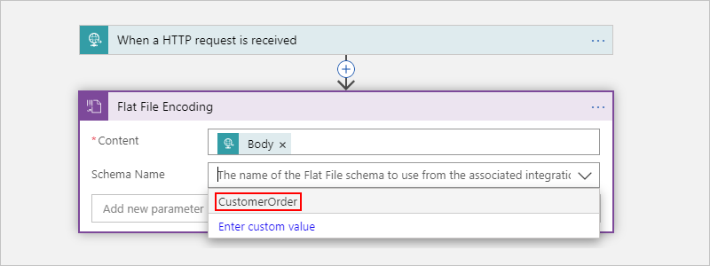

   > [!NOTE]
   >
   > If the schema list is empty, either your logic app resource isn't linked to your 
   > integration account or your integration account doesn't contain any schema files.

   When you're done, your action looks similar to the following:

   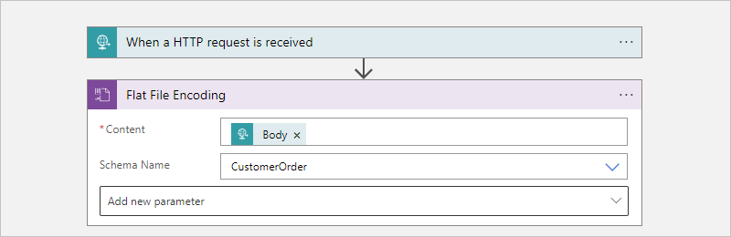

1. To add other optional parameters to the action, select those parameters from the **Add new parameter** list.

   | Parameter | Value | Description |
   |-----------|-------|-------------|
   | **Mode of empty node generation** | **ForcedDisabled** or **HonorSchemaNodeProperty** or **ForcedEnabled** | The mode to use for empty node generation with flat file encoding.   For BizTalk, the flat file schema has a property that controls empty node generation. You can either follow the empty node generation property behavior for your flat file schema, or you can use this setting to have Azure Logic Apps generate or omit empty nodes. For more information, see [Tags for empty elements](https://www.w3.org/TR/xml/#dt-empty). |
   | **XML Normalization** | **Yes** or **No** | The setting to enable or disable XML normalization in flat file encoding. For more information, see [XmlTextReader.Normalization](/dotnet/api/system.xml.xmltextreader.normalization). |

1. Save your workflow. On the designer toolbar, select **Save**.

### [Standard](#tab/standard)

1. In the [Azure portal](https://portal.azure.com), open your logic app workflow in the designer, if not already open.

1. If your workflow doesn't have a trigger or any other actions that your workflow needs, add those operations first. Flat File operations don't have any triggers available.

   This example continues with the Request trigger named **When a HTTP request is received**.

1. On the designer, under the step where you want to add the Flat File action, select the plus sign (**+**), and then select **Add an action**.

1. On the **Add an action** pane that appears, under the search box, select **Built-in**.

1. In the search box, enter **flat file**. From the actions list, select the action named **Flat File Encoding**.

   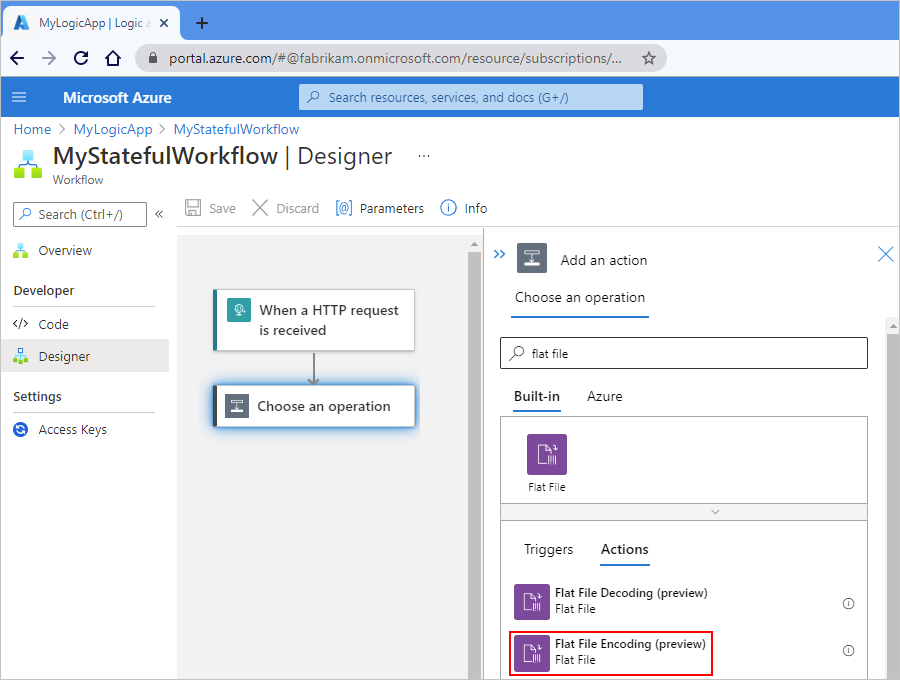

1. In the action's **Content** property, provide the output from the trigger or a previous action that you want to encode by following these steps:

   1. Click inside the **Content** box so that the dynamic content list appears.

   1. From the dynamic content list, select the flat file content that you want to encode.
   
      For this example, from the dynamic content list, under **When a HTTP request is received**, select the **Body** token, which represents the body content output from the trigger.

   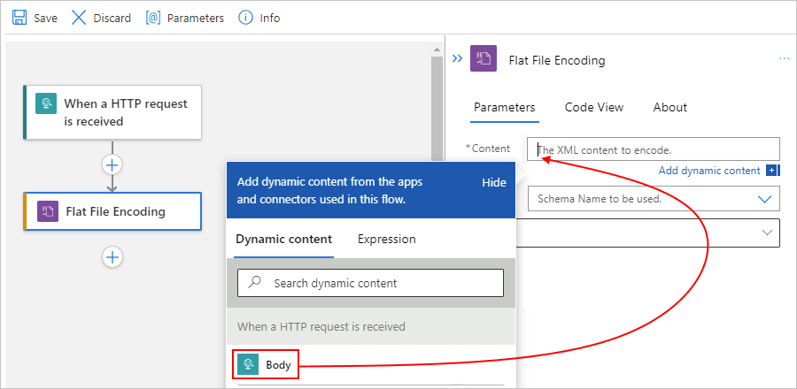

1. From the **Source** list, select either **LogicApp** or **IntegrationAccount** as your schema source.

   This example continues by selecting **IntegrationAccount**.

   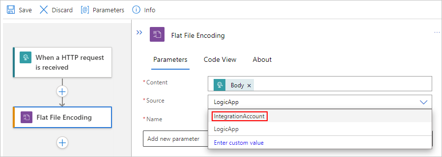

1. From the **Name** list, select the schema that you previously uploaded to your logic app resource for encoding, for example:

   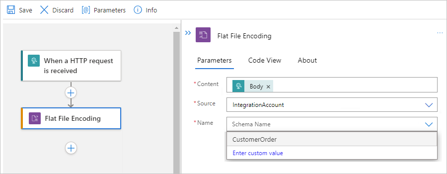

   > [!NOTE]
   >
   > If the schema list is empty, either your logic app resource isn't linked to your 
   > integration account, your integration account doesn't contain any schema files, 
   > or your logic app resource doesn't contain any schema files.

1. Save your workflow. On the designer toolbar, select **Save**.

---

## Add a Flat File decoding action

### [Consumption](#tab/consumption)

1. In the [Azure portal](https://portal.azure.com), open your logic app workflow in the designer, if not already open.

1. If your workflow doesn't have a trigger or any other actions that your workflow needs, add those operations first. Flat File operations don't have any triggers available.

   This example continues with the Request trigger named **When a HTTP request is received**.

1. On the workflow designer, under the step where you want to add the Flat File action, select **New step**.

1. Under the **Choose an operation** search box, select **Built-in**. In the search box, enter **flat file**.

1. From the actions list, select the action named **Flat File Decoding**.

   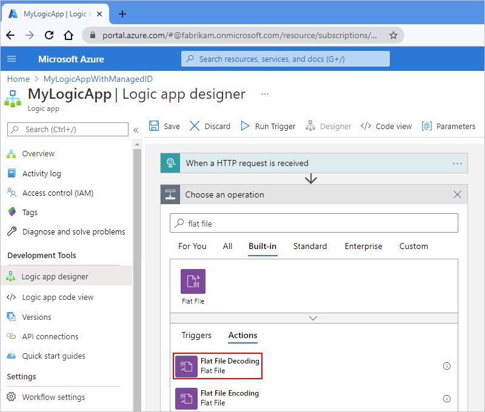

1. In the action's **Content** property, provide the output from the trigger or a previous action that you want to decode by following these steps:

   1. Click inside the **Content** box so that the dynamic content list appears.

   1. From the dynamic content list, select the flat file content that you want to encode.
   
      For this example, from the dynamic content list, under **When a HTTP request is received**, select the **Body** token, which represents the body content output from the trigger.

   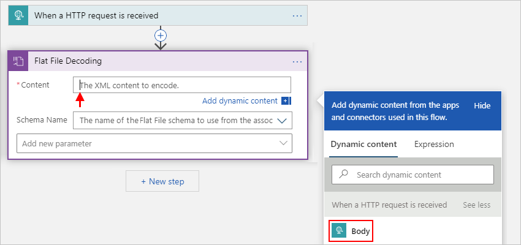

   > [!NOTE]
   >
   > If the **Body** property doesn't appear in the dynamic content list, 
   > select **See more** next to the **When a HTTP request is received** section label.
   > You can also directly enter the content to encode in the **Content** box.

1. From the **Schema Name** list, select your schema.

   

   > [!NOTE]
   >
   > If the schema list is empty, either your logic app resource isn't linked to your 
   > integration account or your integration account doesn't contain any schema files.

   When you're done, your action looks similar to the following:

   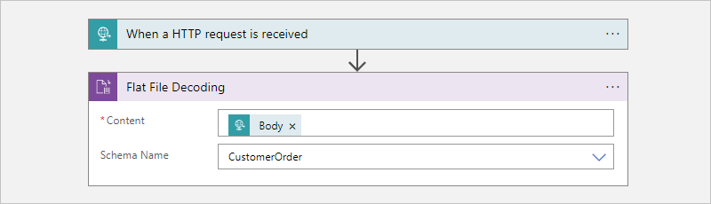

1. Save your workflow. On the designer toolbar, select **Save**.

### [Standard](#tab/standard)

1. In the [Azure portal](https://portal.azure.com), open your logic app workflow in the designer, if not already open.

1. If your workflow doesn't have a trigger or any other actions that your workflow needs, add those operations first. Flat File operations don't have any triggers available.

   This example continues with the Request trigger named **When a HTTP request is received**.

1. On the designer, under the step where you want to add the Flat File action, select the plus sign (**+**), and then select **Add an action**.

1. On the **Add an action** pane that appears, under the search box, select **Built-in**.

1. In the search box, enter **flat file**. From the actions list, select the action named **Flat File Decoding**.

   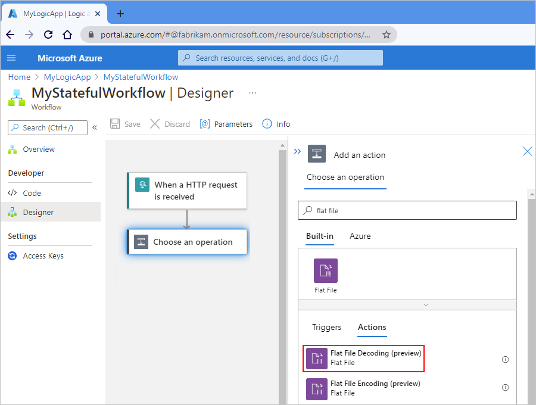

1. In the action's **Content** property, provide the output from the trigger or a previous action that you want to decode by following these steps:

   1. Click inside the **Content** box so that the dynamic content list appears.

   1. From the dynamic content list, select the flat file content that you want to encode.
   
      For this example, from the dynamic content list, under **When a HTTP request is received**, select the **Body** token, which represents the body content output from the trigger.

   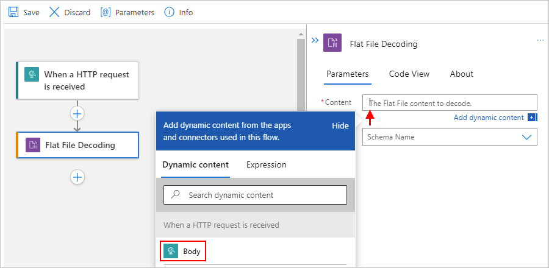

1. From the **Source** list, select either **LogicApp** or **IntegrationAccount** as your schema source.

   This example continues by selecting **IntegrationAccount**.

   

1. From the **Name** list, select the schema that you previously uploaded to your logic app resource for decoding, for example:

   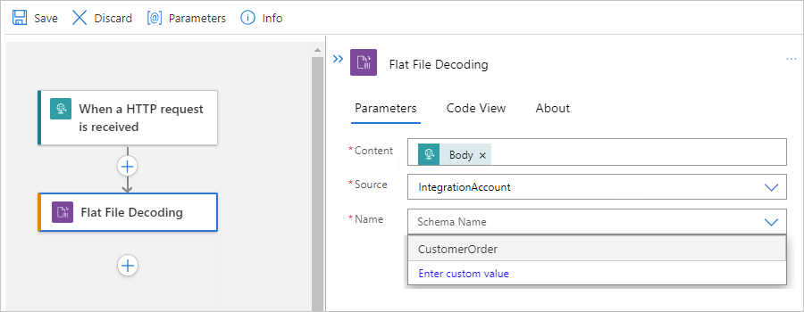

   > [!NOTE]
   >
   > If the schema list is empty, either your logic app resource isn't linked to your 
   > integration account, your integration account doesn't contain any schema files, 
   > or your logic app resource doesn't contain any schema files.

1. Save your workflow. On the designer toolbar, select **Save**.

---

You're now done with setting up your flat file decoding action. In a real world app, you might want to store the decoded data in a line-of-business (LOB) app, such as Salesforce. Or, you can send the decoded data to a trading partner. To send the output from the decoding action to Salesforce or to your trading partner, use the other connectors available in Azure Logic Apps:

* [Managed connectors for Azure Logic Apps](../connectors/managed.md)
* [Built-in connectors for Azure Logic Apps](../connectors/built-in.md)

## Test your workflow

1. By using [Postman](https://www.getpostman.com/postman) or a similar tool and the `POST` method, send a call to the Request trigger's URL, which appears in the Request trigger's **HTTP POST URL** property, and include the XML content that you want to encode or decode in the request body.

1. After your workflow finishes running, go to the workflow's run history, and examine the Flat File action's inputs and outputs.

## Next steps

* Learn more about the [Enterprise Integration Pack](logic-apps-enterprise-integration-overview.md)
