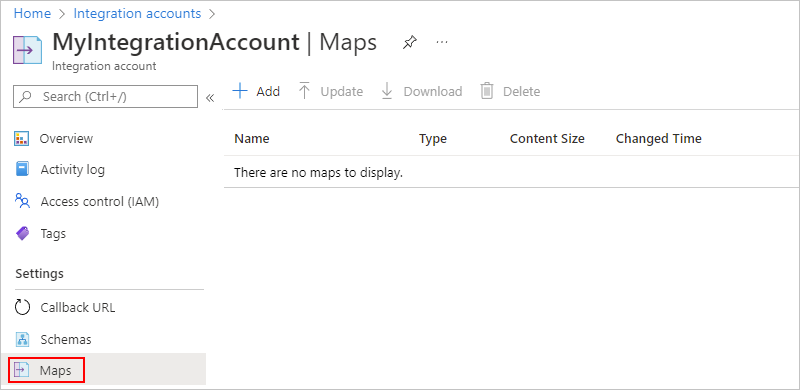
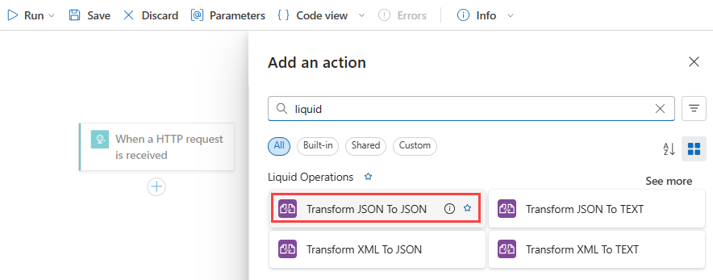
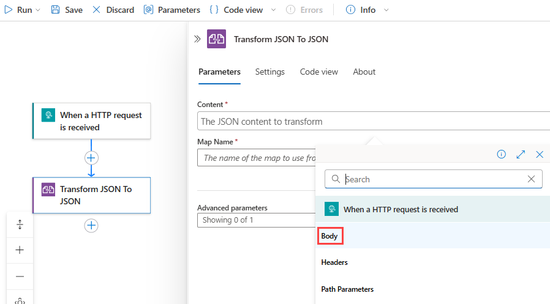
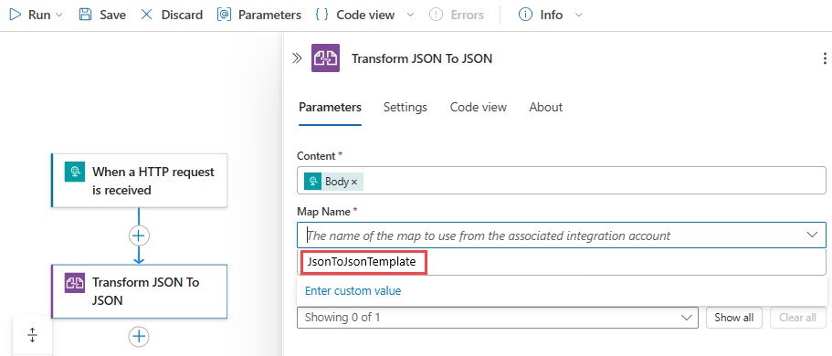
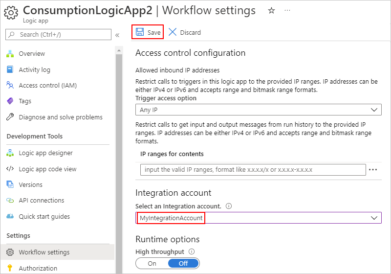
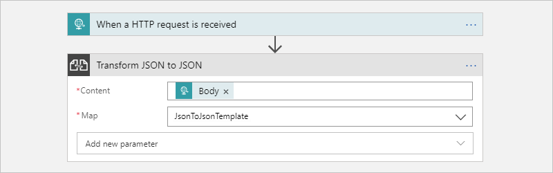

# Transform JSON and XML using Liquid templates as maps in workflows using Azure Logic Apps

When you want to perform basic JSON transformations in your logic app workflows, you can use built-in data operations, such as the **Compose** action or **Parse JSON** action. However, some scenarios might require advanced and complex transformations that include elements such as iterations, control flows, and variables. For transformations between JSON to JSON, JSON to text, XML to JSON, or XML to text, you can create a template that describes the required mapping or transformation using the Liquid open-source template language. You can select this template when you add the appropriate **Liquid** built-in action to your workflow. You can use **Liquid** actions in multi-tenant Consumption logic app workflows and single-tenant Standard logic app workflows.

While no **Liquid** triggers are available, you can use any appropriate trigger or action to get or feed the source JSON or XML content into your workflow for transformation. For example, you can use a built-in connector trigger, a managed or Azure-hosted connector trigger available for Azure Logic Apps, or even another app.

This article shows how to complete the following tasks:

* Create a Liquid template.
* Upload the template to your integration account for Consumption logic app workflows or to your Standard logic app resource for use in any child workflow.
* Add a Liquid action to your workflow.
* Select the template as the map that you want to use.

For more information, review the following documentation:

* [Perform data operations in Azure Logic Apps](logic-apps-perform-data-operations.md)
* [Liquid open-source template language](https://shopify.github.io/liquid/)
* [Consumption versus Standard logic apps](logic-apps-overview.md#resource-type-and-host-environment-differences)
* [Integration account built-in connectors](../connectors/built-in.md#integration-account-built-in)
* [Built-in connectors overview for Azure Logic Apps](../connectors/built-in.md)
* [Managed or Azure-hosted connectors overview for Azure Logic Apps](../connectors/managed.md) and [Managed or Azure-hosted connectors in Azure Logic Apps](/connectors/connector-reference/connector-reference-logicapps-connectors)

## Prerequisites

* An Azure account and subscription. If you don't have a subscription, [sign up for a free Azure account](https://azure.microsoft.com/free/?WT.mc_id=A261C142F).

* An [integration account resource](logic-apps-enterprise-integration-create-integration-account.md) where you define and store artifacts, such as trading partners, agreements, certificates, and so on, for use in your enterprise integration and B2B workflows. This resource has to meet the following requirements:

  * Is associated with the same Azure subscription as your logic app resource.

  * Exists in the same location or Azure region as your logic app resource.

  * If you're working on a Consumption logic app workflow, your integration account requires a [link to your logic app resource](logic-apps-enterprise-integration-create-integration-account.md#link-account).

  * If you're working on a Standard logic app workflow, you can add maps either to your integration account or directly to your logic app resource. Liquid actions support selecting maps either from your logic app resource or a linked integration account.

    If you [add maps directly to your logic app resource](logic-apps-enterprise-integration-maps.md?tabs=standard#add-maps), you can use these maps across multiple workflows within the *same logic app resource*. However, you still need an integration account to store and use other artifacts, such as partners, agreements, and certificates, and if you want to use the [AS2](logic-apps-enterprise-integration-as2.md), [X12](logic-apps-enterprise-integration-x12.md), and [EDIFACT](logic-apps-enterprise-integration-edifact.md) operations.

    However, you don't need to link your logic app resource to your integration account, so the linking capability doesn't exist. Your integration account still has to meet other requirements, such as using the same Azure subscription and existing in the same location as your logic app resource.

* Basic knowledge about [Liquid template language](https://shopify.github.io/liquid/). Azure Logic Apps uses DotLiquid 2.0.361.

  > [!NOTE]
  > The Liquid action named **Transform JSON to JSON** follows the [DotLiquid implementation for Liquid](https://github.com/dotliquid/dotliquid), 
  > which differs in specific cases from the [Shopify implementation for Liquid](https://shopify.github.io/liquid). 
  > For more information, see [Liquid template considerations](#liquid-template-considerations).

* Basic knowledge about how to create logic app workflows. Liquid operations don't have any triggers available, so your workflow has to include a trigger at least. For more information, review the following documentation:

  * [Quickstart: Create your first Consumption logic app workflow](quickstart-create-first-logic-app-workflow.md)

  * [Create a Standard logic app workflow with single-tenant Azure Logic Apps](create-single-tenant-workflows-azure-portal.md)

## Create the template

Before you can perform a Liquid transformation in your logic app workflow, you must first create a Liquid template that defines the mapping that you want.
You then [upload the template as a map](logic-apps-enterprise-integration-maps.md) into your [integration account](logic-apps-enterprise-integration-create-integration-account.md). When you add the **Transform JSON to JSON** action to your workflow, you can then select the Liquid template as the map for the action to use.


1. Create the Liquid template that you use as a map for the JSON transformation. You can use any editing tool that you want.

   For this example, create the sample Liquid template as described in this section:

   ```json
   

   {
      "fullName": "{{content.firstName | Append: ' ' | Append: content.lastName}}",
      "firstNameUpperCase": "{{content.firstName | Upcase}}",
      "phoneAreaCode": "{{content.phone | Slice: 1, 3}}",
      "devices" : [
         
            
            "{{device}}"
            
            "{{device}}",
            
         
      ]
   }
   ```

1. Save the template by using the `.liquid` extension. This example uses `SimpleJsonToJsonTemplate.liquid`.

## Upload the template

1. In the [Azure portal](https://portal.azure.com), sign in with your Azure account credentials.

1. In the Azure portal search box, enter **integration accounts**, and select **Integration accounts**.

   

1. Find and select your integration account.

   

1. On the integration account navigation menu, under **Settings**, select **Maps**.

    

1. On the **Maps** pane, select **Add**, and then provide the following details for your map:

   | Property | Value | Description |
   |----------|-------|-------------|
   | **Name** | `JsonToJsonTemplate` | The name for your map, which is "JsonToJsonTemplate" in this example |
   | **Map type** | **liquid** | The type for your map. For JSON to JSON transformation, you must select **liquid**. |
   | **Map** | `SimpleJsonToJsonTemplate.liquid` | An existing Liquid template or map file to use for transformation, which is "SimpleJsonToJsonTemplate.liquid" in this example. To find this file, you can use the file picker. For map size limits, see [Limits and configuration](../logic-apps/logic-apps-limits-and-config.md#artifact-capacity-limits). |
   |||

   

## Add the Liquid transformation action

The following steps show how to add a Liquid transformation action for Consumption and Standard logic app workflows.

### [Consumption](#consumption)

1. In the [Azure portal](https://portal.azure.com), open your logic app workflow in the designer, if not already open.

1. If your workflow doesn't yet have a trigger or any other actions that your workflow needs, add those operations first. Liquid operations doesn't have any triggers available.

   This example continues with the Request trigger named **When a HTTP request is received**.

1. On the workflow designer, under the step where you want to add the Liquid action, select **New step**.

1. Under the **Choose an operation** search box, select **All**. In the search box, enter **liquid**.

1. From the actions list, select the the Liquid action that you want to use.

   This example continues using the action named **Transform JSON to JSON**.

   

1. For the **Content** property, provide the JSON output from the trigger or a previous action that you want to transform by following these steps.

   1. Click inside the **Content** box so that the dynamic content list appears.

   1. From the dynamic content list, select the JSON data that you want to transform.
   
      For this example, from the dynamic content list, under **When a HTTP request is received**, select the **Body** token, which represents the body content output from the trigger.

      

1. For the **Map** property, open the **Map** list, and select your Liquid template.

   This example continues with a template named "JsonToJsonTemplate".

   

   If the maps list is empty, most likely your logic app resource isn't linked to your integration account. 
   To link your logic app to the integration account that has the Liquid template or map, follow these steps:

   1. On your logic app menu, select **Workflow settings**.

   1. From the **Select an Integration account** list, select your integration account. When you're done, select **Save**.

      

   When you're done, the action looks similar to the following example:

   

### [Standard](#standard)

1. In the [Azure portal](https://portal.azure.com), open your logic app workflow in the designer, if not already open.

1. If your workflow doesn't yet have a trigger or any other actions that your workflow needs, add those operations first. Liquid operations doesn't have any triggers available.

   This example continues with the Request trigger named **When a HTTP request is received**.

1. On the workflow designer, under the step where you want to add the Liquid action, select **Choose an operation**.


---

## Test your logic app

1. By using [Postman](https://www.getpostman.com/postman) or a similar tool and the `POST` method, send a call to the Request trigger's URL and include the JSON input to transform, for example:

   ```json
   {
      "devices": "Surface, Windows Phone, Desktop computer, Monitors",
      "firstName": "Dean",
      "lastName": "Ledet",
      "phone": "(111)5551111"
   }
   ```

1. After your workflow finishes running, go to the workflow's run history, and examine the **Transform JSON to JSON** action's inputs and outputs, for example:

   

<a name="template-considerations"></a>

## Liquid template considerations

* Liquid templates follow the [file size limits for maps](../logic-apps/logic-apps-limits-and-config.md#artifact-capacity-limits) in Azure Logic Apps.

* The **Transform JSON to JSON - Liquid** action follows the [DotLiquid implementation for Liquid](https://github.com/dotliquid/dotliquid). This implementation is a port to the .NET Framework from the [Shopify implementation for Liquid](https://shopify.github.io/liquid/) and differs in [specific cases](https://github.com/dotliquid/dotliquid/issues).

  Here are the known differences:

  * The **Transform JSON to JSON - Liquid** action natively outputs a string, which can include JSON, XML, HTML, and so on. The Liquid action only indicates that the expected text output from the Liquid template's is a JSON string. The action instructs your logic app to parse input as a JSON object and applies a wrapper so that Liquid can interpret the JSON structure. After the transformation, the action instructs your logic app to parse the text output from Liquid back to JSON.

    DotLiquid doesn't natively understand JSON, so make sure that you escape the backslash character (`\`) and any other reserved JSON characters.

  * If your template uses [Liquid filters](https://shopify.github.io/liquid/basics/introduction/#filters), make sure that you follow the [DotLiquid and C# naming conventions](https://github.com/dotliquid/dotliquid/wiki/DotLiquid-for-Designers#filter-and-output-casing), which use *sentence casing*. For all Liquid transforms, make sure that filter names in your template also use sentence casing. Otherwise, the filters won't work.

    For example, when you use the `replace` filter, use `Replace`, not `replace`. The same rule applies if you try out examples at [DotLiquid online](http://dotliquidmarkup.org/TryOnline). For more information, see [Shopify Liquid filters](https://shopify.dev/docs/themes/liquid/reference/filters) and [DotLiquid Liquid filters](https://github.com/dotliquid/dotliquid/wiki/DotLiquid-for-Developers#create-your-own-filters). The Shopify specification includes examples for each filter, so for comparison, you can try these examples at [DotLiquid - Try online](http://dotliquidmarkup.org/TryOnline).

  * The `json` filter from the Shopify extension filters is currently [not implemented in DotLiquid](https://github.com/dotliquid/dotliquid/issues/384). Typically, you can use this filter to prepare text output for JSON string parsing, but instead, you need to use the `Replace` filter instead.

  * The standard `Replace` filter in the [DotLiquid implementation](https://github.com/dotliquid/dotliquid/blob/b6a7d992bf47e7d7dcec36fb402f2e0d70819388/src/DotLiquid/StandardFilters.cs#L425) uses [regular expression (RegEx) matching](/dotnet/standard/base-types/regular-expression-language-quick-reference), while the [Shopify implementation](https://shopify.github.io/liquid/filters/replace/) uses [simple string matching](https://github.com/Shopify/liquid/issues/202). Both implementations appear to work the same way until you use a RegEx-reserved character or an escape character in the match parameter.

    For example, to escape the RegEx-reserved backslash (`\`) escape character, use `| Replace: '\\', '\\'`, and not `| Replace: '\', '\\'`. These examples show how the `Replace` filter behaves differently when you try to escape the backslash character. While this version works successfully:

    `{ "SampleText": "{{ 'The quick brown fox "jumped" over the sleeping dog\\' | Replace: '\\', '\\' | Replace: '"', '\"'}}"}`

    With this result:

    `{ "SampleText": "The quick brown fox \"jumped\" over the sleeping dog\\\\"}`

    This version fails:

    `{ "SampleText": "{{ 'The quick brown fox "jumped" over the sleeping dog\\' | Replace: '\', '\\' | Replace: '"', '\"'}}"}`

    With this error:

    `{ "SampleText": "Liquid error: parsing "\" - Illegal \ at end of pattern."}`

    For more information, see [Replace standard filter uses RegEx pattern matching...](https://github.com/dotliquid/dotliquid/issues/385).

  * The `Sort` filter in the [DotLiquid implementation](https://github.com/dotliquid/dotliquid/blob/b6a7d992bf47e7d7dcec36fb402f2e0d70819388/src/DotLiquid/StandardFilters.cs#L326) sorts items in an array or collection by property but with these differences:<p>

    * Follows [Shopify's sort_natural behavior](https://shopify.github.io/liquid/filters/sort_natural/), not [Shopify's sort behavior](https://shopify.github.io/liquid/filters/sort/).

    * Sorts only in string-alphanumeric order. For more information, see [Numeric sort](https://github.com/Shopify/liquid/issues/980).

    * Uses *case-insensitive* order, not case-sensitive order. For more information, see [Sort filter does not follow casing behavior from Shopify's specification]( https://github.com/dotliquid/dotliquid/issues/393).

<a name="other-transformations"></a>

## Other transformations using Liquid

Liquid isn't limited to only JSON transformations. You can also use Liquid to perform other transformations, for example:

* [JSON to text](#json-text)
* [XML to JSON](#xml-json)
* [XML to text](#xml-text)

<a name="json-text"></a>

### Transform JSON to text

Here's the Liquid template that's used for this example:

```json
{{content.firstName | Append: ' ' | Append: content.lastName}}
```

Here are the sample inputs and outputs:


<a name="xml-json"></a>

### Transform XML to JSON

Here's the Liquid template that's used for this example:

``` json
[
      {{item}}
  ]
```

The `JSONArrayFor` loop is a custom looping mechanism for XML input so that you can create JSON payloads that avoid a trailing comma. Also, the `where` condition for this custom looping mechanism uses the XML element's name for comparison, rather than the element's value like other Liquid filters. For more information, see [Deep Dive on set-body Policy - Collections of Things](https://azure.microsoft.com/blog/deep-dive-on-set-body-policy).

Here are the sample inputs and outputs:


<a name="xml-text"></a>

### Transform XML to text

Here's the Liquid template that's used for this example:

``` json
{{content.firstName | Append: ' ' | Append: content.lastName}}
```

Here are the sample inputs and outputs:


## Next steps

* [Shopify Liquid language and examples](https://shopify.github.io/liquid/basics/introduction/)
* [DotLiquid](http://dotliquidmarkup.org/)
* [DotLiquid - Try online](http://dotliquidmarkup.org/TryOnline)
* [DotLiquid GitHub](https://github.com/dotliquid/dotliquid)
* [DotLiquid GitHub issues](https://github.com/dotliquid/dotliquid/issues/)
* Learn more about [maps](../logic-apps/logic-apps-enterprise-integration-maps.md)
