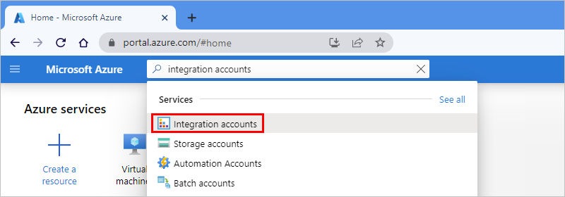
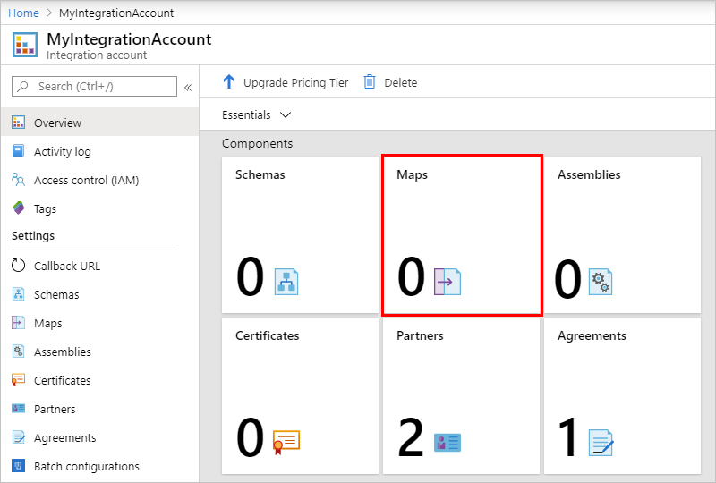
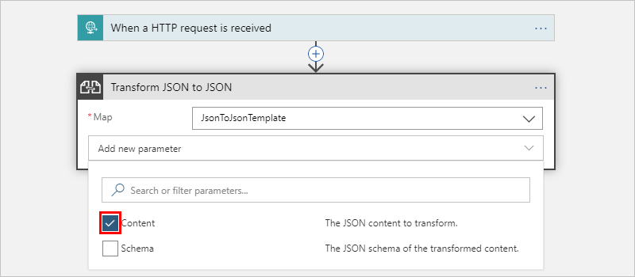
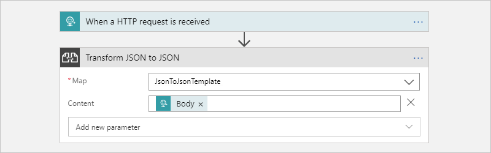

# Transform JSON and XML using Liquid templates as maps in Azure Logic Apps

When you want to perform basic JSON transformations in your logic apps, you can use native [data operations](../logic-apps/logic-apps-perform-data-operations.md) such as **Compose** or **Parse JSON**. For advanced and complex JSON to JSON transformations that have elements such as iterations, control flows, and variables, create and use templates that describe these transformations by using the [Liquid](https://shopify.github.io/liquid/) open-source template language. You can also [perform other transformations](#other-transformations), for example, JSON to text, XML to JSON, and XML to text.

Before you can perform a Liquid transformation in your logic app, you must first create a Liquid template that defines the mapping that you want. You then [upload the template as a map](../logic-apps/logic-apps-enterprise-integration-maps.md) into your [integration account](../logic-apps/logic-apps-enterprise-integration-create-integration-account.md). When you add the **Transform JSON to JSON - Liquid** action to your logic app, you can then select the Liquid template as the map for the action to use.

This article shows you how to complete these tasks:

* Create a Liquid template.
* Add the template to your integration account.
* Add the Liquid transform action to your logic app.
* Select the template as the map that you want to use.

## Prerequisites

* An Azure subscription. If you don't have a subscription, [sign up for a free Azure account](https://azure.microsoft.com/free/).

* Basic knowledge about [how to create logic apps](../logic-apps/quickstart-create-first-logic-app-workflow.md)

* An [integration account](../logic-apps/logic-apps-enterprise-integration-create-integration-account.md)

* Basic knowledge about [Liquid template language](https://shopify.github.io/liquid/)

  > [!NOTE]
  > The **Transform JSON to JSON - Liquid** action follows the [DotLiquid implementation for Liquid](https://github.com/dotliquid/dotliquid), 
  > which differs in specific cases from the [Shopify implementation for Liquid](https://shopify.github.io/liquid). 
  > For more information, see [Liquid template considerations](#liquid-template-considerations).

## Create the template

1. Create the Liquid template that you use as a map for the JSON transformation. You can use any editing tool that you want.

   For this example, create the sample Liquid template as described in this section:

   ```json
   

   {
      "fullName": "{{content.firstName | Append: ' ' | Append: content.lastName}}",
      "firstNameUpperCase": "{{content.firstName | Upcase}}",
      "phoneAreaCode": "{{content.phone | Slice: 1, 3}}",
      "devices" : [
         
            
            "{{device}}"
            
            "{{device}}",
            
         
      ]
   }
   ```

1. Save the template by using the `.liquid` extension. This example uses `SimpleJsonToJsonTemplate.liquid`.

## Upload the template

1. Sign in to the [Azure portal](https://portal.azure.com) with your Azure account credentials.

1. In the Azure portal search box, enter `integration accounts`, and select **Integration accounts**.

   

1. Find and select your integration account.

   

1. On the **Overview** pane, under **Components**, select **Maps**.

    

1. On the **Maps** pane, select **Add** and provide these details for your map:

   | Property | Value | Description |
   |----------|-------|-------------|
   | **Name** | `JsonToJsonTemplate` | The name for your map, which is "JsonToJsonTemplate" in this example |
   | **Map type** | **liquid** | The type for your map. For JSON to JSON transformation, you must select **liquid**. |
   | **Map** | `SimpleJsonToJsonTemplate.liquid` | An existing Liquid template or map file to use for transformation, which is "SimpleJsonToJsonTemplate.liquid" in this example. To find this file, you can use the file picker. For map size limits, see [Limits and configuration](../logic-apps/logic-apps-limits-and-config.md#artifact-capacity-limits). |
   |||

   

## Add the Liquid transformation action

1. In the Azure portal, follow these steps to [create a blank logic app](../logic-apps/quickstart-create-first-logic-app-workflow.md).

1. In the Logic App Designer, add the [Request trigger](../connectors/connectors-native-reqres.md#add-request) to your logic app.

1. Under the trigger, choose **New step**. In the search box, enter `liquid` as your filter, and select this action: **Transform JSON to JSON - Liquid**

   

1. Open the **Map** list, and select your Liquid template, which is "JsonToJsonTemplate" in this example.

   

   If the maps list is empty, most likely your logic app isn't linked to your integration account. 
   To link your logic app to the integration account that has the Liquid template or map, follow these steps:

   1. On your logic app menu, select **Workflow settings**.

   1. From the **Select an Integration account** list, select your integration account, and select **Save**.

      

1. Now add the **Content** property to this action. Open the **Add new parameter** list, and select **Content**.

   

1. To set the **Content** property value, click inside the **Content** box so that the dynamic content list appears. Select the **Body** token, which represents the body content output from the trigger.

   

   When you're done, the action looks like this example:

   

## Test your logic app

By using [Postman](https://www.getpostman.com/postman) or a similar tool, post JSON input to your logic app. The transformed JSON output from your logic app looks like this example:


<a name="template-considerations"></a>

## Liquid template considerations

* Liquid templates follow the [file size limits for maps](../logic-apps/logic-apps-limits-and-config.md#artifact-capacity-limits) in Azure Logic Apps.

* The **Transform JSON to JSON - Liquid** action follows the [DotLiquid implementation for Liquid](https://github.com/dotliquid/dotliquid). This implementation is a port to the .NET Framework from the [Shopify implementation for Liquid](https://shopify.github.io/liquid/) and differs in [specific cases](https://github.com/dotliquid/dotliquid/issues).

  Here are the known differences:

  * The **Transform JSON to JSON - Liquid** action natively outputs a string, which can include JSON, XML, HTML, and so on. The Liquid action only indicates that the expected text output from the Liquid template's is a JSON string. The action instructs your logic app to parse input as a JSON object and applies a wrapper so that Liquid can interpret the JSON structure. After the transformation, the action instructs your logic app to parse the text output from Liquid back to JSON.

    DotLiquid doesn't natively understand JSON, so make sure that you escape the backslash character (`\`) and any other reserved JSON characters.

  * If your template uses [Liquid filters](https://shopify.github.io/liquid/basics/introduction/#filters), make sure that you follow the [DotLiquid and C# naming conventions](https://github.com/dotliquid/dotliquid/wiki/DotLiquid-for-Designers#filter-and-output-casing), which use *sentence casing*. For all Liquid transforms, make sure that filter names in your template also use sentence casing. Otherwise, the filters won't work.

    For example, when you use the `replace` filter, use `Replace`, not `replace`. The same rule applies if you try out examples at [DotLiquid online](http://dotliquidmarkup.org/try-online). For more information, see [Shopify Liquid filters](https://shopify.dev/docs/themes/liquid/reference/filters) and [DotLiquid Liquid filters](https://github.com/dotliquid/dotliquid/wiki/DotLiquid-for-Developers#create-your-own-filters). The Shopify specification includes examples for each filter, so for comparison, you can try these examples at [DotLiquid - Try online](http://dotliquidmarkup.org/try-online).

  * The `json` filter from the Shopify extension filters is currently [not implemented in DotLiquid](https://github.com/dotliquid/dotliquid/issues/384). Typically, you can use this filter to prepare text output for JSON string parsing, but instead, you need to use the `Replace` filter instead.

  * The standard `Replace` filter in the [DotLiquid implementation](https://github.com/dotliquid/dotliquid/blob/b6a7d992bf47e7d7dcec36fb402f2e0d70819388/src/DotLiquid/StandardFilters.cs#L425) uses [regular expression (RegEx) matching](/dotnet/standard/base-types/regular-expression-language-quick-reference), while the [Shopify implementation](https://shopify.github.io/liquid/filters/replace/) uses [simple string matching](https://github.com/Shopify/liquid/issues/202). Both implementations appear to work the same way until you use a RegEx-reserved character or an escape character in the match parameter.

    For example, to escape the RegEx-reserved backslash (`\`) escape character, use `| Replace: '\\', '\\'`, and not `| Replace: '\', '\\'`. These examples show how the `Replace` filter behaves differently when you try to escape the backslash character. While this version works successfully:

    `{ "SampleText": "{{ 'The quick brown fox "jumped" over the sleeping dog\\' | Replace: '\\', '\\' | Replace: '"', '\"'}}"}`

    With this result:

    `{ "SampleText": "The quick brown fox \"jumped\" over the sleeping dog\\\\"}`

    This version fails:

    `{ "SampleText": "{{ 'The quick brown fox "jumped" over the sleeping dog\\' | Replace: '\', '\\' | Replace: '"', '\"'}}"}`

    With this error:

    `{ "SampleText": "Liquid error: parsing "\" - Illegal \ at end of pattern."}`

    For more information, see [Replace standard filter uses RegEx pattern matching...](https://github.com/dotliquid/dotliquid/issues/385).

  * The `Sort` filter in the [DotLiquid implementation](https://github.com/dotliquid/dotliquid/blob/b6a7d992bf47e7d7dcec36fb402f2e0d70819388/src/DotLiquid/StandardFilters.cs#L326) sorts items in an array or collection by property but with these differences:<p>

    * Follows [Shopify's sort_natural behavior](https://shopify.github.io/liquid/filters/sort_natural/), not [Shopify's sort behavior](https://shopify.github.io/liquid/filters/sort/).

    * Sorts only in string-alphanumeric order. For more information, see [Numeric sort](https://github.com/Shopify/liquid/issues/980).

    * Uses *case-insensitive* order, not case-sensitive order. For more information, see [Sort filter does not follow casing behavior from Shopify's specification]( https://github.com/dotliquid/dotliquid/issues/393).

<a name="other-transformations"></a>

## Other transformations using Liquid

Liquid isn't limited to only JSON transformations. You can also use Liquid to perform other transformations, for example:

* [JSON to text](#json-text)
* [XML to JSON](#xml-json)
* [XML to text](#xml-text)

<a name="json-text"></a>

### Transform JSON to text

Here's the Liquid template that's used for this example:

```json
{{content.firstName | Append: ' ' | Append: content.lastName}}
```

Here are the sample inputs and outputs:


<a name="xml-json"></a>

### Transform XML to JSON

Here's the Liquid template that's used for this example:

``` json
[
      {{item}}
  ]
```

The `JSONArrayFor` loop is a custom looping mechanism for XML input so that you can create JSON payloads that avoid a trailing comma. Also, the `where` condition for this custom looping mechanism uses the XML element's name for comparison, rather than the element's value like other Liquid filters. For more information, see [Deep Dive on set-body Policy - Collections of Things](https://azure.microsoft.com/blog/deep-dive-on-set-body-policy).

Here are the sample inputs and outputs:


<a name="xml-text"></a>

### Transform XML to text

Here's the Liquid template that's used for this example:

``` json
{{content.firstName | Append: ' ' | Append: content.lastName}}
```

Here are the sample inputs and outputs:


## Next steps

* [Shopify Liquid language and examples](https://shopify.github.io/liquid/basics/introduction/)
* [DotLiquid](http://dotliquidmarkup.org/)
* [DotLiquid - Try online](http://dotliquidmarkup.org/try-online)
* [DotLiquid GitHub](https://github.com/dotliquid/dotliquid)
* [DotLiquid GitHub issues](https://github.com/dotliquid/dotliquid/issues/)
* Learn more about [maps](../logic-apps/logic-apps-enterprise-integration-maps.md)
