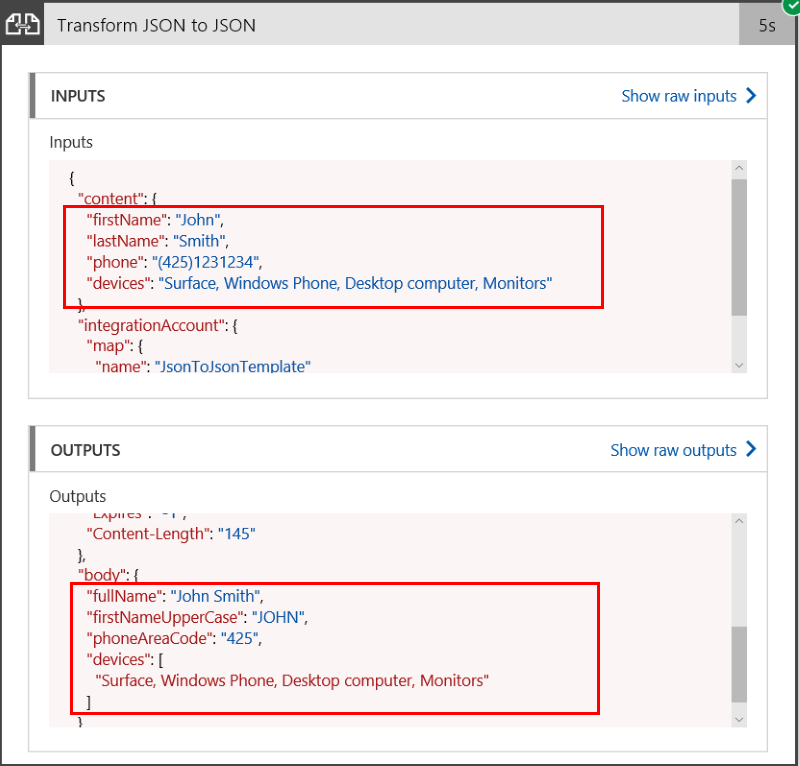

# Advanced JSON transformations using Liquid template
Azure Logic Apps supports basic JSON transformations through native Data Operation actions like Compose or Parse JSON. Logic Apps now also supports advanced JSON transformations with Liquid templates. [Liquid](https://shopify.github.io/liquid/) is an open-source template language for flexible web apps.
 
In this article, learn how to use a Liquid map or template, which can support more complex JSON transformations, such as iterations, control flows, variables, and so on. You must define JSON to JSON mapping with this Liquid map, and store that map in your integration account before you can perform a Liquid transformation in your logic app.

## Prerequisites
Here are the prerequisites to use the liquid action:

* An Azure subscription. If you don't have a subscription, you can 
[start with a free Azure account](https://azure.microsoft.com/free/). 
Otherwise, you can [sign up for a Pay-As-You-Go subscription](https://azure.microsoft.com/pricing/purchase-options/).

* Basic knowledge about [how to create logic apps](../logic-apps/logic-apps-create-a-logic-app.md) 

* A basic [Integration Account](logic-apps-enterprise-integration-create-integration-account.md)


## Create and add Liquid template or map to integration account

1. Create the sample Liquid template for this example. The Liquid template defines how to transform JSON input as described here:

   ```
   
    {
        "fullName": "{{content.firstName | Append: ' ' | Append: content.lastName}}",
        "firstNameUpperCase": "{{content.firstName | Upcase}}",
        "phoneAreaCode": "{{content.phone | Slice: 1, 3}}",
        "devices" : [
        
            
            "{{device}}"
            
            "{{device}}",
            
        
        ]
    }
    ```
    > [!NOTE]
    > If your Liquid template uses any [filters](https://shopify.github.io/liquid/basics/introduction/#filters), those filters must start with uppercase. 

2. Sign in to the [Azure portal](https://portal.azure.com).

3. In the main Azure menu, choose **All resources**. 

4. In the search box, provide your integration account. Select your account.

   

5.  On the integration account tile, select **Maps**.

   

6. Choose **Add** and provide these details for your map:
  * **Name**: The name for your map, which is "JsontoJsonTemplate" in this example.
  * **Map type**: The type for your map. For JSON to JSON transformation, you must select **liquid**.
  * **Map**: An existing Liquid template or map file to use for transformation, which is "SimpleJsonToJsonTemplate.liquid" in this example. You can use the file picker to find this file.

    

    
## Add the Liquid action to transform JSON in your logic app

1. [Create a logic app](logic-apps-create-a-logic-app.md).

2. Add the [Request trigger](../connectors/connectors-native-reqres.md#use-the-http-request-trigger) to your logic app.

3. Choose **+ New step > Add an action**. Search for *liquid* in the search box. Select **Liquid - Transform JSON to JSON**.

  

4. In the **Content** box, select **Body** from dynamic content list or parameters list, whichever appears. 
  
  
 
5. From the **Map** drop-down list, select your Liquid template, which is JsonToJsonTemplate in this example.

  

   If the list is empty, your logic app most likely isn't linked to your integration account. To link your logic app to the integration account that has the Liquid template or map, follow these steps:

   1. On your logic app menu, select **Workflow settings**. 
   2. From the **Select an Integration account** list, select your integration account, and choose **Save**.

     


## Test your logic app
   Post JSON input to your logic app from [Postman](https://www.getpostman.com/postman) or a similar tool. The transformed JSON output from your logic app looks like this example:
  
  


## Next steps
* [Learn more about the Enterprise Integration Pack](../logic-apps/logic-apps-enterprise-integration-overview.md "Learn about Enterprise Integration Pack")  
* [Learn more about maps](../logic-apps/logic-apps-enterprise-integration-maps.md "Learn about enterprise integration maps")  

