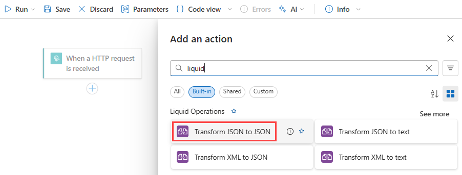
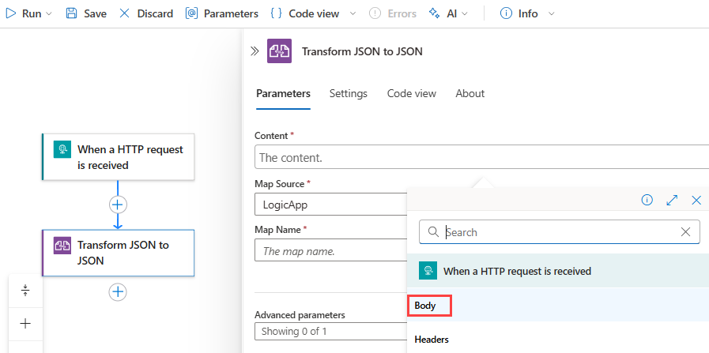

# Transform JSON and XML using Liquid templates as maps in workflows using Azure Logic Apps

When you want to perform basic JSON transformations in your logic app workflows, you can use built-in data operations, such as the **Compose** action or **Parse JSON** action. However, some scenarios might require advanced and complex transformations that include elements such as iterations, control flows, and variables. For transformations between JSON to JSON, JSON to text, XML to JSON, or XML to text, you can create a template that describes the required mapping or transformation using the Liquid open-source template language. You can select this template when you add a **Liquid** built-in action to your workflow. You can use **Liquid** actions in multi-tenant Consumption logic app workflows and single-tenant Standard logic app workflows.

While no **Liquid** triggers are available, you can use any trigger or action to feed the source JSON or XML content into your workflow. For example, you can use a built-in connector trigger, a managed or Azure-hosted connector trigger available for Azure Logic Apps, or even another app.

This article shows how to complete the following tasks:

* Create a Liquid template.
* Upload the template to your integration account for Consumption logic app workflows or to your Standard logic app resource for use in any child workflow.
* Add a Liquid action to your workflow.
* Select the template as the map that you want to use.

For more information, review the following documentation:

* [Perform data operations in Azure Logic Apps](logic-apps-perform-data-operations.md)
* [Liquid open-source template language](https://shopify.github.io/liquid/)
* [Consumption versus Standard logic apps](logic-apps-overview.md#resource-environment-differences)
* [Integration account built-in connectors](../connectors/built-in.md#integration-account-built-in)
* [Built-in connectors overview for Azure Logic Apps](../connectors/built-in.md)
* [Managed or Azure-hosted connectors overview for Azure Logic Apps](../connectors/managed.md) and [Managed or Azure-hosted connectors in Azure Logic Apps](/connectors/connector-reference/connector-reference-logicapps-connectors)

## Prerequisites

* An Azure account and subscription. If you don't have a subscription, [sign up for a free Azure account](https://azure.microsoft.com/free/?WT.mc_id=A261C142F).

* Your logic app resource and workflow. Liquid operations don't have any triggers available, so your workflow has to minimally include a trigger. For more information, se the following documentation:

  * [Create an example Consumption logic app workflow in multi-tenant Azure Logic Apps](quickstart-create-example-consumption-workflow.md)

  * [Create an example Standard logic app workflow in single-tenant Azure Logic Apps](create-single-tenant-workflows-azure-portal.md)

* Based on whether you're working on a Consumption or Standard logic app workflow, you'll need an [integration account resource](logic-apps-enterprise-integration-create-integration-account.md). Usually, you need this resource when you want to define and store artifacts for use in enterprise integration and B2B workflows.

  > [!IMPORTANT]
  >
  > To work together, both your integration account and logic app resource must exist in the same Azure subscription and Azure region.

  * If you're working on a Consumption logic app workflow, your integration account requires a [link to your logic app resource](logic-apps-enterprise-integration-create-integration-account.md?tabs=consumption#link-account).

  * If you're working on a Standard logic app workflow, you can link your integration account to your logic app resource, upload maps directly to your logic app resource, or both, based on the following scenarios:

    * If you already have an integration account with the artifacts that you need or want to use, you can link the integration account to multiple Standard logic app resources where you want to use the artifacts. That way, you don't have to upload maps to each individual logic app. For more information, review [Link your logic app resource to your integration account](logic-apps-enterprise-integration-create-integration-account.md?tabs=standard#link-account).

    * The **Liquid** built-in connector lets you select a map that you previously uploaded to your logic app resource or to a linked integration account, but not both. You can then use these artifacts across all child workflows within the *same logic app resource*.

    So, if you don't have or need an integration account, you can use the upload option. Otherwise, you can use the linking option. Either way, you can use these artifacts across all child workflows within the same logic app resource.

* Basic knowledge about [Liquid template language](https://shopify.github.io/liquid/). Azure Logic Apps uses DotLiquid 2.0.361.

  > [!NOTE]
  >
  > The Liquid action named **Transform JSON to JSON** follows the [DotLiquid implementation for Liquid](https://github.com/dotliquid/dotliquid), 
  > which differs in specific cases from the [Shopify implementation for Liquid](https://shopify.github.io/liquid). 
  > For more information, see [Liquid template considerations](#liquid-template-considerations).

<a name="create-template"></a>

## Step 1: Create the template

Before you can perform a Liquid transformation in your logic app workflow, you must first create a Liquid template that defines the mapping that you want.

1. Create the Liquid template that you use as a map for the JSON transformation. You can use any editing tool that you want.

   The JSON to JSON transformation example in this article uses the following sample Liquid template:

   ```
   

   {
      "fullName": "{{content.firstName | Append: ' ' | Append: content.lastName}}",
      "firstNameUpperCase": "{{content.firstName | Upcase}}",
      "phoneAreaCode": "{{content.phone | Slice: 1, 3}}",
      "devices" : [
         
            
            "{{device}}"
            
            "{{device}}",
            
         
      ]
   }
   ```

1. Save the template using the Liquid template (**.liquid**) file extension. This example uses **SimpleJsonToJsonTemplate.liquid**.

<a name="upload-template"></a>

## Step 2: Upload Liquid template

After you create your Liquid template, you now have to upload the template based on the following scenario:

* If you're working on a Consumption logic app workflow, [upload your template to your integration account](#upload-template-integration-account).

* If you're working on a Standard logic app workflow, you can [upload your template to your integration account](#upload-template-integration-account), or [upload your template to your logic app resource](#upload-template-standard-logic-app).

<a name="upload-template-integration-account"></a>

### Upload template to integration account

1. In the [Azure portal](https://portal.azure.com), sign in with your Azure account credentials.

1. In the Azure portal search box, enter **integration accounts**, and select **Integration accounts**.

   

1. Find and select your integration account.

   

1. On the integration account's navigation menu, under **Settings**, select **Maps**.

    

1. On the **Maps** pane, select **Add**. Provide the following information about your map:

   | Property | Value | Description |
   |----------|-------|-------------|
   | **Name** | `JsonToJsonTemplate` | The name for your map, which is "JsonToJsonTemplate" in this example |
   | **Map type** | **Liquid** | The type for your map. For JSON to JSON transformation, you must select **Liquid**. |
   | **Map** | `SimpleJsonToJsonTemplate.liquid` | An existing Liquid template or map file to use for transformation, which is "SimpleJsonToJsonTemplate.liquid" in this example. To find this file, you can use the file picker. For map size limits, see [Limits and configuration](../logic-apps/logic-apps-limits-and-config.md#artifact-capacity-limits). |
   |||

   

<a name="upload-template-standard-logic-app"></a>

### Upload template to Standard logic app

1. In the [Azure portal](https://portal.azure.com), find and open your logic app resource. Make sure that you're at the resource level, not the workflow level.

1. On your logic app resource's navigation menu, under **Artifacts**, select **Maps**.

1. On the **Maps** pane toolbar, select **Add**.

1. On the **Add Map** pane, provide the following information about your template:

   | Property | Value | Description |
   |----------|-------|-------------|
   | **Name** | `JsonToJsonTemplate` | The name for your map, which is "JsonToJsonTemplate" in this example |
   | **Map type** | **Liquid** | The type for your map. For JSON to JSON transformation, you must select **Liquid**. |
   | **Map** | `SimpleJsonToJsonTemplate.liquid` | An existing Liquid template or map file to use for transformation, which is "SimpleJsonToJsonTemplate.liquid" in this example. To find this file, you can use the file picker. For map size limits, see [Limits and configuration](../logic-apps/logic-apps-limits-and-config.md#artifact-capacity-limits). |
   |||

1. When you're done, select **OK**.

   After your map file finishes uploading, the map appears in the **Maps** list. On your integration account's **Overview** page, under **Artifacts**, your uploaded map also appears.

## Step 3: Add the Liquid transformation action

The following steps show how to add a Liquid transformation action for Consumption and Standard logic app workflows.

### [Consumption](#tab/consumption)

1. In the [Azure portal](https://portal.azure.com), open your logic app workflow in the designer, if not already open.

1. If your workflow doesn't have a trigger or any other actions that your workflow needs, add those operations first. Liquid operations don't have any triggers available.

   This example continues with the Request trigger named **When a HTTP request is received**.

1. On the workflow designer, under the step where you want to add the Liquid action, select **New step**.

1. Under the **Choose an operation** search box, select **All**. In the search box, enter **liquid**.

1. From the actions list, select the Liquid action that you want to use.

   This example continues using the action named **Transform JSON to JSON**.

   

1. In the action's **Content** property, provide the JSON output from the trigger or a previous action that you want to transform by following these steps.

   1. Click inside the **Content** box so that the dynamic content list appears.

   1. From the dynamic content list, select the JSON data that you want to transform.
   
      For this example, from the dynamic content list, under **When a HTTP request is received**, select the **Body** token, which represents the body content output from the trigger.

      

1. From the **Map** list, select your Liquid template.

   This example continues with the template named **JsonToJsonTemplate**.

   

   > [!NOTE]
   >
   > If the maps list is empty, either your logic app resource isn't linked to your 
   > integration account or your integration account doesn't contain any map files.

   When you're done, the action looks similar to the following example:

   

1. Save your workflow. On the designer toolbar, select **Save**.

### [Standard](#tab/standard)

1. In the [Azure portal](https://portal.azure.com), open your logic app workflow in the designer, if not already open.

1. If your workflow doesn't have a trigger or any other actions that your workflow needs, add those operations first. Liquid operations don't have any triggers available.

   This example continues with the Request trigger named **When a HTTP request is received**.

1. On the designer, under the step where you want to add the Liquid action, select the plus sign (**+**), and then select **Add an action**.

1. On the **Add an action** pane that appears, under the search box, select **Built-in**.

1. In the search box, enter **liquid**. From the actions list, select the Liquid action that you want to use.

   This example continues using the action named **Transform JSON to JSON**.

   

1. In the action's **Content** property, provide the JSON output from the trigger or a previous action that you want to transform by following these steps.

   1. Click inside the **Content** box so that the dynamic content list appears.

   1. From the dynamic content list, select the JSON data that you want to transform.

      For this example, in the dynamic content list, under **When a HTTP request is received**, select the **Body** token, which represents the body content output from the trigger.

      

   > [!NOTE]
   >
   > If the **Body** property doesn't appear in the dynamic content list, 
   > select **See more** next to the **When a HTTP request is received** section label.
   > You can also directly enter the content to decode in the **Content** box.

1. From the **Source** list, select either **LogicApp** or **IntegrationAccount** as your Liquid template source.

   This example continues by selecting **IntegrationAccount**.

   

1. From the **Name** list, select your Liquid template.

   This example continues with the template named **JsonToJsonTemplate**.

   

   > [!NOTE]
   >
   > If the maps list is empty, most likely your logic app resource isn't linked to your integration account. 
   > Make sure to [link your logic app resource to the integration account that has the Liquid template or map](logic-apps-enterprise-integration-create-integration-account.md?tabs=standard#link-account).

   When you're done, the action looks similar to the following example:

   

1. Save your workflow. On the designer toolbar, select **Save**.

---

## Test your workflow

1. By using [Postman](https://www.getpostman.com/postman) or a similar tool and the `POST` method, send a call to the Request trigger's URL, which appears in the Request trigger's **HTTP POST URL** property, and include the JSON input to transform, for example:

   ```json
   {
      "devices": "Surface, Mobile, Desktop computer, Monitors",
      "firstName": "Dean",
      "lastName": "Ledet",
      "phone": "(111)0001111"
   }
   ```

1. After your workflow finishes running, go to the workflow's run history, and examine the **Transform JSON to JSON** action's inputs and outputs, for example:

   

<a name="other-transformations"></a>

## Other Liquid transformations

You can use Liquid to perform other transformations, for example:

* [JSON to text](#json-text)
* [XML to JSON](#xml-json)
* [XML to text](#xml-text)

<a name="json-text"></a>

### Transform JSON to text

The following Liquid template shows an example transformation for JSON to text:

```json
{{content.firstName | Append: ' ' | Append: content.lastName}}
```

The following example shows the sample inputs and outputs:


<a name="xml-json"></a>

### Transform XML to JSON

The following Liquid template shows an example transformation for XML to JSON:

```json
[
      {{item}}
  ]
```

The `JSONArrayFor` loop is a custom looping mechanism for XML input so that you can create JSON payloads that avoid a trailing comma. Also, the `where` condition for this custom looping mechanism uses the XML element's name for comparison, rather than the element's value like other Liquid filters. For more information, see [Deep Dive on set-body Policy - Collections of Things](https://azure.microsoft.com/blog/deep-dive-on-set-body-policy).

The following example shows the sample inputs and outputs:


<a name="xml-text"></a>

### Transform XML to text

The following Liquid template shows an example transformation for XML to text:

```json
{{content.firstName | Append: ' ' | Append: content.lastName}}
```

The following example shows the sample inputs and outputs:


<a name="template-considerations"></a>

## Liquid template considerations

* Liquid templates follow the [file size limits for maps](logic-apps-limits-and-config.md#artifact-capacity-limits) in Azure Logic Apps.

* The **Transform JSON to JSON** action follows the [DotLiquid implementation for Liquid](https://github.com/dotliquid/dotliquid). This implementation is a port to the .NET Framework from the [Shopify implementation for Liquid](https://shopify.github.io/liquid/) and differs in [specific cases](https://github.com/dotliquid/dotliquid/issues).

  The following list describes the known differences:

  * The **Transform JSON to JSON** action natively outputs a string, which can include JSON, XML, HTML, and so on. The Liquid action only indicates that the expected text output from the Liquid template's is a JSON string. The action instructs your logic app to parse input as a JSON object and applies a wrapper so that Liquid can interpret the JSON structure. After the transformation, the action instructs your logic app to parse the text output from Liquid back to JSON.

    DotLiquid doesn't natively understand JSON, so make sure that you escape the backslash character (`\`) and any other reserved JSON characters.

  * If your template uses [Liquid filters](https://shopify.github.io/liquid/basics/introduction/#filters), make sure that you follow the [DotLiquid and C# naming conventions](https://github.com/dotliquid/dotliquid/wiki/DotLiquid-for-Designers#filter-and-output-casing), which use *sentence casing*. For all Liquid transforms, make sure that filter names in your template also use sentence casing. Otherwise, the filters won't work.

    For example, when you use the `replace` filter, use `Replace`, not `replace`. The same rule applies if you try out examples at [DotLiquid online](https://github.com/dotliquid/dotliquid/tree/master/src/DotLiquid.Website/Views/TryOnline). For more information, see [Shopify Liquid filters](https://shopify.dev/docs/themes/liquid/reference/filters) and [DotLiquid Liquid filters](https://github.com/dotliquid/dotliquid/wiki/DotLiquid-for-Developers#create-your-own-filters). The Shopify specification includes examples for each filter, so for comparison, you can try these examples at [DotLiquid - Try online](https://github.com/dotliquid/dotliquid/tree/master/src/DotLiquid.Website/Views/TryOnline).

  * The `json` filter from the Shopify extension filters is currently [not implemented in DotLiquid](https://github.com/dotliquid/dotliquid/issues/384). Typically, you can use this filter to prepare text output for JSON string parsing, but instead, you need to use the `Replace` filter instead.

  * The standard `Replace` filter in the [DotLiquid implementation](https://github.com/dotliquid/dotliquid/blob/b6a7d992bf47e7d7dcec36fb402f2e0d70819388/src/DotLiquid/StandardFilters.cs#L425) uses [regular expression (RegEx) matching](/dotnet/standard/base-types/regular-expression-language-quick-reference), while the [Shopify implementation](https://shopify.github.io/liquid/filters/replace/) uses [simple string matching](https://github.com/Shopify/liquid/issues/202). Both implementations appear to work the same way until you use a RegEx-reserved character or an escape character in the match parameter.

    For example, to escape the RegEx-reserved backslash (`\`) escape character, use `| Replace: '\\', '\\'`, and not `| Replace: '\', '\\'`. These examples show how the `Replace` filter behaves differently when you try to escape the backslash character. While this version works successfully:

    `{ "SampleText": "{{ 'The quick brown fox "jumped" over the sleeping dog\\' | Replace: '\\', '\\' | Replace: '"', '\"'}}"}`

    With this result:

    `{ "SampleText": "The quick brown fox \"jumped\" over the sleeping dog\\\\"}`

    This version fails:

    `{ "SampleText": "{{ 'The quick brown fox "jumped" over the sleeping dog\\' | Replace: '\', '\\' | Replace: '"', '\"'}}"}`

    With this error:

    `{ "SampleText": "Liquid error: parsing "\" - Illegal \ at end of pattern."}`

    For more information, see [Replace standard filter uses RegEx pattern matching...](https://github.com/dotliquid/dotliquid/issues/385).

  * The `Sort` filter in the [DotLiquid implementation](https://github.com/dotliquid/dotliquid/blob/b6a7d992bf47e7d7dcec36fb402f2e0d70819388/src/DotLiquid/StandardFilters.cs#L326) sorts items in an array or collection by property but with these differences:

    * Follows [Shopify's sort_natural behavior](https://shopify.github.io/liquid/filters/sort_natural/), not [Shopify's sort behavior](https://shopify.github.io/liquid/filters/sort/).

    * Sorts only in string-alphanumeric order. For more information, see [Numeric sort](https://github.com/Shopify/liquid/issues/980).

    * Uses *case-insensitive* order, not case-sensitive order. For more information, see [Sort filter doesn't follow casing behavior from Shopify's specification]( https://github.com/dotliquid/dotliquid/issues/393).

## Next steps

* [Shopify Liquid language and examples](https://shopify.github.io/liquid/basics/introduction/)
* [DotLiquid](https://github.com/dotliquid/dotliquid/)
* [DotLiquid - Try online](https://github.com/dotliquid/dotliquid/tree/master/src/DotLiquid.Website/Views/TryOnline)
* [DotLiquid GitHub](https://github.com/dotliquid/dotliquid)
* [DotLiquid GitHub issues](https://github.com/dotliquid/dotliquid/issues/)
* Learn more about [maps](../logic-apps/logic-apps-enterprise-integration-maps.md)
