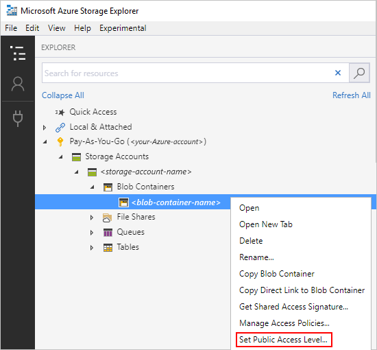
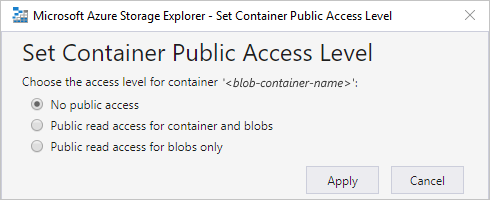
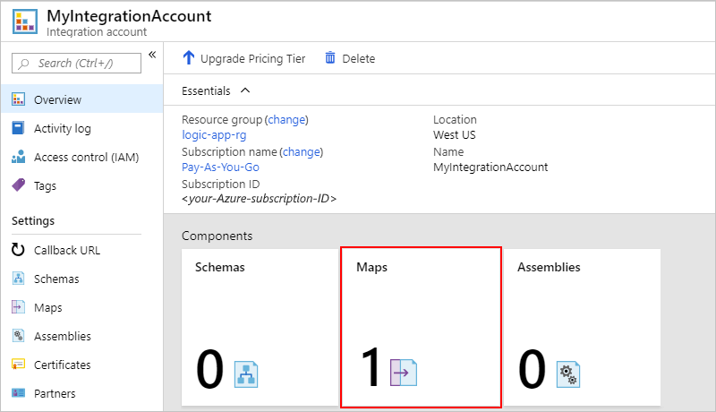
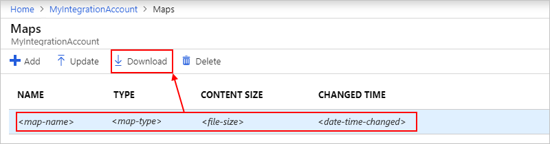
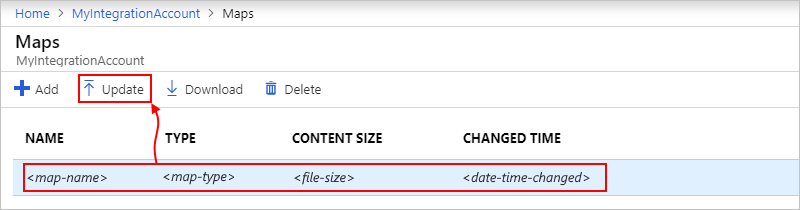
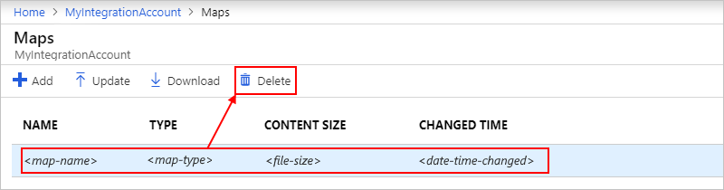
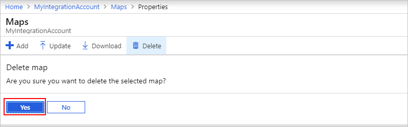

# Transform XML with maps in Azure Logic Apps with Enterprise Integration Pack

To transfer XML data between formats for enterprise integration scenarios 
in Azure Logic Apps, your logic app can use maps, or more specifically, 
Extensible Stylesheet Language Transformations (XSLT) maps. A map is an XML 
document that describes how to convert data from an XML document into another format. 

For example, suppose you regularly receive B2B orders or invoices from 
a customer who uses the YYYMMDD date format. However, your organization 
uses the MMDDYYY date format. You can define and use a map that transforms 
the YYYMMDD date format to the MMDDYYY format before storing the order or 
invoice details in your customer activity database.

For limits related to integration accounts and artifacts such as maps, 
see [Limits and configuration information for Azure Logic Apps](../logic-apps/logic-apps-limits-and-config.md#integration-account-limits).

## Prerequisites

* An Azure subscription. If you don't have a subscription, 
<a href="https://azure.microsoft.com/free/" target="_blank">sign up for a free Azure account</a>.

* An [integration account](../logic-apps/logic-apps-enterprise-integration-create-integration-account.md) 
where you store your maps and other artifacts for enterprise 
integration and business-to-business (B2B) solutions.

* If your map references an external assembly, you have to upload 
*both the assembly and the map* to your integration account. 
Make sure you *upload your assembly first*, and then upload the 
map that references the assembly.

  If your assembly is [2 MB or smaller](#smaller-assembly), 
  you can add your assembly to your integrationacount 
  directly from the Azure portal. However, if your assembly is 
  bigger than 2 MB but no bigger than the [assembly size limit](../logic-apps/logic-apps-limits-and-config.md#artifact-capacity-limits), 

  up to 8 MB](#larger-assembly), 
  you need an Azure blob container where you store your assembly 
  and the content URI for that container so you can provide that 
  location later when you add the assembly to your integration account.

  If your schema is [2 MB or smaller](#smaller-schema), 
  you can add your schema to your integration account 
  directly from the Azure portal. However, if your 
  schema is bigger than 2 MB but no bigger than the 
  [schema size limit](../logic-apps/logic-apps-limits-and-config.md#artifact-capacity-limits), 
  you can upload your schema to an Azure storage account. 
  To add that schema to your integration account, you can 
  then link to your storage account from your integration account. 
  For this task, here are the items you need: 

  * [Azure storage account](../storage/common/storage-account-overview.md) 
  where you create a blob container for your schema. Learn how to 
  [create a storage account](../storage/common/storage-quickstart-create-account.md). 

  * Blob container for storing your schema. Learn how to 
  [create a blob container](../storage/blobs/storage-quickstart-blobs-portal.md). 
  You need your container's content URI later when you 
  add the schema to your integration account.

  * [Azure Storage Explorer](../vs-azure-tools-storage-manage-with-storage-explorer.md), 
  which you can use for managing storage accounts and blob containers. 
  To use Storage Explorer, choose either option here:
  
    * Go to your storage account in the Azure portal. 
    On your storage account menu, select **Storage Explorer**.

    * For the desktop version, [download and install Azure Storage Explorer](https://www.storageexplorer.com/). 
  Then, follow these [steps for connecting Azure Storage Explorer to your storage account](../vs-azure-tools-storage-manage-with-storage-explorer.md).

You don't need a logic app when creating and adding maps. 
However, to use a map, your logic app needs linking to 
an integration account where you store that map. Learn 
[how to link logic apps to integration accounts](../logic-apps/logic-apps-enterprise-integration-create-integration-account.md#link-account). 
If you don't have a logic app yet, learn [how to create logic apps](../logic-apps/quickstart-create-first-logic-app-workflow.md). 

## Add referenced assemblies

1. Sign in to the <a href="https://portal.azure.com" target="_blank">Azure portal</a> 
with your Azure account credentials.

1. To find and open your integration account, 
on the main Azure menu, select **All services**. 
In the search box, enter "integration account". 
Select **Integration accounts**.

   

1. Select the integration account where you want to add your assembly, 
for example:

   

1. On your integration account's **Overview** page, 
under **Components**, select the **Assemblies** tile.

   

1. After the **Assemblies** page opens, choose **Add**.

   

Based on your assembly file's size, follow the 
steps for uploading an assembly that's either 
[up to 2 MB](#smaller-assembly) or 
[more than 2 MB, up to 8 MB](#larger-assembly).
For limits on assembly quantities in integration accounts, see 
[Limits and configuration for Azure Logic Apps](../logic-apps/logic-apps-limits-and-config.md#artifact-number-limits).

### Upload assemblies up to 2 MB

1. Under **Add Assembly**, enter a name for your assembly.
Keep **Small file** selected. Next to the **Assembly** box, 
choose the folder icon. Find and select the assembly you're uploading, 
for example:

   

   In the **Assembly Name** property, the assembly's file 
   name appears automatically after you select the assembly.

1. When you're ready, choose **OK**.

   After your assembly file finishes uploading, 
   the assembly appears in the **Assemblies** list.

   

   On your integration account's **Overview** page, 
   under **Components**, the **Assemblies** tile now 
   shows the number of uploaded assemblies, for example:

   

### Upload assemblies more than 2 MB

To upload an assembly that's larger than 2 MB but only up to 8 MB,
follow these steps. 

1. Under **Add Assembly**, enter a name for your assembly.
Choose **Large file (larger than 2 MB)**. 

   The **Content URI** box now appears, 
   rather than the **Assembly** box. 

1. In the **Content URI** box, enter the location for 
the blob container where you're storing your assembly.

   On your integration account's **Overview** page, 
   under **Components**, the **Assemblies** tile now 
   shows the number of uploaded assemblies, for example:

   

## Create maps

To create an XSLT document you can use as a map, 
you can use Visual Studio 2015 for creating a 
BizTalk Integration project by using the 
[Enterprise Integration Pack](logic-apps-enterprise-integration-overview.md). 
In this project, you can build an integration map file, 
which lets you visually map items between two XML schema files. 
After you build this project, you get an XSLT document.

## Add maps

After you upload any assemblies that your map references, 
you can now upload your map.

1. If you haven't signed in already, sign in to the 
<a href="https://portal.azure.com" target="_blank">Azure portal</a> 
with your Azure account credentials. 

1. If your integration account isn't already open, 
on the main Azure menu, select **All services**. 
In the search box, enter "integration account". 
Select **Integration accounts**.

   

1. Select the integration account where you want to add your map, 
for example:

   

1. On your integration account's **Overview** page, 
under **Components**, select the **Maps** tile.

   

1. After the **Maps** page opens, choose **Add**.

     

1. Upload your map by following these steps:

   1. Under **Add Map**, enter a name for your map.

   1. Under **Map type**, select the type, for example: 
   **Liquid**, **XSLT**, **XSLT 2.0**, or **XSLT 3.0**.

   1. Next to the **Map** box, choose the folder icon.

   1. Find and select the map file you're uploading, for example:

      

      If you left the **Name** property empty, the map's file name automatically 
      appears in that property automatically after you select the map file. 
      However, you can use any unique name.

      For limits on map sizes, see [Limits and configuration for Azure Logic Apps](../logic-apps/logic-apps-limits-and-config.md#artifact-capacity-limits). 
      To add maps larger than 2 MB up to the size limit, 
      [follow the steps in this section](#add-larger-map).

   1. When you're ready, choose **OK**. 
   After your map file finishes uploading, 
   the map appears in the **Maps** list.

      

      On your integration account's **Overview** page, 
      under **Components**, the **Maps** tile now 
      shows the number of uploaded maps, for example:

      

      For limits on map quantities in integration accounts, see 
      [Limits and configuration for Azure Logic Apps](../logic-apps/logic-apps-limits-and-config.md#artifact-number-limits). 

## Add maps larger than 2 MB

To add a map file up to the [map size limit](../logic-apps/logic-apps-limits-and-config.md#artifact-capacity-limits), 
you need these items: 

* [Azure storage account](../storage/common/storage-account-overview.md) 
for creating a blob container. Learn how to 
[create a storage account](../storage/common/storage-quickstart-create-account.md).

* Blob container for storing your maps. Learn how to [create a blob container](../storage/blobs/storage-quickstart-blobs-portal.md).

* [Azure Storage Explorer](../vs-azure-tools-storage-manage-with-storage-explorer.md), 
which you can use for managing storage accounts and blob containers. If you don't have 
this tool already, [download and install Azure Storage Explorer](https://www.storageexplorer.com/). Then, follow these [steps for connecting Azure Storage Explorer to your storage account](../vs-azure-tools-storage-manage-with-storage-explorer.md).

Your steps for adding maps differ based whether or not your blob container 
has public read access. So first, check your blob container's access level.

### Check blob container access level

1. Open Azure Storage Explorer. 
If you haven't already connected to your Azure subscription and storage account, 
[follow these steps to connect now](../vs-azure-tools-storage-manage-with-storage-explorer.md).

1. In the explorer window, select {*your-Azure-subscription*} > 
**Storage Accounts** > {*your-storage-account*} > 
**Blob Containers** > {*your-blob-container*}.
From your blob container's shortcut menu, 
select **Set Public Access Level**. 

   

1. Find the option that appears selected 
and follow the steps for the selected option: 

   * [**No public access**](#no-public-access)
   * [**Public read access** (any)](#public-read-access)

   For example:

   

### Add maps to containers with no public access

### Add maps to containers with public read access

1. On the blob container toolbar, choose **Upload**. 
Find and select your map file for uploading to your storage account. 

1. On the blob container toolbar, choose **View**. 
Select your map file. Find the **Snapshot Qualified Storage Uri** 
property, which has this value: 

   `Primary =` <*URI-value*> 

1. Copy the URI. 

## Edit maps

To update an existing map, you have to upload a new 
map file that has the changes you want. However, 
you can first download the existing map for editing.

1. In the <a href="https://portal.azure.com" target="_blank">Azure portal</a>, 
find and open your integration account, if not already open.

1. On the main Azure menu, select **All services**. 
In the search box, enter "integration account". 
Select **Integration accounts**.

   

1. Select the integration account where you want to update your map, 
for example:

   

1. On your integration account's **Overview** page, 
under **Components**, select the **Maps** tile.

   

1. After the **Maps** page opens, select your map. 
To download and edit the map first, choose **Download**, 
and save the map.

     

1. When you're ready to upload the updated map, on the **Maps** page, 
select the map you want to update, and choose **Update**.

   

1. Find and select the updated map you want to upload. 
After your map file finishes uploading, 
the updated map appears in the **Maps** list.

## Delete maps

1. In the <a href="https://portal.azure.com" target="_blank">Azure portal</a>, 
find and open your integration account, if not already open.

1. On the main Azure menu, select **All services**. 
In the search box, enter "integration account". 
Select **Integration accounts**.

   

1. Select the integration account where you want to update your map, 
for example:

   

1. On your integration account's **Overview** page, 
under **Components**, select the **Maps** tile.

   

1. After the **Maps** page opens, select your map, 
and choose **Delete**.

   

1. To confirm you want to delete the map, choose **Yes**.

   

## Next steps

* [Learn more about the Enterprise Integration Pack](logic-apps-enterprise-integration-overview.md)  
* [Learn more about agreements](../logic-apps/logic-apps-enterprise-integration-agreements.md)  
* [Learn more about transforms](logic-apps-enterprise-integration-transform.md)