# Transform XML with maps in Azure Logic Apps with Enterprise Integration Pack

To transfer XML data between formats for enterprise integration scenarios 
in Azure Logic Apps, your logic app can use maps, or more specifically, 
Extensible Style sheet Language Transformations (XSLT) maps. A map is an XML 
document that describes how to convert data from an XML document into another format. 

For example, suppose you regularly receive B2B orders or invoices from 
a customer who uses the YYYMMDD date format. However, your organization 
uses the MMDDYYY date format. You can define and use a map that transforms 
the YYYMMDD date format to the MMDDYYY format before storing the order or 
invoice details in your customer activity database.

For limits related to integration accounts and artifacts such as maps, 
see [Limits and configuration information for Azure Logic Apps](../logic-apps/logic-apps-limits-and-config.md#integration-account-limits).

## Prerequisites

* An Azure subscription. If you don't have a subscription, [sign up for a free Azure account](https://azure.microsoft.com/free/).

* An [integration account](../logic-apps/logic-apps-enterprise-integration-create-integration-account.md) 
where you store your maps and other artifacts for enterprise 
integration and business-to-business (B2B) solutions.

* If your map references an external assembly, you have to upload 
*both the assembly and the map* to your integration account. 
Make sure you [*upload your assembly first*](#add-assembly), and then upload the 
map that references the assembly.

  If your assembly is 2 MB or smaller, you can add 
  your assembly to your integration account *directly* 
  from the Azure portal. However, if your assembly or 
  map is bigger than 2 MB but not bigger than the 
  [size limit for assemblies or maps](../logic-apps/logic-apps-limits-and-config.md#artifact-capacity-limits), 
  you have these options:

  * For assemblies, you need an Azure blob container 
  where you can upload your assembly and that container's 
  location. That way, you can provide that location later 
  when you add the assembly to your integration account. 
  For this task, you need these items:

    | Item | Description |
    |------|-------------|
    | [Azure storage account](../storage/common/storage-account-overview.md) | In this account, create an Azure blob container for your assembly. Learn [how to create a storage account](../storage/common/storage-account-create.md). |
    | Blob container | In this container, you can upload your assembly. You also need this container's location when you add the assembly to your integration account. Learn how to [create a blob container](../storage/blobs/storage-quickstart-blobs-portal.md). |
    | [Azure Storage Explorer](../vs-azure-tools-storage-manage-with-storage-explorer.md) | This tool helps you more easily manage storage accounts and blob containers. To use Storage Explorer, either [download and install Azure Storage Explorer](https://www.storageexplorer.com/). Then, connect Storage Explorer to your storage account by following the steps in [Get started with Storage Explorer](../vs-azure-tools-storage-manage-with-storage-explorer.md). To learn more, see [Quickstart: Create a blob in object storage with Azure Storage Explorer](../storage/blobs/storage-quickstart-blobs-storage-explorer.md). 
Or, in the Azure portal, find and select your storage account. From your storage account menu, select **Storage Explorer**. |
    |||

  * For maps, you can currently add larger maps by using the [Azure Logic Apps REST API - Maps](https://docs.microsoft.com/rest/api/logic/maps/createorupdate).

You don't need a logic app when creating and adding maps. 
However, to use a map, your logic app needs linking to 
an integration account where you store that map. Learn 
[how to link logic apps to integration accounts](../logic-apps/logic-apps-enterprise-integration-create-integration-account.md#link-account). 
If you don't have a logic app yet, learn [how to create logic apps](../logic-apps/quickstart-create-first-logic-app-workflow.md).

## Add referenced assemblies

1. Sign in to the [Azure portal](https://portal.azure.com) 
   with your Azure account credentials.

1. To find and open your integration account, 
   on the main Azure menu, select **All services**. 
   In the search box, enter "integration account". 
   Select **Integration accounts**.

   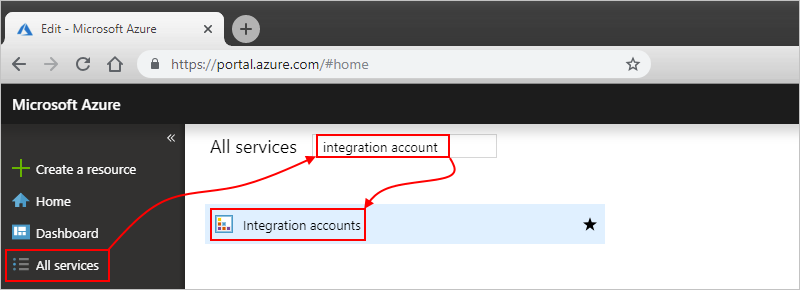

1. Select the integration account where you want to 
   add your assembly, for example:

   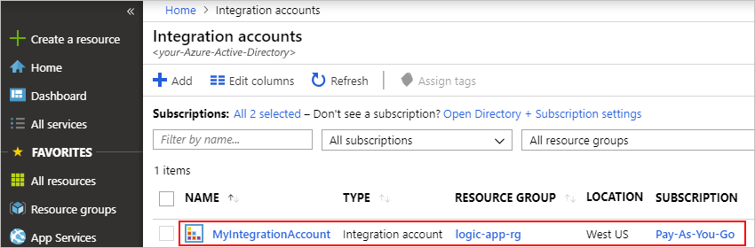

1. On your integration account's **Overview** page, 
   under **Components**, select the **Assemblies** tile.

   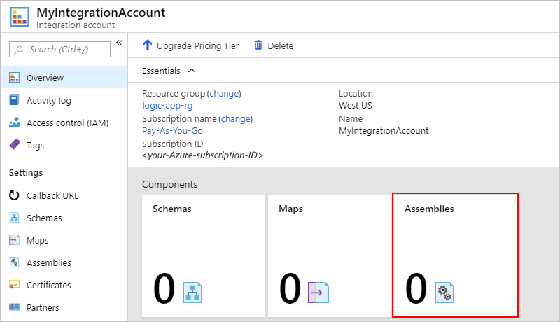

1. After the **Assemblies** page opens, choose **Add**.

   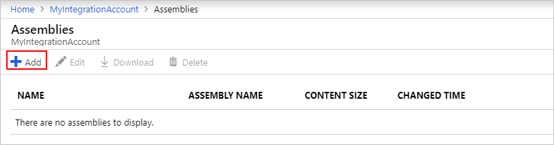

Based on your assembly file's size, follow the 
steps for uploading an assembly that's either 
[up to 2 MB](#smaller-assembly) or 
[more than 2 MB but only up to 8 MB](#larger-assembly).
For limits on assembly quantities in integration accounts, see 
[Limits and configuration for Azure Logic Apps](../logic-apps/logic-apps-limits-and-config.md#artifact-number-limits).

> [!NOTE]
> If you change your assembly, you must also update your map whether or not the map has changes.

### Add assemblies up to 2 MB

1. Under **Add Assembly**, enter a name for your assembly. 
Keep **Small file** selected. Next to the **Assembly** box, 
choose the folder icon. Find and select the assembly 
you're uploading, for example:

   

   In the **Assembly Name** property, the assembly's file 
   name appears automatically after you select the assembly.

1. When you're ready, choose **OK**.

   After your assembly file finishes uploading, 
   the assembly appears in the **Assemblies** list.

   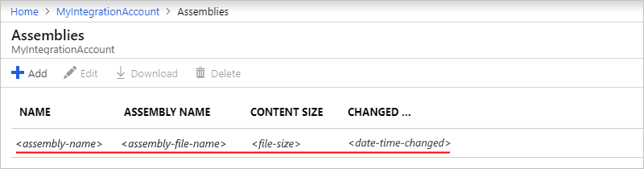

   On your integration account's **Overview** page, 
   under **Components**, the **Assemblies** tile now 
   shows the number of uploaded assemblies, for example:

   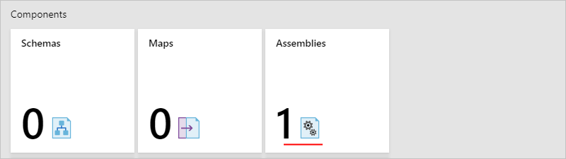

### Add assemblies more than 2 MB

To add larger assemblies, you can upload your assembly to 
an Azure blob container in your Azure storage account. 
Your steps for adding assemblies differ based whether 
your blob container has public read access. So first, 
check whether or not your blob container has public 
read access by following these steps: 
[Set public access level for blob container](../vs-azure-tools-storage-explorer-blobs.md#set-the-public-access-level-for-a-blob-container)

#### Check container access level

1. Open Azure Storage Explorer. In the Explorer window, 
   expand your Azure subscription if not already expanded.

1. Expand **Storage Accounts** > {*your-storage-account*} > 
   **Blob Containers**. Select your blob container.

1. From your blob container's shortcut menu, 
   select **Set Public Access Level**.

   * If your blob container has at least public access, choose **Cancel**, 
   and follow these steps later on this page: 
   [Upload to containers with public access](#public-access-assemblies)

     

   * If your blob container doesn't have public access, choose **Cancel**, 
   and follow these steps later on this page: 
   [Upload to containers without public access](#no-public-access-assemblies)

     

#### Upload to containers with public access

1. Upload the assembly to your storage account. 
   In the right-hand window, choose **Upload**.

1. After you finish uploading, select your 
   uploaded assembly. On the toolbar, choose **Copy URL** 
   so that you copy the assembly's URL.

1. Return to the Azure portal where the 
   **Add Assembly** pane is open. 
   Enter a name for your assembly. 
   Choose **Large file (larger than 2 MB)**.

   The **Content URI** box now appears, 
   rather than the **Assembly** box.

1. In the **Content URI** box, paste your assembly's URL. 
   Finish adding your assembly.

After your assembly finishes uploading, 
the schema appears in the **Assemblies** list.
On your integration account's **Overview** page, 
under **Components**, the **Assemblies** tile now 
shows the number of uploaded assemblies.

#### Upload to containers without public access

1. Upload the assembly to your storage account. 
   In the right-hand window, choose **Upload**.

1. After you finish uploading, generate a 
   shared access signature (SAS) for your assembly. 
   From your assembly's shortcut menu, 
   select **Get Shared Access Signature**.

1. In the **Shared Access Signature** pane, select 
   **Generate container-level shared access signature URI** > **Create**. 
   After the SAS URL gets generated, next to the **URL** box, choose **Copy**.

1. Return to the Azure portal where the 
   **Add Assembly** pane is open. 
   Enter a name for your assembly. 
   Choose **Large file (larger than 2 MB)**.

   The **Content URI** box now appears, 
   rather than the **Assembly** box.

1. In the **Content URI** box, paste the SAS URI 
   you previously generated. Finish adding your assembly.

After your assembly finishes uploading, 
the assembly appears in the **Schemas** list. 
On your integration account's **Overview** page, 
under **Components**, the **Assemblies** tile now 
shows the number of uploaded assemblies.

## Create maps

To create an XSLT document you can use as a map, 
you can use Visual Studio 2015 for creating a 
BizTalk Integration project by using the 
[Enterprise Integration Pack](logic-apps-enterprise-integration-overview.md). 
In this project, you can build an integration map file, 
which lets you visually map items between two XML schema files. 
After you build this project, you get an XSLT document.
For limits on map quantities in integration accounts, see 
[Limits and configuration for Azure Logic Apps](../logic-apps/logic-apps-limits-and-config.md#artifact-number-limits). 

## Add maps

After you upload any assemblies that your map references, 
you can now upload your map.

1. If you haven't signed in already, sign in to the 
   [Azure portal](https://portal.azure.com) 
   with your Azure account credentials. 

1. If your integration account isn't already open, 
   on the main Azure menu, select **All services**. 
   In the search box, enter "integration account". 
   Select **Integration accounts**.

   

1. Select the integration account where you want to add your map, 
   for example:

   

1. On your integration account's **Overview** page, 
   under **Components**, select the **Maps** tile.

   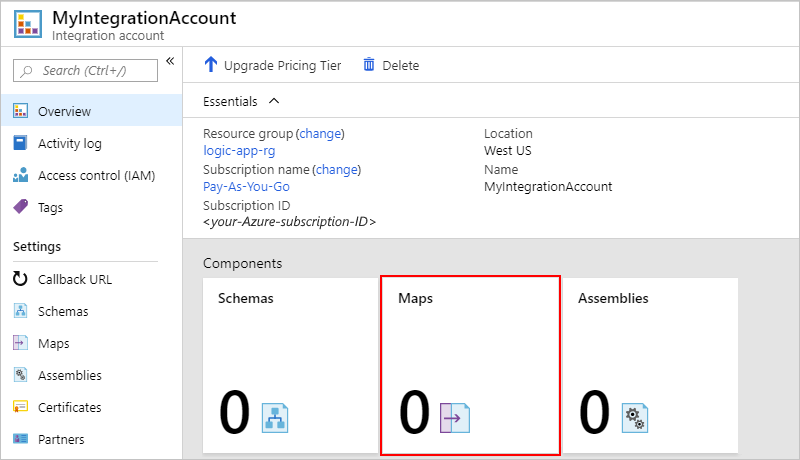

1. After the **Maps** page opens, choose **Add**.

   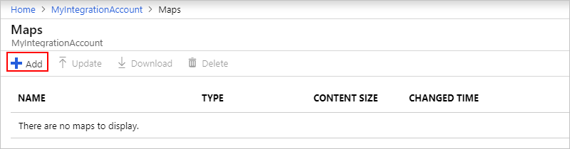  

### Add maps up to 2 MB

1. Under **Add Map**, enter a name for your map. 

1. Under **Map type**, select the type, for example: 
   **Liquid**, **XSLT**, **XSLT 2.0**, or **XSLT 3.0**.

1. Keep **Small file** selected. Next to the **Map** box, 
   choose the folder icon. Find and select the map 
   you're uploading, for example:

   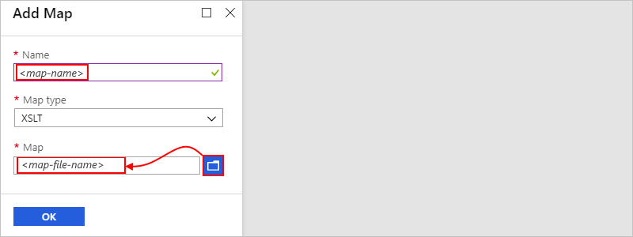

   If you left the **Name** property empty, the map's file name automatically 
   appears in that property automatically after you select the map file. 
   However, you can use any unique name.

1. When you're ready, choose **OK**. 
   After your map file finishes uploading, 
   the map appears in the **Maps** list.

   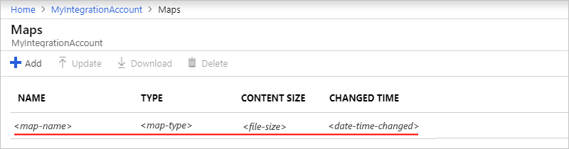

   On your integration account's **Overview** page, 
   under **Components**, the **Maps** tile now 
   shows the number of uploaded maps, for example:

   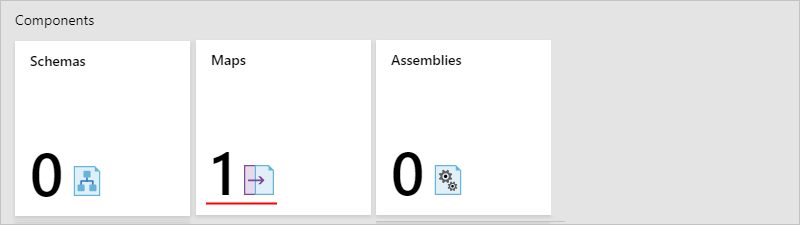

### Add maps more than 2 MB

Currently, to add larger maps, use the [Azure Logic Apps REST API - Maps](https://docs.microsoft.com/rest/api/logic/maps/createorupdate).

<!--

To add larger maps, you can upload your map to 
an Azure blob container in your Azure storage account. 
Your steps for adding maps differ based whether your 
blob container has public read access. So first, check 
whether or not your blob container has public read 
access by following these steps: 
[Set public access level for blob container](../vs-azure-tools-storage-explorer-blobs.md#set-the-public-access-level-for-a-blob-container)

#### Check container access level

1. Open Azure Storage Explorer. In the Explorer window, 
   expand your Azure subscription if not already expanded.

1. Expand **Storage Accounts** > {*your-storage-account*} > 
   **Blob Containers**. Select your blob container.

1. From your blob container's shortcut menu, 
   select **Set Public Access Level**.

   * If your blob container has at least public access, choose **Cancel**, 
   and follow these steps later on this page: 
   [Upload to containers with public access](#public-access)

     

   * If your blob container doesn't have public access, choose **Cancel**, 
   and follow these steps later on this page: 
   [Upload to containers without public access](#public-access)

     

### Add maps to containers with public access

1. Upload the map to your storage account. 
   In the right-hand window, choose **Upload**. 

1. After you finish uploading, select your 
   uploaded map. On the toolbar, choose **Copy URL** 
   so that you copy the map's URL.

1. Return to the Azure portal where the 
   **Add Map** pane is open. Choose **Large file**. 

   The **Content URI** box now appears, 
   rather than the **Map** box.

1. In the **Content URI** box, paste your map's URL. 
   Finish adding your map.

After your map finishes uploading, 
the map appears in the **Maps** list.

### Add maps to containers with no public access

1. Upload the map to your storage account. 
   In the right-hand window, choose **Upload**.

1. After you finish uploading, generate a 
   shared access signature (SAS) for your schema. 
   From your map's shortcut menu, 
   select **Get Shared Access Signature**.

1. In the **Shared Access Signature** pane, select 
   **Generate container-level shared access signature URI** > **Create**. 
   After the SAS URL gets generated, next to the **URL** box, choose **Copy**.

1. Return to the Azure portal where the 
   **Add Maps** pane is open. Choose **Large file**.

   The **Content URI** box now appears, 
   rather than the **Map** box.

1. In the **Content URI** box, paste the SAS URI 
   you previously generated. Finish adding your map.

After your map finishes uploading, 
the map appears in the **Maps** list.

-->

## Edit maps

To update an existing map, you have to upload a new 
map file that has the changes you want. However, 
you can first download the existing map for editing.

1. In the [Azure portal](https://portal.azure.com), 
find and open your integration account, if not already open.

1. On the main Azure menu, select **All services**. 
In the search box, enter "integration account". 
Select **Integration accounts**.

1. Select the integration account where you want to update your map.

1. On your integration account's **Overview** page, 
   under **Components**, select the **Maps** tile.

1. After the **Maps** page opens, select your map. 
   To download and edit the map first, choose **Download**, 
   and save the map.

1. When you're ready to upload the updated map, on the **Maps** page, 
   select the map you want to update, and choose **Update**.

1. Find and select the updated map you want to upload. 
   After your map file finishes uploading, 
   the updated map appears in the **Maps** list.

## Delete maps

1. In the [Azure portal](https://portal.azure.com), 
   find and open your integration account, if not already open.

1. On the main Azure menu, select **All services**. 
   In the search box, enter "integration account". 
   Select **Integration accounts**.

1. Select the integration account where you 
   want to delete your map.

1. On your integration account's **Overview** page, 
   under **Components**, select the **Maps** tile.

1. After the **Maps** page opens, select your map, and choose **Delete**.

1. To confirm you want to delete the map, choose **Yes**.

## Next steps

* [Learn more about the Enterprise Integration Pack](../logic-apps/logic-apps-enterprise-integration-overview.md)  
* [Learn more about schemas](../logic-apps/logic-apps-enterprise-integration-schemas.md)
* [Learn more about transforms](../logic-apps/logic-apps-enterprise-integration-transform.md)
