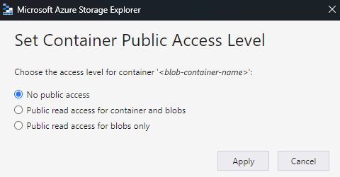

# Add maps for transformations in workflows with Azure Logic Apps

Workflow actions such as **Transform XML** and **Liquid** require a map to perform their tasks. For example, the **Transform XML** action requires a map to convert XML between formats. A map is an XML document that uses [Extensible Stylesheet Language Transformation (XSLT)](https://www.w3.org/TR/xslt/) language to describe how to convert data from XML to another format and has the .xslt file name extension. The map consists of a source XML schema as input and a target XML schema as output. You can define a basic transformation, such as copying a name and address from one document to another. Or, you can create more complex transformations using the out-of-the-box map operations. You can manipulate or control data by using different built-in functions, such as string manipulations, conditional assignments, arithmetic expressions, date time formatters, and even looping constructs.

For example, suppose you regularly receive B2B orders or invoices from a customer who uses the YearMonthDay date format (YYYYMMDD). However, your organization uses the MonthDayYear date format (MMDDYYYY). You can define and use a map that transforms the YYYYMMDD format to the MMDDYYYY format before storing the order or invoice details in your customer activity database.

This article shows how to add a map to your integration account. If you're working with a Standard logic app workflow, you can also add a map directly to your logic app resource.

## Prerequisites

* An Azure account and subscription. If you don't have a subscription yet, [sign up for a free Azure account](https://azure.microsoft.com/free/?WT.mc_id=A261C142F).

* The map that you want to add. To create maps, you can use the following tools:

  * Visual Studio Code and the Data Mapper extension. To call the maps created with Data Mapper from your workflow, you must use the **Data Mapper Operations** action named **Transform using Data Mapper XSLT**, not the **XML Operations** action named **Transform XML**. For more information, see [Create maps for data transformation with Visual Studio Code](create-maps-data-transformation-visual-studio-code.md).

  * Visual Studio 2019 and the [Microsoft Azure Logic Apps Enterprise Integration Tools extension](https://aka.ms/vsenterpriseintegrationtools).

  * Visual Studio 2015 and the [Microsoft Azure Logic Apps Enterprise Integration Tools for Visual Studio 2015 2.0 extension](https://aka.ms/vsmapsandschemas).

    > [!NOTE]
    > Don't install the Microsoft Azure Logic Apps Enterprise Integration Tools extension alongside the BizTalk Server extension. 
    > Having both extensions might produce unexpected behavior. Make sure that you only have one of these extensions installed.
    >
    > On high resolution monitors, you might experience a [display problem with the map designer](/visualstudio/designers/disable-dpi-awareness) 
    > in Visual Studio. To resolve this display problem, either [restart Visual Studio in DPI-unaware mode](/visualstudio/designers/disable-dpi-awareness#restart-visual-studio-as-a-dpi-unaware-process), 
    > or add the [DPIUNAWARE registry value](/visualstudio/designers/disable-dpi-awareness#add-a-registry-entry).

    For more information, review the [Create maps](#create-maps) section in this article.

* Based on whether you're working on a Consumption or Standard logic app workflow, you'll need an [integration account resource](logic-apps-enterprise-integration-create-integration-account.md). Usually, you need this resource when you want to define and store artifacts for use in enterprise integration and B2B workflows.

  > [!IMPORTANT]
  >
  > To work together, both your integration account and logic app resource must exist in the same Azure subscription and Azure region.

  * If you're working on a Consumption logic app workflow, you'll need an [integration account that's linked to your logic app resource](logic-apps-enterprise-integration-create-integration-account.md?tabs=consumption#link-account).

  * If you're working on a Standard logic app workflow, you can link your integration account to your logic app resource, upload maps directly to your logic app resource, or both, based on the following scenarios:

    * If you already have an integration account with the artifacts that you need or want to use, you can link your integration account to multiple Standard logic app resources where you want to use the artifacts. That way, you don't have to upload maps to each individual logic app. For more information, review [Link your logic app resource to your integration account](logic-apps-enterprise-integration-create-integration-account.md?tabs=standard#link-account).

    * The **Liquid** built-in connector lets you select a map that you previously uploaded to your logic app resource or to a linked integration account, but not both.

    So, if you don't have or need an integration account, you can use the upload option. Otherwise, you can use the linking option. Either way, you can use these artifacts across all child workflows within the same logic app resource.

## Limitations

* Limits apply to the number of artifacts, such as maps, per integration account. For more information, review [Limits and configuration information for Azure Logic Apps](logic-apps-limits-and-config.md#integration-account-limits).

* Based on whether you're working on a Consumption or Standard logic app workflow, the following limitations apply:

  * Standard workflows

    * Supports references to external assemblies from maps, which enable direct calls from XSLT maps to custom .NET code. To configure support for external assemblies, see [.NET Framework assembly support for XSLT transformations added to Azure Logic Apps (Standard)](https://techcommunity.microsoft.com/t5/integrations-on-azure-blog/net-framework-assembly-support-added-to-azure-logic-apps/ba-p/3669120).

    * Supports XSLT 1.0, 2.0, and 3.0.

    * No limits apply to map file sizes.

  * Consumption workflows

    * Azure Logic Apps allocates finite memory for processing XML transformations. If you create Consumption workflows, and your map or payload transformations have high memory consumption, such transformations might fail, resulting in out of memory errors. To avoid this scenario, consider these options:

      * Edit your maps or payloads to reduce memory consumption.

      * Create [Standard logic app workflows](logic-apps-overview.md#resource-environment-differences), which run in single-tenant Azure Logic Apps and offer dedicated and flexible options for compute and memory resources.

    * Supports references to external assemblies from maps, which enable direct calls from XSLT maps to custom .NET code with the following requirements:

      * You need a 64-bit assembly. The transform service runs a 64-bit process, so 32-bit assemblies aren't supported. If you have the source code for a 32-bit assembly, recompile the code into a 64-bit assembly. If you don't have the source code, but you obtained the binary from a third-party provider, get the 64-bit version from that provider. For example, some vendors provide assemblies in packages that have both 32-bit and 64-bit versions. If you have the option, use the 64-bit version instead.

      * You have to upload *both the assembly and the map* in a specific order to your integration account. Make sure you [*upload your assembly first*](#add-assembly), and then upload the map that references the assembly.

      * If your assembly or map is [2 MB or smaller](#smaller-map), you can add your assembly and map to your integration account *directly* from the Azure portal.

      * If your assembly is bigger than 2 MB but not bigger than the [size limit for assemblies](logic-apps-limits-and-config.md#artifact-capacity-limits), you'll need an Azure storage account and blob container where you can upload your assembly. Later, you can provide that container's location when you add the assembly to your integration account. For this task, the following table describes the items you need:

        | Item | Description |
        |------|-------------|
        | [Azure storage account](../storage/common/storage-account-overview.md) | In this account, create an Azure blob container for your assembly. Learn [how to create a storage account](../storage/common/storage-account-create.md). |
        | Blob container | In this container, you can upload your assembly. You also need this container's content URI location when you add the assembly to your integration account. Learn how to [create a blob container](../storage/blobs/storage-quickstart-blobs-portal.md). |
        | [Azure Storage Explorer](../vs-azure-tools-storage-manage-with-storage-explorer.md) | This tool helps you more easily manage storage accounts and blob containers. To use Storage Explorer, either [download and install Azure Storage Explorer](https://www.storageexplorer.com/). Then, connect Storage Explorer to your storage account by following the steps in [Get started with Storage Explorer](../vs-azure-tools-storage-manage-with-storage-explorer.md). To learn more, see [Quickstart: Create a blob in object storage with Azure Storage Explorer](../storage/blobs/quickstart-storage-explorer.md). <br><br>Or, in the Azure portal, select your storage account. From your storage account menu, select **Storage Explorer**. |

        To add larger maps, you can use the [Azure Logic Apps REST API - Maps](/rest/api/logic/maps/createorupdate). For Standard workflows, the Azure Logic Apps REST API is currently unavailable.

<a name="create-maps"></a>

## Create maps

You can create maps using either Visual Studio Code with the Data Mapper extension or Visual Studio with the Microsoft Azure Logic Apps Enterprise Integration Tools extension.

### Visual Studio Code

When you create maps using Visual Studio Code and the Data Mapper extension, you can call these maps from your workflow, but only with the **Data Mapper Operations** action named **Transform using Data Mapper XSLT**, not the **XML Operations** action named **Transform XML**. For more information, see [Create maps for data transformation with Visual Studio Code](create-maps-data-transformation-visual-studio-code.md).

### Visual Studio

When you create maps using Visual Studio, you'll need to create an integration project with either of the following tools:

* Visual Studio 2019 and the [Microsoft Azure Logic Apps Enterprise Integration Tools extension](https://aka.ms/vsenterpriseintegrationtools)

* Visual Studio 2015 and the [Microsoft Azure Logic Apps Enterprise Integration Tools for Visual Studio 2015 2.0 extension](https://aka.ms/vsmapsandschemas).

In the integration project, you can build an integration map file, which lets you visually map items between two XML schema files. These tools offer the following map capabilities:

* You work with a graphical representation of the map, which shows all the relationships and links you create.

* You can make a direct data copy between the XML schemas that you use to create the map. The Enterprise Integration SDK for Visual Studio includes a mapper that makes this task as simple as drawing a line that connects the elements in the source XML schema with their counterparts in the target XML schema.

* Operations or functions for multiple maps are available, including string functions, date time functions, and so on.

* To add a sample XML message, you can use the map testing capability. With just one gesture, you can test the map you created, and review the generated output.

* After you build your project, you get an XSLT document.

Your map must have the following attributes and a `CDATA` section that contains the call to the assembly code:

* `name` is the custom assembly name.

* `namespace` is the namespace in your assembly that includes the custom code.

The following example shows a map that references an assembly named `XslUtilitiesLib` and calls the `circumference` method from the assembly.

```xml
<?xml version="1.0" encoding="UTF-8"?>
<xsl:stylesheet version="1.0" xmlns:xsl="http://www.w3.org/1999/XSL/Transform" xmlns:msxsl="urn:schemas-microsoft-com:xslt" xmlns:user="urn:my-scripts">
<msxsl:script language="C#" implements-prefix="user">
    <msxsl:assembly name="XsltHelperLib"/>
    <msxsl:using namespace="XsltHelpers"/>
    <![CDATA[public double circumference(int radius){ XsltHelper helper = new XsltHelper(); return helper.circumference(radius); }]]>
</msxsl:script>
<xsl:template match="data">
<circles>
    <xsl:for-each select="circle">
        <circle>
            <xsl:copy-of select="node()"/>
                <circumference>
                    <xsl:value-of select="user:circumference(radius)"/>
                </circumference>
        </circle>
    </xsl:for-each>
</circles>
</xsl:template>
</xsl:stylesheet>
```

<a name="add-assembly"></a>

## Add referenced assemblies

### [Consumption](#tab/consumption)

A Consumption logic app resource supports referencing external assemblies from maps, which enable direct calls from XSLT maps to custom .NET code. 

1. In the [Azure portal](https://portal.azure.com), sign in with your Azure account credentials.

1. In the main Azure search box, enter `integration accounts`, and select **Integration accounts**.

1. Select the integration account where you want to add your assembly.

1. On your integration account's menu, select **Overview**. Under **Settings**, select **Assemblies**.

1. On the **Assemblies** pane toolbar, select **Add**.

Based on your assembly file's size, follow the steps for uploading an assembly that's either [up to 2 MB](#smaller-assembly) or [more than 2 MB but only up to 8 MB](#larger-assembly). For limits on assembly quantities in integration accounts, review [Limits and configuration for Azure Logic Apps](logic-apps-limits-and-config.md#artifact-number-limits).

> [!NOTE]
> If you change your assembly, you must also update your map whether or not the map has changes.

<a name="smaller-assembly"></a>

#### Add assemblies up to 2 MB

1. Under **Add Assembly**, enter a name for your assembly. Keep **Small file** selected. Next to the **Assembly** box, select the folder icon. Find and select the assembly you're uploading.

   After you select the assembly, the **Assembly Name** property automatically shows the assembly's file name.

1. When you're done, select **OK**.

   After your assembly file finishes uploading, the assembly appears in the **Assemblies** list. On your integration account's **Overview** pane, under **Artifacts**, your uploaded assembly also appears.

<a name="larger-assembly"></a>

#### Add assemblies more than 2 MB

To add larger assemblies, you can upload your assembly to an Azure blob container in your Azure storage account. Your steps for adding assemblies differ based whether your blob container has public read access. So first, check whether or not your blob container has public read access by following these steps: [Set public access level for blob container](../vs-azure-tools-storage-explorer-blobs.md#set-the-public-access-level-for-a-blob-container)

#### Check container access level

1. Open Azure Storage Explorer. In the Explorer window, expand your Azure subscription if not already expanded.

1. Expand **Storage Accounts** > {*your-storage-account*} > **Blob Containers**. Select your blob container.

1. From your blob container's shortcut menu, select **Set Public Access Level**.

   * If your blob container has at least public access, select **Cancel**, and follow these steps later on this page: [Upload to containers with public access](#public-access-assemblies)

     

   * If your blob container doesn't have public access, select **Cancel**, and follow these steps later on this page: [Upload to containers without public access](#no-public-access-assemblies)

     

<a name="public-access-assemblies"></a>

##### Upload to containers with public access

1. Upload the assembly to your storage account. In the right-side window, select **Upload**.

1. After you finish uploading, select your uploaded assembly. On the toolbar, select **Copy URL** so that you copy the assembly's URL.

1. Return to the Azure portal where the **Add Assembly** pane is open. Enter a name for your assembly. Select **Large file (larger than 2 MB)**.

   The **Content URI** box now appears, rather than the **Assembly** box.

1. In the **Content URI** box, paste your assembly's URL. Finish adding your assembly.

   After your assembly finishes uploading, the assembly appears in the **Assemblies** list. On your integration account's **Overview** pane, under **Artifacts**, your uploaded assembly also appears.

<a name="no-public-access-assemblies"></a>

##### Upload to containers without public access

1. Upload the assembly to your storage account. In the right-side window, select **Upload**.

1. After you finish uploading, generate a shared access signature (SAS) for your assembly. From your assembly's shortcut menu, select **Get Shared Access Signature**.

1. In the **Shared Access Signature** pane, select **Generate container-level shared access signature URI** > **Create**. After the SAS URL gets generated, next to the **URL** box, select **Copy**.

1. Return to the Azure portal where the **Add Assembly** pane is open. Enter a name for your assembly. Select **Large file (larger than 2 MB)**.

   The **Content URI** box now appears, rather than the **Assembly** box.

1. In the **Content URI** box, paste the SAS URI that you previously generated. Finish adding your assembly.

After your assembly finishes uploading, the assembly appears in the **Assemblies** list. On your integration account's **Overview** page, under **Artifacts**, your uploaded assembly also appears.

### [Standard](#tab/standard)

A Standard logic app resource supports referencing external assemblies from maps, which enable direct calls from XSLT maps to custom .NET code. To configure this support, see [.NET Framework assembly support for XSLT transformations added to Azure Logic Apps (Standard)](https://techcommunity.microsoft.com/t5/integrations-on-azure-blog/net-framework-assembly-support-added-to-azure-logic-apps/ba-p/3669120).

---

<a name="add-map"></a>

## Add maps

* If you're working with a Consumption workflow, you must add your map to a linked integration account.

* If you're working with a Standard workflow, you have the following options:

  * Add your map to a linked integration account. You can share the map and integration account across multiple Standard logic app resources and their child workflows.

  * Add your map directly to your logic app resource. However, you can only share that map across child workflows in the same logic app resource.

<a name="add-map-integration-account"></a>

### Add map to integration account

1. In the [Azure portal](https://portal.azure.com), sign in with your Azure account credentials.

1. In the Azure portal search box, enter **integration accounts**, and select **Integration accounts**.

1. Find and select your integration account.

1. On the integration account's navigation menu, under **Settings**, select **Maps**.

1. On the **Maps** pane toolbar, select **Add**.

For Consumption workflows, based on your map's file size, now follow the steps for uploading a map that's either [up to 2 MB](#smaller-map) or [more than 2 MB](#larger-map).

<a name="smaller-map"></a>

### Add maps up to 2 MB

1. On the **Add Map** pane, enter a unique name for your map.

1. Under **Map type**, select the type, for example: **Liquid**, **XSLT**, **XSLT 2.0**, or **XSLT 3.0**.

1. Next to the **Map** box, select the folder icon. Select the map to upload.

   If you left the **Name** property empty, the map's file name automatically appears in that property after you select the map file.

1. When you're done, select **OK**.

   After your map file finishes uploading, the map appears in the **Maps** list. On your integration account's **Overview** page, under **Artifacts**, your uploaded map also appears.

<a name="larger-map"></a>

### Add maps more than 2 MB

To add larger maps for Consumption workflows, use the [Azure Logic Apps REST API - Maps](/rest/api/logic/maps/createorupdate).

---

### Add map to Standard logic app resource

The following steps apply only if you want to add a map directly to your Standard logic app resource. Otherwise, [add the map to your integration account](#add-map-integration-account).

#### Azure portal

1. On your logic app resource's menu, under **Settings**, select **Maps**.

1. On the **Maps** pane toolbar, select **Add**.

1. On the **Add Map** pane, enter a unique name for your map and include the `.xslt` extension name.

1. Next to the **Map** box, select the folder icon. Select the map to upload.

1. When you're done, select **OK**.

   After your map file finishes uploading, the map appears in the **Maps** list. On your integration account's **Overview** page, under **Artifacts**, your uploaded map also appears.

#### Visual Studio Code

1. In your logic app project's structure, open the **Artifacts** folder and then the **Maps** folder.

1. In the **Maps** folder, add your map.

---

<a name="edit-map"></a>

## Edit a map

To update an existing map, you have to upload a new map file that has the changes you want. However, you can first download the existing map for editing.

### [Consumption](#tab/consumption)

1. In the [Azure portal](https://portal.azure.com), open your integration account, if not already open.

1. On your integration account's menu, under **Settings**, select **Maps**.

1. After the **Maps** pane opens, select your map. To download and edit the map first, on the **Maps** pane toolbar, select **Download**, and save the map.

1. When you're ready to upload the updated map, on the **Maps** pane, select the map that you want to update. On the **Maps** pane toolbar, select **Update**.

1. Find and select the updated map you want to upload.

   After your map file finishes uploading, the updated map appears in the **Maps** list.

### [Standard](#tab/standard)

1. In the [Azure portal](https://portal.azure.com), open your logic app resource, if not already open.

1. On your logic app resource's menu, under **Settings**, select **Maps**.

1. After the **Maps** pane opens, select your map. To download and edit the map first, on the **Maps** pane toolbar, select **Download**, and save the map.

1. On the **Maps** pane toolbar, select **Add**.

1. Under **Add map**, enter a unique name for your map and include the `.xslt` extension name.

1. Next to the **Map** box, select the folder icon. Select the map to upload.

1. When you're done, select **OK**.

   After your map file finishes uploading, the updated map appears in the **Maps** list.

---

<a name="delete-map"></a>

## Delete a map

### [Consumption](#tab/consumption)

1. In the [Azure portal](https://portal.azure.com), open your integration account, if not already open.

1. On your integration account's menu, under **Settings**, select **Maps**.

1. After the **Maps** pane opens, select your map, and then select **Delete**.

1. To confirm you want to delete the map, select **Yes**.

### [Standard](#tab/standard)

1. In the [Azure portal](https://portal.azure.com), open your logic app resource, if not already open.

1. On your logic app resource's menu, under **Settings**, select **Maps**.

1. After the **Maps** pane opens, select your map, and then select **Delete**.

1. To confirm you want to delete the map, select **Yes**.

---

## Next steps

* [Transform XML for workflows in Azure Logic Apps](logic-apps-enterprise-integration-transform.md)
* [Validate XML for workflows in Azure Logic Apps](logic-apps-enterprise-integration-xml-validation.md)
