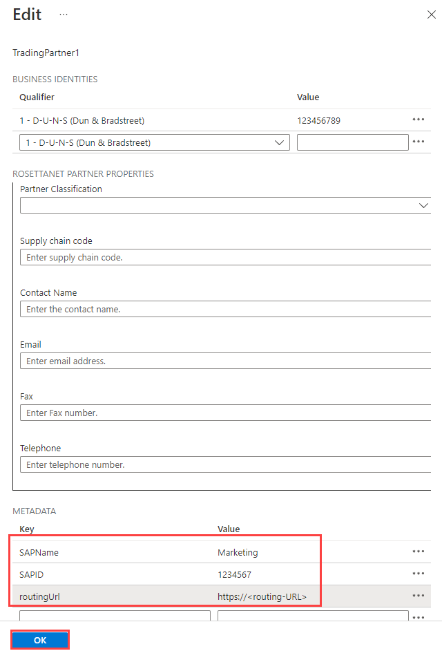
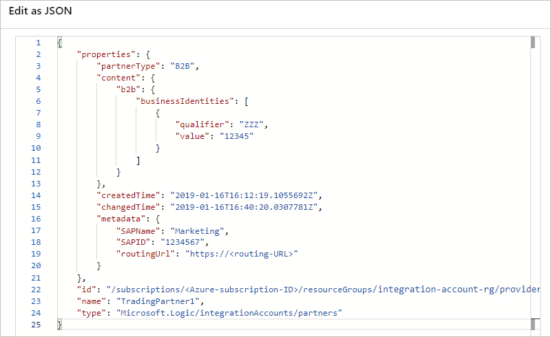
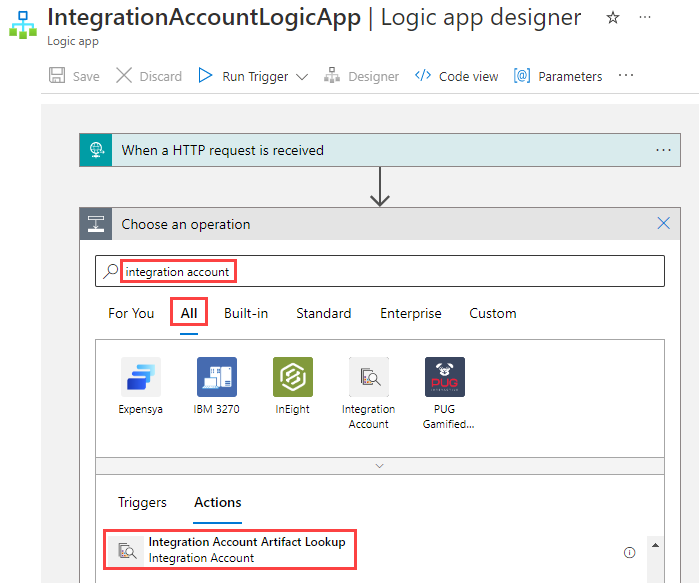
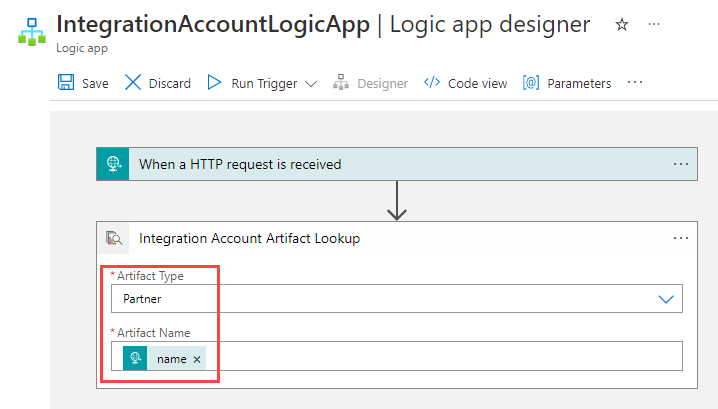
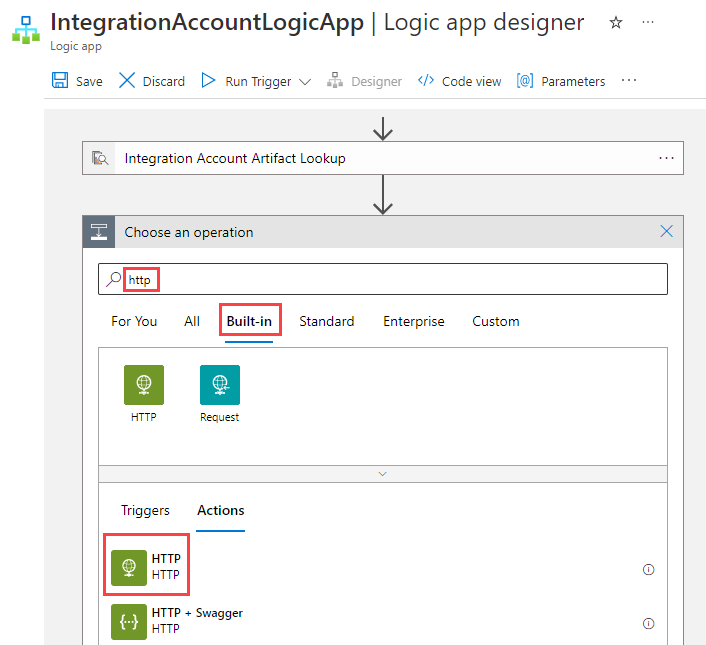
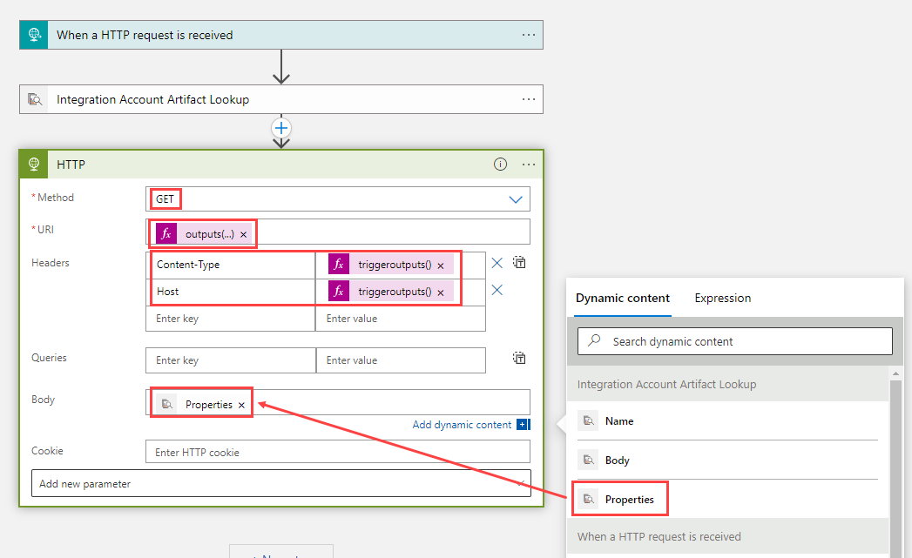
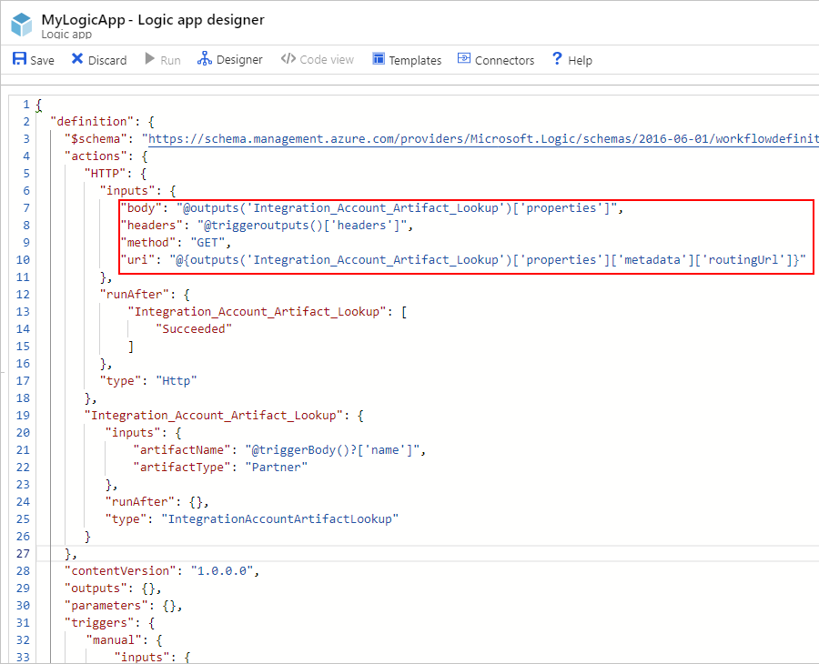
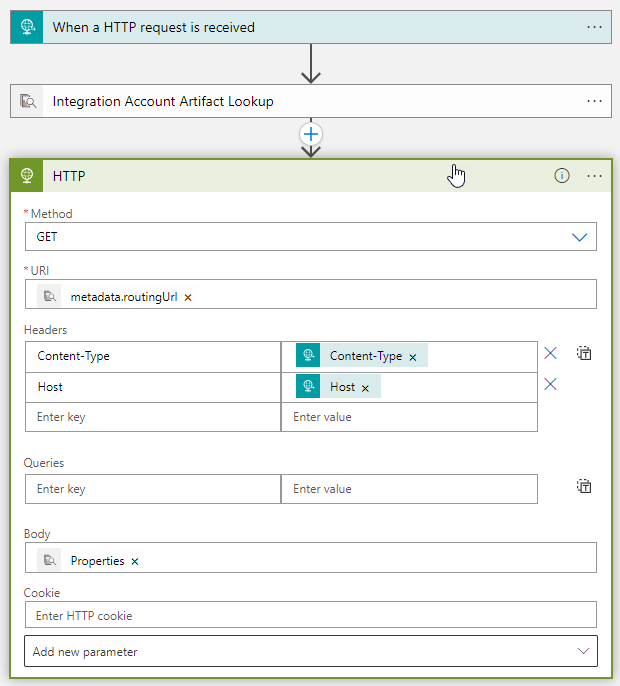

# Manage artifact metadata in integration accounts with Azure Logic Apps and Enterprise Integration Pack

You can define custom metadata for artifacts in integration accounts 
and get that metadata during runtime for your logic app to use. 
For example, you can provide metadata for artifacts, such as partners, 
agreements, schemas, and maps - all store metadata using key-value pairs. 

## Prerequisites

* An Azure subscription. If you don't have a subscription, 
<a href="https://azure.microsoft.com/free/" target="_blank">sign up for a free Azure account</a>.

* A basic [integration account](../logic-apps/logic-apps-enterprise-integration-create-integration-account.md) 
that has the artifacts where you want to add metadata, for example: 

  * [Partner](logic-apps-enterprise-integration-partners.md)
  * [Agreement](logic-apps-enterprise-integration-agreements.md)
  * [Schema](logic-apps-enterprise-integration-schemas.md)
  * [Map](logic-apps-enterprise-integration-maps.md)

* A logic app that's linked to the integration account 
and artifact metadata you want to use. If your logic app 
isn't already linked, learn [how to link logic apps to integration accounts](logic-apps-enterprise-integration-create-integration-account.md#link-account). 

  If you don't have a logic app yet, learn [how to create logic apps](../logic-apps/quickstart-create-first-logic-app-workflow.md). 
  Add the trigger and actions you want to use for managing 
  artifact metadata. Or, to just try things out, add a trigger 
  such as **Request** or **HTTP** to your logic app.

## Add metadata to artifacts

1. Sign in to the <a href="https://portal.azure.com" target="_blank">Azure portal</a> 
with your Azure account credentials. Find and open your integration account.

1. Select the artifact where you want to add metadata, 
and choose **Edit**. Enter the metadata details for 
that artifact, for example:

   

1. When you're done, choose **OK**.

1. To view this metadata in the JavaScript Object Notation (JSON) 
definition for the integration account, choose **Edit as JSON** 
so that the JSON editor opens: 

   

## Get artifact metadata

1. In the Azure portal, open the logic app that's 
linked to the integration account you want. 

1. In the Logic App Designer, if you're adding the step for 
getting metadata under the trigger or last action in the workflow, 
choose **New step** > **Add an action**. 

1. In the search box, enter "integration account". 
Under the search box, choose **All**. From the actions list, 
select this action: **Integration Account Artifact Lookup - Integration Account**

   

1. Provide this information for the artifact you want to find:

   | Property | Required | Value | Description | 
   |----------|---------|-------|-------------| 
   | **Artifact Type** | Yes | **Schema**, **Map**, **Partner**, **Agreement**, or a custom type | The type for the artifact you want | 
   | **Artifact Name** | Yes | <*artifact-name*> | The name for the artifact you want | 
   ||| 

   For example, suppose you want to get the metadata 
   for a trading partner artifact:

   

1. Add the action that you want for handling that metadata, for example:

   1. Under the **Integration Account Artifact Lookup** action, 
   choose **Next step**, and select **Add an action**. 

   1. In the search box, enter "http". Under the search box, 
   choose **Built-ins**, and select this action: **HTTP - HTTP**

      

   1. Provide information for the artifact metadata you want to manage. 

      For example, suppose you want to get the `routingUrl` metadata 
      that's added earlier in this topic. Here are the property 
      values you might specify: 

      | Property | Required | Value | Description | 
      |----------|----------|-------|-------------| 
      | **Method** | Yes | <*operation-to-run*> | The HTTP operation to run on the artifact. For example, this HTTP action uses the **GET** method. | 
      | **URI** | Yes | <*metadata-location*> | To access the `routingUrl` metadata value from the artifact you retrieved, you can use an expression, for example: 
`@{outputs('Integration_Account_Artifact_Lookup')['properties']['metadata']['routingUrl']}` | 
      | **Headers** | No | <*header-values*> | Any header outputs from the trigger you want to pass into the HTTP action. For example, to pass in the trigger's `headers` property value: you can use an expression, for example: 
`@triggeroutputs()['headers']` | 
      | **Body** | No | <*body-content*> | Any other content you want to pass through the HTTP action's `body` property. This example passes the artifact's `properties` values into the HTTP action: 
1. Click inside the **Body** property so the dynamic content list appears. If no properties appear, choose **See more**.  2. From the dynamic content list, under **Integration Account Artifact Lookup**, select **Properties**. | 
      |||| 

      For example:

      

   1. To check the information you provided for the HTTP action, 
   view your logic app's JSON definition. On the Logic App 
   Designer toolbar, choose **Code view** so the app's JSON 
   definition appears, for example:

      

      After you switch back to the Logic App Designer, 
      any expressions you used now appear resolved, 
      for example:

      

## Next steps

* [Learn more about agreements](logic-apps-enterprise-integration-agreements.md)
