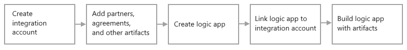

# B2B enterprise integration workflows with Azure Logic Apps and Enterprise Integration Pack

For business-to-business (B2B) solutions and seamless communication between organizations, you can build automated, scalable, enterprise integration workflows by using Azure Logic Apps with the Enterprise Integration Pack (EIP).

## What is the Enterprise Integration Pack?

If you're familiar with Microsoft BizTalk Server, the EIP follows similar concepts and makes B2B capabilities easy to use. However, one major difference is that the EIP is architecturally based on *integration accounts*. These accounts are cloud-based containers in Azure that simplify how you store, manage, and use B2B artifacts for B2B communication, including trading partners, agreements, maps, schemas, certificates, and so on.

With these artifacts, you can build B2B workflows and integration solutions that include cloud services, such as Azure, Microsoft, and other software-as-service (SaaS) apps, on-premises systems, and custom apps by using Azure Logic Apps and choosing from [hundreds of connectors](/connectors/connector-reference/connector-reference-logicapps-connectors). For example, you can create and run custom code from your workflows using the built-in and Azure Functions connectors. You can also use [enterprise integration connectors](../connectors/managed.md#enterprise-connectors) that support the following industry standards:

* Electronic Data Interchange (EDI)
* Enterprise Application Integration (EAI)

Although organizations use different protocols and formats for B2B communication, you can still electronically exchange messages with other organizations. You can transform these different formats into a format that your organization's systems can process when you use the EIP, which supports industry-standard protocols, including [AS2](logic-apps-enterprise-integration-as2.md), [X12](logic-apps-enterprise-integration-x12.md), [EDIFACT](logic-apps-enterprise-integration-edifact.md), and [RosettaNet](logic-apps-enterprise-integration-rosettanet.md). You can also improve message security by using both encryption and digital signatures.

## What do I need to get started?

* An Azure account and subscription. If you don't have an Azure subscription, [sign up for a free Azure account](https://azure.microsoft.com/free/?WT.mc_id=A261C142F).

* An [integration account](logic-apps-enterprise-integration-create-integration-account.md) to store the B2B artifacts that you define and want to use.

* B2B artifacts, such as [trading partners](logic-apps-enterprise-integration-partners.md), [agreements](logic-apps-enterprise-integration-agreements.md), [maps](logic-apps-enterprise-integration-maps.md), [schemas](logic-apps-enterprise-integration-schemas.md), [certificates](logic-apps-enterprise-integration-certificates.md), and so on.

* To create maps and schemas, you can use Visual Studio 2019 and the [Microsoft Azure Logic Apps Enterprise Integration Tools Extension](https://aka.ms/vsenterpriseintegrationtools). For Visual Studio 2015, you can use the [Microsoft Azure Logic Apps Enterprise Integration Tools for Visual Studio 2015 2.0 extension](https://aka.ms/vsmapsandschemas). The extension is currently unavailable for Visual Studio 2022.

   > [!NOTE]
   > Don't install this extension alongside the BizTalk Server extension. Having both extensions might 
   > produce unexpected behavior. Make sure that you only have one of these extensions installed.
   >
   > On high resolution monitors, you might experience a display problem with the map designer. To resolve this display scaling problem for Visual Studio, either [restart Visual Studio in DPI-unaware mode](/visualstudio/designers/disable-dpi-awareness#restart-visual-studio-as-a-dpi-unaware-process) or add the [DPIUNAWARE registry value](/visualstudio/designers/disable-dpi-awareness#add-a-registry-entry).

   To install the extension from inside Visual Studio, follow these steps:

   1. After you open Visual Studio, from the **Extensions** menu, select **Manage Extensions**.

   1. In the search box, enter **enterprise integration**.

   1. Next to **Azure Logic Apps Enterprise Integration Tools**, select **Download**.

      Visual Studio downloads and installs the extension.

* To create, manage, and deploy logic app resources, you can use the Azure portal, [Visual Studio Code](quickstart-create-logic-apps-visual-studio-code.md), [Visual Studio](quickstart-create-logic-apps-with-visual-studio.md), or [PowerShell](/powershell/module/az.logicapp).

After you create an integration account and add your artifacts, you can start building B2B workflows by creating a logic app resource.

> [!IMPORTANT]
> If you use the **Logic App (Consumption)** resource type, you have to link your integration account 
> to your logic app resource before you can select B2B artifacts to use in your workflow. However, 
> to define and add those artifacts to your integration account, you don't need a logic app resource.
>
> If you use the **Logic App (Standard)** resource type, you can add schemas and maps directly to your 
> logic app resource and use those artifacts across multiple workflows within the *same logic app resource*. 
> You still need an integration account to store other artifacts such as partners and agreements, but linking 
> is optional. For more information about these resource types, review 
> [What is Azure Logic Apps - Resource type and host environments](logic-apps-overview.md#resource-environment-differences).

The following diagram shows the high-level steps to start building B2B logic app workflows:

## Try now sample

To try this [sample](https://github.com/Azure/azure-quickstart-templates/tree/master/quickstarts/microsoft.logic/logic-app-as2-send-receive), which deploys logic apps that send and receive AS2 messages through Azure, select **Deploy to Azure**. Before you run the sample, make sure that you manually update **FabrikamSales-AS2Send** logic app workflow so that the **HTTP** action's **URI** property uses the URI that's dynamically generated for the **Request** trigger in the **Contoso-AS2Receive** logic app.

## Next steps

* [Create trading partners](logic-apps-enterprise-integration-partners.md)
* [Create agreements](logic-apps-enterprise-integration-agreements.md)
* [Add schemas](logic-apps-enterprise-integration-schemas.md)
* [Add maps](logic-apps-enterprise-integration-maps.md)
* [Migrate from BizTalk Services](logic-apps-move-from-mabs.md)
