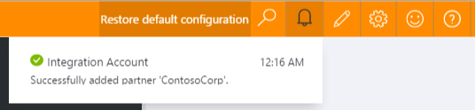

# Partners in B2B scenarios

Before you and another entity or organization can engage 
in Business-to-Business (B2B) messages and transactions, 
you must both share information that helps identify 
and validate messages sent by each other. 
After you discuss these details and are ready 
to start your business relationship, 
you can create *partners* to represent 
you both in your integration account.

## What roles do partners perform in an integration account?

You create agreements between partners to define the details 
about the messages that those partners exchange.

Before you can create an agreement, you must have added 
at least two partners to your integration account. 
Your organization must be part of the agreement as the **host partner**. 
The other partner, or **guest partner** represents the organization 
that exchanges messages with your organization. 
The guest partner can be another company, 
or even a department in your own organization.

After you add these partners, you can create an agreement.

Receive and Send settings are oriented from the point of view of the Hosted Partner. For example, the receive settings in an agreement determine how the hosted partner receives messages sent from a guest partner. Likewise, the send settings on the agreement indicate how the hosted partner sends messages to the guest partner.

## How to create a partner?

1. In the Azure portal, select **Browse**.

	

2. In the filter search box, enter **integration**, 
then select **Integration Accounts** in the results list.

	

3. Select the integration account where you want to add your partners.

	

4. Select the **Partners** tile.

	

5. In the Partners blade, choose **Add**.

	

6. Enter a name for your partner, then select a **Qualifier**. 
Finally, enter a **Value** to help identify documents that come into your apps.

	

7. To see the progress for your partner creation process, 
select the *bell* notification icon.

	

8. To confirm that your new partners were successfully added, 
select the **Partners** tile.

	

	After you select the Partners tile, you'll also see 
	newly added partners in the Partners blade.

	

## How to edit existing partners in your integration account

1. Select the **Partners** tile.
2. After the Partners blade opens, select the partner you want to edit.
3. On the **Update Partner** tile, make your changes.
4. After you're done, choose **Save**, or to cancel your changes, 
select **Discard**.

	

## How to delete a partner

1. Select the **Partners** tile.
2. After the Partner blade opens, select the partner that you want to delete.
3. Choose **Delete**.

	

## Next steps
* [Learn more about agreements](../logic-apps/logic-apps-enterprise-integration-agreements.md "Learn about enterprise integration agreements")  

