# Exchange RosettaNet messages for B2B enterprise integration in Azure Logic Apps

[RosettaNet](https://resources.gs1us.org) is a non-profit consortium that has established standard processes for sharing business information. These standards are commonly used for supply chain processes and are widespread in the semiconductor, electronics, and logistics industries. The RosettaNet consortium creates and maintains Partner Interface Processes (PIPs), which provide common business process definitions for all RosettaNet message exchanges. RosettaNet is based on XML and defines message guidelines, interfaces for business processes, and implementation frameworks for communication between companies.

In [Azure Logic Apps](../logic-apps/logic-apps-overview.md), the RosettaNet connector helps you create integration solutions that support RosettaNet standards. The connector is based on RosettaNet Implementation Framework (RNIF) version 2.0.01. RNIF is an open network application framework that enables business partners to collaboratively run RosettaNet PIPs. This framework defines the message structure, the need for acknowledgments, Multipurpose Internet Mail Extensions (MIME) encoding, and the digital signature.

Specifically, the connector provides these capabilities:

* Encode or receive RosettaNet messages.
* Decode or send RosettaNet messages.
* Wait for the response and generation of Notification of Failure.

For these capabilities, the connector supports all PIPs that are defined by RNIF 2.0.01. Communication with the partner can be synchronous or asynchronous.

## RosettaNet concepts

Here are some concepts and terms that are unique to the RosettaNet specification and are important when building RosettaNet-based integrations:

* **PIP**

  The RosettaNet organization creates and maintains Partner Interface Processes (PIPs), which provide common business process definitions for all RosettaNet message exchanges. Each PIP specification provides a document type definition (DTD) file and a message guideline document. The DTD file defines the service-content message structure. The message-guideline document, which is a human-readable HTML file, specifies element-level constraints. Together, these files provide a complete definition of the business process.

   PIPs are categorized by a high-level business function, or cluster, and a subfunction, or segment. For example, "3A4" is the PIP for Purchase Order, while "3" is the Order Management function, and "3A" is the Quote & Order Entry subfunction. For more information, see the [RosettaNet site](https://resources.gs1us.org).

* **Action**

  Part of a PIP, action messages are business messages that are exchanged between partners.

* **Signal**

   Part of a PIP, signal messages are acknowledgments that are sent in response to action messages.

* **Single action and double action**

  For a single-action PIP, the only response is an acknowledgment signal message. For a double-action PIP, the initiator receives a response message and replies with an acknowledgment in addition to the single-action message flow.

## Prerequisites

* An Azure subscription. If you don't have an Azure subscription yet, [sign up for a free Azure account](https://azure.microsoft.com/free/).

* An [integration account](../logic-apps/logic-apps-enterprise-integration-create-integration-account.md) for storing your agreement and other B2B artifacts. This integration account must be associated with your Azure subscription.

* At least two [partners](../logic-apps/logic-apps-enterprise-integration-partners.md) that are defined in your integration account and configured with the "DUNS" qualifier under **Business Identities**

* A PIP process configuration, which is required to send or receive RosettaNet messages, in your integration account. The process configuration stores all the PIP configuration characteristics. You can then reference this configuration when you create an agreement with the partner. To create a PIP process configuration in your integration account, see [Add PIP process configuration](#add-pip).

* Optional [certificates](../logic-apps/logic-apps-enterprise-integration-certificates.md) for encrypting, decrypting, or signing the messages that you upload to the integration account. Certificates are required only if you are use signing or encryption.

## Add PIP process configuration

To add a PIP process configuration to your integration account, follow these steps:

1. In the [Azure portal](https://portal.azure.com), find and open your integration account.

1. On the **Overview** pane, select the **RosettaNet PIP** tile.

   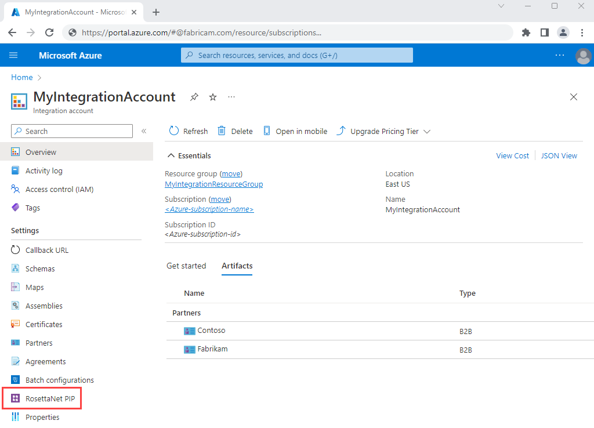

1. Under **RosettaNet PIP**, choose **Add**. Provide your PIP details.

   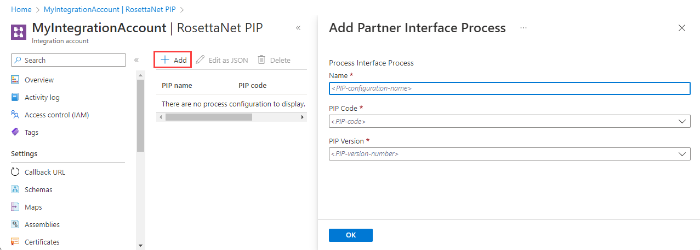

   | Property | Required | Description |
   |----------|----------|-------------|
   | **Name** | Yes | Your PIP name |
   | **PIP Code** | Yes | The PIP three-digit code. For more information, see [RosettaNet PIPs](https://docs.microsoft.com/biztalk/adapters-and-accelerators/accelerator-rosettanet/rosettanet-pips). |
   | **PIP Version** | Yes | The PIP version number, which is available based on your selected PIP code |
   ||||

   For more information about these PIP properties, visit the [RosettaNet website](https://resources.gs1us.org/RosettaNet-Standards/Standards-Library/PIP-Directory#1043208-pipsreg).

1. When you're done, choose **OK**, which creates the PIP configuration.

1. To view or edit the process configuration, select the PIP, and choose **Edit as JSON**.

   All process configuration settings come from the PIP's specifications. Logic Apps populates most of the settings with the default values that are the most typically used values for these properties.

   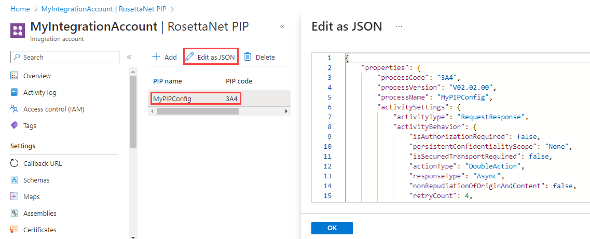

1. Confirm that the settings correspond to the values in the appropriate PIP specification and meet your business needs. If necessary, update the values in JSON and save those changes.

## Create RosettaNet agreement

1. In the [Azure portal](https://portal.azure.com), find and open your integration account, if not already open.

1. On the **Overview** pane, select the **Agreements** tile.

   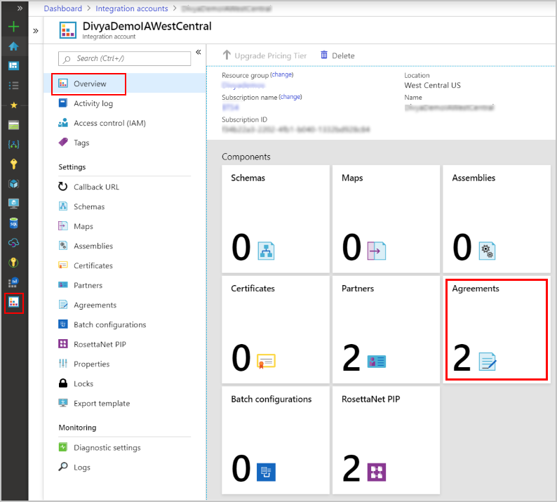

1. Under **Agreements**, choose **Add**. Provide your agreement details.

   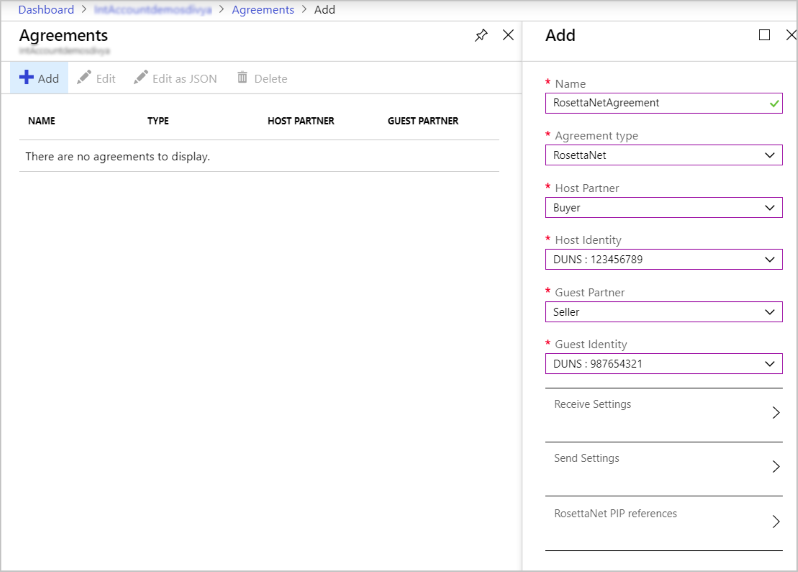

   | Property | Required | Description |
   |----------|----------|-------------|
   | **Name** | Yes | The name of the agreement |
   | **Agreement type** | Yes | Select **RosettaNet**. |
   | **Host Partner** | Yes | An agreement requires both a host and guest partner. The host partner represents the organization that configures the agreement. |
   | **Host Identity** | Yes | An identifier for the host partner |
   | **Guest Partner** | Yes | An agreement requires both a host and guest partner. The guest partner represents the organization that's doing business with the host partner. |
   | **Guest Identity** | Yes | An identifier for the guest partner |
   | **Receive Settings** | Varies | These properties apply to all messages received by the host partner |
   | **Send Settings** | Varies | These properties apply to all messages sent by the host partner |  
   | **RosettaNet PIP references** | Yes | The PIP references for the agreement. All RosettaNet messages require PIP configurations. |
   ||||

1. To set up your agreement for receiving incoming messages from the guest partner, select **Receive Settings**.

   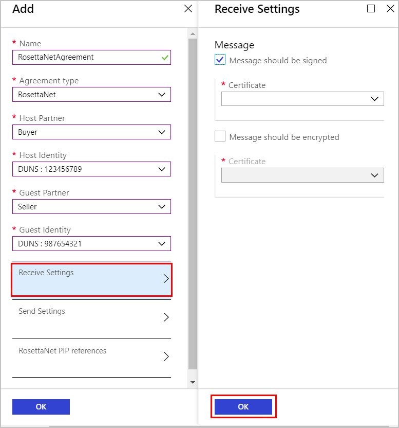

   1. To enable signing or encryption for incoming messages, under **Messages**, select **Message should be signed** or **Message should be encrypted** respectively.

      | Property | Required | Description |
      |----------|----------|-------------|
      | **Message should be signed** | No | Sign incoming messages with the selected certificate. |
      | **Certificate** | Yes, if signing is enabled | The certificate to use for signing |
      | **Enable message encryption** | No | Encrypt incoming messages with the selected certificate. |
      | **Certificate** | Yes, if encryption is enabled | The certificate to use for encryption |
      ||||

   1. Under each selection, select the respective [certificate](./logic-apps-enterprise-integration-certificates.md), which you previously added to your integration account, to use for signing or encryption.

1. To set up your agreement for sending messages to the guest partner, select **Send Settings**.

   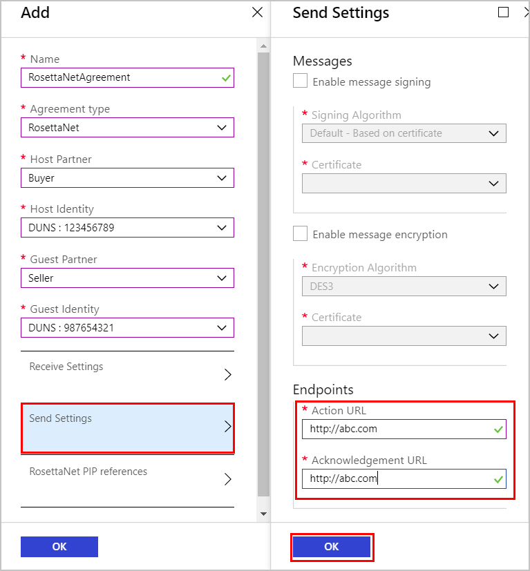

   1. To enable signing or encryption for outgoing messages, under **Messages**, select **Enable message signing** or **Enable message encryption** respectively. Under each selection, select the respective algorithm and [certificate](./logic-apps-enterprise-integration-certificates.md), which you previously added to your integration account, to use for signing or encryption.

      | Property | Required | Description |
      |----------|----------|-------------|
      | **Enable message signing** | No | Sign outgoing messages with the selected signing algorithm and certificate. |
      | **Signing Algorithm** | Yes, if signing is enabled | The signing algorithm to use, based on the selected certificate |
      | **Certificate** | Yes, if signing is enabled | The certificate to use for signing |
      | **Enable message encryption** | No | Encrypt outgoing with the selected encryption algorithm and certificate. |
      | **Encryption Algorithm** | Yes, if encryption is enabled | The encryption algorithm to use, based on the selected certificate |
      | **Certificate** | Yes, if encryption is enabled | The certificate to use for encryption |
      ||||

   1. Under **Endpoints**, specify the required URLs to use for sending action messages and acknowledgments.

      | Property | Required | Description |
      |----------|----------|-------------|
      | **Action URL** |  Yes | The URL to use for sending action messages. The URL is a required field for both synchronous and asynchronous messages. |
      | **Acknowledgment URL** | Yes | The URL to use for sending acknowledgment messages. The URL is a required field for asynchronous messages. |
      ||||

1. To set up your agreement with the RosettaNet PIP references for partners, select **RosettaNet PIP references**. Under **PIP Name**, select the name for your previously created PIP.

   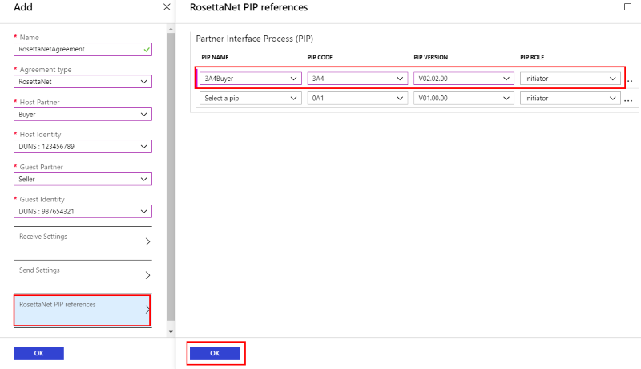

   Your selection populates the remaining properties, which are based on the PIP that you set up in your integration account. If necessary, you can change the **PIP Role**.

   

After you complete these steps, you're ready to send or receive RosettaNet messages.

## RosettaNet templates

To accelerate development and recommend integration patterns, you can use logic app templates for decoding and encoding RosettaNet messages. When you create a logic app, you can select from the template gallery in Logic App Designer. You can also find these templates in the [GitHub repository for Azure Logic Apps](https://github.com/Azure/logicapps).

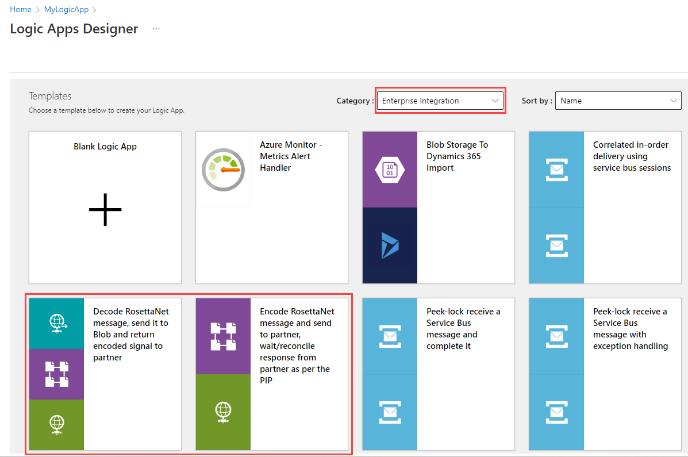

## Receive or decode RosettaNet messages

1. [Create a blank logic app](quickstart-create-first-logic-app-workflow.md).

1. [Link your integration account](logic-apps-enterprise-integration-create-integration-account.md#link-account) to your logic app.

1. Before you can add an action to decode the RosettaNet message, you must add a trigger for starting your logic app, such as a Request trigger.

1. After adding the trigger, choose **New step**.

   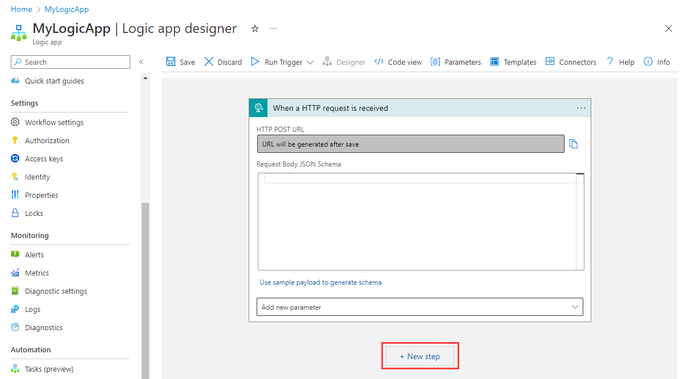

1. In the search box, enter "rosettanet", and select this action: **RosettaNet Decode**

   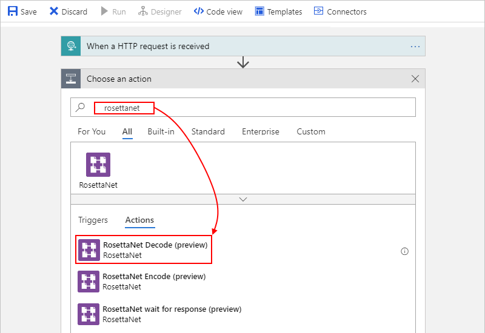

1. Provide the information for the action's properties:

   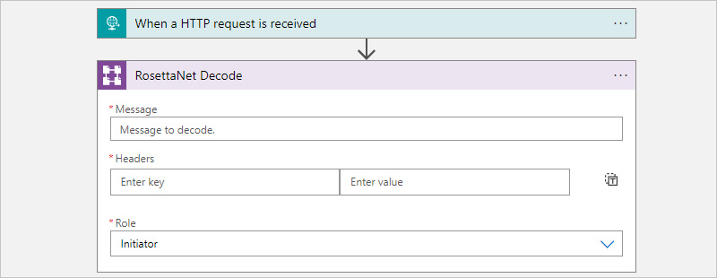

   | Property | Required | Description |
   |----------|----------|-------------|
   | **Message** | Yes | The RosettaNet message to decode  |
   | **Headers** | Yes | The HTTP headers that provide the values for the version, which is the RNIF version, and the response type, which indicates the communication type between the partners and can be synchronous or asynchronous |
   | **Role** | Yes | The role of the host partner in the PIP |
   ||||

   From the RosettaNet Decode action, the output, along with other properties, includes **Outbound signal**, which you can choose to encode and return back to the partner, or take any other action on that output.

## Send or encode RosettaNet messages

1. [Create a blank logic app](quickstart-create-first-logic-app-workflow.md).

1. [Link your integration account](logic-apps-enterprise-integration-create-integration-account.md#link-account) to your logic app.

1. Before you can add an action to encode the RosettaNet message, you must add a trigger for starting your logic app, such as a Request trigger.

1. After adding the trigger, choose **New step**.

   

1. In the search box, enter "rosettanet", and select this action: **RosettaNet Encode**

   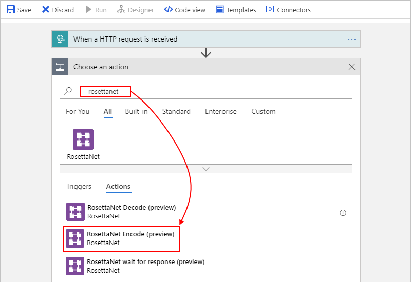

1. Provide the information for the action's properties:

   

   | Property | Required | Description |
   |----------|----------|-------------|
   | **Message** | Yes | The RosettaNet message to encode  |
   | **Host partner** | Yes | The host partner name |
   | **Guest partner** | Yes | The guest partner name |
   | **PIP code** | Yes | The PIP code |
   | **PIP version** | Yes | The PIP version |  
   | **PIP instance identity** | Yes | The unique identifier for this PIP message |  
   | **Message type** | Yes | The type of the message to encode |  
   | **Role** | Yes | The role of the host partner |
   ||||

   The encoded message is now ready to send to the partner.

1. To send the encoded message, this example uses the **HTTP** action, which is renamed "HTTP - Send encoded message to partner".

   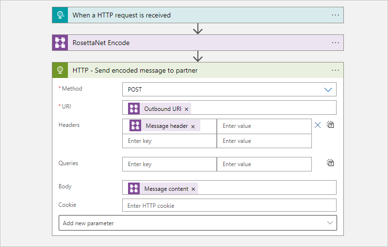

   Per RosettaNet standards, business transactions are considered complete only when all the steps defined by the PIP are complete.

1. After the host sends the encoded message to partner, the host waits for the signal and acknowledgment. To accomplish this task, add the **RosettaNet wait for response** action.

   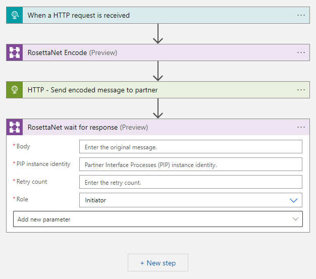

   The duration to use for waiting and the number of retries are based on the PIP configuration in your integration account. If the response is not received, this action generates a Notification of Failure. To handle retries, always put the **Encode** and **Wait for response** actions in an **Until** loop.

   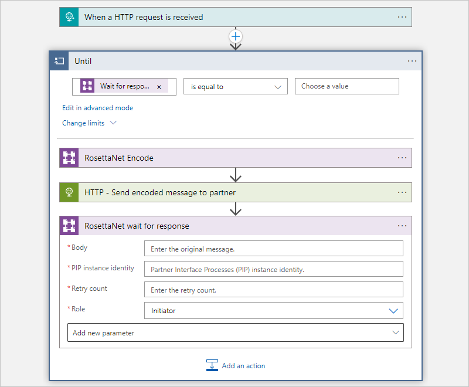

## Next steps

* Learn how to validate, transform, and other message operations with the [Enterprise Integration Pack](../logic-apps/logic-apps-enterprise-integration-overview.md)
* Learn about other [Logic Apps connectors](../connectors/apis-list.md)
