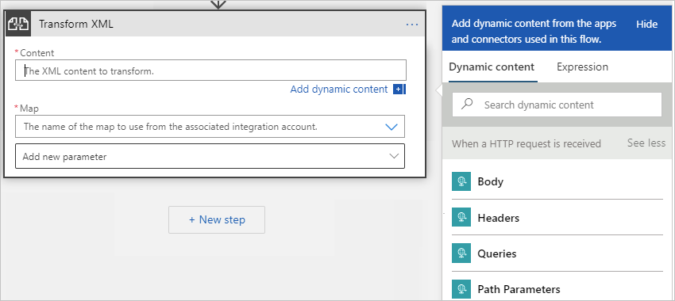
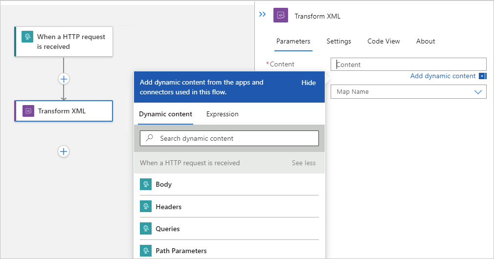

# Transform XML in workflows with Azure Logic Apps

[!INCLUDE [logic-apps-sku-consumption-standard](../../includes/logic-apps-sku-consumption-standard.md)]

In enterprise integration business-to-business (B2B) scenarios, you might have to convert XML between formats. Your logic app workflow can transform XML by using the **Transform XML** action and a predefined [*map*](logic-apps-enterprise-integration-maps.md). For example, suppose you regularly receive B2B orders or invoices from a customer that uses the YearMonthDay date format (YYYYMMDD). However, your organization uses the MonthDayYear date format (MMDDYYYY). You can create and use a map that transforms the YearMonthDay format to the MonthDayYear format before storing the order or invoice details in your customer activity database.

If you're new to logic apps, review [What is Azure Logic Apps](logic-apps-overview.md)? For more information about B2B enterprise integration, review [B2B enterprise integration workflows with Azure Logic Apps and Enterprise Integration Pack](logic-apps-enterprise-integration-overview.md).

## Prerequisites

* An Azure account and subscription. If you don't have a subscription yet, [sign up for a free Azure account](https://azure.microsoft.com/free/?WT.mc_id=A261C142F).

* A logic app workflow that already starts with a trigger so that you can add the **Transform XML** action where necessary in your workflow.

* An [integration account resource](logic-apps-enterprise-integration-create-integration-account.md) where you define and store artifacts, such as trading partners, agreements, certificates, and so on, for use in your enterprise integration and B2B workflows. This resource has to meet the following requirements:

  * Is associated with the same Azure subscription as your logic app resource.

  * Exists in the same location or Azure region as your logic app resource where you plan to use the **Transform XML** action.

  * If you're working on a [Consumption logic app resource and workflow](logic-apps-overview.md#resource-environment-differences), your integration account requires the following items:

    * The [map](logic-apps-enterprise-integration-maps.md) to use for transforming XML content.

    * A [link to your logic app resource](logic-apps-enterprise-integration-create-integration-account.md#link-account).

  * If you're working on a [Standard logic app resource and workflow](logic-apps-overview.md#resource-environment-differences), you can link your integration account to your logic app resource, upload maps directly to your logic app resource, or both, based on the following scenarios: 

    * If you already have an integration account with the artifacts that you need or want to use, you can link your integration account to multiple Standard logic app resources where you want to use the artifacts. That way, you don't have to upload maps to each individual logic app. For more information, review [Link your logic app resource to your integration account](logic-apps-enterprise-integration-create-integration-account.md?tabs=standard#link-account).

    * If you don't have an integration account or only plan to use your artifacts across multiple workflows within the *same logic app resource*, you can [directly add maps to your logic app resource](logic-apps-enterprise-integration-maps.md) using either the Azure portal or Visual Studio Code.

      > [!NOTE]
      > 
      > The Liquid built-in connector lets you select a map that you previously uploaded to your logic app resource or to a linked integration account, but not both. 

    So, if you don't have or need an integration account, you can use the upload option. Otherwise, you can use the linking option. Either way, you can use these artifacts across all child workflows within the same logic app resource.

  You still need an integration account to store other artifacts, such as partners, agreements, and certificates, along with using the [AS2](logic-apps-enterprise-integration-as2.md), [X12](logic-apps-enterprise-integration-x12.md), and [EDIFACT](logic-apps-enterprise-integration-edifact.md) operations.

## Add Transform XML action

1. In the [Azure portal](https://portal.azure.com), open your logic app resource and workflow in designer view.

1. If you have a blank workflow that doesn't have a trigger, add any trigger you want. This example uses the Request trigger. Otherwise, continue to the next step.

   To add the Request trigger, in the designer search box, enter `HTTP request`, and select the Request trigger named **When an HTTP request is received**.

1. Under the step in your workflow where you want to add the **Transform XML** action, choose one of the following steps:

   For a Consumption or ISE-based logic app workflow, choose a step:

   * To add the **Transform XML** action at the end of your workflow, select **New step**.

   * To add the **Transform XML** action between existing steps, move your pointer over the arrow that connects those steps so that the plus sign (**+**) appears. Select that plus sign, and then select **Add an action**.

   For a Standard-based logic app workflow, choose a step:

   * To add the **Transform XML** action at the end of your workflow, select the plus sign (**+**), and then select **Add an action**.

   * To add the **Transform XML** action between existing steps, select the plus sign (**+**) that appears between those steps, and then select **Add an action**.

1. Under **Choose an operation**, select **Built-in**. In the search box, enter `transform xml`. From the actions list, select **Transform XML**.

1. To specify the XML content for transformation, you can use any XML data you receive in the HTTP request. Click inside the **Content** box so that the dynamic content list appears.

   The dynamic content list shows property tokens that represent the outputs from the previous steps in the workflow. If the list doesn't show an expected property, check the trigger or action heading in the list and whether you can select **See more**.

   For a Consumption or ISE-based logic app workflow, the designer looks like this example:

   

   For a Standard logic app workflow, the designer looks like this example:

   

1. From the dynamic content list, select the property token for the content you want to validate.

   This example selects the **Body** token from the trigger.

   > [!NOTE]
   > Make sure that the content you select is XML. If the content is not XML or is base64-encoded, you must specify an expression 
   > that processes the content. For example, you can use [expression functions](workflow-definition-language-functions-reference.md), 
   > such as `base64ToBinary()` to decode content or `xml()` to process the content as XML.

1. To specify the map to use for transformation, open the **Map** list, and select the map that you previously added.

1. When you're done, make sure to save your logic app workflow.

   You're now finished setting up your **Transform XML** action. In a real world app, you might want to store the transformed data in a line-of-business (LOB) app such as SalesForce. To send the transformed output to Salesforce, add a Salesforce action.

1. To test your transformation action, trigger and run your workflow. For example, for the Request trigger, send a request to the trigger's endpoint URL.

   The **Transform XML** action runs after your workflow is triggered and when XML content is available for transformation.

## Advanced capabilities

### Reference assembly or custom code from maps

The **Transform XML** action supports maps that reference an external assembly. For more information, review [Add XSLT maps for workflows in Azure Logic Apps](logic-apps-enterprise-integration-maps.md#add-assembly).

### Byte order mark

By default, the response from the transformation starts with a byte order mark (BOM). You can access this functionality only when you work in the code view editor. To disable this functionality, set the `transformOptions` property to `disableByteOrderMark`:

```json
"Transform_XML": {
    "inputs": {
        "content": "@{triggerBody()}",
        "integrationAccount": {
            "map": {
                "name": "TestMap"
            }
        },
        "transformOptions": "disableByteOrderMark"
    },
    "runAfter": {},
    "type": "Xslt"
}
```

## Next steps

* [Add XSLT maps for XML transformation in Azure Logic Apps](logic-apps-enterprise-integration-maps.md)
* [Validate XML for workflows in Azure Logic Apps](logic-apps-enterprise-integration-xml-validation.md)
