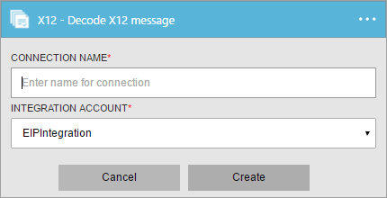
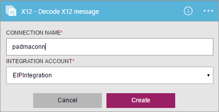
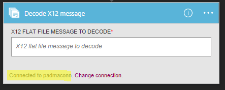
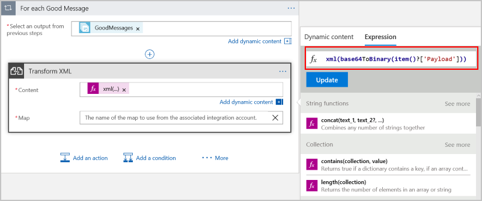

# Decode X12 messages in Azure Logic Apps with Enterprise Integration Pack

With the Decode X12 message connector, you can validate the envelope against a trading partner agreement, validate EDI and partner-specific properties, split interchanges into transactions sets or preserve entire interchanges, and generate acknowledgments for processed transactions. 
To use this connector, you must add the connector to an existing trigger in your logic app.

## Before you start

Here's the items you need:

* An Azure account; you can create a [free account](https://azure.microsoft.com/free)
* An [integration account](logic-apps-enterprise-integration-create-integration-account.md) 
that's already defined and associated with your Azure subscription. 
You must have an integration account to use the Decode X12 message connector.
* At least two [partners](logic-apps-enterprise-integration-partners.md) 
that are already defined in your integration account
* An [X12 agreement](logic-apps-enterprise-integration-x12.md) 
that's already defined in your integration account

## Decode X12 messages

1. [Create a logic app](quickstart-create-first-logic-app-workflow.md).

2. The Decode X12 message connector doesn't have triggers, 
so you must add a trigger for starting your logic app, like a Request trigger. 
In the Logic App Designer, add a trigger, and then add an action to your logic app.

3.	In the search box, enter "x12" for your filter. 
Select **X12 - Decode X12 message**.
   
	  

3. If you didn't previously create any connections to your integration account, 
you're prompted to create that connection now. Name your connection, 
and select the integration account that you want to connect. 

	

	Properties with an asterisk are required.

	| Property | Details |
	| --- | --- |
	| Connection Name * |Enter any name for your connection. |
	| Integration Account * |Enter a name for your integration account. Make sure that your integration account and logic app are in the same Azure location. |

5.	When you're done, your connection details should look similar to this example. 
To finish creating your connection, choose **Create**.
   
	 

6. After your connection is created, as shown in this example, 
select the X12 flat file message to decode.

	 

	For example:

	 

   > [!NOTE]
   > The actual message content or payload for the message array, good or bad, 
   > is base64 encoded. So, you must specify an expression that processes this content.
   > Here is an example that processes the content as XML that you can 
   > enter in code view 
   > or by using expression builder in the designer.
   > ``` json
   > "content": "@xml(base64ToBinary(item()?['Payload']))"
   > ```
   > 
   >


## X12 Decode details

The X12 Decode connector performs these tasks:

* Validates the envelope against trading partner agreement
* Validates EDI and partner-specific properties
  * EDI structural validation, and extended schema validation
  * Validation of the structure of the interchange envelope.
  * Schema validation of the envelope against the control schema.
  * Schema validation of the transaction-set data elements against the message schema.
  * EDI validation performed on transaction-set data elements 
* Verifies that the interchange, group, and transaction set control numbers are not duplicates
  * Checks the interchange control number against previously received interchanges.
  * Checks the group control number against other group control numbers in the interchange.
  * Checks the transaction set control number against other transaction set control numbers in that group.
* Splits the interchange into transaction sets, or preserves the entire interchange:
  * Split Interchange as transaction sets - suspend transaction sets on error: 
  Splits interchange into transaction sets and parses each transaction set. 
  The X12 Decode action outputs only those transaction sets 
  that fail validation to `badMessages`, and outputs the remaining transactions sets to `goodMessages`.
  * Split Interchange as transaction sets - suspend interchange on error: 
  Splits interchange into transaction sets and parses each transaction set. 
  If one or more transaction sets in the interchange fail validation, 
  the X12 Decode action outputs all the transaction sets in that interchange to `badMessages`.
  * Preserve Interchange - suspend transaction sets on error: 
  Preserve the interchange and process the entire batched interchange. 
  The X12 Decode action outputs only those transaction sets that fail validation to `badMessages`, 
  and outputs the remaining transactions sets to `goodMessages`.
  * Preserve Interchange - suspend interchange on error: 
  Preserve the interchange and process the entire batched interchange. 
  If one or more transaction sets in the interchange fail validation, 
  the X12 Decode action outputs all the transaction sets in that interchange to `badMessages`. 
* Generates a Technical and/or Functional acknowledgment (if configured).
  * A Technical Acknowledgment generates as a result of header validation. The technical acknowledgment reports the status of the processing of an interchange header and trailer by the address receiver.
  * A Functional Acknowledgment generates as a result of body validation. The functional acknowledgment reports each error encountered while processing the received document

## View the swagger
See the [swagger details](/connectors/x12/). 

## Next steps
[Learn more about the Enterprise Integration Pack](../logic-apps/logic-apps-enterprise-integration-overview.md "Learn about Enterprise Integration Pack") 

