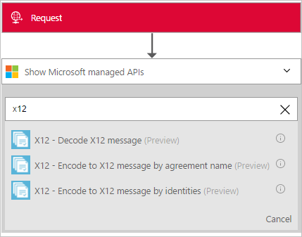
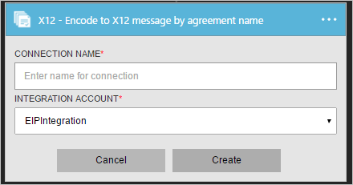
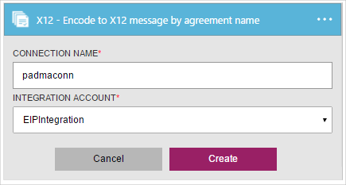
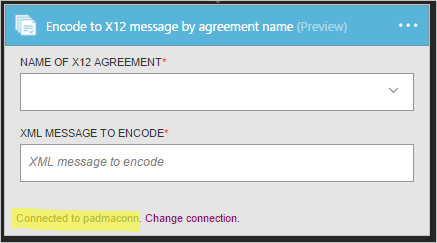
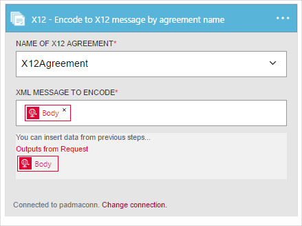
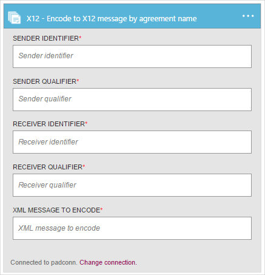

# Encode X12 messages in Azure Logic Apps with Enterprise Integration Pack

With the Encode X12 message connector, you can validate EDI and partner-specific properties, 
convert XML-encoded messages into EDI transaction sets in the interchange, 
and request a Technical Acknowledgement, Functional Acknowledgment, or both.
To use this connector, you must add the connector to an existing trigger in your logic app.

## Before you start

Here's the items you need:

* An Azure account; you can create a [free account](https://azure.microsoft.com/free)
* An [integration account](logic-apps-enterprise-integration-create-integration-account.md) 
that's already defined and associated with your Azure subscription. 
You must have an integration account to use the Encode X12 message connector.
* At least two [partners](logic-apps-enterprise-integration-partners.md) 
that are already defined in your integration account
* An [X12 agreement](logic-apps-enterprise-integration-x12.md) 
that's already defined in your integration account

## Encode X12 messages

1. [Create a logic app](quickstart-create-first-logic-app-workflow.md).

2. The Encode X12 message connector doesn't have triggers, 
so you must add a trigger for starting your logic app, like a Request trigger. 
In the Logic App Designer, add a trigger, and then add an action to your logic app.

3.	In the search box, enter "x12" for your filter. 
Select either **X12 - Encode to X12 message by agreement name** 
or **X12 - Encode to X12 message by identities**.
   
     

3. If you didn't previously create any connections to your integration account, 
you're prompted to create that connection now. Name your connection, 
and select the integration account that you want to connect. 
   
    

	Properties with an asterisk are required.

	| Property | Details |
	| --- | --- |
	| Connection Name * |Enter any name for your connection. |
	| Integration Account * |Enter a name for your integration account. Make sure that your integration account and logic app are in the same Azure location. |

5.	When you're done, your connection details should look similar to this example. 
To finish creating your connection, choose **Create**.

    

	Your connection is now created.

	 

#### Encode X12 messages by agreement name

If you chose to encode X12 messages by agreement name, 
open the **Name of X12 agreement** list, 
enter or select your existing X12 agreement. Enter the XML message to encode.

#### Encode X12 messages by identities

If you choose to encode X12 messages by identities, enter the sender identifier, 
sender qualifier, receiver identifier, and receiver qualifier as 
configured in your X12 agreement. Select the XML message to encode.
   
 

## X12 Encode details

The X12 Encode connector performs these tasks:

* Agreement resolution by matching sender and receiver context properties.
* Serializes the EDI interchange, converting XML-encoded messages into EDI transaction sets in the interchange.
* Applies transaction set header and trailer segments
* Generates an interchange control number, a group control number, and a transaction set control number for each outgoing interchange
* Replaces separators in the payload data
* Validates EDI and partner-specific properties
  * Schema validation of the transaction-set data elements against the message Schema
  * EDI validation performed on transaction-set data elements.
  * Extended validation performed on transaction-set data elements
* Requests a Technical and/or Functional acknowledgment (if configured).
  * A Technical Acknowledgment generates as a result of header validation. The technical acknowledgment reports the status of the processing of an interchange header and trailer by the address receiver
  * A Functional Acknowledgment generates as a result of body validation. The functional acknowledgment reports each error encountered while processing the received document

## View the swagger
See the [swagger details](/connectors/x12/). 

## Next steps
[Learn more about the Enterprise Integration Pack](logic-apps-enterprise-integration-overview.md "Learn about Enterprise Integration Pack") 

