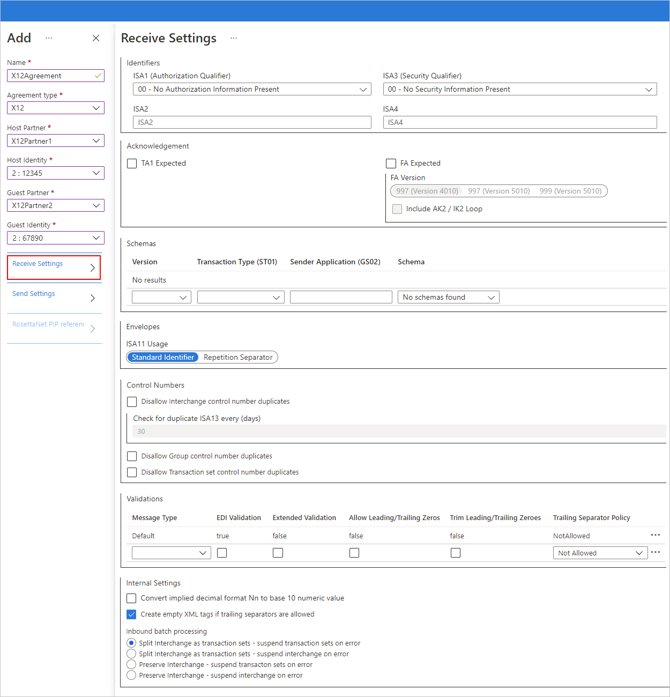
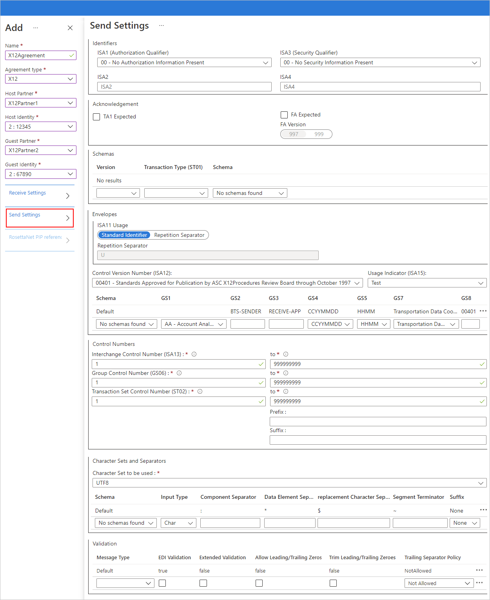

# Reference for X12 message settings in agreements for Azure Logic Apps

[!INCLUDE [logic-apps-sku-consumption-standard](../../includes/logic-apps-sku-consumption-standard.md)]

This reference describes the properties that you can set in an X12 agreement for specifying how to handle messages between [trading partners](logic-apps-enterprise-integration-partners.md). Set up these properties based on your agreement with the partner that exchanges messages with you.

<a name="x12-inbound-messages"></a>

## X12 Receive Settings



<a name="inbound-identifiers"></a>

### Identifiers

| Property | Description |
|----------|-------------|
| **ISA1 (Authorization Qualifier)** | The Authorization Qualifier value that you want to use. The default value is **00 - No Authorization Information Present**. <br><br>**Note**: If you select other values, specify a value for the **ISA2** property. |
| **ISA2** | The Authorization Information value to use when the **ISA1** property is not **00 - No Authorization Information Present**. This property value must have a minimum of one alphanumeric character and a maximum of 10. |
| **ISA3 (Security Qualifier)** | The Security Qualifier value that you want to use. The default value is **00 - No Security Information Present**. <br><br>**Note**: If you select other values, specify a value for the **ISA4** property. |
| **ISA4** | The Security Information value to use when the **ISA3** property is not **00 - No Security Information Present**. This property value must have a minimum of one alphanumeric character and a maximum of 10. |

<a name="inbound-acknowledgment"></a>

### Acknowledgment

| Property | Description |
|----------|-------------|
| **TA1 Expected** | Return a technical acknowledgment (TA1) to the interchange sender. |
| **FA Expected** | Return a functional acknowledgment (FA) to the interchange sender. <br><br>For the **FA Version** property, based on the schema version, select the 997 or 999 acknowledgments. <br><br>To enable generation of AK2 loops in functional acknowledgments for accepted transaction sets, select **Include AK2 / IK2 Loop**. |

<a name="inbound-schemas"></a>

### Schemas

For this section, select a [schema](logic-apps-enterprise-integration-schemas.md) from your [integration account](logic-apps-enterprise-integration-create-integration-account.md) for each transaction type (ST01) and Sender Application (GS02). The EDI Receive Pipeline disassembles the incoming message by matching the values and schema that you set in this section with the values for ST01 and GS02 in the incoming message and with the schema of the incoming message. After you complete each row, a new empty row automatically appears.

| Property | Description |
|----------|-------------|
| **Version** | The X12 version for the schema |
| **Transaction Type (ST01)** | The transaction type |
| **Sender Application (GS02)** | The sender application |
| **Schema** | The schema file that you want to use |

<a name="inbound-envelopes"></a>

### Envelopes

| Property | Description |
|----------|-------------|
| **ISA11 Usage** | The separator to use in a transaction set: <br><br>- **Standard Identifier**: Use a period (.) for decimal notation, rather than the decimal notation of the incoming document in the EDI Receive Pipeline. <br><br>- **Repetition Separator**: Specify the separator for repeated occurrences of a simple data element or a repeated data structure. For example, usually the carat (^) is used as the repetition separator. For HIPAA schemas, you can only use the carat. |

<a name="inbound-control-numbers"></a>

### Control Numbers

| Property | Description |
|----------|-------------|
| **Disallow Interchange control number duplicates** | Block duplicate interchanges. Check the interchange control number (ISA13) for the received interchange control number. If a match is detected, the EDI Receive Pipeline doesn't process the interchange. <br><br><br><br>To specify the number of days to perform the check, enter a value for the **Check for duplicate ISA13 every (days)** property. |
| **Disallow Group control number duplicates** | Block interchanges that have duplicate group control numbers. |
| **Disallow Transaction set control number duplicates** | Block interchanges that have duplicate transaction set control numbers. |

<a name="inbound-validations"></a>

### Validations

The **Default** row shows the validation rules that are used for an EDI message type. If you want to define different rules, select each box where you want the rule set to **true**. After you complete each row, a new empty row automatically appears.

| Property | Description |
|----------|-------------|
| **Message Type** | The EDI message type |
| **EDI Validation** | Perform EDI validation on data types as defined by the schema's EDI properties, length restrictions, empty data elements, and trailing separators. |
| **Extended Validation** | If the data type isn't EDI, validation is on the data element requirement and allowed repetition, enumerations, and data element length validation (min or max). |
| **Allow Leading/Trailing Zeroes** | Keep any additional leading or trailing zero and space characters. Don't remove these characters. |
| **Trim Leading/Trailing Zeroes** | Remove any leading or trailing zero and space characters. |
| **Trailing Separator Policy** | Generate trailing separators. <br><br>- **Not Allowed**: Prohibit trailing delimiters and separators in the inbound interchange. If the interchange has trailing delimiters and separators, the interchange is declared not valid. <br><br>- **Optional**: Accept interchanges with or without trailing delimiters and separators. <br><br>- **Mandatory**: The inbound interchange must have trailing delimiters and separators. |

<a name="inbound-internal-settings"></a>

### Internal Settings

| Property | Description |
|----------|-------------|
| **Convert implied decimal format Nn to a base 10 numeric value** | Convert an EDI number that is specified with the format "Nn" into a base-10 numeric value. |
| **Create empty XML tags if trailing separators are allowed** | Have the interchange sender include empty XML tags for trailing separators. |
| **Split Interchange as transaction sets - suspend transaction sets on error** | Parse each transaction set that's in an interchange into a separate XML document by applying the appropriate envelope to the transaction set. Suspend only the transactions where the validation fails. |
| **Split Interchange as transaction sets - suspend interchange on error** | Parse each transaction set that's in an interchange into a separate XML document by applying the appropriate envelope. Suspend the entire interchange when one or more transaction sets in the interchange fail validation. |
| **Preserve Interchange - suspend transaction sets on error** | Leave the interchange intact and create an XML document for the entire batched interchange. Suspend only the transaction sets that fail validation, but continue to process all other transaction sets. |
| **Preserve Interchange - suspend interchange on error** |Leaves the interchange intact, creates an XML document for the entire batched interchange. Suspends the entire interchange when one or more transaction sets in the interchange fail validation. |

<a name="x12-outbound-settings"></a>

## X12 Send settings



<a name="outbound-identifiers"></a>

### Identifiers

| Property | Description |
|----------|-------------|
| **ISA1 (Authorization Qualifier)** | The Authorization Qualifier value that you want to use. The default value is **00 - No Authorization Information Present**. <br><br>**Note**: If you select other values, specify a value for the **ISA2** property. |
| **ISA2** | The Authorization Information value to use when the **ISA1** property is not **00 - No Authorization Information Present**. This property value must have a minimum of one alphanumeric character and a maximum of 10. |
| **ISA3 (Security Qualifier)** | The Security Qualifier value that you want to use. The default value is **00 - No Security Information Present**. <br><br>**Note**: If you select other values, specify a value for the **ISA4** property. |
| **ISA4** | The Security Information value to use when the **ISA3** property is not **00 - No Security Information Present**. This property value must have a minimum of one alphanumeric character and a maximum of 10. |

<a name="outbound-acknowledgment"></a>

### Acknowledgment

| Property | Description |
|----------|-------------|
| **TA1 Expected** | Return a technical acknowledgment (TA1) to the interchange sender. <br><br>This setting specifies that the host partner, who is sending the message, requests an acknowledgment from the guest partner in the agreement. These acknowledgments are expected by the host partner based on the agreement's Receive Settings. |
| **FA Expected** | Return a functional acknowledgment (FA) to the interchange sender. For the **FA Version** property, based on the schema version, select the 997 or 999 acknowledgments. <br><br>This setting specifies that the host partner, who is sending the message, requests an acknowledgment from the guest partner in the agreement. These acknowledgments are expected by the host partner based on the agreement's Receive Settings. |

<a name="outbound-schemas"></a>

### Schemas

For this section, select a [schema](../logic-apps/logic-apps-enterprise-integration-schemas.md) from your [integration account](./logic-apps-enterprise-integration-create-integration-account.md) for each transaction type (ST01). After you complete each row, a new empty row automatically appears.

| Property | Description |
|----------|-------------|
| **Version** | The X12 version for the schema |
| **Transaction Type (ST01)** | The transaction type for the schema |
| **Schema** | The schema file that you want to use. If you select the schema first, the version and transaction type are automatically set. |

<a name="outbound-envelopes"></a>

### Envelopes

| Property | Description |
|----------|-------------|
| **ISA11 Usage** | The separator to use in a transaction set: <br><br>- **Standard Identifier**: Use a period (.) for decimal notation, rather than the decimal notation of the outbound document in the EDI Send Pipeline. <br><br>- **Repetition Separator**: Specify the separator for repeated occurrences of a simple data element or a repeated data structure. For example, usually the carat (^) is used as the repetition separator. For HIPAA schemas, you can only use the carat. |

<a name="outbound-control-version-number"></a>

#### Control Version Number

For this section, select a [schema](../logic-apps/logic-apps-enterprise-integration-schemas.md) from your [integration account](./logic-apps-enterprise-integration-create-integration-account.md) for each interchange. After you complete each row, a new empty row automatically appears.

| Property | Description |
|----------|-------------|
| **Control Version Number (ISA12)** | The version of the X12 standard |
| **Usage Indicator (ISA15)** | The context of an interchange, which is either **Test** data, **Information** data, or **Production** data |
| **Schema** | The schema to use for generating the GS and ST segments for an X12-encoded interchange that's sent to the EDI Send Pipeline. |
| **GS1** | Optional, select the functional code. |
| **GS2** | Optional, specify the application sender. |
| **GS3** | Optional, specify the application receiver. |
| **GS4** | Optional, select **CCYYMMDD** or **YYMMDD**. |
| **GS5** | Optional, select **HHMM**, **HHMMSS**, or **HHMMSSdd**. |
| **GS7** | Optional, select a value for the responsible agency. |
| **GS8** | Optional, specify the schema document version. |

<a name="outbound-control-numbers"></a>

### Control Numbers

| Property | Description |
|----------|-------------|
| **Interchange Control Number (ISA13)** | The range of values for the interchange control number, which can have a minimum of value 1 and a maximum value of 999999999 |
| **Group Control Number (GS06)** | The range of values for the group control number, which can have a minimum value of 1 and a maximum value of 999999999 |
| **Transaction Set Control Number (ST02)** | The range of values for the transaction set control number, which can have a minimum value of 1 and a maximum value of 999999999 <br><br>- **Prefix**: Optional, an alphanumeric value <br>- **Suffix**: Optional, an alphanumeric value |

<a name="outbound-character-sets-separators"></a>

### Character Sets and Separators

The **Default** row shows the character set that's used as delimiters for a message schema. If you don't want to use the **Default** character set, you can enter a different set of delimiters for each message type. After you complete each row, a new empty row automatically appears.

> [!TIP]
>
> To provide special character values, edit the agreement as JSON and provide the ASCII value for the special character.

| Property | Description |
|----------|-------------|
| **Character Set to be used** | The X12 character set, which is either **Basic**, **Extended**, or **UTF8**. |
| **Schema** | The schema that you want to use. After you select the schema, select the character set that you want to use, based on the separator descriptions below. |
| **Input Type** | The input type for the character set |
| **Component Separator** | A single character that separates composite data elements |
| **Data Element Separator** | A single character that separates simple data elements within composite data |
| **Replacement Character Separator** | A replacement character that replaces all separator characters in the payload data when generating the outbound X12 message |
| **Segment Terminator** | A single character that indicates the end of an EDI segment |
| **Suffix** | The character to use with the segment identifier. If you specify a suffix, the segment terminator data element can be empty. If the segment terminator is left empty, you must designate a suffix. |

<a name="outbound-validation"></a>

### Validation

The **Default** row shows the validation rules that are used for an EDI message type. If you want to define different rules, select each box where you want the rule set to **true**. After you complete each row, a new empty row automatically appears.

| Property | Description |
|----------|-------------|
| **Message Type** | The EDI message type |
| **EDI Validation** | Perform EDI validation on data types as defined by the schema's EDI properties, length restrictions, empty data elements, and trailing separators. |
| **Extended Validation** | If the data type isn't EDI, validation is on the data element requirement and allowed repetition, enumerations, and data element length validation (min or max). |
| **Allow Leading/Trailing Zeroes** | Keep any additional leading or trailing zero and space characters. Don't remove these characters. |
| **Trim Leading/Trailing Zeroes** | Remove any leading or trailing zero and space characters. |
| **Trailing Separator Policy** | Generate trailing separators. <br><br>- **Not Allowed**: Prohibit trailing delimiters and separators in the outbound interchange. If the interchange has trailing delimiters and separators, the interchange is declared not valid. <br><br>- **Optional**: Send interchanges with or without trailing delimiters and separators. <br><br>- **Mandatory**: The outbound interchange must have trailing delimiters and separators. |

<a name="hipaa-schemas"></a>

## HIPAA schemas and message types

When you work with HIPAA schemas and the 277 or 837 message types, you need to perform a few extra steps. The [document version numbers (GS8)](#outbound-control-version-number) for these message types have more than nine characters, for example, "005010X222A1". Also, some document version numbers map to variant message types. If you don't reference the correct message type in your schema and in your agreement, you get this error message:

`"The message has an unknown document type and did not resolve to any of the existing schemas configured in the agreement."`

This table lists the affected message types, any variants, and the document version numbers that map to those message types:

| Message type or variant |  Description | Document version number (GS8) |
|-------------------------|--------------|-------------------------------|
| 277 | Health Care Information Status Notification | 005010X212 |
| 837_I | Health Care Claim Institutional | 004010X096A1 <br>005010X223A1 <br>005010X223A2 |
| 837_D | Health Care Claim Dental | 004010X097A1 <br>005010X224A1 <br>005010X224A2 |
| 837_P | Health Care Claim Professional | 004010X098A1 <br>005010X222 <br>005010X222A1 |

You also need to disable EDI validation when you use these document version numbers because they result in an error that the character length is invalid.

To specify these document version numbers and message types, follow these steps. Please note that each 837 message type needs a seperate agreement.

1. In your HIPAA schema, replace the current message type with the variant message type for the document version number that you want to use.

   For example, suppose you want to use document version number `005010X222A1` with the `837` message type. In your schema, replace each `"X12_00501_837"` value with the `"X12_00501_837_P"` value instead.

   To update your schema, follow these steps:

   1. In the Azure portal, go to your integration account. Find and download your schema. Replace the message type and rename the schema file, and upload your revised schema to your integration account. For more information, see [Edit a schema](logic-apps-enterprise-integration-schemas.md#edit-schema).

   1. In your agreement's message settings, select the revised schema.

1. In your agreement's `schemaReferences` object, add another entry that specifies the variant message type that matches your document version number.

   For example, suppose you want to use document version number `005010X222A1` for the `837` message type. Your agreement has a `schemaReferences` section with these properties and values:

   ```json
   "schemaReferences": [
      {
         "messageId": "837",
         "schemaVersion": "00501",
         "schemaName": "X12_00501_837"
      }
   ]
   ```

   Edit your `schemaReferences` section to look like the following example:

   ```json
   "schemaReferences": [
      {
         "messageId": "837",
         "schemaVersion": "00501",
         "schemaName": "X12_00501_837_P"
      }
   ]
   ```

1. In your agreement's message settings, disable EDI validation by clearing the **EDI Validation** checkbox either for each message type or for all message types if you're using the **Default** values.

    

## Next steps

[Exchange X12 messages](logic-apps-enterprise-integration-x12.md)