# Exchange X12 messages for B2B enterprise integration in Azure Logic Apps with Enterprise Integration Pack

Before you can exchange X12 messages for Azure Logic Apps, 
you must create an X12 agreement and 
store that agreement in your integration account. 
Here are the steps for how to create an X12 agreement.

> [!NOTE]
> This page covers the X12 features for Azure Logic Apps. 
> For more information, see [EDIFACT](logic-apps-enterprise-integration-edifact.md).

## Before you start

Here's the items you need:

* An [integration account](logic-apps-enterprise-integration-create-integration-account.md) 
that's already defined and associated with your Azure subscription
* At least two [partners](../logic-apps/logic-apps-enterprise-integration-partners.md) 
that are defined in your integration account and configured with the X12 identifier under **Business Identities**    
* A required [schema](../logic-apps/logic-apps-enterprise-integration-schemas.md) 
that you can upload to your integration account

After you [create an integration account](../logic-apps/logic-apps-enterprise-integration-create-integration-account.md), 
[add partners](logic-apps-enterprise-integration-partners.md), 
and have a [schema](../logic-apps/logic-apps-enterprise-integration-schemas.md) that you want to use, 
you can create an X12 agreement by following these steps.

## Create an X12 agreement

1. Sign in to the [Azure portal](https://portal.azure.com "Azure portal"). 

2. From the main Azure menu, select **All services**. 
   In the search box, enter "integration", 
   and then select **Integration accounts**.  

   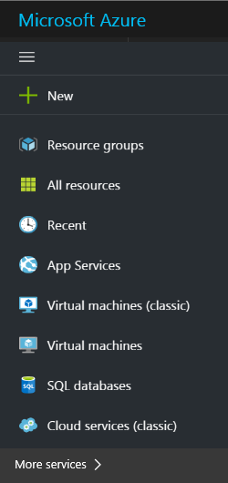

   > [!TIP]
   > If **All services** doesn't appear, you might have to expand the menu first. 
   > At the top of the collapsed menu, select **Show menu**.

3. Under **Integration Accounts**, 
   select the integration account where you want to add the agreement.

   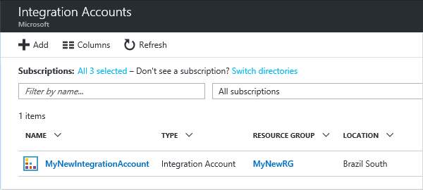

4. Select **Overview**, then select the **Agreements** tile. 
   If you don't have an Agreements tile, add the tile first. 

   

5. Under **Agreements**, choose **Add**.

        

6. Under **Add**, enter a **Name** for your agreement. 
   For the agreement type, select **X12**. 
   Select the **Host Partner**, **Host Identity**, 
   **Guest Partner**, and **Guest Identity** for your agreement. 
   For more property details, see the table in this step.

	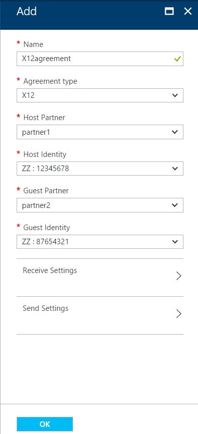  

	| Property | Description |
	| --- | --- |
	| Name |Name of the agreement |
	| Agreement Type | Should be X12 |
	| Host Partner |An agreement needs both a host and guest partner. The host partner represents the organization that configures the agreement. |
	| Host Identity |An identifier for the host partner |
	| Guest Partner |An agreement needs both a host and guest partner. The guest partner represents the organization that's doing business with the host partner. |
	| Guest Identity |An identifier for the guest partner |
	| Receive Settings |These properties apply to all messages received by an agreement. |
	| Send Settings |These properties apply to all messages sent by an agreement. |  

   > [!NOTE]
   > Resolution of X12 agreement depends on matching the sender qualifier and identifier, 
   > and the receiver qualifier and identifier defined in the partner and incoming message. 
   > If these values change for your partner, update the agreement too.

## Configure how your agreement handles received messages

Now that you've set the agreement properties, 
you can configure how this agreement identifies and 
handles incoming messages received from your partner through this agreement.

1.	Under **Add**, select **Receive Settings**.
Configure these properties based on your agreement 
with the partner that exchanges messages with you. 
For property descriptions, see the tables in this section.

	**Receive Settings** is organized into these sections: 
	Identifiers, Acknowledgment, Schemas, Envelopes, Control Numbers, 
	Validations, and Internal Settings.

2. After you're done, 
make sure to save your settings by choosing **OK**.

Now your agreement is ready to handle incoming 
messages that conform to your selected settings.

### Identifiers

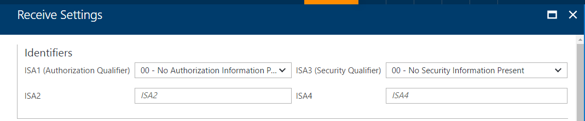  

| Property | Description |
| --- | --- |
| ISA1 (Authorization Qualifier) |Select the Authorization qualifier value from the drop-down list. |
| ISA2 |Optional. Enter Authorization information value. If the value you entered for ISA1 is other than 00, enter a minimum of one alphanumeric character and a maximum of 10. |
| ISA3 (Security Qualifier) |Select the Security qualifier value from the drop-down list. |
| ISA4 |Optional. Enter the Security information value. If the value you entered for ISA3 is other than 00, enter a minimum of one alphanumeric character and a maximum of 10. |

### Acknowledgment

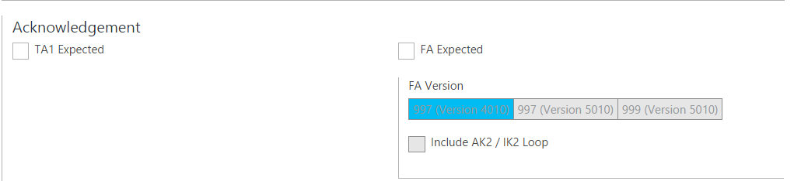 

| Property | Description |
| --- | --- |
| TA1 expected |Returns a technical acknowledgment to the interchange sender |
| FA expected |Returns a functional acknowledgment to the interchange sender. Then select whether you want the 997 or 999 acknowledgments, based on the schema version |
| Include AK2/IK2 Loop |Enables generation of AK2 loops in functional acknowledgments for accepted transaction sets |

### Schemas

Select a schema for each transaction type (ST1) and Sender Application (GS2). 
The receive pipeline disassembles the incoming message by matching the values for ST1 and GS2 
in the incoming message with the values you set here, and the schema of the incoming message with the schema you set here.

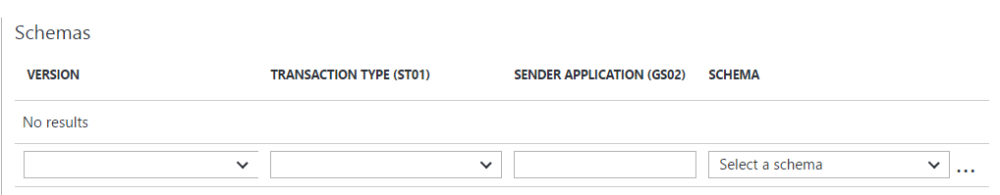 

| Property | Description |
| --- | --- |
| Version |Select the X12 version |
| Transaction Type (ST01) |Select the transaction type |
| Sender Application (GS02) |Select the sender application |
| Schema |Select the schema file you want to use. Schemas are added to your integration account. |

> [!NOTE]
> Configure the required [Schema](../logic-apps/logic-apps-enterprise-integration-schemas.md) 
> that is uploaded to your [integration account](../logic-apps/logic-apps-enterprise-integration-accounts.md).

### Envelopes

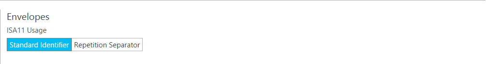

| Property | Description |
| --- | --- |
| ISA11 Usage |Specifies the separator to use in a transaction set: 
Select **Standard identifier** to use a period (.) for decimal notation, rather than the decimal notation of the incoming document in the EDI receive pipeline. 
Select **Repetition Separator** to specify the separator for repeated occurrences of a simple data element or a repeated data structure. For example, usually the carat (^) is used as the repetition separator. For HIPAA schemas, you can only use the carat. |

### Control Numbers

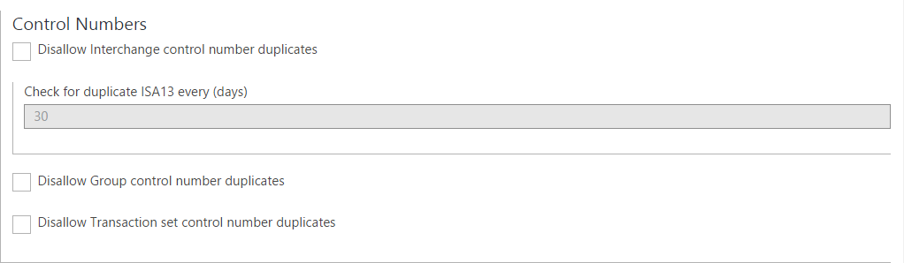 

| Property | Description |
| --- | --- |
| Disallow Interchange Control Number duplicates |Block duplicate interchanges. Checks the interchange control number (ISA13) for the received interchange control number. If a match is detected, the receive pipeline doesn't process the interchange. You can specify the number of days for performing the check by giving a value for *Check for duplicate ISA13 every (days)*. |
| Disallow Group control number duplicates |Block interchanges with duplicate group control numbers. |
| Disallow Transaction set control number duplicates |Block interchanges with duplicate transaction set control numbers. |

### Validations

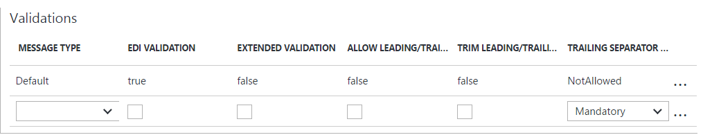 

When you complete each validation row, another is automatically added. 
If you don't specify any rules, then validation uses the "Default" row.

| Property | Description |
| --- | --- |
| Message Type |Select the EDI message type. |
| EDI Validation |Perform EDI validation on data types as defined by the schema's EDI properties, length restrictions, empty data elements, and trailing separators. |
| Extended Validation |If the data type isn't EDI, validation is on the data element requirement and allowed repetition, enumerations, and data element length validation (min/max). |
| Allow Leading/Trailing Zeroes |Retain any additional leading or trailing zero and space characters. Don't remove these characters. |
| Trim Leading/Trailing Zeroes |Remove leading or trailing zero and space characters. |
| Trailing Separator Policy |Generate trailing separators. 
Select **Not Allowed** to prohibit trailing delimiters and separators in the received interchange. If the interchange has trailing delimiters and separators, the interchange is declared not valid. 
Select **Optional** to accept interchanges with or without trailing delimiters and separators. 
Select **Mandatory** when the interchange must have trailing delimiters and separators. |

### Internal Settings

 

| Property | Description |
| --- | --- |
| Convert implied decimal format "Nn" to a base 10 numeric value |Converts an EDI number that is specified with the format "Nn" into a base-10 numeric value |
| Create empty XML tags if trailing separators are allowed |Select this check box to have the interchange sender include empty XML tags for trailing separators. |
| Split Interchange as transaction sets - suspend transaction sets on error|Parses each transaction set in an interchange into a separate XML document by applying the appropriate envelope to the transaction set. Suspends only the transactions where the validation fails. |
| Split Interchange as transaction sets - suspend interchange on error|Parses each transaction set in an interchange into a separate XML document by applying the appropriate envelope. Suspends entire interchange when one or more transaction sets in the interchange fail validation. | 
| Preserve Interchange - suspend transaction sets on error |Leaves the interchange intact, creates an XML document for the entire batched interchange. Suspends only the transaction sets that fail validation, while continuing to process all other transaction sets. |
| Preserve Interchange - suspend interchange on error |Leaves the interchange intact, creates an XML document for the entire batched interchange. Suspends the entire interchange when one or more transaction sets in the interchange fail validation. |

## Configure how your agreement sends messages

You can configure how this agreement identifies and handles outgoing 
messages that you send to your partner through this agreement.

1.	Under **Add**, select **Send Settings**.
Configure these properties based on your agreement 
with your partner who exchanges messages with you. 
For property descriptions, see the tables in this section.

	**Send Settings** is organized into these sections: Identifiers, 
	Acknowledgment, Schemas, Envelopes, Character Sets and Separators, 
	Control Numbers, and Validation.

2. After you're done, 
make sure to save your settings by choosing **OK**.

Now your agreement is ready to handle outgoing 
messages that conform to your selected settings.

### Identifiers

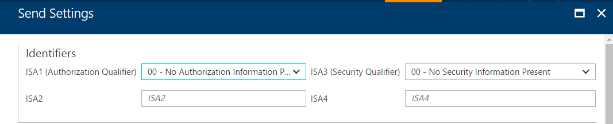  

| Property | Description |
| --- | --- |
| Authorization qualifier (ISA1) |Select the Authorization qualifier value from the drop-down list. |
| ISA2 |Enter Authorization information value. If this value is other than 00, then enter a minimum of one alphanumeric character and a maximum of 10. |
| Security qualifier (ISA3) |Select the Security qualifier value from the drop-down list. |
| ISA4 |Enter the Security information value. If this value is other than 00, for the Value (ISA4) text box, then enter a minimum of one alphanumeric value and a maximum of 10. |

### Acknowledgment

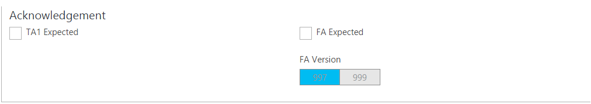  

| Property | Description |
| --- | --- |
| TA1 expected |Return a technical acknowledgment (TA1) to the interchange sender. This setting specifies that the host partner who is sending the message requests an acknowledgment from the guest partner in the agreement. These acknowledgments are expected by the host partner based on the Receive Settings of the agreement. |
| FA expected |Return a functional acknowledgment (FA) to the interchange sender. Select whether you want the 997 or 999 acknowledgements, based on the schema versions you are working with. These acknowledgments are expected by the host partner based on the Receive Settings of the agreement. |
| FA Version |Select the FA version |

### Schemas

  

| Property | Description |
| --- | --- |
| Version |Select the X12 version |
| Transaction Type (ST01) |Select the transaction type |
| SCHEMA |Select the schema to use. Schemas are located in your integration account. If you select schema first, it automatically configures version and transaction type  |

> [!NOTE]
> Configure the required [Schema](../logic-apps/logic-apps-enterprise-integration-schemas.md) 
> that is uploaded to your [integration account](../logic-apps/logic-apps-enterprise-integration-accounts.md).

### Envelopes

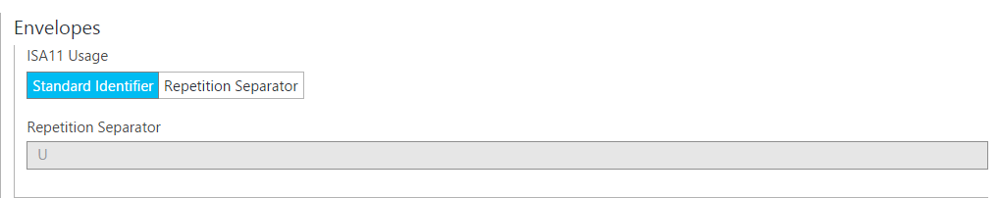 

| Property | Description |
| --- | --- |
| ISA11 Usage |Specifies the separator to use in a transaction set: 
Select **Standard identifier** to use a period (.) for decimal notation, rather than the decimal notation of the incoming document in the EDI receive pipeline. 
Select **Repetition Separator** to specify the separator for repeated occurrences of a simple data element or a repeated data structure. For example, usually the carat (^) is used as the repetition separator. For HIPAA schemas, you can only use the carat. |

### Control Numbers

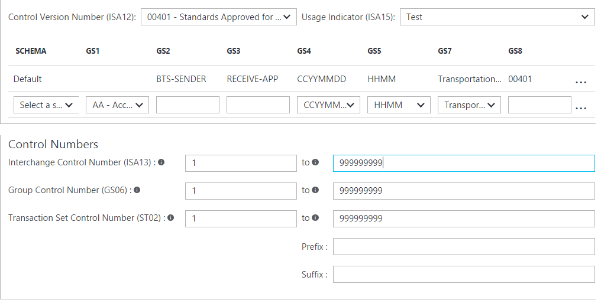 

| Property | Description |
| --- | --- |
| Control Version Number (ISA12) |Select the version of the X12 standard |
| Usage Indicator (ISA15) |Select the context of an interchange.  The values are information, production data, or test data |
| Schema |Generates the GS and ST segments for an X12-encoded interchange that it sends to the Send Pipeline |
| GS1 |Optional, select a value for the functional code from the drop-down list |
| GS2 |Optional, application sender |
| GS3 |Optional, application receiver |
| GS4 |Optional, select CCYYMMDD or YYMMDD |
| GS5 |Optional, select HHMM, HHMMSS, or HHMMSSdd |
| GS7 |Optional, select a value for the responsible agency from the drop-down list |
| GS8 |Optional, version of the document |
| Interchange Control Number (ISA13) |Required, enter a range of values for the interchange control number. Enter a numeric value with a minimum of 1 and a maximum of 999999999 |
| Group Control Number (GS06) |Required, enter a range of numbers for the group control number. Enter a numeric value with a minimum of 1 and a maximum of 999999999 |
| Transaction Set Control Number (ST02) |Required, enter a range of numbers for the Transaction Set Control number. Enter a range of numeric values with a minimum of 1 and a maximum of 999999999 |
| Prefix |Optional, designated for the range of transaction set control numbers used in acknowledgment. Enter a numeric value for the middle two fields, and an alphanumeric value (if desired) for the prefix and suffix fields. The middle fields are required and contain the minimum and maximum values for the control number |
| Suffix |Optional, designated for the range of transaction set control numbers used in an acknowledgment. Enter a numeric value for the middle two fields and an alphanumeric value (if desired) for the prefix and suffix fields. The middle fields are required and contain the minimum and maximum values for the control number |

### Character Sets and Separators

Other than the character set, you can enter a different set of delimiters for each message type. 
If a character set isn't specified for a given message schema, then the default character set is used.

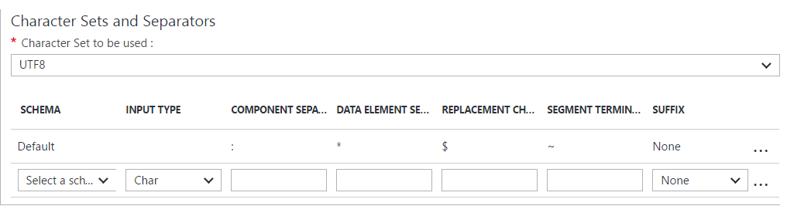 

| Property | Description |
| --- | --- |
| Character Set to be used |To validate the properties, select the X12 character set. The options are Basic, Extended, and UTF8. |
| Schema |Select a schema from the drop-down list. After you complete each row, a new row is automatically added. For the selected schema, select the separators set that you want to use, based on the separator descriptions below. |
| Input Type |Select an input type from the drop-down list. |
| Component Separator |To separate composite data elements, enter a single character. |
| Data Element Separator |To separate simple data elements within composite data elements, enter a single character. |
| Replacement Character |Enter a replacement character used for replacing all separator characters in the payload data when generating the outbound X12 message. |
| Segment Terminator |To indicate the end of an EDI segment, enter a single character. |
| Suffix |Select the character that is used with the segment identifier. If you designate a suffix, then the segment terminator data element can be empty. If the segment terminator is left empty, then you must designate a suffix. |

> [!TIP]
> To provide special character values, edit the agreement as JSON and provide the ASCII value for the special character.

### Validation

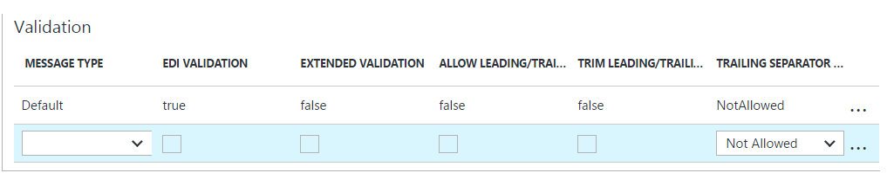 

When you complete each validation row, another is automatically added. 
If you don't specify any rules, then validation uses the "Default" row.

| Property | Description |
| --- | --- |
| Message Type |Select the EDI message type. |
| EDI Validation |Perform EDI validation on data types as defined by the schema's EDI properties, length restrictions, empty data elements, and trailing separators. |
| Extended Validation |If the data type isn't EDI, validation is on the data element requirement and allowed repetition, enumerations, and data element length validation (min/max). |
| Allow Leading/Trailing Zeroes |Retain any additional leading or trailing zero and space characters. Don't remove these characters. |
| Trim Leading/Trailing Zeroes |Remove leading or trailing zero characters. |
| Trailing Separator Policy |Generate trailing separators. 
Select **Not Allowed** to prohibit trailing delimiters and separators in the sent interchange. If the interchange has trailing delimiters and separators, the interchange is declared not valid. 
Select **Optional** to send interchanges with or without trailing delimiters and separators. 
Select **Mandatory** if the sent interchange must have trailing delimiters and separators. |

## Find your created agreement

1.	After you finish setting all your agreement properties, 
on the **Add** page, choose **OK** to finish creating your agreement 
and return to your integration account.

	Your newly added agreement now appears in your **Agreements** list.

2.	You can also view your agreements in your integration account overview. 
On your integration account menu, choose **Overview**, then select the **Agreements** tile.

	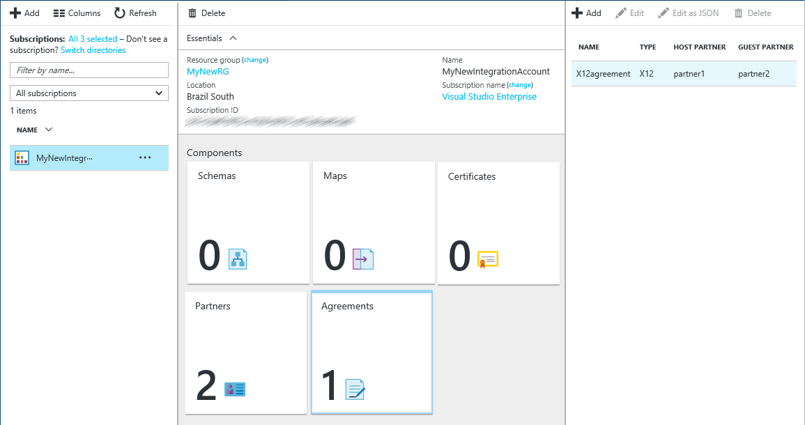   

## View the swagger
See the [swagger details](/connectors/x12/). 

## Learn more
* [Learn more about the Enterprise Integration Pack](../logic-apps/logic-apps-enterprise-integration-overview.md "Learn about Enterprise Integration Pack")  

