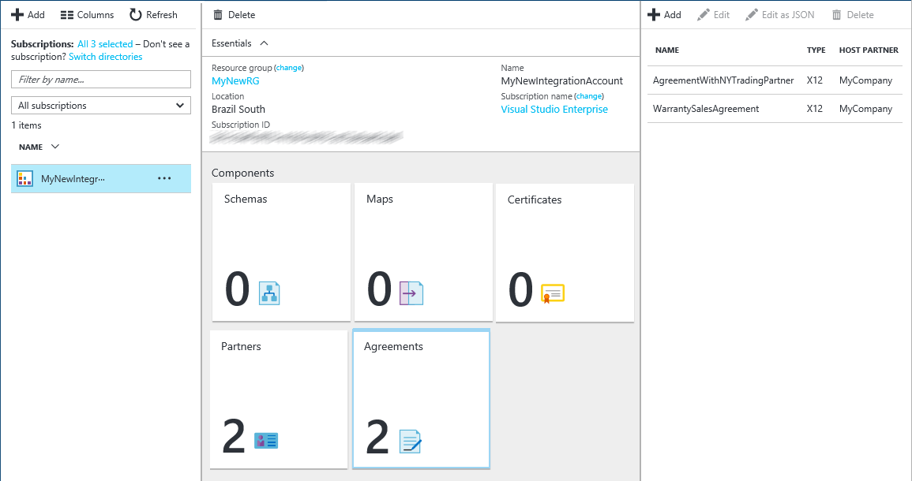

# Enterprise integration with X12

## Prereqs

Before you can exchange X12 messages, you must create an X12 agreement and store that agreement in your integration account. 
The following steps walk you through the process of creating an X12 agreement.

* An [integration account](../logic-apps/logic-apps-enterprise-integration-accounts.md) defined in your Azure subscription  
* At least two [partners](../logic-apps/logic-apps-enterprise-integration-partners.md) configured with EDI X12 qualifier under business identities.   
* Required [Schema](../logic-apps/logic-apps-enterprise-integration-schemas.md) to be uploaded to [integration account](../logic-apps/logic-apps-enterprise-integration-accounts.md)

## Create an X12 agreement

1. Sign in to the [Azure portal](http://portal.azure.com "Azure portal").

2. Select **More services**, and enter **integration** in the filter search box. 
Select **Integration Accounts** from the results list:    

	

3. Select the integration account where you want to add the certificate.

	

4. Select the **Agreements** tile. If you don't see the agreements tile, add the tile. 

	   

5. In the Agreements blade that opens, select **Add**.

	     

6. Under **Add**, enter a **Name** for your agreement. 
Select **X12** for the agreement type, then select the **Host Partner**, **Host Identity**, **Guest Partner**, and **Guest Identity**.

	  

	| Property | Description |
	| --- | --- |
	| Name |Name of the agreement |
	| Agreement Type | Should be X12 |
	| Host Partner |An agreement needs both a host and guest partner. The host partner represents the organization that is configuring the agreement |
	| Host Identity |An identifier for the host partner |
	| Guest Partner |An agreement needs both a host and guest partner. The guest partner represents the organization that's doing business with the host partner |
	| Guest Identity |An identifier for the guest partner |
	| Receive Settings |These properties apply to all messages received by an agreement |
	| Send Settings |These properties apply to all messages sent by an agreement |  

  > [!NOTE]
  > Resolution of X12 agreement depends on matching the sender qualifier and identifier, 
  > and the receiver qualifier and identifier defined in the partner and incoming message. 
  > If these values change for your partner, update the agreement too.

## Receive Settings

1. To configure how to handle messages received through this agreement, select **Receive Settings**.
2. The Receive Settings control is divided into the following sections, including Identifiers, 
Acknowledgment, Schemas, Envelopes, Control Numbers, Validations, and Internal Settings. 
Configure these properties based on your agreement with the partner that you exchange messages. 
Here is a view of these controls, configure them based on how you want this agreement to identify and handle incoming messages.

### Identifiers

  

| Property | Description |
| --- | --- |
| ISA1 (Authorization Qualifier) |Select the Authorization qualifier value from the drop-down list. |
| ISA2 |Optional. Enter Authorization information value. If the value you entered for ISA1 is other than 00, enter a minimum of one alphanumeric character and a maximum of 10. |
| ISA3 (Security Qualifier) |Select the Security qualifier value from the drop-down list. |
| ISA4 |Optional. Enter the Security information value. If the value you entered for ISA3 is other than 00, enter a minimum of one alphanumeric character and a maximum of 10. |

### Acknowledgments

 

| Property | Description |
| --- | --- |
| TA1 expected |Returns a technical acknowledgment to the interchange sender |
| FA expected |Returns a functional acknowledgment to the interchange sender. Then select whether you want the 997 or 999 acknowledgments, based on the schema version |
| Include AK2/IK2 Loop |Enables generation of AK2 loops in functional acknowledgments for accepted transaction sets |

### Schemas
Choose a schema for each transaction type (ST1) and Sender Application (GS2). 
The receive pipeline disassembles the incoming message by matching the values for ST1 and GS2 
in the incoming message with the values you set here, and the schema of the incoming message with the schema you set here.

 

| Property | Description |
| --- | --- |
| Version |Select the X12 version |
| Transaction Type (ST01) |Select the transaction type |
| Sender Application (GS02) |Select the sender application |
| Schema |Select the schema file you want to us. Schemas are added to your integration account |

> [!NOTE]
> Configure required [Schema](../logic-apps/logic-apps-enterprise-integration-schemas.md) 
> that is uploaded in [integration account](../logic-apps/logic-apps-enterprise-integration-accounts.md).

### Envelopes

 

| Property | Description |
| --- | --- |
| ISA11 Usage |Use this field to specify the separator in a transaction set:  Select the Standard identifier to use the decimal notation of “.”, rather than the decimal notation of the incoming document in the EDI receive pipeline.  Select Repetition separator to specify the separator for repeated occurrences of a simple data element or a repeated data structure. For example, usually "^" is used as repetition separator. For HIPAA schemas, you can only use "^". |

### Control Numbers

 

| Property | Description |
| --- | --- |
| Disallow Interchange Control Number duplicates |Blocks duplicate interchanges. Checks that the interchange control number (ISA13) for the received interchange control number. If a match is detected, the receive pipeline does not process the interchange. You can specify the number of days at which the check is performed by giving the appropriate value for *Check for duplicate ISA13 every x days*. |
| Disallow Group control number duplicates |Blocks interchanges with duplicate group control numbers |
| Disallow Transaction set control number duplicates |Blocks interchanges with duplicate transaction set control numbers |

### Validations

 

| Property | Description |
| --- | --- |
| Message Type |EDI Message types, like 850-Purchase Order or 999-Implementation Acknowledgement. |
| EDI Validation |Performs EDI validation on data types as defined by the EDI properties of the schema, length restrictions, empty data elements, and trailing separators. |
| Extended Validation |If the data type is not EDI, validation is on the data element requirement and allowed repetition, enumerations, and data element length validation (min/max). |
| Allow Leading/Trailing Zeroes |Any additional space and zero characters that are leading or trailing are retained. They are not removed. |
| Trailing Separator Policy |Generates trailing separators on the interchange received. Options include NotAllowed, Optional, and Mandatory. |

### Internal Settings

 

| Property | Description |
| --- | --- |
| Convert implied decimal format *Nn* to a base 10 numeric value |Converts an EDI number that is specified with the format Nn into a base-10 numeric value |
| Create empty XML tags if trailing separators are allowed |Select this check box to have the interchange sender include empty XML tags for trailing separators. |
| Split Interchange as transaction sets - suspend transaction sets on error|Parses each transaction set in an interchange into a separate XML document by applying the appropriate envelope to the transaction set. Suspends only the transactions where the validation fails. |
| Split Interchange as transaction sets - suspend interchange on error|Parses each transaction set in an interchange into a separate XML document by applying the appropriate envelope. Suspends entire interchange if one or more transaction sets in the interchange fail validation. | 
| Preserve Interchange - suspend transaction sets on error |Leaves the interchange intact, creates an XML document for the entire batched interchange. Suspends only the transaction sets that fail validation, while continuing to process all other transaction sets. |
| Preserve Interchange - suspend interchange on error |Leaves the interchange intact, creates an XML document for the entire batched interchange.  Suspends entire interchange if one or more transaction sets in the interchange fail validation. |

After you have set the receive settings properties, select the **OK** button  
   
Your agreement is ready to handle incoming messages that conform to the schema you selected.

## Send Settings

1. Select **Send Settings** to configure how to handle messages sent through this agreement.

2. The Send Settings control is divided into the following sections, including Identifiers, 
Acknowledgment, Schemas, Envelopes, Character Sets and Separators, Control Numbers, and Validations. 
Configure these properties based on your agreement with the partner that you exchange messages. 
Here is a view of these controls, configure them based on how you want this agreement to identify and handle outgoing messages.

### Identifiers

  

| Property | Description |
| --- | --- |
| Authorization qualifier (ISA1) |Select the Authorization qualifier value from the drop-down list. |
| ISA2 |Enter Authorization information value. If this value is other than 00, then enter a minimum of one alphanumeric character and a maximum of 10. |
| Security qualifier (ISA3) |Select the Security qualifier value from the drop-down list. |
| ISA4 |Enter the Security information value. If this value is other than 00, for the Value (ISA4) text box, then enter a minimum of one alphanumeric value and a maximum of 10. |

### Acknowledgment

  

| Property | Description |
| --- | --- |
| TA1 expected |Select this checkbox to return a technical (TA1) acknowledgment to the interchange sender. This setting specifies that the host partner who is sending the message requests an acknowledgment from the guest partner in the agreement. These acknowledgments are expected by the host partner based on the Receive Settings of the agreement. |
| FA expected |Select this checkbox to return a functional (FA) acknowledgment to the interchange sender, and then select whether you want the 997 or 999 acknowledgements, based on the schema versions you are working with. These acknowledgments are expected by the host partner based on the Receive Settings of the agreement. |
| FA Version |Select the FA version |

### Schemas

  

| Property | Description |
| --- | --- |
| Version |Select the X12 version |
| Transaction Type (ST01) |Select the transaction type |
| SCHEMA |Select the schema to use. Schemas are located in your integration account. If you select schema first, it automatically configures version and transaction type  |

> [!NOTE]
> Configure required [Schema](../logic-apps/logic-apps-enterprise-integration-schemas.md) 
> that is uploaded in [integration account](../logic-apps/logic-apps-enterprise-integration-accounts.md).

### Envelopes

 

| Property | Description |
| --- | --- |
| ISA11 Usage |Use this field to specify the separator in a transaction |
| Standard Identifier |Select the Standard identifier to use the decimal notation of “.” |
| Repetition Separator |Select Repetition separator to specify the separator for repeated occurrences of a simple data element or a repeated data structure. For example, usually "^" is used as repetition separator. For HIPAA schemas, you can only use "^". |

### Control Numbers

 

| Property | Description |
| --- | --- |
| Control Version Number (ISA12) |Select the version of the X12 standard |
| Usage Indicator (ISA15) |Select the context of an interchange.  The values are information, production data, or test data |
| Schema |Generates the GS and ST segments for an X12-encoded interchange that it sends to the Send Pipeline |
| GS1 |Optional, select a value for the functional code from the drop-down list |
| GS2 |Optional, application sender |
| GS3 |Optional, application receiver |
| GS4 |Optional, select CCYYMMDD or YYMMDD |
| GS5 |Optional, select HHMM, HHMMSS, or HHMMSSdd |
| GS7 |Optional, select a value for the responsible agency from the drop-down list |
| GS8 |Optional, version of the document |
| Interchange Control Number (ISA13) |Required, enter a range of values for the interchange control number. Enter a numeric value with a minimum of 1 and a maximum of 999999999 |
| Group Control Number (GS06) |Required, enter a range of numbers for the group control number. Enter a numeric value with a minimum of 1 and a maximum of 999999999 |
| Transaction Set Control Number (ST02) |Required, enter a range of numbers for the Transaction Set Control number. Enter a range of numeric values with a minimum of 1 and a maximum of 999999999 |
| Prefix |Optional, designated for the range of transaction set control numbers used in acknowledgment. Enter a numeric value for the middle two fields, and an alphanumeric value (if desired) for the prefix and suffix fields. The middle fields are required and contain the minimum and maximum values for the control number |
| Suffix |Optional, designated for the range of transaction set control numbers used in an acknowledgment. Enter a numeric value for the middle two fields and an alphanumeric value (if desired) for the prefix and suffix fields. The middle fields are required and contain the minimum and maximum values for the control number |

### Character Sets and Separators

Other than the character set, you can enter a different set of delimiters to be used for each message type. 
If a character set is not specified for a given message schema, then the default character set is used.

 

| Property | Description |
| --- | --- |
| Character Set to be used |To validate the properties, select the X12 character set. The options are Basic, Extended, and UTF8. |
| Schema |Select a schema from the drop-down list. For the selected schema, select the separators set to use. |
| Input Type |Select an input type from the drop-down list. |
| Component element separator |To separate composite data elements, enter a single character. |
| Data Element Separator |To separate simple data elements within composite data elements, enter a single character. |
| Replacement Character |Enter a replacement character. When generating the outbound X12 message, all instances of separator characters in the payload data are replaced with the specified character. |
| Segment Terminator |Enter a single character to indicate the end of an EDI segment. |
| Suffix |Select the character that is used with the segment identifier. If you designate a suffix, then the segment terminator data element can be empty. If the segment terminator is left empty, then you must designate a suffix. |

### Validation

 

| Property | Description |
| --- | --- |
| Message Type |Select the message type from the list |
| EDI Validation |Selecting this option enables validation on the interchange receiver. This validation performs EDI validation on transaction set data elements, validating data types, length restrictions, and empty data elements and trailing separators |
| Extended Validation |Selecting this option enables extended validation of interchanges received from the interchange sender. This includes validation of field length, optionality, and repeat count in addition to XSD data type validation. You can enable extension validation without enabling EDI validation, or vice versa. |
| Allow leading/ trailing zeroes |Selecting this option specifies that an EDI interchange received from the party does not fail validation if a data element in an EDI interchange does not conform to its length requirement because of or trailing spaces, but does conform to its length requirement when they are removed. |
| Trailing separator |Selecting this option specifies an EDI interchange received from the party does not fail validation if a data element in an EDI interchange does not conform to its length requirement because of leading (or trailing) zeroes or trailing spaces, but does conform to its length requirement when they are removed.  Select Not Allowed if you do not want to allow trailing delimiters and separators in an interchange received from the interchange sender. If the interchange contains trailing delimiters and separators, it is declared not valid.  Select Optional to accept interchanges with or without trailing delimiters and separators.  Select Mandatory if the received interchange must contain trailing delimiters and separators. |

1.	After you have set the send settings properties, choose **OK**. 
Your agreement is ready to handle outgoing messages that confirm to the schema you selected.

2.	To create the agreement, choose **OK**.

3.	Select the **Agreements** tile on the Integration Account blade. The newly added agreement appears. 

	   

## Learn more
* [Learn more about the Enterprise Integration Pack](../logic-apps/logic-apps-enterprise-integration-overview.md "Learn about Enterprise Integration Pack")  

