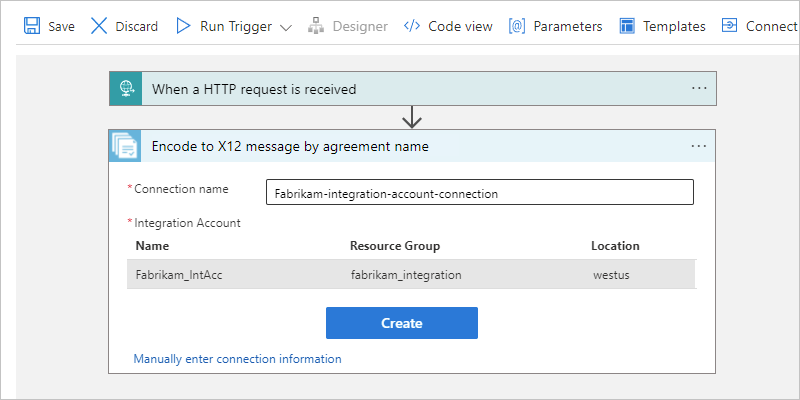
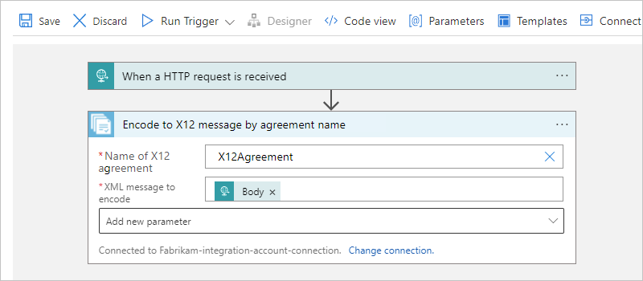

# Exchange X12 messages using workflows in Azure Logic Apps

[!INCLUDE [logic-apps-sku-consumption-standard](../../includes/logic-apps-sku-consumption-standard.md)]

To send and receive X12 messages in workflows that you create using Azure Logic Apps, use the **X12** connector, which provides operations that support and manage X12 communication.

This how-to guide shows how to add the X12 encoding and decoding actions to an existing logic app workflow. The **X12** connector doesn't include any triggers, so you can use any trigger to start your workflow. The examples in this guide use the [Request trigger](../connectors/connectors-native-reqres.md).

## Connector technical reference

The **X12** connector has one version across workflows in [multi-tenant Azure Logic Apps, single-tenant Azure Logic Apps, and the integration service environment (ISE)](logic-apps-overview.md#resource-environment-differences). For technical information about the **X12** connector, see the following documentation:

* [Connector reference page](/connectors/x12/), which describes the triggers, actions, and limits as documented by the connector's Swagger file

* [B2B protocol limits for message sizes](logic-apps-limits-and-config.md#b2b-protocol-limits)

  For example, in an [integration service environment (ISE)](connect-virtual-network-vnet-isolated-environment-overview.md), this connector's ISE version uses the [B2B message limits for ISE](logic-apps-limits-and-config.md#b2b-protocol-limits).

## Prerequisites

* An Azure account and subscription. If you don't have an Azure subscription yet, [sign up for a free Azure account](https://azure.microsoft.com/free/?WT.mc_id=A261C142F).

* An [integration account resource](logic-apps-enterprise-integration-create-integration-account.md) where you define and store artifacts, such as trading partners, agreements, certificates, and so on, for use in your enterprise integration and B2B workflows. This resource has to meet the following requirements:

  * Both your integration account and logic app resource must exist in the same Azure subscription and Azure region.

  * Defines at least two [trading partners](logic-apps-enterprise-integration-partners.md) that participate in the **X12** operation used in your workflow. The definitions for both partners must use the same X12 business identity qualifier.

  * Defines an [X12 agreement](logic-apps-enterprise-integration-agreements.md) between the trading partners that participate in your workflow. Each agreement requires a host partner and a guest partner. The content in the messages between you and the other partner must match the agreement type. For information about agreement settings to use when receiving and sending messages, see [X12 message settings](logic-apps-enterprise-integration-x12-message-settings.md).

    > [!IMPORTANT]
    >
    > If you're working with Health Insurance Portability and Accountability Act (HIPAA) schemas, you have to add a 
    > `schemaReferences` section to your agreement. For more information, review [HIPAA schemas and message types](#hipaa-schemas).

  * Defines the [schemas](logic-apps-enterprise-integration-schemas.md) to use for XML validation.

    > [!IMPORTANT]
    >
    > If you're working with Health Insurance Portability and Accountability Act (HIPAA) schemas, make sure to review [HIPAA schemas and message types](#hipaa-schemas).

* Based on whether you're working on a Consumption or Standard logic app workflow, your logic app resource might require a link to your integration account:

  | Logic app workflow | Link required? |
  |--------------------|----------------|
  | Consumption | Connection to integration account required, but no link required. You can create the connection when you add the **X12** operation to your workflow. |
  | Standard | Connection to integration account required, but no link required. You can create the connection when you add the **X12** operation to your workflow. |

* The logic app resource and workflow where you want to use the X12 operations.

  For more information, see the following documentation:

  * [Create an example Consumption logic app workflow in multi-tenant Azure Logic Apps](quickstart-create-example-consumption-workflow.md)

  * [Create an example Standard logic app workflow in single-tenant Azure Logic Apps](create-single-tenant-workflows-azure-portal.md)

## Encode X12 messages

### [Consumption](#tab/consumption)

1. In the [Azure portal](https://portal.azure.com), open your logic app resource and workflow in the designer.

1. In the designer, [follow these general steps to add the **X12** action named **Encode to X12 message by agreement name** to your workflow](create-workflow-with-trigger-or-action?tabs=consumption#add-action).

   > [!NOTE]
   >
   > If you want to use **Encode to X12 message by identities** action instead, 
   > you later have to provide different values, such as the **Sender identifier** 
   > and **Receiver identifier** that's specified by your X12 agreement. 
   > You also have to specify the **XML message to encode**, which can be the output 
   > from the trigger or a preceding action.

1. When prompted, provide the following connection information for your integration account:

   | Property | Required | Description |
   |----------|----------|-------------|
   | **Connection name** | Yes | A name for the connection |
   | **Integration Account** | Yes | From the list of available integration accounts, select the account to use. |

   For example:

   

1. When you're done, select **Create**.

1. In the X12 action information box, provide the following property values:

   | Property | Required | Description |
   |----------|----------|-------------|
   | **Name of X12 agreement** | Yes | The X12 agreement to use. |
   | **XML message to encode** | Yes | The business identifier for the message sender as specified by your X12 agreement |
   | Other parameters | No | This operation includes the following other parameters: 
- **Data element separator**  - **Release indicator**  - **Component separator**  - **Repetition separator**  - **Segment terminator**  - **Segment terminator suffix**  - **Decimal indicator** 
For more information, review [X12 message settings](logic-apps-enterprise-integration-x12-message-settings.md). |

   For example, the XML message payload can be the **Body** content output from the Request trigger:

   

### [Standard](#tab/standard)

---

## Next steps

* [X12 TA1 technical acknowledgments and error codes](logic-apps-enterprise-integration-x12-ta1-acknowledgment.md)
* [X12 997 functional acknowledgments and error codes](logic-apps-enterprise-integration-x12-997-acknowledgment.md)
* [X12 message settings](logic-apps-enterprise-integration-x12-message-settings.md)