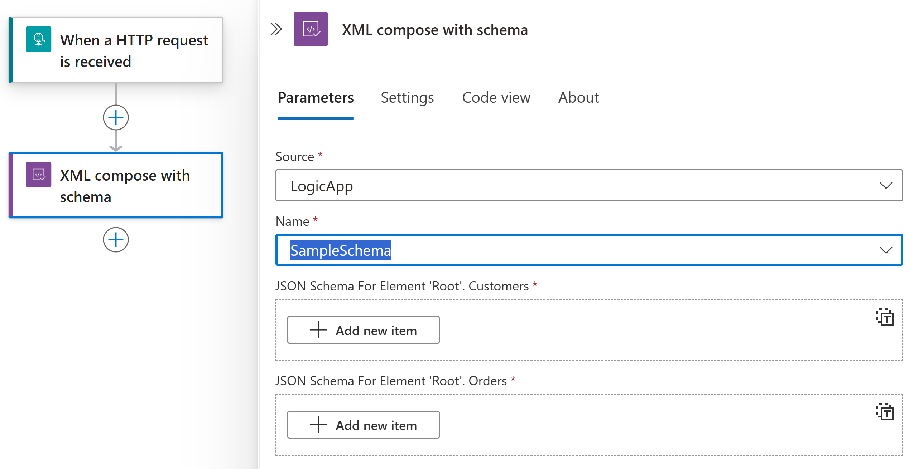
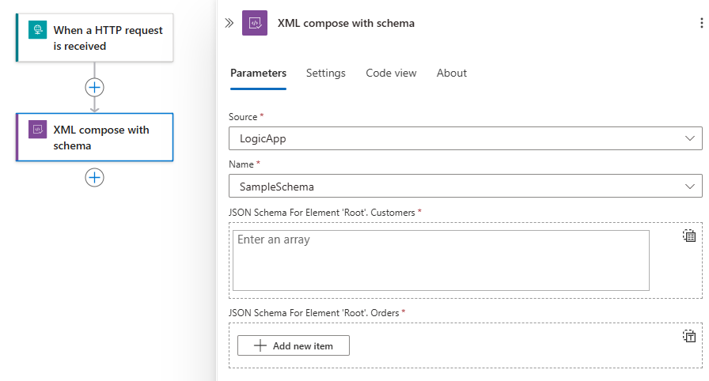

# Compose XML using schemas in Standard workflows with Azure Logic Apps (Preview)

[!INCLUDE [logic-apps-sku-consumption-standard](../../includes/logic-apps-sku-consumption-standard.md)]

In enterprise integration business-to-business (B2B) or BizTalk migration scenarios, you might have to create XML documents from JSON data. Your Standard logic app workflow can compose XML documents by using the action named **Compose XML with schema**, which requires an XSD schema.

For example, suppose you receive JSON data from Azure Service Bus and need to send that data in XML format to an FTP server. You can use the JSON data as content for the **Compose XML with schema** action and create a new XML document with the source data. You can then submit this XML data to the FTP server.

## Prerequisites

* An Azure account and subscription. If you don't have a subscription yet, [sign up for a free Azure account](https://azure.microsoft.com/free/?WT.mc_id=A261C142F).

* A Standard logic app workflow that already starts with a trigger so that you can add the **Compose XML with schema** action to your workflow.

* An [integration account resource](logic-apps-enterprise-integration-create-integration-account.md) where you define and store artifacts, such as trading partners, agreements, certificates, and so on, for use in your enterprise integration and B2B workflows. This resource has to meet the following requirements:

  * Is associated with the same Azure subscription as your logic app resource.

  * Exists in the same location or Azure region as your logic app resource where you plan to use the **XML compose with schema** action.

  * Currently this actions are not yet supported in [Consumption logic app resource and workflow](logic-apps-overview.md#resource-environment-differences).

  * If you're working on a [Standard logic app resource and workflow](logic-apps-overview.md#resource-environment-differences), you can link your integration account to your logic app resource, upload XSD schemas directly to your logic app resource, or both, based on the following scenarios: 

    * If you already have an integration account with the artifacts that you need or want to use, you can link your integration account to multiple Standard logic app resources where you want to use the artifacts. That way, you don't have to upload XSD schemas to each individual logic app. For more information, review [Link your logic app resource to your integration account](enterprise-integration/create-integration-account.md?tabs=standard#link-account).

    * If you don't have an integration account or only plan to use your artifacts across multiple workflows within the *same logic app resource*, you can [directly add schemas to your logic app resource](logic-apps-enterprise-integration-schemas.md) using either the Azure portal or Visual Studio Code.
   
    So, if you don't have or need an integration account, you can use the upload option. Otherwise, you can use the linking option. Either way, you can use these artifacts across all child workflows within the same logic app resource.

  You still need an integration account to store other artifacts, such as partners, agreements, and certificates, along with using the [AS2](logic-apps-enterprise-integration-as2.md), [X12](logic-apps-enterprise-integration-x12.md), and [EDIFACT](logic-apps-enterprise-integration-edifact.md) operations.

## Add XML compose with schema action

1. In the [Azure portal](https://portal.azure.com), open your Standard logic app and workflow in the designer.

1. If you have a blank workflow that doesn't have a trigger, [follow these general steps to add any trigger you want](create-workflow-with-trigger-or-action.md?tabs=standard#add-trigger). Otherwise, continue to the next step.

   This example uses the **Request** trigger.

1. Under the step in your workflow where you want to add the **Compose XML with schema** action, [follow these general steps to add the action named **Compose XML with schema**](create-workflow-with-trigger-or-action.md?tabs=standard#add-action).
 
1. From the **Source** list, select the location where you uploaded your XSD schema, either your **LogicApp** resource or your **IntegrationAccount**.
 
1. From the **Name** list, select your XSD schema.

   After you select the schema, under the **Name** list, the schema's JSON input parameters for the root element dynamically appear,

1. Enter the values for each Element

   1. To select outputs from previous operations in the workflow, in the **JSON Schema For Element 'Root'** section, select inside an attribute box, and then select the dynamic content list option (lightning icon).

   1. From the dynamic content list, select the token for the content that you want to compose for each attribute.

      

1. For an attribute that accepts an array, you can select **Switch to input entire array**, which appears only for array parameters.

      

1. When you're done, save your workflow.

   You're now finished setting up your **XML compose with schema** action. In a real world app, you might want to store the parsed data in a line-of-business (LOB) app such as SalesForce. To send the composed output to Salesforce, add a Salesforce action.

1. To test your parsing action, trigger and run your workflow. For example, for the Request trigger, send a request to the trigger's endpoint URL.

   The **XML compose with schema** action runs after your workflow is triggered and when JSON  content is available for composing XML data.

## Advanced parameters

The following table describes the advanced parameters available in this action:

   | Parameter | Value | Description |
|-----------|-------|-------------|
   | **Root Node Qualified Name** | <*root-node-qualified-name*> | The root node's qualified name in case the schema contains multiple unreferenced element definitions. |
   | **Date and Time Format** | <*date-time-format*> | The date and time format specifier, e.g. 'dddd, MMM dd yyyy HH:mm:ss: zzz'. |
   | **XML Writer Settings Omit XML Declaration** | No/Yes | Whether to omit an XML declaration.  |
   | **XML Writer Settings New Line On Attributes** | No/Yes | Whether to write attributes on a new line.  |   
   | **XML Writer Settings New Line Handling** | Entitize/None/Replace | Specify how to handle line breaks.  |
   | **XML Writer Settings New Line Characters** | <*writer-new-line*> | The character string to use for line breaks.  |
   | **XML Writer Settings Indent Characters** | <*writer-indent-characters*> | The character string to use when indenting.  |
   | **XML Writer Settings Indent** | No/Yes | Whether to indent elements.  |
| **XML Writer Settings Encoding** | Various options available. | The type of text encoding to use. |
   | **XML Writer Settings Do Not Escape URI Attributes** | No/Yes | Indicates whether URI attributes should not be escaped.  |
   | **XML Writer Settings Conformance Level** | Auto/Document/fragment | The level of confirmance that the XML writer checks the XML output for.  |
| **XML Writer Check Characters** | **No** or **Yes** | Whether to make sure that all characters in the document conform to the XML specification. |
   | **JSON Schema for Element 'Root'.Xmlns** | <*json-schema-root*> | XML Namespace. Used to declare a namespace for elements in an XML document.  |

