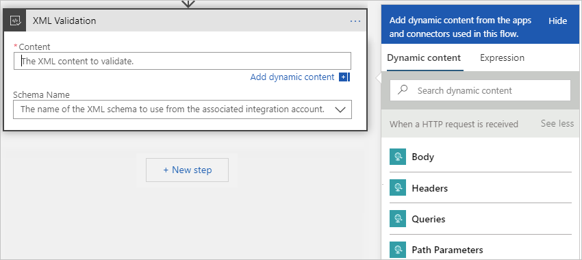
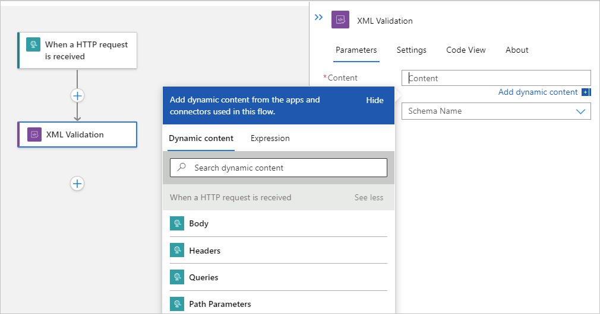

# Validate XML for workflows in Azure Logic Apps

Often in enterprise integration business-to-business (B2B) scenarios, the trading partners in an agreement need to make sure that the messages they exchange are valid before any data processing can start. You can validate documents against a predefined schema by using the **XML Validation** action in Azure Logic Apps.

## Prerequisites

* An Azure account and subscription. If you don't have a subscription yet, [sign up for a free Azure account](https://azure.microsoft.com/free/?WT.mc_id=A261C142F).

* The logic app workflow, blank or existing, where you want to use the **XML Validation** action.

  If you have a blank workflow, use any trigger you want. This example uses the Request trigger.

  If you're new to logic apps, review the following documentation:

  * [What is Azure Logic Apps](logic-apps-overview.md)

  * [Quickstart: Create your first logic app workflow](quickstart-create-first-logic-app-workflow.md)

  * [Create single-tenant logic app workflows](create-single-tenant-workflows-azure-portal.md)

  * [Usage metering, billing, and pricing models for Azure Logic Apps](logic-apps-pricing.md)

* If you're using the **Logic App (Consumption)** resource type, you need to have an [integration account](logic-apps-enterprise-integration-create-integration-account.md) that meets the following requirements:

  * Is associated with the same Azure subscription as your logic app resource.

  * Exists in the same location or Azure region as your logic app resource where you plan to use the **XML Validation** action.

  * Is [linked](logic-apps-enterprise-integration-create-integration-account.md#link-account) to the logic app resource.

  * Contains the [schema](logic-apps-enterprise-integration-schemas.md) to use for validating XML content.

  If you're using the **Logic App (Standard)** resource type, you don't need to link an integration account. However, you still have to add the [schema](logic-apps-enterprise-integration-schemas.md) to use for validating XML content to your logic app resource. You can complete this task on your logic app resource's menu, under **Settings**, in the **Schemas** section.

## Add XML validation action

1. In the [Azure portal](https://portal.azure.com), open your logic app and workflow in designer view.

1. If you have a blank logic app that doesn't have a trigger, add any trigger you want. This example uses the Request trigger. Otherwise, continue to the next step.

   To add the Request trigger, in the designer search box, enter `HTTP request`, and select the Request trigger named **When an HTTP request is received**.

1. Under the step in your workflow where you want to add the **XML Validation** action, choose one of the following steps:

   For a Consumption or ISE plan-based logic app, choose a step:

   * To add the **XML Validation** action at the end of your workflow, select **New step**.

   * To add the **XML Validation** action between existing steps, move your pointer over the arrow that connects those steps so that the plus sign (**+**) appears. Select that plus sign, and then select **Add an action**.

   For a Standard plan-based logic app, choose a step:

   * To add the **XML Validation** action at the end of your workflow, select the plus sign (**+**), and then select **Add an action**.

   * To add the **XML Validation** action between existing steps, select the plus sign (**+**) that appears between those steps, and then select **Add an action**.

1. Under **Choose an operation**, select **Built-in**. In the search box, enter `xml validation`. From the actions list, select **XML Validation**.

1. To specify the XML content for validation, click inside the **Content** box so that the dynamic content list appears.

   The dynamic content list shows property tokens that represent the outputs from the previous steps in the workflow. If the list doesn't show an expected property, check the trigger or action heading in the list and whether you can select **See more**.

   For a Consumption or ISE plan-based logic app, the designer looks like this example:

   

   For a Standard plan-based logic app, the designer looks like this example:

   

1. From the dynamic content list, select the property token for the content you want to validate.

   This example selects the **Body** token from the trigger.

1. To specify the schema to use for validation, open the **Schema Name** list, and select the schema that you previously added.

1. When you're done, make sure to save your logic app workflow.

   You're now finished setting up your **XML Validation** action. In a real world app, you might want to store the validated data in a line-of-business (LOB) app such as SalesForce. To send the validated output to Salesforce, add a Salesforce action.

1. To test your validation action, trigger and run your workflow. For example, for the Request trigger, send a request to the trigger's endpoint URL.

## Next steps

* [Add schemas for XML validation in Azure Logic Apps](logic-apps-enterprise-integration-schemas.md)
* [Transform XML for workflows in Azure Logic Apps](logic-apps-enterprise-integration-transform.md)