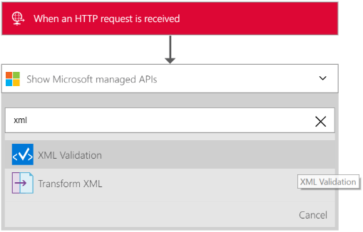

# Validate XML for B2B enterprise integration in Azure Logic Apps with Enterprise Integration Pack

Often in B2B scenarios, the partners in an agreement must make sure that 
the messages they exchange are valid before data processing can start. 
You can validate documents against a predefined schema by using the 
use the XML Validation connector in the Enterprise Integration Pack.

## Validate a document with the XML Validation connector

1. Create a logic app, and 
[link the app to the integration account](../logic-apps/logic-apps-enterprise-integration-accounts.md "Learn to link an integration account to a Logic app") 
that has the schema you want to use for validating XML data.

2. Add a **Request - When an HTTP request is received** 
trigger to your logic app.

	

3. To add the **XML Validation** action, choose **Add an action**.

4. To filter all the actions to the one that you want, 
enter *xml* in the search box. Choose **XML Validation**.

	

5. To specify the XML content that you want to validate, 
select **CONTENT**.

	

6. Select the body tag as the content that you want to validate.

	

7. To specify the schema you want to use for validating 
the previous *content* input, choose **SCHEMA NAME**.

	

8. Save your work  

	

You are now done with setting up your validation connector. 
In a real world application, you might want to store the 
validated data in a line-of-business (LOB) app like SalesForce. 
To send the validated output to Salesforce, add an action.

To test your validation action, make a request to the HTTP endpoint.

## Next steps
[Learn more about the Enterprise Integration Pack](../logic-apps/logic-apps-enterprise-integration-overview.md "Learn about Enterprise Integration Pack")   

