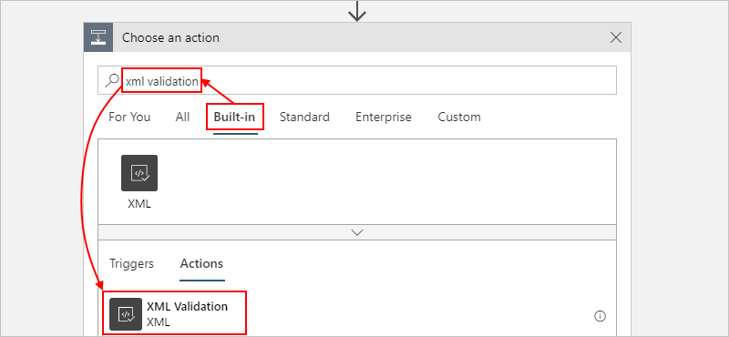
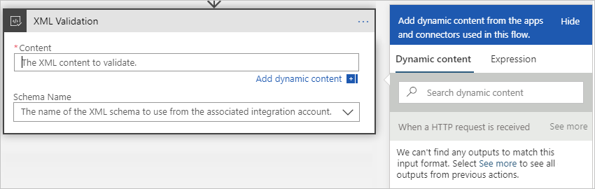
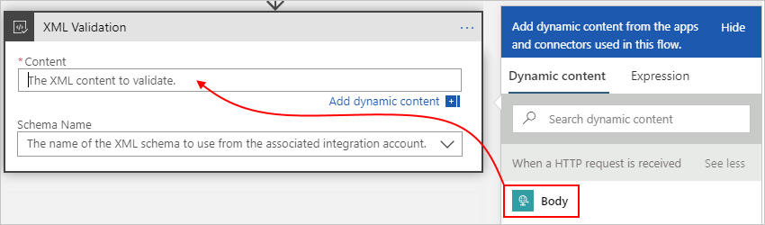
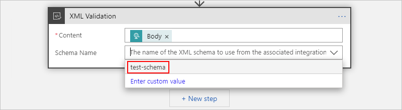

# Validate XML for B2B enterprise integration in Azure Logic Apps with Enterprise Integration Pack

Often in B2B scenarios, the trading partners in an agreement need to make sure that the messages they exchange are valid before any data processing can start. You can validate documents against a predefined schema by using the XML validation action, which is available with the Enterprise Integration Pack.

## Prerequisites

* An Azure subscription. If you don't have a subscription yet, [sign up for a free Azure account](https://azure.microsoft.com/free/).

* A blank or existing logic app where you want to use the XML validation action. If you're new to logic apps, review [What is Azure Logic Apps](../logic-apps/logic-apps-overview.md) and [Quickstart: Create your first logic app](../logic-apps/quickstart-create-first-logic-app-workflow.md).

* An [integration account](../logic-apps/logic-apps-enterprise-integration-create-integration-account.md) that's associated with your Azure subscription, is linked to the logic app where you plan to use the XML validation action, and contains the schema you want to use for validating XML content. Both your logic app and integration account must exist in the same location or Azure region.

## Add XML validation action

1. In the [Azure portal](https://portal.azure.com), open your logic app in the Logic App Designer.

1. If you have a blank logic app, in the Logic App Designer, in the search box, enter `HTTP request` as your filter, and select the **When an HTTP request is received** trigger. Otherwise, continue to the next step.

1. Under the last step in your workflow, select **New step**.

   To add an action between existing steps, move your pointer over the arrow that connects those steps so that the plus sign (**+**) appears. Select that plus sign, and then select **Add an action**.

1. Under **Choose an action**, select **Built-in**. In the search box, enter `xml validation` as your filter. From the actions list, select **XML Validation**.

   

1. To specify the XML content that you want to validate, click inside the **Content** box so that the dynamic content list appears.

   

   The dynamic content list shows property tokens that represent the outputs from the previous steps in the workflow. If the list doesn't show an expected property, check the trigger or action heading whether you can select **See more**.

1. From the dynamic content list, select the property that has the content that you want to validate.

   This example selects the **Body** output from the trigger.

   

1. To specify the schema that you want to use for validation, open the **Schema Name** list and select the validation schema that you added to your linked integration account.

   

1. Save your logic app.

   You're now done setting up your validation. In a real world app, you might want to store the validated data in a line-of-business (LOB) app such as SalesForce. To send the validated output to Salesforce, add an action.

1. To test your validation action, you can send a request to trigger your logic app's workflow.

## Next steps

* Learn more about the [Enterprise Integration Pack](../logic-apps/logic-apps-enterprise-integration-overview.md)