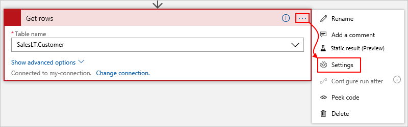
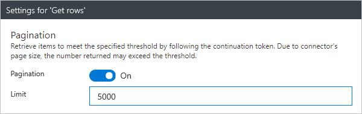

# Get more data, items, or records by using pagination in Azure Logic Apps

[!INCLUDE [logic-apps-sku-consumption](../../includes/logic-apps-sku-consumption.md)]

When you retrieve data, items, or records by using a connector action in 
[Azure Logic Apps](../logic-apps/logic-apps-overview.md), you might get 
result sets so large that the action doesn't return all the results at 
the same time. With some actions, the number of results might exceed the 
connector's default page size. In this case, the action returns only the 
first page of results. For example, the default page size for the SQL Server 
connector's **Get rows** action is 2048, but might vary based on other settings.

Some actions let you turn on a *pagination* setting so that your logic 
app can retrieve more results up to the pagination limit, but return those 
results as a single message when the action finishes. When you use pagination, 
you must specify a *threshold* value, which is the target number of results you 
want the action to return. The action retrieves results until reaching your 
specified threshold. When your total number of items is less than the specified 
threshold, the action retrieves all the results.

Turning on the pagination setting retrieves pages of results based on a connector's page size. 
This behavior means that sometimes, you might get more results than your specified threshold. 
For example, when using the SQL Server **Get rows** action, which supports pagination setting:

* The action's default page size is 2048 records per page.
* Suppose you have 10,000 records and specify 5000 records as the minimum.
* Pagination gets pages of records, so to get at least the specified minimum, 
the action returns 6144 records (3 pages x 2048 records), not 5000 records.

Here's a list with just some of the connectors where you 
can exceed the default page size for specific actions:

* [Azure Blob Storage](/connectors/azureblob/)
* [Dynamics 365](/connectors/dynamicscrmonline/)
* [Excel](/connectors/excel/)
* [HTTP](../connectors/connectors-native-http.md)
* [IBM DB2](/connectors/db2/)
* [Microsoft Teams](/connectors/teams/)
* [Oracle Database](/connectors/oracle/)
* [Salesforce](/connectors/salesforce/)
* [SharePoint](/connectors/sharepointonline/)
* [SQL Server](/connectors/sql/)

## Prerequisites

* An Azure subscription. If you don't have an Azure subscription yet, 
[sign up for a free Azure account](https://azure.microsoft.com/free/).

* The logic app and the action where you want to turn on pagination. For more information, see [Create an example Consumption logic app workflow in multi-tenant Azure Logic Apps](quickstart-create-example-consumption-workflow.md).

## Turn on pagination

To determine whether an action supports pagination in the workflow designer, 
check the action's settings for the **Pagination** setting. This example shows 
how to turn on pagination in the SQL Server's **Get rows** action.

1. In the action's upper-right corner, choose the 
ellipses (**...**) button, and select **Settings**.

   

   If the action supports pagination, 
   the action shows the **Pagination** setting.

1. Change the **Pagination** setting from **Off** to **On**. 
In the **Threshold** property, specify an integer value for 
the target number of results that you want the action to return.

   

1. When you're ready, choose **Done**.

## Workflow definition - pagination

When you turn on pagination for an action that supports this capability, 
your logic app's workflow definition includes the `"paginationPolicy"` 
property along with the `"minimumItemCount"` property in that action's 
`"runtimeConfiguration"` property, for example:

```json
"actions": {
   "HTTP": {
      "inputs": {
         "method": "GET",
         "uri": "https://www.testuri.com"
      },
      "runAfter": {},
      "runtimeConfiguration": {
         "paginationPolicy": {
            "minimumItemCount": 1000
         }
      },
      "type": "Http"
   }
},
```

In this case, the response returns an array that contains JSON objects.

## Get support

For questions, visit the 
[Microsoft Q&A question page for Azure Logic Apps](/answers/topics/azure-logic-apps.html).
