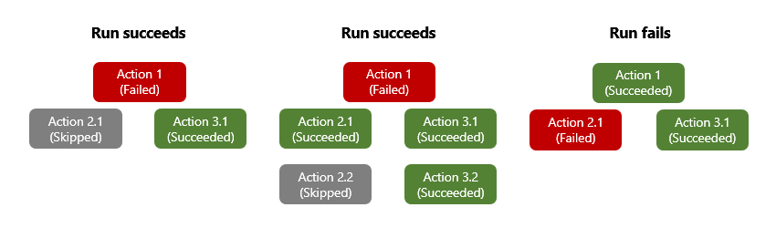
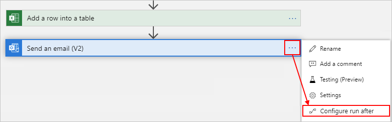
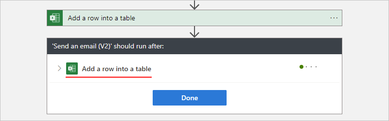
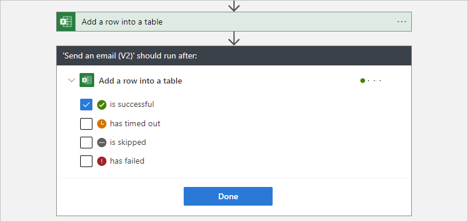
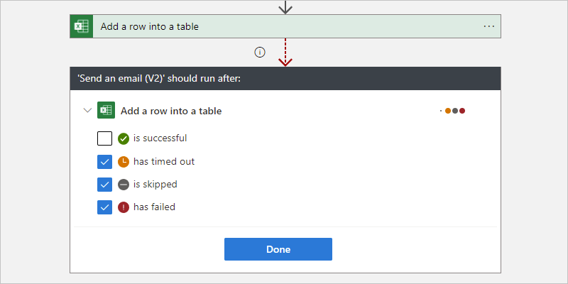
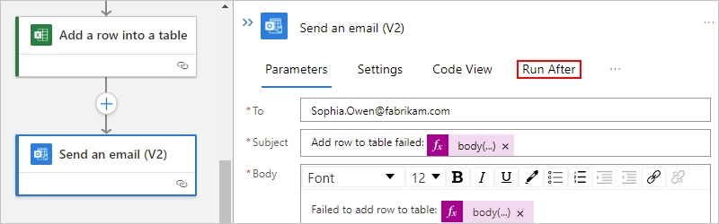
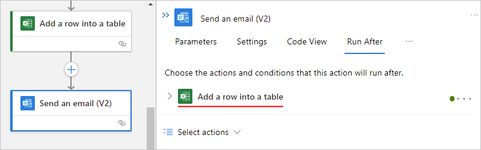
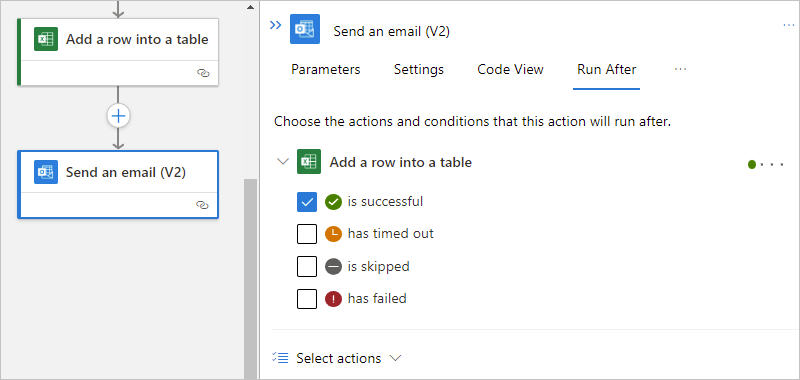
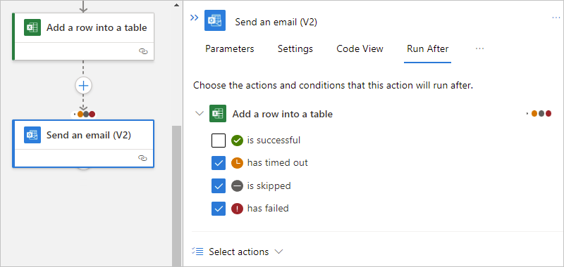
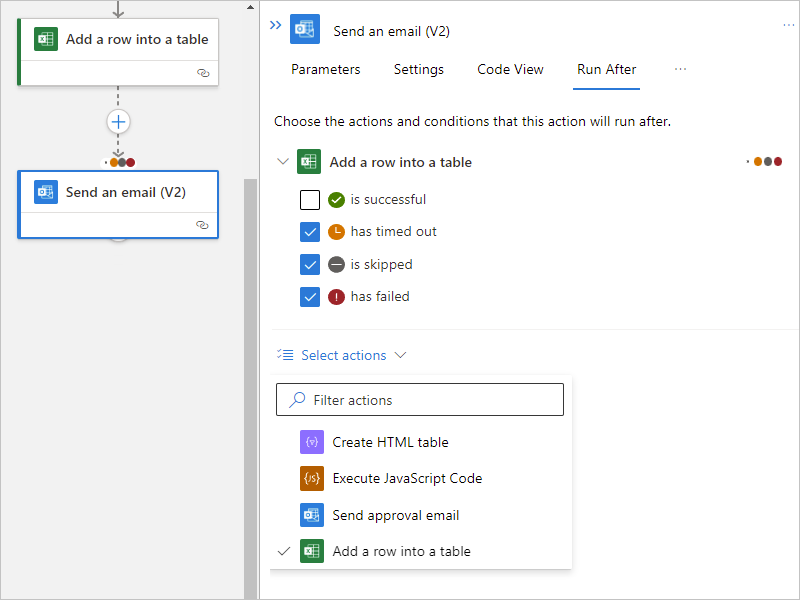

# Handle errors and exceptions in Azure Logic Apps

[!INCLUDE [logic-apps-sku-consumption-standard](../../includes/logic-apps-sku-consumption-standard.md)]

The way that any integration architecture appropriately handles downtime or issues caused by dependent systems can pose a challenge. To help you create robust and resilient integrations that gracefully handle problems and failures, Azure Logic Apps provides a first-class experience for handling errors and exceptions.

<a name="retry-policies"></a>

## Retry policies

For the most basic exception and error handling, you can use the *retry policy* when supported on a trigger or action, such as the [HTTP action](logic-apps-workflow-actions-triggers.md#http-trigger). If the trigger or action's original request times out or fails, resulting in a 408, 429, or 5xx response, the retry policy specifies that the trigger or action resend the request per policy settings.

<a name="retry-policy-limits"></a>

### Retry policy limits

For more information about retry policies, settings, limits, and other options, review [Retry policy limits](logic-apps-limits-and-config.md#retry-policy-limits).

### Retry policy types

Connector operations that support retry policies use the **Default** policy unless you select a different retry policy.

| Retry policy | Description |
|--------------|-------------|
| **Default** | For most operations, the **Default** retry policy is an [exponential interval policy](#exponential-interval) that sends up to 4 retries at *exponentially increasing* intervals. These intervals scale by 7.5 seconds but are capped between 5 and 45 seconds. Several operations use a different **Default** retry policy, such as a [fixed interval policy](#fixed-interval). For more information, review the [Default retry policy type](#default). |
| **None** | Don't resend the request. For more information, review [None - No retry policy](#none). |
| **Exponential Interval** | This policy waits a random interval, which is selected from an exponentially growing range before sending the next request. For more information, review the [exponential interval policy type](#exponential-interval). |
| **Fixed Interval** | This policy waits the specified interval before sending the next request. For more information, review the [fixed interval policy type](#fixed-interval). |

### Change retry policy type in the designer

1. In the [Azure portal](https://portal.azure.com), open your logic app workflow in the designer.

1. Based on whether you're working on a Consumption or Standard workflow, open the trigger or action's **Settings**.

   * **Consumption**: On the action shape, open the ellipses menu (**...**), and select **Settings**.

   * **Standard**: On the designer, select the action. On the details pane, select **Settings**.

1. If the trigger or action supports retry policies, under **Retry Policy**, select the policy type that you want.

### Change retry policy type in the code view editor

1. If necessary, confirm whether the trigger or action supports retry policies by completing the earlier steps in the designer.

1. Open your logic app workflow in the code view editor.

1. In the trigger or action definition, add the `retryPolicy` JSON object to that trigger or action's `inputs` object. Otherwise, if no `retryPolicy` object exists, the trigger or action uses the `default` retry policy.

   ```json
   "inputs": {
      <...>,
      "retryPolicy": {
         "type": "<retry-policy-type>",
         // The following properties apply to specific retry policies.
         "count": <retry-attempts>,
         "interval": "<retry-interval>",
         "maximumInterval": "<maximum-interval>",
         "minimumInterval": "<minimum-interval>"
      },
      <...>
   },
   "runAfter": {}
   ```

   *Required*

   | Property | Value | Type | Description |
   |----------|-------|------|-------------|
   | `type` | <*retry-policy-type*> | String | The retry policy type to use: `default`, `none`, `fixed`, or `exponential` |
   | `count` | <*retry-attempts*> | Integer | For `fixed` and `exponential` policy types, the number of retry attempts, which is a value from 1 - 90. For more information, review [Fixed Interval](#fixed-interval) and [Exponential Interval](#exponential-interval). |
   | `interval`| <*retry-interval*> | String | For `fixed` and `exponential` policy types, the retry interval value in [ISO 8601 format](https://en.wikipedia.org/wiki/ISO_8601#Combined_date_and_time_representations). For the `exponential` policy, you can also specify [optional maximum and minimum intervals](#optional-max-min-intervals). For more information, review [Fixed Interval](#fixed-interval) and [Exponential Interval](#exponential-interval). <br><br>**Consumption**: 5 seconds (`PT5S`) to 1 day (`P1D`). <br>**Standard**: For stateful workflows, 5 seconds (`PT5S`) to 1 day (`P1D`). For stateless workflows, 1 second (`PT1S`) to 1 minute (`PT1M`). |

   <a name="optional-max-min-intervals"></a>

   *Optional*

   | Property | Value | Type | Description |
   |----------|-------|------|-------------|
   | `maximumInterval` | <*maximum-interval*> | String | For the `exponential` policy, the largest interval for the randomly selected interval in [ISO 8601 format](https://en.wikipedia.org/wiki/ISO_8601#Combined_date_and_time_representations). The default value is 1 day (`P1D`). For more information, review [Exponential Interval](#exponential-interval). |
   | `minimumInterval` | <*minimum-interval*> | String | For the `exponential` policy, the smallest interval for the randomly selected interval in [ISO 8601 format](https://en.wikipedia.org/wiki/ISO_8601#Combined_date_and_time_representations). The default value is 5 seconds (`PT5S`). For more information, review [Exponential Interval](#exponential-interval). |

<a name="default"></a>

#### Default retry policy

Connector operations that support retry policies use the **Default** policy unless you select a different retry policy. For most operations, the **Default** retry policy is an exponential interval policy that sends up to 4 retries at *exponentially increasing* intervals. These intervals scale by 7.5 seconds but are capped between 5 and 45 seconds. Several operations use a different **Default** retry policy, such as a fixed interval policy.

In your workflow definition, the trigger or action definition doesn't explicitly define the default policy, but the following example shows how the default retry policy behaves for the HTTP action:

```json
"HTTP": {
   "type": "Http",
   "inputs": {
      "method": "GET",
      "uri": "http://myAPIendpoint/api/action",
      "retryPolicy" : {
         "type": "exponential",
         "interval": "PT7S",
         "count": 4,
         "minimumInterval": "PT5S",
         "maximumInterval": "PT1H"
      }
   },
   "runAfter": {}
}
```

<a name="none"></a>

### None -  No retry policy

To specify that the action or trigger doesn't retry failed requests, set the <*retry-policy-type*> to `none`.

<a name="fixed-interval"></a>

### Fixed interval retry policy

To specify that the action or trigger waits the specified interval before sending the next request, set the <*retry-policy-type*> to `fixed`.

*Example*

This retry policy attempts to get the latest news two more times after the first failed request with a 30-second delay between each attempt:

```json
"Get_latest_news": {
   "type": "Http",
   "inputs": {
      "method": "GET",
      "uri": "https://mynews.example.com/latest",
      "retryPolicy": {
         "type": "fixed",
         "interval": "PT30S",
         "count": 2
      }
   }
}
```

<a name="exponential-interval"></a>

### Exponential interval retry policy

The exponential interval retry policy specifies that the trigger or action waits a random interval before sending the next request. This random interval is selected from an exponentially growing range. Optionally, you can override the default minimum and maximum intervals by specifying your own minimum and maximum intervals, based on whether you have a [Consumption or Standard logic app workflow](logic-apps-overview.md#resource-environment-differences).

| Name | Consumption limit | Standard limit | Notes |
|------|-------------------|----------------|-------|
| Maximum delay | Default: 1 day | Default: 1 hour | To change the default limit in a Consumption logic app workflow, use the [retry policy parameter](logic-apps-exception-handling.md#retry-policies). <p><p>To change the default limit in a Standard logic app workflow, review [Edit host and app settings for logic apps in single-tenant Azure Logic Apps](edit-app-settings-host-settings.md). |
| Minimum delay | Default: 5 sec | Default: 5 sec | To change the default limit in a Consumption logic app workflow, use the [retry policy parameter](logic-apps-exception-handling.md#retry-policies). <p><p>To change the default limit in a Standard logic app workflow, review [Edit host and app settings for logic apps in single-tenant Azure Logic Apps](edit-app-settings-host-settings.md). |

**Random variable ranges**

For the exponential interval retry policy, the following table shows the general algorithm that Azure Logic Apps uses to generate a uniform random variable in the specified range for each retry. The specified range can be up to and including the number of retries.

| Retry number | Minimum interval | Maximum interval |
|--------------|------------------|------------------|
| 1 | max(0, <*minimum-interval*>) | min(interval, <*maximum-interval*>) |
| 2 | max(interval, <*minimum-interval*>) | min(2 * interval, <*maximum-interval*>) |
| 3 | max(2 * interval, <*minimum-interval*>) | min(4 * interval, <*maximum-interval*>) |
| 4 | max(4 * interval, <*minimum-interval*>) | min(8 * interval, <*maximum-interval*>) |
| .... | .... | .... |
||||

<a name="control-run-after-behavior"></a>

## Manage the "run after" behavior

When you add actions in the workflow designer, you implicitly declare the order to use for running those actions. After an action finishes running, that action is marked with a status such as **Succeeded**, **Failed**, **Skipped**, or **TimedOut**. By default, an action that you add in the designer runs only after the predecessor completes with **Succeeded** status. In an action's underlying definition, the `runAfter` property specifies that the predecessor action that must first finish and the statuses permitted for that predecessor before the successor action can run.

When an action throws an unhandled error or exception, the action is marked **Failed**, and any successor action is marked **Skipped**. If this behavior happens for an action that has parallel branches, the Azure Logic Apps engine follows the other branches to determine their completion statuses. For example, if a branch ends with a **Skipped** action, that branch's completion status is based on that skipped action's predecessor status. After the workflow run completes, the engine determines the entire run's status by evaluating all the branch statuses. If any branch ends in failure, the entire workflow run is marked **Failed**.



To make sure that an action can still run despite its predecessor's status, you can change an action's "run after" behavior to handle the predecessor's unsuccessful statuses. That way, the action runs when the predecessor's status is **Succeeded**, **Failed**, **Skipped**, **TimedOut**, or all these statuses.

For example, to run the Office 365 Outlook **Send an email** action after the Excel Online **Add a row into a table** predecessor action is marked **Failed**, rather than **Succeeded**, change the "run after" behavior using either the designer or code view editor.

> [!NOTE]
>
> In the designer, the "run after" setting doesn't apply to the action that immediately 
> follows the trigger as the trigger must run successfully before the first action can run.

<a name="change-run-after-designer"></a>

### Change "run after" behavior in the designer

### [Consumption](#tab/consumption)

1. In the [Azure portal](https://portal.azure.com), open the logic app workflow in the designer.

1. On the action shape, open the ellipses menu (**...**), and select **Configure run after**.

   

   The action shape expands and shows the predecessor action for the currently selected action.

   

1. Expand the predecessor action node to view all the "run after" statuses.

   By default, the "run after" status is set to **is successful**. So, the predecessor action must run successfully before the currently selected action can run.

   

1. Change the "run after" behavior to the status that you want. Make sure that you first select an option before you clear the default option. You have to always have at least one option selected.

   The following example selects **has failed**.

   

1. To specify that the current action runs whether the predecessor action is marked as **Failed**, **Skipped**, or **TimedOut**, select the other statuses.

   

1. When you're ready, select **Done**.

### [Standard](#tab/standard)

1. In the [Azure portal](https://portal.azure.com), open the logic app workflow in the designer.

1. On the designer, select the action shape. On the details pane, select **Run After**.

   

   The **Run After** pane shows the predecessor action for the currently selected action.

   

1. Expand the predecessor action node to view all the "run after" statuses.

   By default, the "run after" status is set to **is successful**. So, the predecessor action must run successfully before the currently selected action can run.

   

1. Change the "run after" behavior to the status that you want. Make sure that you first select an option before you clear the default option. You have to always have at least one option selected.

   The following example selects **has failed**.

   

1. To specify that the current action runs whether the predecessor action is marked as **Failed**, **Skipped**, or **TimedOut**, select the other statuses.

   

1. To require that more than one predecessor action runs, each with their own "run after" statuses, expand the **Select actions** list. Select the predecessor actions that you want, and specify their required "run after" statuses.

   

1. When you're ready, select **Done**.

---

### Change "run after" behavior in the code view editor

1. In the [Azure portal](https://portal.azure.com), open your logic app workflow in the code view editor.

1. In the action's JSON definition, edit the `runAfter` property, which has the following syntax:

   ```json
   "<action-name>": {
      "inputs": {
         "<action-specific-inputs>"
      },
      "runAfter": {
         "<preceding-action>": [
            "Succeeded"
         ]
      },
      "type": "<action-type>"
   }
   ```

1. For this example, change the `runAfter` property from `Succeeded` to `Failed`:

   ```json
   "Send_an_email_(V2)": {
      "inputs": {
         "body": {
            "Body": "<p>Failed to add row to table: @{body('Add_a_row_into_a_table')?['Terms']}</p>",
            "Subject": "Add row to table failed: @{body('Add_a_row_into_a_table')?['Terms']}",
            "To": "Sophia.Owen@fabrikam.com"
         },
         "host": {
            "connection": {
               "name": "@parameters('$connections')['office365']['connectionId']"
            }
         },
         "method": "post",
         "path": "/v2/Mail"
      },
      "runAfter": {
         "Add_a_row_into_a_table": [
            "Failed"
         ]
      },
      "type": "ApiConnection"
   }
   ```

1. To specify that the action runs whether the predecessor action is marked as `Failed`, `Skipped` or `TimedOut`, add the other statuses:

   ```json
   "runAfter": {
      "Add_a_row_into_a_table": [
         "Failed", "Skipped", "TimedOut"
      ]
   },
   ```

<a name="scopes"></a>

## Evaluate actions with scopes and their results

Similar to running steps after individual actions with the "run after" setting, you can group actions together inside a [scope](logic-apps-control-flow-run-steps-group-scopes.md). You can use scopes when you want to logically group actions together, assess the scope's aggregate status, and perform actions based on that status. After all the actions in a scope finish running, the scope itself gets its own status.

To check a scope's status, you can use the same criteria that you use to check a workflow run status, such as **Succeeded**, **Failed**, and so on.

By default, when all the scope's actions succeed, the scope's status is marked **Succeeded**. If the final action in a scope is marked **Failed** or **Aborted**, the scope's status is marked **Failed**.

To catch exceptions in a **Failed** scope and run actions that handle those errors, you can use the "run after" setting that **Failed** scope. That way, if *any* actions in the scope fail, and you use the "run after" setting for that scope, you can create a single action to catch failures.

For limits on scopes, see [Limits and config](logic-apps-limits-and-config.md).

<a name="get-results-from-failures"></a>

### Get context and results for failures

Although catching failures from a scope is useful, you might also want more context to help you learn the exact failed actions plus any errors or status codes. The [`result()` function](workflow-definition-language-functions-reference.md#result) returns the results from the top-level actions in a scoped action. This function accepts the scope's name as a single parameter, and returns an array with the results from those top-level actions. These action objects have the same attributes as the attributes returned by the `actions()` function, such as the action's start time, end time, status, inputs, correlation IDs, and outputs. 

> [!NOTE]
>
> The `result()` function returns the results *only* from the top-level actions 
> and not from deeper nested actions such as switch or condition actions.

To get context about the actions that failed in a scope, you can use the `@result()` expression with the scope's name and the "run after" setting. To filter down the returned array to actions that have **Failed** status, you can add the [**Filter Array** action](logic-apps-perform-data-operations.md#filter-array-action). To run an action for a returned failed action, take the returned filtered array and use a [**For each** loop](logic-apps-control-flow-loops.md).

The following JSON example sends an HTTP POST request with the response body for any actions that failed within the scope action named **My_Scope**. A detailed explanation follows the example.

```json
"Filter_array": {
   "type": "Query",
   "inputs": {
      "from": "@result('My_Scope')",
      "where": "@equals(item()['status'], 'Failed')"
   },
   "runAfter": {
      "My_Scope": [
         "Failed"
      ]
    }
},
"For_each": {
   "type": "foreach",
   "actions": {
      "Log_exception": {
         "type": "Http",
         "inputs": {
            "method": "POST",
            "body": "@item()['outputs']['body']",
            "headers": {
               "x-failed-action-name": "@item()['name']",
               "x-failed-tracking-id": "@item()['clientTrackingId']"
            },
            "uri": "http://requestb.in/"
         },
         "runAfter": {}
      }
   },
   "foreach": "@body('Filter_array')",
   "runAfter": {
      "Filter_array": [
         "Succeeded"
      ]
   }
}
```

The following steps describe what happens in this example:

1. To get the result from all actions inside **My_Scope**, the **Filter Array** action uses this filter expression: `@result('My_Scope')`

1. The condition for **Filter Array** is any `@result()` item that has a status equal to `Failed`. This condition filters the array that has all the action results from **My_Scope** down to an array with only the failed action results.

1. Perform a `For_each` loop action on the *filtered array* outputs. This step performs an action for each failed action result that was previously filtered.

   If a single action in the scope fails, the actions in the `For_each` loop run only once. Multiple failed actions cause one action per failure.

1. Send an HTTP POST on the `For_each` item response body, which is the `@item()['outputs']['body']` expression.

   The `@result()` item shape is the same as the `@actions()` shape and can be parsed the same way.

1. Include two custom headers with the failed action name (`@item()['name']`) and the failed run client tracking ID (`@item()['clientTrackingId']`).

For reference, here's an example of a single `@result()` item, showing the `name`, `body`, and `clientTrackingId` properties that are parsed in the previous example. Outside a `For_each` action, `@result()` returns an array of these objects.

```json
{
   "name": "Example_Action_That_Failed",
   "inputs": {
      "uri": "https://myfailedaction.azurewebsites.net",
      "method": "POST"
   },
   "outputs": {
      "statusCode": 404,
      "headers": {
         "Date": "Thu, 11 Aug 2016 03:18:18 GMT",
         "Server": "Microsoft-IIS/8.0",
         "X-Powered-By": "ASP.NET",
         "Content-Length": "68",
         "Content-Type": "application/json"
      },
      "body": {
         "code": "ResourceNotFound",
         "message": "/docs/folder-name/resource-name does not exist"
      }
   },
   "startTime": "2016-08-11T03:18:19.7755341Z",
   "endTime": "2016-08-11T03:18:20.2598835Z",
   "trackingId": "bdd82e28-ba2c-4160-a700-e3a8f1a38e22",
   "clientTrackingId": "08587307213861835591296330354",
   "code": "NotFound",
   "status": "Failed"
}
```

To perform different exception handling patterns, you can use the expressions previously described in this article. You might choose to execute a single exception handling action outside the scope that accepts the entire filtered array of failures, and remove the `For_each` action. You can also include other useful properties from the `\@result()` response as previously described.

## Set up Azure Monitor logs

The previous patterns are useful ways to handle errors and exceptions that happen within a run. However, you can also identify and respond to errors that happen independently from the run. To evaluate run statuses, you can monitor the logs and metrics for your runs, or publish them into any monitoring tool that you prefer.

For example, [Azure Monitor](../azure-monitor/overview.md) provides a streamlined way to send all workflow events, including all run and action statuses, to a destination. You can [set up alerts for specific metrics and thresholds in Azure Monitor](monitor-logic-apps.md#set-up-monitoring-alerts). You can also send workflow events to a [Log Analytics workspace](../azure-monitor/logs/data-platform-logs.md) or [Azure storage account](../storage/blobs/storage-blobs-overview.md). Or, you can stream all events through [Azure Event Hubs](../event-hubs/event-hubs-about.md) into [Azure Stream Analytics](https://azure.microsoft.com/services/stream-analytics/). In Stream Analytics, you can write live queries based on any anomalies, averages, or failures from the diagnostic logs. You can use Stream Analytics to send information to other data sources, such as queues, topics, SQL, Azure Cosmos DB, or Power BI.

For more information, review [Set up Azure Monitor logs and collect diagnostics data for Azure Logic Apps](monitor-workflows-collect-diagnostic-data.md).

## Next steps

* [Learn more about Azure Logic Apps examples and scenarios](logic-apps-examples-and-scenarios.md)
