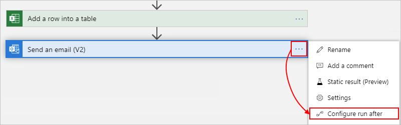
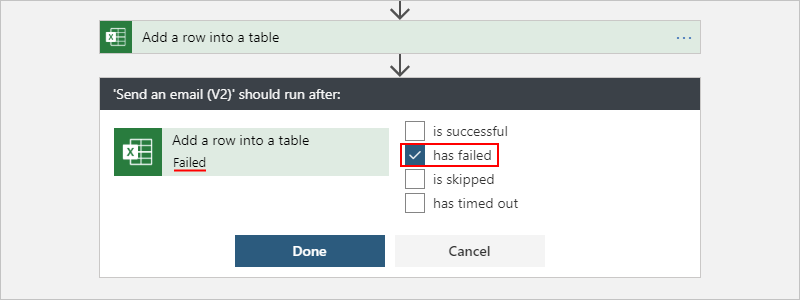
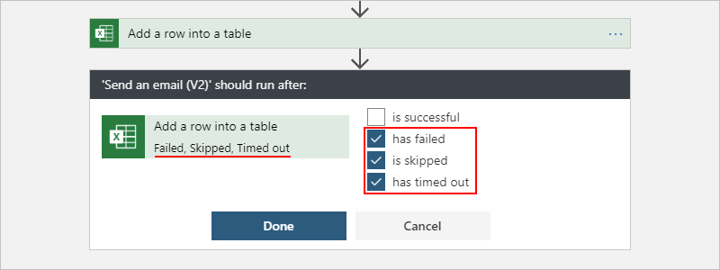

# Handle errors and exceptions in Azure Logic Apps

The way that any integration architecture appropriately handles downtime or issues caused by dependent systems can pose a challenge. To help you create robust and resilient integrations that gracefully handle problems and failures, Logic Apps provides a first-class experience for handling errors and exceptions.

<a name="retry-policies"></a>

## Retry policies

For the most basic exception and error handling, you can use a *retry policy* in any action or trigger where supported, for example, see [HTTP action](../logic-apps/logic-apps-workflow-actions-triggers.md#http-trigger). A retry policy specifies whether and how the action or trigger retries a request when the original request times out or fails, which is any request that results in a 408, 429, or 5xx response. If no other retry policy is used, the default policy is used.

Here are the retry policy types:

| Type | Description |
|------|-------------|
| **Default** | This policy sends up to four retries at *exponentially increasing* intervals, which scale by 7.5 seconds but are capped between 5 and 45 seconds. |
| **Exponential interval**  | This policy waits a random interval selected from an exponentially growing range before sending the next request. |
| **Fixed interval**  | This policy waits the specified interval before sending the next request. |
| **None**  | Don't resend the request. |
|||

For information about retry policy limits, see [Logic Apps limits and configuration](../logic-apps/logic-apps-limits-and-config.md#request-limits).

### Change retry policy

To select a different retry policy, follow these steps:

1. Open your logic app in Logic App Designer.

1. Open the **Settings** for an action or trigger.

1. If the action or trigger supports retry policies, under **Retry Policy**, select the type you want.

Or, you can manually specify the retry policy in the `inputs` section for an action or trigger that supports retry policies. If you don't specify a retry policy, the action uses the default policy.

```json
"<action-name>": {
   "type": "<action-type>",
   "inputs": {
      "<action-specific-inputs>",
      "retryPolicy": {
         "type": "<retry-policy-type>",
         "interval": "<retry-interval>",
         "count": <retry-attempts>,
         "minimumInterval": "<minimum-interval>",
         "maximumInterval": "<maximum-interval>"
      },
      "<other-action-specific-inputs>"
   },
   "runAfter": {}
}
```

*Required*

| Value | Type | Description |
|-------|------|-------------|
| <*retry-policy-type*> | String | The retry policy type you want to use: `default`, `none`, `fixed`, or `exponential` |
| <*retry-interval*> | String | The retry interval where the value must use [ISO 8601 format](https://en.wikipedia.org/wiki/ISO_8601#Combined_date_and_time_representations). The default minimum interval is `PT5S` and the maximum interval is `PT1D`. When you use the exponential interval policy, you can specify different minimum and maximum values. |
| <*retry-attempts*> | Integer | The number of retry attempts, which must be between 1 and 90 |
||||

*Optional*

| Value | Type | Description |
|-------|------|-------------|
| <*minimum-interval*> | String | For the exponential interval policy, the smallest interval for the randomly selected interval in [ISO 8601 format](https://en.wikipedia.org/wiki/ISO_8601#Combined_date_and_time_representations) |
| <*maximum-interval*> | String | For the exponential interval policy, the largest interval for the randomly selected interval in [ISO 8601 format](https://en.wikipedia.org/wiki/ISO_8601#Combined_date_and_time_representations) |
||||

Here is more information about the different policy types.

<a name="default-retry"></a>

### Default

If you don't specify a retry policy, the action uses the default policy, which is actually an [exponential interval policy](#exponential-interval) that sends up to four retries at exponentially increasing intervals that are scaled by 7.5 seconds. The interval is capped between 5 and 45 seconds.

Though not explicitly defined in your action or trigger, here is how the default policy behaves in an example HTTP action:

```json
"HTTP": {
   "type": "Http",
   "inputs": {
      "method": "GET",
      "uri": "http://myAPIendpoint/api/action",
      "retryPolicy" : {
         "type": "exponential",
         "interval": "PT7S",
         "count": 4,
         "minimumInterval": "PT5S",
         "maximumInterval": "PT1H"
      }
   },
   "runAfter": {}
}
```

### None

To specify that the action or trigger doesn't retry failed requests, set the <*retry-policy-type*> to `none`.

### Fixed interval

To specify that the action or trigger waits the specified interval before sending the next request, set the <*retry-policy-type*> to `fixed`.

*Example*

This retry policy attempts to get the latest news two more times after the first failed request with a 30-second delay between each attempt:

```json
"Get_latest_news": {
   "type": "Http",
   "inputs": {
      "method": "GET",
      "uri": "https://mynews.example.com/latest",
      "retryPolicy": {
         "type": "fixed",
         "interval": "PT30S",
         "count": 2
      }
   }
}
```

<a name="exponential-interval"></a>

### Exponential interval

To specify that the action or trigger waits a random interval before sending the next request, set the <*retry-policy-type*> to `exponential`. The random interval is selected from an exponentially growing range. Optionally, you can also override the default minimum and maximum intervals by specifying your own minimum and maximum intervals.

**Random variable ranges**

This table shows how Logic Apps generates a uniform random variable in the specified range for each retry up to and including the number of retries:

| Retry number | Minimum interval | Maximum interval |
|--------------|------------------|------------------|
| 1 | max(0, <*minimum-interval*>) | min(interval, <*maximum-interval*>) |
| 2 | max(interval, <*minimum-interval*>) | min(2 * interval, <*maximum-interval*>) |
| 3 | max(2 * interval, <*minimum-interval*>) | min(4 * interval, <*maximum-interval*>) |
| 4 | max(4 * interval, <*minimum-interval*>) | min(8 * interval, <*maximum-interval*>) |
| .... | .... | .... |
||||

<a name="control-run-after-behavior"></a>

## Catch and handle failures by changing "run after" behavior

When you add actions in the Logic App Designer, you implicitly declare the order to use for running those actions. After an action finishes running, that action is marked with a status such as `Succeeded`, `Failed`, `Skipped`, or `TimedOut`. In each action definition, the `runAfter` property specifies the predecessor action that must first finish and the statuses permitted for that predecessor before the successor action can run. By default, an action that you add in the designer runs only after the predecessor completes with `Succeeded` status.

When an action throws an unhandled error or exception, the action is marked `Failed`, and any successor action is marked `Skipped`. If this behavior happens for an action that has parallel branches, the Logic Apps engine follows the other branches to determine their completion statuses. For example, if a branch ends with a `Skipped` action, that branch's completion status is based on that skipped action's predecessor status. After the logic app run completes, the engine determines the entire run's status by evaluating all the branch statuses. If any branch ends in failure, the entire logic app run is marked `Failed`.


To make sure that an action can still run despite its predecessor's status, [customize an action's "run after" behavior](#customize-run-after) to handle the predecessor's unsuccessful statuses.

<a name="customize-run-after"></a>

### Customize "run after" behavior

You can customize an action's "run after" behavior so that the action runs when the predecessor's status is either `Succeeded`, `Failed`, `Skipped`, `TimedOut`, or any of these statuses. For example, to send an email after the Excel Online `Add_a_row_into_a_table` predecessor action is marked `Failed`, rather than `Succeeded`, change the "run after" behavior by following either step:

* In the design view, select the ellipses (**...**) button, and then select **Configure run after**.

  

  The action shape shows the default status that's required for the predecessor action, which is **Add a row into a table** in this example:

  

  Change the "run after" behavior to the status that you want, which is **has failed** in this example:

  

  To specify that the action runs whether the predecessor action is marked as `Failed`, `Skipped` or `TimedOut`, select the other statuses:

  

* In code view, in the action's JSON definition, edit the `runAfter` property, which follows this syntax:

  ```json
  "<action-name>": {
     "inputs": {
        "<action-specific-inputs>"
     },
     "runAfter": {
        "<preceding-action>": [
           "Succeeded"
        ]
     },
     "type": "<action-type>"
  }
  ```

  For this example, change the `runAfter` property from `Succeeded` to `Failed`:

  ```json
  "Send_an_email_(V2)": {
     "inputs": {
        "body": {
           "Body": "<p>Failed to&nbsp;add row to &nbsp;@{body('Add_a_row_into_a_table')?['Terms']}</p>",,
           "Subject": "Add row to table failed: @{body('Add_a_row_into_a_table')?['Terms']}",
           "To": "Sophia.Owen@fabrikam.com"
        },
        "host": {
           "connection": {
              "name": "@parameters('$connections')['office365']['connectionId']"
           }
        },
        "method": "post",
        "path": "/v2/Mail"
     },
     "runAfter": {
        "Add_a_row_into_a_table": [
           "Failed"
        ]
     },
     "type": "ApiConnection"
  }
  ```

  To specify that the action runs whether the predecessor action is marked as `Failed`, `Skipped` or `TimedOut`, add the other statuses:

  ```json
  "runAfter": {
     "Add_a_row_into_a_table": [
        "Failed", "Skipped", "TimedOut"
     ]
  },
  ```

<a name="scopes"></a>

## Evaluate actions with scopes and their results

Similar to running steps after individual actions with the `runAfter` property, you can group actions together inside a [scope](../logic-apps/logic-apps-control-flow-run-steps-group-scopes.md). You can use scopes when you want to logically group actions together, assess the scope's aggregate status, and perform actions based on that status. After all the actions in a scope finish running, the scope itself gets its own status.

To check a scope's status, you can use the same criteria that you use to check a logic app's run status, such as `Succeeded`, `Failed`, and so on.

By default, when all the scope's actions succeed, the scope's status is marked `Succeeded`. If the final action in a scope results as `Failed` or `Aborted`, the scope's status is marked `Failed`.

To catch exceptions in a `Failed` scope and run actions that handle those errors, you can use the `runAfter` property for that `Failed` scope. That way, if *any* actions in the scope fail, and you use the `runAfter` property for that scope, you can create a single action to catch failures.

For limits on scopes, see [Limits and config](../logic-apps/logic-apps-limits-and-config.md).

<a name="get-results-from-failures"></a>

### Get context and results for failures

Although catching failures from a scope is useful, you might also want context to help you understand exactly which actions failed plus any errors or status codes that were returned.

The [`result()`](../logic-apps/workflow-definition-language-functions-reference.md#result) function provides context about the results from all the actions in a scope. The `result()` function accepts a single parameter, which is the scope's name, and returns an array that contains all the action results from within that scope. These action objects include the same attributes as the `actions()` object, such as the action's start time, end time, status, inputs, correlation IDs, and outputs. To send context for any actions that failed within a scope, you can easily pair a `@result()` expression with the `runAfter` property.

To run an action for each action in a scope that has a `Failed` result, and to filter the array of results down to the failed actions, you can pair a `@result()` expression with a [**Filter Array**](logic-apps-perform-data-operations.md#filter-array-action) action and a [**For each**](../logic-apps/logic-apps-control-flow-loops.md) loop. You can take the filtered result array and perform an action for each failure using the `For_each` loop.

Here's an example, followed by a detailed explanation, that sends an HTTP POST request with the response body for any actions that failed within the scope "My_Scope":

```json
"Filter_array": {
   "type": "Query",
   "inputs": {
      "from": "@result('My_Scope')",
      "where": "@equals(item()['status'], 'Failed')"
   },
   "runAfter": {
      "My_Scope": [
         "Failed"
      ]
    }
},
"For_each": {
   "type": "foreach",
   "actions": {
      "Log_exception": {
         "type": "Http",
         "inputs": {
            "method": "POST",
            "body": "@item()['outputs']['body']",
            "headers": {
               "x-failed-action-name": "@item()['name']",
               "x-failed-tracking-id": "@item()['clientTrackingId']"
            },
            "uri": "http://requestb.in/"
         },
         "runAfter": {}
      }
   },
   "foreach": "@body('Filter_array')",
   "runAfter": {
      "Filter_array": [
         "Succeeded"
      ]
   }
}
```

Here's a detailed walkthrough that describes what happens in this example:

1. To get the result from all actions inside "My_Scope", the **Filter Array** action uses this filter expression: `@result('My_Scope')`

1. The condition for **Filter Array** is any `@result()` item that has a status equal to `Failed`. This condition filters the array that has all the action results from "My_Scope" down to an array with only the failed action results.

1. Perform a `For_each` loop action on the *filtered array* outputs. This step performs an action for each failed action result that was previously filtered.

   If a single action in the scope fails, the actions in the `For_each` loop run only once. Multiple failed actions cause one action per failure.

1. Send an HTTP POST on the `For_each` item response body, which is the `@item()['outputs']['body']` expression.

   The `@result()` item shape is the same as the `@actions()` shape and can be parsed the same way.

1. Include two custom headers with the failed action name (`@item()['name']`) and the failed run client tracking ID (`@item()['clientTrackingId']`).

For reference, here's an example of a single `@result()` item, showing the `name`, `body`, and `clientTrackingId` properties that are parsed in the previous example. Outside a `For_each` action, `@result()` returns an array of these objects.

```json
{
   "name": "Example_Action_That_Failed",
   "inputs": {
      "uri": "https://myfailedaction.azurewebsites.net",
      "method": "POST"
   },
   "outputs": {
      "statusCode": 404,
      "headers": {
         "Date": "Thu, 11 Aug 2016 03:18:18 GMT",
         "Server": "Microsoft-IIS/8.0",
         "X-Powered-By": "ASP.NET",
         "Content-Length": "68",
         "Content-Type": "application/json"
      },
      "body": {
         "code": "ResourceNotFound",
         "message": "/docs/folder-name/resource-name does not exist"
      }
   },
   "startTime": "2016-08-11T03:18:19.7755341Z",
   "endTime": "2016-08-11T03:18:20.2598835Z",
   "trackingId": "bdd82e28-ba2c-4160-a700-e3a8f1a38e22",
   "clientTrackingId": "08587307213861835591296330354",
   "code": "NotFound",
   "status": "Failed"
}
```

To perform different exception handling patterns, you can use the expressions previously described in this article. You might choose to execute a single exception handling action outside the scope that accepts the entire filtered array of failures, and remove the `For_each` action. You can also include other useful properties from the `\@result()` response as previously described.

## Azure Diagnostics and metrics

The previous patterns are great way to handle errors and exceptions within a run, but you can also identify and respond to errors independent of the run itself. [Azure Diagnostics](../logic-apps/logic-apps-monitor-your-logic-apps.md) provides a simple way to send all workflow events, including all run and action statuses, to an Azure Storage account or an event hub created with [Azure Event Hubs](../event-hubs/event-hubs-about.md).

To evaluate run statuses, you can monitor the logs and metrics, or publish them into any monitoring tool that you prefer. One potential option is to stream all the events through Event Hubs into [Azure Stream Analytics](https://azure.microsoft.com/services/stream-analytics/). In Stream Analytics, you can write live queries based on any anomalies, averages, or failures from the diagnostic logs. You can use Stream Analytics to send information to other data sources, such as queues, topics, SQL, Azure Cosmos DB, or Power BI.

## Next steps

* [See how a customer builds error handling with Azure Logic Apps](../logic-apps/logic-apps-scenario-error-and-exception-handling.md)
* [Find more Logic Apps examples and scenarios](../logic-apps/logic-apps-examples-and-scenarios.md)
