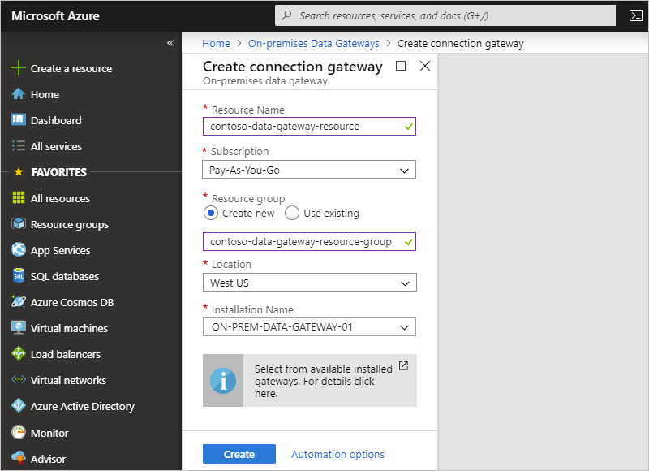

# Connect to on-premises data sources from Azure Logic Apps

To access data sources on premises from your logic apps, create an on-premises data gateway resource in the Azure portal. Your logic apps can then use the [on-premises connectors](../logic-apps/logic-apps-gateway-install.md#supported-connections). This article shows how to create your Azure gateway resource *after* you [download and install the gateway on your local computer](../logic-apps/logic-apps-gateway-install.md). To learn more about how the gateway works, see [How the gateway works](../logic-apps/logic-apps-gateway-install.md#gateway-cloud-service).

> [!TIP]
> To connect to Azure virtual networks, consider creating an 
> [*integration service environment*](../logic-apps/connect-virtual-network-vnet-isolated-environment-overview.md) instead. 

For information about how to use the gateway with other services, see these articles:

* [Microsoft Power BI on-premises data gateway](https://powerbi.microsoft.com/documentation/powerbi-gateway-onprem/)
* [Microsoft Flow on-premises data gateway](https://flow.microsoft.com/documentation/gateway-manage/)
* [Microsoft PowerApps on-premises data gateway](https://powerapps.microsoft.com/tutorials/gateway-management/)
* [Azure Analysis Services on-premises data gateway](../analysis-services/analysis-services-gateway.md)

## Prerequisites

* You've already [installed the on-premises data gateway on a local computer](../logic-apps/logic-apps-gateway-install.md).

* You have the [same Azure account and Azure subscription](../logic-apps/logic-apps-gateway-install.md#requirements) that you used when you installed the on-premises data gateway.

* You haven't previously linked your gateway installation to another gateway resource in Azure.

  When you create a gateway resource, you select a gateway installation to associate with your gateway resource. An already linked gateway installation isn't available for you to select when creating gateway resources.

## Create Azure gateway resource

After you install the gateway on a local computer, create the Azure resource for your gateway. 

1. Sign in to the [Azure portal](https://portal.azure.com) with the same Azure account that was used to install the gateway.

1. In the Azure portal search box, enter "on-premises data gateway", and select **On-premises Data Gateways**.

   

1. Under **On-premises Data Gateways**, select **Add**.

   

1. Under **Create connection gateway**, provide this information for your gateway resource. When you're done, select **Create**.

   | Property | Description |
   |----------|-------------|
   | **Resource Name** | Your gateway resource name, which can contain only letters, numbers, hyphens (`-`), underscores (`_`), parentheses (`(`, `)`), and periods (`.`). |
   | **Subscription** | Your Azure subscription, which must be the same as gateway installation and logic app. The default subscription is based on the Azure account that you used to sign in. |
   | **Resource group** | The [Azure resource group](../azure-resource-manager/resource-group-overview.md) that you want to use |
   | **Location** | The same region as the location that was selected for the gateway cloud service during [gateway installation](../logic-apps/logic-apps-gateway-install.md). Otherwise, your gateway installation won't appear in the **Installation Name** list for you to select. Your logic app location can differ from your gateway resource location. |
   | **Installation Name** | If your gateway installation isn't already selected, select the gateway that you previously installed. Previously linked gateway installations won't appear in this list for you to select. |
   |||

   Here is an example:

   

## Connect to on-premises data

After you create your gateway resource and associate your Azure subscription with this resource, you can now create a connection between your logic app and your on-premises data source by using the gateway.

1. In the Azure portal, create or open your logic app in the Logic App Designer.

1. Add a connector that supports on-premises connections, for example, **SQL Server**.

1. Select **Connect via on-premises data gateway**. 

1. For **Gateways**, select the gateway resource that you created.

   > [!NOTE]
   > The gateways list includes gateway resources in other regions because your 
   > logic app's location can differ from your gateway resource's location.

1. Provide a unique connection name and other required information, which depends on the connection that you want to create.

   A unique connection name helps you easily find that connection later, especially if you create multiple connections. If applicable, also include the qualified domain for your username.
   
   Here is an example:

   

1. When you're done, select **Create**. 

Your gateway connection is now ready for your logic app to use.

## Edit connection

To update the settings for a gateway connection, you can edit your connection.

1. To find all API connections for just your logic app, on your logic app's menu, under **Development Tools**, select **API connections**.
   
   

1. Select the gateway connection you want, and then select **Edit API connection**.

   > [!TIP]
   > If your updates don't take effect, 
   > try [stopping and restarting the gateway Windows service account](../logic-apps/logic-apps-gateway-install.md#restart-gateway) for your gateway installation.

To find all API connections associated with your Azure subscription: 

* From the main Azure menu, go to **All services** > **Web** > **API Connections**.
* Or, from the main Azure menu, go to **All resources**. Set the **Type** filter to **API Connection**.

## Delete gateway resource

To create a different gateway resource, link your gateway installation to a different gateway resource, or remove the gateway resource, you can delete the gateway resource without affecting the gateway installation. 

1. From the main Azure menu, select **All resources**. Find and select your gateway resource.

1. If not already selected, on your gateway resource menu, select **On-premises Data Gateway**. On the gateway resource toolbar, select **Delete**.

   For example:

   

## Frequently asked questions

[!INCLUDE [existing-gateway-location-changed](../../includes/logic-apps-existing-gateway-location-changed.md)]

## Next steps

* [Secure your logic apps](./logic-apps-securing-a-logic-app.md)
* [Common examples and scenarios for logic apps](./logic-apps-examples-and-scenarios.md)
