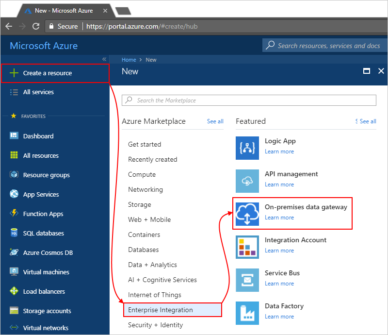
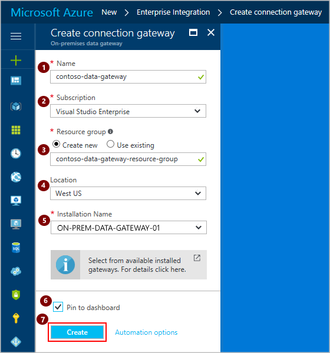
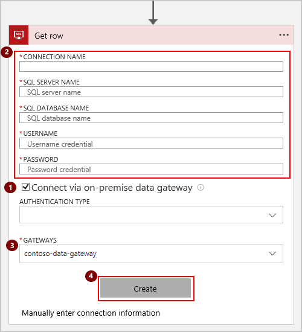
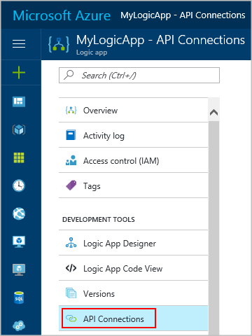
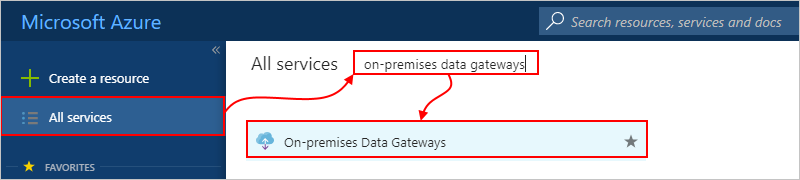

# Access data sources on premises from logic apps with the on-premises data gateway

To access data sources on premises from your logic apps, 
set up an on-premises data gateway that logic apps 
can use with supported connectors. 
The gateway acts as a bridge that provides quick data transfer 
and encryption between data sources on premises and your logic apps. 
The gateway relays data from on-premises sources 
on encrypted channels through the Azure Service Bus. 
All traffic originates as secure outbound traffic from the gateway agent. 
Learn more about [how the data gateway works](logic-apps-gateway-install.md#gateway-cloud-service). 

The gateway supports connections to these data sources on premises:

*   BizTalk Server
*   DB2  
*   File System
*   Informix
*   MQ
*   MySQL
*   Oracle Database
*   PostgreSQL
*   SAP Application Server 
*   SAP Message Server
*   SharePoint for HTTP only, not HTTPS
*   SQL Server
*   Teradata

These steps show how to set up the 
on-premises data gateway to work with your logic apps. 
For more information about supported connectors, see 
[Connectors for Azure Logic Apps](../connectors/apis-list.md).

## Requirements

* You must have already 
[installed the data gateway on a local computer](logic-apps-gateway-install.md).

* You need the Azure account that has the work or school email address used 
to [install the on-premises data gateway](logic-apps-gateway-install.md#requirements).

* Your gateway installation can't be already claimed by another Azure gateway resource. 
You can associate your gateway installation only to one gateway resource. 
Claim happens when you create the gateway resource so that the installation 
is unavailable for other resources.

## Set up the data gateway connection

### 1. Install the on-premises data gateway

If you haven't already, follow the 
[steps to install the on-premises data gateway](logic-apps-gateway-install.md). 
Before you continue with the other steps, 
make sure that you installed the data gateway on a local computer.

### 2. Create an Azure resource for the on-premises data gateway

After you install the gateway on a local computer, 
you must create your connection gateway as a resource in Azure. 
This step also associates your gateway resource with your Azure subscription.

1. Sign in to the [Azure portal](https://portal.azure.com "Azure portal"). 
Make sure to use the same Azure work or school email address used to install the gateway.

2. On the left menu in Azure, 
choose **New** > **Enterprise Integration** > **On-premises data gateway** as shown here:

   

3. On the **Create connection gateway** blade, 
provide these details to create your data gateway resource:

   * **Name**: Enter a name for your gateway resource. 

   * **Subscription**: Select the Azure subscription 
   to associate with your gateway resource. 
   This subscription should be the same subscription as your logic app.
   
      The default subscription is based on the 
      Azure account that you used to sign in.

   * **Resource group**: Create a resource group or select an existing 
   resource group for deploying your gateway resource. 
   Resource groups help you manage related Azure assets as a collection.

   * **Location**: Azure restricts this location to the same region as 
   your gateway cloud service. The gateway cloud service location was 
   set during gateway installation. 

   * **Installation Name**: If not selected already, select the previously installed 
   on-premises data gateway. 

   To add the gateway resource to your Azure dashboard, choose **Pin to dashboard**. 
   When you're done, choose **Create**.

   For example:

   

### 3. Connect your logic app to the on-premises data gateway

Now that you've created your data gateway resource and associated your Azure subscription 
with that resource, create a connection between your logic app and the data gateway.

> [!NOTE]
> Your connection location must exist in the 
> same region as your logic app, but you can 
> use a gateway that exists in a different region.

1. In the Azure portal, create or open your logic app in Logic App Designer.

2. Add a connector that supports on-premises connections, like SQL Server.

3. Following the order shown, select **Connect via on-premises data gateway**, 
provide a unique connection name and the required information, 
and select the data gateway resource that you want to use. 
When you're done, choose **Create**.

   > [!TIP]
   > A unique connection name helps 
   > you easily identify that connection later, 
   > especially when you create multiple connections. 
   > If applicable, also include the qualified domain for your username. 

   

Congratulations, your data gateway connection is now ready for your logic app to use.

## View or edit your on-premises data gateway connection settings

After you add the data gateway connection to your logic app, 
you might have to update the settings for that connection. 

1. To find the data gateway connection:

   * On the logic app blade, under **Development Tools**, select **API Connections**. 
   
     The **API Connections** pane shows all the API Connections associated with your logic app, 
     including your data gateway connection. To view and edit that connection's settings, 
     select that connection.

     

   * Or, from the main Azure left menu, go to 
   **More Services** > **Enterprise Integration** > **On-premises Data Gateways**.

      

   * Or, on the main Azure left menu, go to **All resources**, 
   and search for the data gateway resource.

2. Update the connection settings that you want.

   > [!TIP]
   > If your updates don't take effect, 
   > try [stopping and restarting the gateway Windows service](./logic-apps-gateway-install.md#restart-gateway).

## Switch or delete your on-premises data gateway resource

To create a different gateway resource, 
associate your gateway with a different resource, 
or remove the gateway resource, 
you can delete the gateway resource without 
affecting the gateway installation. 

1. From the main Azure left menu, go to **All resources**. 
2. Find and select your data gateway resource.
3. Choose **Overview**, and on the resource toolbar, choose **Delete**.

## Next steps

* [Secure your logic apps](./logic-apps-securing-a-logic-app.md)
* [Common examples and scenarios for logic apps](./logic-apps-examples-and-scenarios.md)
