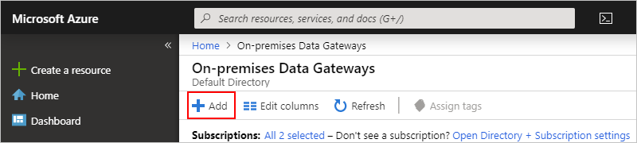
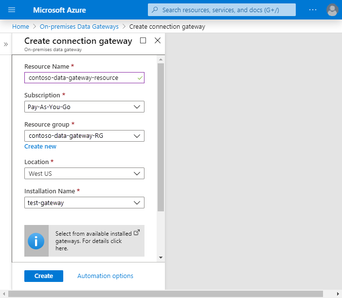
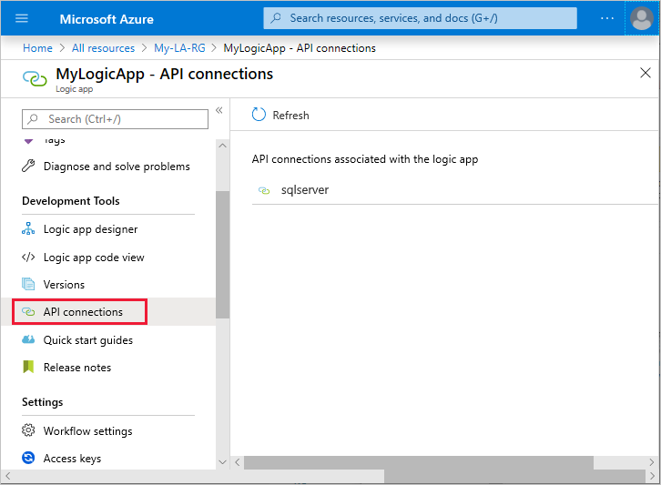
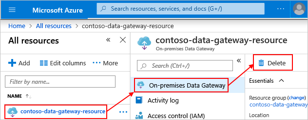

# Connect to on-premises data sources from Azure Logic Apps

After you [install the *on-premises data gateway* on a local computer](../logic-apps/logic-apps-gateway-install.md) and before you can access data sources on premises from your logic apps, you have to create a gateway resource in Azure for your gateway installation. You can then select this gateway resource in the triggers and actions that you want to use for the [on-premises connectors](../connectors/managed.md#on-premises-connectors) available in Azure Logic Apps. Azure Logic Apps supports read and write operations through the data gateway. However, these operations have [limits on their payload size](/data-integration/gateway/service-gateway-onprem#considerations).

This article shows how to create your Azure gateway resource for a previously [installed gateway on your local computer](../logic-apps/logic-apps-gateway-install.md). For more information about the gateway, see [How the gateway works](../logic-apps/logic-apps-gateway-install.md#gateway-cloud-service).

> [!TIP]
> To directly access on-premises resources in Azure virtual networks without having to use the gateway, consider creating an 
> [*integration service environment*](../logic-apps/connect-virtual-network-vnet-isolated-environment-overview.md) instead. 

For information about how to use the gateway with other services, see these articles:

* [Microsoft Power Automate on-premises data gateway](/power-automate/gateway-reference)
* [Microsoft Power BI on-premises data gateway](/power-bi/service-gateway-onprem)
* [Microsoft Power Apps on-premises data gateway](/powerapps/maker/canvas-apps/gateway-reference)
* [Azure Analysis Services on-premises data gateway](../analysis-services/analysis-services-gateway.md)

## Supported data sources

In Azure Logic Apps, the on-premises data gateway supports the [on-premises connectors](../connectors/managed.md#on-premises-connectors) for these data sources:

* BizTalk Server 2016
* File System
* IBM DB2  
* IBM Informix
* IBM MQ
* MySQL
* Oracle Database
* PostgreSQL
* SAP
* SharePoint Server
* SQL Server
* Teradata

You can also create [custom connectors](../logic-apps/custom-connector-overview.md) that connect to data sources over HTTP or HTTPS by using REST or SOAP. Although the gateway itself doesn't incur extra costs, the [Logic Apps pricing model](../logic-apps/logic-apps-pricing.md) applies to these connectors and other operations in Azure Logic Apps.

## Prerequisites

* You already [installed the on-premises data gateway on a local computer](../logic-apps/logic-apps-gateway-install.md). This gateway installation must exist before you can create a gateway resource that links to this installation.

* You have the [same Azure account and subscription](../logic-apps/logic-apps-gateway-install.md#requirements) that you used for your gateway installation. This Azure account must belong only to a single [Azure Active Directory (Azure AD) tenant or directory](../active-directory/fundamentals/active-directory-whatis.md#terminology). You have to use the same Azure account and subscription to create your gateway resource in Azure because only the gateway administrator can create the gateway resource in Azure. Service principals currently aren't supported.

  * When you create a gateway resource in Azure, you select a gateway installation to link with your gateway resource and only that gateway resource. Each gateway resource can link to only one gateway installation. You can't select a gateway installation that's already associated with another gateway resource.

  * Your logic app and gateway resource don't have to exist in the same Azure subscription. In triggers and actions where you can use the gateway resource, you can select a different Azure subscription that has a gateway resource, but only if that subscription exists in the same Azure AD tenant or directory as your logic app. You also have to have administrator permissions on the gateway, which another administrator can set up for you. For more information, see [Data Gateway: Automation using PowerShell - Part 1](https://community.powerbi.com/t5/Community-Blog/Data-Gateway-Automation-using-PowerShell-Part-1/ba-p/1117330) and [PowerShell: Data Gateway - Add-DataGatewayClusterUser](/powershell/module/datagateway/add-datagatewayclusteruser).

    > [!NOTE]
    > Currently, you can't share a gateway resource or installation across multiple subscriptions. 
    > To submit product feedback, see [Microsoft Azure Feedback Forum](https://feedback.azure.com/forums/34192--general-feedback).

## Create Azure gateway resource

After you install the gateway on a local computer, create the Azure resource for your gateway.

1. Sign in to the [Azure portal](https://portal.azure.com) with the same Azure account that was used to install the gateway.

1. In the Azure portal search box, enter "on-premises data gateway", and select **On-premises Data Gateways**.

   

1. Under **On-premises Data Gateways**, select **Add**.

   

1. Under **Create connection gateway**, provide this information for your gateway resource. When you're done, select **Create**.

   | Property | Description |
   |----------|-------------|
   | **Resource Name** | Provide a name for your gateway resource that contains only letters, numbers, hyphens (`-`), underscores (`_`), parentheses (`(`, `)`), or periods (`.`). |
   | **Subscription** | Select the Azure subscription for the Azure account that was used for the gateway installation. The default subscription is based on the Azure account that you used to sign in. |
   | **Resource group** | The [Azure resource group](../azure-resource-manager/management/overview.md) that you want to use |
   | **Location** | The same region or location that was selected for the gateway cloud service during [gateway installation](../logic-apps/logic-apps-gateway-install.md). Otherwise, your gateway installation won't appear in the **Installation Name** list. Your logic app location can differ from your gateway resource location. |
   | **Installation Name** | Select a gateway installation, which appears in the list only when these conditions are met: 

- The gateway installation uses the same region as the gateway resource that you want to create.  - The gateway installation isn't linked to another Azure gateway resource.  - The gateway installation is linked to the same Azure account that you're using to create the gateway resource.  - Your Azure account belongs to a single [Azure Active Directory (Azure AD) tenant or directory](../active-directory/fundamentals/active-directory-whatis.md#terminology) and is the same account that you used for the gateway installation. 

For more information, see the [Frequently asked questions](#faq) section. |
   |||

   Here is an example that shows a gateway installation that's in the same region as your gateway resource and is linked to the same Azure account:

   

## Connect to on-premises data

After you create your gateway resource and associate your Azure subscription with this resource, you can now create a connection between your logic app and your on-premises data source by using the gateway.

1. In the Azure portal, create or open your logic app in the Logic App Designer.

1. Add a connector that supports on-premises connections, for example, **SQL Server**.

1. Select **Connect via on-premises data gateway**.

1. Under **Gateway**, from the **Subscription** list, select your Azure subscription that has the gateway resource you want.

   Your logic app and gateway resource don't have to exist in the same Azure subscription. You can select from other Azure subscriptions that each have a gateway resource, but only if these subscriptions exist in the same Azure AD tenant or directory as your logic app, and you have administrator permissions on the gateway, which another administrator can set up for you. For more information, see [Data Gateway: Automation using PowerShell - Part 1](https://community.powerbi.com/t5/Community-Blog/Data-Gateway-Automation-using-PowerShell-Part-1/ba-p/1117330) and [PowerShell: Data Gateway - Add-DataGatewayClusterUser](/powershell/module/datagateway/add-datagatewayclusteruser).
  
1. From the **Connection Gateway** list, which shows the available gateway resources in your selected subscription, select the gateway resource that you want. Each gateway resource is linked to a single gateway installation.

   > [!NOTE]
   > The gateways list includes gateway resources in other regions because your 
   > logic app's location can differ from your gateway resource's location. 

1. Provide a unique connection name and other required information, which depends on the connection that you want to create.

   A unique connection name helps you easily find that connection later, especially if you create multiple connections. If applicable, also include the qualified domain for your username.

   Here is an example:

   

1. When you're done, select **Create**.

Your gateway connection is now ready for your logic app to use.

## Edit connection

To update the settings for a gateway connection, you can edit your connection.

1. To find all the API connections for just your logic app, on your logic app's menu, under **Development Tools**, select **API connections**.

   

1. Select the gateway connection you want, and then select **Edit API connection**.

   > [!TIP]
   > If your updates don't take effect, try 
   > [stopping and restarting the gateway Windows service account](../logic-apps/logic-apps-gateway-install.md#restart-gateway) for your gateway installation.

To find all API connections associated with your Azure subscription:

* From the Azure portal menu, select **All services** > **Web** > **API Connections**.
* Or, from the Azure portal menu, select **All resources**. Set the **Type** filter to **API Connection**.

## Delete gateway resource

To create a different gateway resource, link your gateway installation to a different gateway resource, or remove the gateway resource, you can delete the gateway resource without affecting the gateway installation.

1. From the Azure portal menu, select **All resources**, or search for and select **All resources** from any page. Find and select your gateway resource.

1. If not already selected, on your gateway resource menu, select **On-premises Data Gateway**. On the gateway resource toolbar, select **Delete**.

   For example:

   

## Frequently asked questions

**Q**: Why doesn't my gateway installation appear when I create my gateway resource in Azure?  
**A**: This issue can happen for these reasons:

* Your Azure account isn't the same account that you used for the gateway installation on your local computer. Check that you signed in to the Azure portal with the same identity that you used for the gateway installation. Only the gateway administrator can create the gateway resource in Azure. Service principals currently aren't supported.

* Your Azure account doesn't belong to only a single [Azure AD tenant or directory](../active-directory/fundamentals/active-directory-whatis.md#terminology). Check that you're using the same Azure AD tenant or directory that you used during gateway installation.

* Your gateway resource and gateway installation don't exist in the same region. However, your logic app's location can differ from your gateway resource location.

* Your gateway installation is already associated with another gateway resource. Each gateway resource can link to only one gateway installation, which can link to only one Azure account and subscription. So, you can't select a gateway installation that's already associated with another gateway resource. These installations won't appear in the **Installation Name** list.

  To review your gateway registrations in the Azure portal, find all your Azure resources that have the **On-premises Data Gateways** resource type across *all* your Azure subscriptions. To unlink the gateway installation from the other gateway resource, see [Delete gateway resource](#change-delete-gateway-resource).

[!INCLUDE [existing-gateway-location-changed](../../includes/logic-apps-existing-gateway-location-changed.md)]

## Next steps

* [Secure your logic apps](./logic-apps-securing-a-logic-app.md)
* [Common examples and scenarios for logic apps](./logic-apps-examples-and-scenarios.md)
