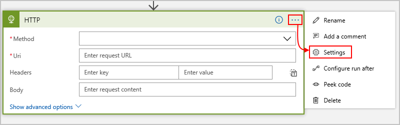
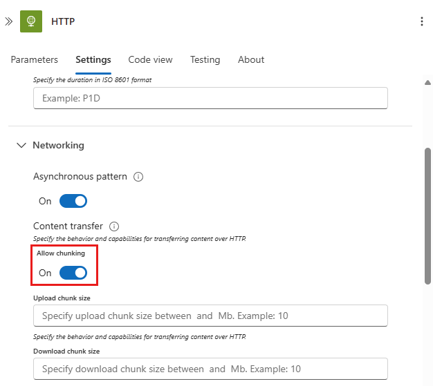

# Handle large messages in workflows using chunking in Azure Logic Apps

[!INCLUDE [logic-apps-sku-consumption](../../includes/logic-apps-sku-consumption.md)]

Azure Logic Apps has different maximum limits on the message content size that triggers and actions can handle in logic app workflows, based on the logic app resource type and the environment where that logic app workflow runs. These limits help reduce any overhead that results from storing and processing [large messages](#what-is-large-message). For more information about message size limits, review [Message limits in Azure Logic Apps](logic-apps-limits-and-config.md#messages).

If you're using built-in HTTP actions or specific managed connector actions, and you need Azure Logic Apps to work with messages larger than the default limits, you can enable *chunking*, which splits a large message into smaller messages. That way, you can still transfer large files under specific conditions. In fact, when you use these built-in HTTP actions or specific managed connector actions, chunking is the only way that Azure Logic Apps can consume large messages. This requirement means that either the underlying HTTP message exchange between Azure Logic Apps and other services must use chunking, or that the connections created by the managed connectors that you want to use must also support chunking.

> [!NOTE]
> Azure Logic Apps doesn't support chunking on triggers due to the increased overhead from exchanging multiple messages.
> Also, Azure Logic Apps implements chunking for HTTP actions using its own protocol as described in this article.
> So, even if your web site or web service supports chunking, they won't work with HTTP action chunking.
> To use HTTP action chunking with your web site or web service, you have to implement the same protocol
> that's used by Azure Logic Apps. Otherwise, don't enable chunking on the HTTP action.

This article provides an overview about how chunking works in Azure Logic Apps and how to set up chunking on supported actions.

<a name="what-is-large-message"></a>

## What makes messages "large"?

Messages are "large" based on the service handling those messages.
The exact size limit on large messages differs across Logic Apps and connectors.
Both Logic Apps and connectors can't directly consume large messages,
which must be chunked. For the Logic Apps message size limit,
see [Logic Apps limits and configuration](../logic-apps/logic-apps-limits-and-config.md).
For each connector's message size limit, see the
[connector's reference documentation](/connectors/connector-reference/connector-reference-logicapps-connectors).

### Chunked message handling for Logic Apps

Logic Apps can't directly use outputs from chunked
messages that are larger than the message size limit.
Only actions that support chunking can access the message content in these outputs.
So, an action that handles large messages must meet *either* these criteria:

* Natively support chunking when that action belongs to a connector.
* Have chunking support enabled in that action's runtime configuration.

Otherwise, you get a runtime error when you try to access large content output.
To enable chunking, see [Set up chunking support](#set-up-chunking).

### Chunked message handling for connectors

Services that communicate with Logic Apps can have their own message size limits.
These limits are often smaller than the Logic Apps limit. For example, assuming that
a connector supports chunking, a connector might consider a 30-MB message as large,
while Logic Apps does not. To comply with this connector's limit,
Logic Apps splits any message larger than 30 MB into smaller chunks.

For connectors that support chunking, the underlying chunking protocol is invisible to end users.
However, not all connectors support chunking, so these connectors generate runtime
errors when incoming messages exceed the connectors' size limits.

For actions that support and are enabled for chunking, you can't use trigger bodies, variables, and expressions such as `@triggerBody()?['Content']` because using any of these inputs prevents the chunking operation from happening. Instead, use the [**Compose** action](../logic-apps/logic-apps-perform-data-operations.md#compose-action). Specifically, you must create a `body` field by using the **Compose** action to store the data output from the trigger body, variable, expression, and so on, for example:

```json
"Compose": {
    "inputs": {
        "body": "@variables('myVar1')"
    },
    "runAfter": {
        "Until": [
            "Succeeded"
        ]
    },
    "type": "Compose"
},
```
Then, to reference the data, in the chunking action, use `@body('Compose')` .

```json
"Create_file": {
    "inputs": {
        "body": "@body('Compose')",
        "headers": {
            "ReadFileMetadataFromServer": true
        },
        "host": {
            "connection": {
                "name": "@parameters('$connections')['sftpwithssh_1']['connectionId']"
            }
        },
        "method": "post",
        "path": "/datasets/default/files",
        "queries": {
            "folderPath": "/c:/test1/test1sub",
            "name": "tt.txt",
            "queryParametersSingleEncoded": true
        }
    },
    "runAfter": {
        "Compose": [
            "Succeeded"
        ]
    },
    "runtimeConfiguration": {
        "contentTransfer": {
            "transferMode": "Chunked"
        }
    },
    "type": "ApiConnection"
},
```

<a name="set-up-chunking"></a>

## Set up chunking over HTTP

In generic HTTP scenarios, you can split up large content downloads and uploads over HTTP,
so that your logic app and an endpoint can exchange large messages. However,
you must chunk messages in the way that Logic Apps expects.

If an endpoint has enabled chunking for downloads or uploads,
the HTTP actions in your logic app automatically chunk large messages. Otherwise,
you must set up chunking support on the endpoint. If you don't own or control
the endpoint or connector, you might not have the option to set up chunking.

Also, if an HTTP action doesn't already enable chunking,
you must also set up chunking in the action's `runTimeConfiguration` property.
You can set this property inside the action, either directly in the code view
editor as described later, or in the Logic Apps Designer as described here:

1. In the HTTP action's upper-right corner,
choose the ellipsis button (**...**),
and then choose **Settings**.

   

2. Under **Content Transfer**, set **Allow chunking** to **On**.

   

3. To continue setting up chunking for downloads or uploads,
continue with the following sections.

<a name="download-chunks"></a>

## Download content in chunks

Many endpoints automatically send large messages
in chunks when downloaded through an HTTP GET request.
To download chunked messages from an endpoint over HTTP,
the endpoint must support partial content requests,
or *chunked downloads*. When your logic app sends an HTTP GET
request to an endpoint for downloading content,
and the endpoint responds with a "206" status code,
the response contains chunked content.
Logic Apps can't control whether an endpoint supports partial requests.
However, when your logic app gets the first "206" response,
your logic app automatically sends multiple requests to download all the content.

To check whether an endpoint can support partial content,
send a HEAD request. This request helps you determine
whether the response contains the `Accept-Ranges` header.
That way, if the endpoint supports chunked downloads but
doesn't send chunked content, you can *suggest*
this option by setting the `Range` header in your HTTP GET request.

These steps describe the detailed process Logic Apps uses for
downloading chunked content from an endpoint to your logic app:

1. Your logic app sends an HTTP GET request to the endpoint.

   The request header can optionally include a `Range` field that
   describes a byte range for requesting content chunks.

2. The endpoint responds with the "206" status code and an HTTP message body.

    Details about the content in this chunk appear in the response's `Content-Range` header,
    including information that helps Logic Apps determine the start and end for the chunk,
    plus the total size of the entire content before chunking.

3. Your logic app automatically sends follow-up HTTP GET requests.

    Your logic app sends follow-up GET requests until the entire content is retrieved.

For example, this action definition shows an HTTP GET request that sets the `Range` header.
The header *suggests* that the endpoint should respond with chunked content:

```json
"getAction": {
    "inputs": {
        "headers": {
            "Range": "bytes=0-1023"
        },
       "method": "GET",
       "uri": "http://myAPIendpoint/api/downloadContent"
    },
    "runAfter": {},
    "type": "Http"
}
```

The GET request sets the "Range" header to "bytes=0-1023",
which is the range of bytes. If the endpoint supports
requests for partial content, the endpoint responds
with a content chunk from the requested range.
Based on the endpoint, the exact format for the "Range" header field can differ.

<a name="upload-chunks"></a>

## Upload content in chunks

To upload chunked content from an HTTP action, the action must have enabled
chunking support through the action's `runtimeConfiguration` property.
This setting permits the action to start the chunking protocol.
Your logic app can then send an initial POST or PUT message to the target endpoint.
After the endpoint responds with a suggested chunk size, your logic app follows
up by sending HTTP PATCH requests that contain the content chunks.

The following steps describe the detailed process Logic Apps uses for uploading
chunked content from your logic app to an endpoint:

1. Your logic app sends an initial HTTP POST or PUT request with an empty message body. The request header, includes the following information about the content that your logic app wants to upload in chunks:

   | Logic Apps request header field | Value | Type | Description |
   |---------------------------------|-------|------|-------------|
   | **x-ms-transfer-mode** | chunked | String | Indicates that the content is uploaded in chunks |
   | **x-ms-content-length** | <*content-length*> | Integer | The entire content size in bytes before chunking |
   ||||

1. The endpoint responds with "200" success status code and the following information:

   | Endpoint response header field | Type | Required | Description |
   |--------------------------------|------|----------|-------------|
   | **Location** | String | Yes | The URL location where to send the HTTP PATCH messages |
   | **x-ms-chunk-size** | Integer | No | The suggested chunk size in bytes |
   ||||

1. Your logic app creates and sends follow-up HTTP PATCH messages - each with the following information:

   * A content chunk based on **x-ms-chunk-size** or some internally calculated size until all the content totaling **x-ms-content-length** is sequentially uploaded

   * The following header information about the content chunk sent in each PATCH message:

     | Logic Apps request header field | Value | Type | Description |
     |---------------------------------|-------|------|-------------|
     | **Content-Range** | <*range*> | String | The byte range for the current content chunk, including the starting value, ending value, and the total content size, for example: "bytes=0-1023/10100" |
     | **Content-Type** | <*content-type*> | String | The type of chunked content |
     | **Content-Length** | <*content-length*> | String | The length of size in bytes of the current chunk |
     |||||

1. After each PATCH request, the endpoint confirms the receipt for each chunk by responding with the "200" status code and the following response headers:

   | Endpoint response header field | Type | Required | Description |
   |--------------------------------|------|----------|-------------|
   | **Range** | String | Yes | The byte range for content that has been received by the endpoint, for example: "bytes=0-1023" |
   | **x-ms-chunk-size** | Integer | No | The suggested chunk size in bytes |
   ||||

For example, this action definition shows an HTTP POST request for uploading chunked content to an endpoint. In the action's `runTimeConfiguration` property,
the `contentTransfer` property sets `transferMode` to `chunked`:

```json
"postAction": {
    "runtimeConfiguration": {
        "contentTransfer": {
            "transferMode": "chunked"
        }
    },
    "inputs": {
        "method": "POST",
        "uri": "http://myAPIendpoint/api/action",
        "body": "@body('getAction')"
    },
    "runAfter": {
    "getAction": ["Succeeded"]
    },
    "type": "Http"
}
```
