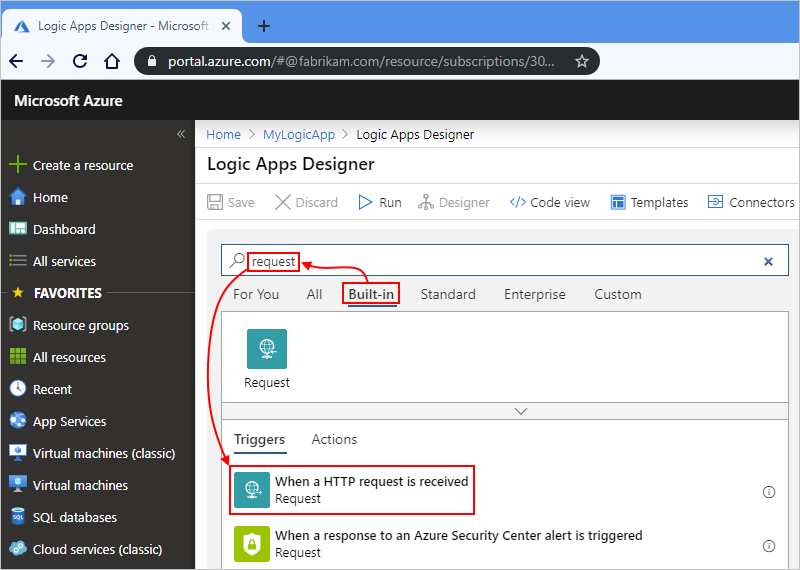
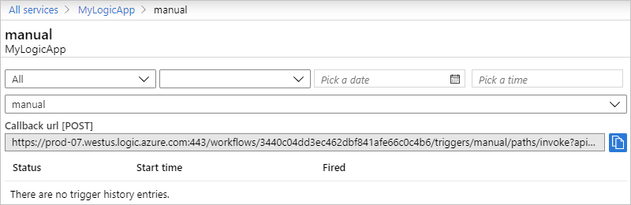
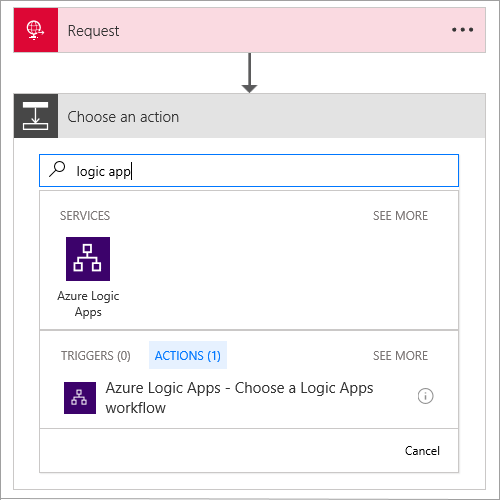

# Call, trigger, or nest logic apps by using HTTP endpoints in Azure Logic Apps

To make your logic app callable through a URL so that your logic app can receive incoming requests from other services, you can natively expose a synchronous HTTP endpoint as a trigger on that logic app. When you set up this capability, you can also nest your logic app inside other logic apps, which lets you create a pattern of callable endpoints.

To set up an HTTP endpoint, you can use any of these trigger types, which enable logic apps to receive incoming requests:

* [Request](../connectors/connectors-native-reqres.md)
* [HTTP Webhook](../connectors/connectors-native-webhook.md)
* Managed connector triggers that have the [ApiConnectionWebhook type](../logic-apps/logic-apps-workflow-actions-triggers.md#apiconnectionwebhook-trigger) and can receive incoming HTTP requests

> [!NOTE]
> These examples use the Request trigger, but you can use any HTTP request-based trigger that's 
> in the previous list. All principles identically apply to these other trigger types.

If you're new to logic apps, see [What is Azure Logic Apps](../logic-apps/logic-apps-overview.md) and [Quickstart: Create your first logic app](../logic-apps/quickstart-create-first-logic-app-workflow.md).

## Prerequisites

* An Azure subscription. If you don't have a subscription, [sign up for a free Azure account](https://azure.microsoft.com/free/).

* The logic app where you want to set up the HTTP endpoint as the trigger. You can start with either a blank logic app or an existing logic app where you want to replace the current trigger. This example starts with a blank logic app.

## Create a callable endpoint

1. Sign in to the [Azure portal](https://portal.azure.com). Create and open a blank logic app in the Logic App Designer.

   This example uses the Request trigger, but you can use any trigger that can receive incoming HTTP requests. All principles identically apply to these triggers. For more information about the Request trigger, see [Receive and respond to incoming HTTPS calls by using Azure Logic Apps](../connectors/connectors-native-reqres.md).

1. Under the search box, select **Built-in**. In the search box, enter `request` as your filter. From the triggers list, select **When a HTTP request is received**.

   

1. Optionally, in the **Request Body JSON Schema** box, you can enter a JSON schema that describes the payload or data that you expect the trigger to receive.

   The designer uses this schema to generate tokens that represent trigger outputs. You can then easily reference these outputs throughout your logic app's workflow. Learn more about [tokens generated from JSON schemas](#generated-tokens).

   For this example, enter this schema:

   ```json
      {
      "type": "object",
      "properties": {
         "address": {
            "type": "object",
            "properties": {
               "streetNumber": {
                  "type": "string"
               },
               "streetName": {
                  "type": "string"
               },
               "town": {
                  "type": "string"
               },
               "postalCode": {
                  "type": "string"
               }
            }
         }
      }
   }
    ```

   

   Or, you can generate a JSON schema by providing a sample payload:

   1. In the **Request** trigger, select **Use sample payload to generate schema**.

   1. In the **Enter or paste a sample JSON payload** box, enter your sample payload, for example:

      ```json
      {
         "address": {
            "streetNumber": "00000",
            "streetName": "AnyStreet",
            "town": "AnyTown",
            "postalCode": "11111-1111"
        }
      }
      ```

   1. When you're ready, select **Done**.

      The **Request Body JSON Schema** box now shows the generated schema.

1. Save your logic app.

   The **HTTP POST to this URL** box now shows the generated callback URL that other services can use to call and trigger your logic app. This URL includes a Shared Access Signature (SAS) key, which is used for authentication, in the query parameters, for example:

   

   You can also get the HTTP endpoint URL from your logic app's **Overview** pane.

   1. On your logic app's menu, select **Overview**.

   1. In the **Summary** section, select **See trigger history**.

      

   1. Under **Callback url [POST]**, copy the URL:

      

      Or you can get the URL by making this call:

      ```http
      POST https://management.azure.com/{logic-app-resource-ID}/triggers/{endpoint-trigger-name}/listCallbackURL?api-version=2016-06-01
      ```

<a name="set-method"></a>

## Set expected HTTP method

By default, the Request trigger expects an HTTP POST request. However, you can specify a different method to expect, but only one method.

1. In the Request trigger, open the **Add new parameter** list, and select **Method**, which adds this property to the trigger.

   

1. From the **Method** list, select another method that the trigger expects instead. Or, you can specify a custom method.

   For example, select the **GET** method so that you can test your HTTP endpoint's URL later.

   

## Accept parameters in endpoint URL

When you want your endpoint URL to accept parameters, specify the relative path in your trigger. You also need to explicitly [set the method](#set-method) that your HTTP request expects.

1. In the Request trigger, open the **Add new parameter** list, and select **Relative path**, which adds this property to the trigger.

   

1. In the **Relative path** property, specify the relative path for the parameter in your JSON schema that you want your URL to accept, for example, `address/{postalCode}`.

   

1. To use the parameter, find and add a **Response** action to your logic app.

   1. Under the Request trigger, select **New step** > **Add an action**.

   1. Under **Choose an action**, in the search box, enter `response` as your filter.

   1. From the actions list, select the **Response** action.

1. In the Response action's **Body** property, include the token that represents the parameter that you specified in your trigger's relative path.

   For example, suppose that you want the Response action to return `Postal Code: {postalCode}`.

   In the **Body** property, enter `Postal Code: ` with a trailing space. From the dynamic content list that appears, select the **postalCode** token.

   

   The **Body** property now includes the selected parameter:

   

1. Save your logic app.

    Your HTTP endpoint URL now includes the relative path, for example:

    ```http
    https://prod-25.westus.logic.azure.com/workflows/{logic-app-resource-ID}/triggers/manual/paths/invoke/address/{postalCode}?api-version=2016-10-01&sp=%2Ftriggers%2Fmanual%2Frun&sv=1.0&sig={shared-access-signature}
    ```

1. To test your HTTP endpoint, copy and paste the updated URL into another browser window, but replace `{postalCode}` with `123456`, and press Enter.

   Your browser shows this text: `Postal Code: 123456`

## Call logic app through HTTP endpoint

After you create the HTTP endpoint, you can trigger the logic app by sending an HTTP `POST` request to the endpoint's full URL. Logic apps have built-in support for direct-access endpoints.

<a name="generated-tokens"></a>

## Tokens generated from schema

When you provide a JSON schema in the Request trigger, the Logic App Designer generates tokens for the properties in that schema. You can then use those tokens for passing data through your logic app workflow.

For example, if you add more properties, such as `"suite"`, to your JSON schema, tokens for those properties are available for you to use in the later steps for your logic app. Here is the complete JSON schema:

```json
   {
   "type": "object",
   "properties": {
      "address": {
         "type": "object",
         "properties": {
            "streetNumber": {
               "type": "string"
            },
            "streetName": {
               "type": "string"
            },
            "suite": {
               "type": "string"
            },
            "town": {
               "type": "string"
            },
            "postalCode": {
               "type": "string"
            }
         }
      }
   }
}
```

## Create nested logic apps

You can nest workflows in your logic app by adding other logic apps that can receive requests. To include these logic apps, follow these steps:

1. Under the step where you want to call another logic app, select **New step** > **Add an action**.

1. Under **Choose an action**, select **Built-in**. In the search box, enter `logic apps` as your filter. From the actions list, select **Choose a Logic Apps workflow**.

   

   The designer shows the eligible logic apps for you to select.

1. Select the logic app to call from your current logic app.

   

## Reference content from an incoming request

If the incoming request's content type is `application/json`, you can reference the properties in the incoming request. Otherwise, this content is treated as a single binary unit that you can pass to other APIs. To reference this content inside your logic app's workflow, you need to first convert that content.

For example, if you're passing content that has `application/xml` type, you can use the [`@xpath()` expression](../logic-apps/workflow-definition-language-functions-reference.md#xpath) to perform an XPath extraction, or use the [`@json()` expression](../logic-apps/workflow-definition-language-functions-reference.md#json) for converting XML to JSON. Learn more about working with supported [content types](../logic-apps/logic-apps-content-type.md).

To get the output from an incoming request, you can use the [`@triggerOutputs` expression](../logic-apps/workflow-definition-language-functions-reference.md#triggerOutputs). For example, suppose you have output that looks like this example:

```json
{
   "headers": {
      "content-type" : "application/json"
   },
   "body": {
      "myProperty" : "property value"
   }
}
```

To access specifically the `body` property, you can use the [`@triggerBody()` expression](../logic-apps/workflow-definition-language-functions-reference.md#triggerBody) as a shortcut.

## Respond to requests

Sometimes you want to respond to certain requests that trigger your logic app by returning content to the caller. To construct the status code, header, and body for your response, use the Response action. This action can appear anywhere in your logic app, not just at the end of your workflow. If your logic app doesn't include a Response action, the HTTP endpoint responds *immediately* with the **202 Accepted** status.

For the original caller to successfully get the response, all the required steps for the response must finish within the [request timeout limit](./logic-apps-limits-and-config.md) unless the triggered logic app is called as a nested logic app. If no response is returned within this limit, the incoming request times out and receives the **408 Client timeout** response.

For nested logic apps, the parent logic app continues to wait for a response until all the steps are completed, regardless of how much time is required.

### Construct the response

In the response body, you can include multiple headers and any type of content. For example, this response's header specifies that the response's content type is `application/json` and that the body contains values for the `town` and `postalCode` properties, based on the JSON schema described earlier in this topic for the Request trigger.


Responses have these properties:

| Property (Display) | Property (JSON) | Description |
|--------------------|-----------------|-------------|
| **Status Code** | `statusCode` | The HTTP status code to use in the response for the incoming request. This code can be any valid status code that starts with 2xx, 4xx, or 5xx. However, 3xx status codes are not permitted. |
| **Headers** | `headers` | One or more headers to include in the response |
| **Body** | `body` | A body object that can be a string, a JSON object, or even binary content referenced from a previous step |
||||

To view the JSON definition for the Response action and your logic app's complete JSON definition, on the Logic App Designer toolbar, select **Code view**.

``` json
"Response": {
   "type": "Response",
   "kind": "http",
   "inputs": {
      "body": {
         "postalCode": "@triggerBody()?['address']?['postalCode']",
         "town": "@triggerBody()?['address']?['town']"
      },
      "headers": {
         "content-type": "application/json"
      },
      "statusCode": 200
   },
   "runAfter": {}
}
```

## Q & A

#### Q: What about URL security?

**A**: Azure securely generates logic app callback URLs by using [Shared Access Signature (SAS)](https://docs.microsoft.com/rest/api/storageservices/delegate-access-with-shared-access-signature). This signature passes through as a query parameter and must be validated before your logic app can run. Azure generates the signature using a unique combination of a secret key per logic app, the trigger name, and the operation that's performed. So unless someone has access to the secret logic app key, they cannot generate a valid signature.

> [!IMPORTANT]
> For production and higher security systems, we strongly advise against calling your logic app directly from the browser for these reasons:
>
> * The shared access key appears in the URL.
> * You can't manage security content policies due to shared domains across Azure Logic Apps customers.

#### Q: Can I configure HTTP endpoints further?

**A**: Yes, HTTP endpoints support more advanced configuration through [Azure API Management](../api-management/api-management-key-concepts.md). This service also offers the capability for you to consistently manage all your APIs, including logic apps, set up custom domain names, use more authentication methods, and more, for example:

* [Change the request method](../api-management/api-management-advanced-policies.md#SetRequestMethod)
* [Change the URL segments of the request](../api-management/api-management-transformation-policies.md#RewriteURL)
* Set up your API Management domains in the [Azure portal](https://portal.azure.com/)
* Set up policy to check for Basic authentication

## Next steps

* [Receive and respond to incoming HTTPS calls by using Azure Logic Apps](../connectors/connectors-native-reqres.md)