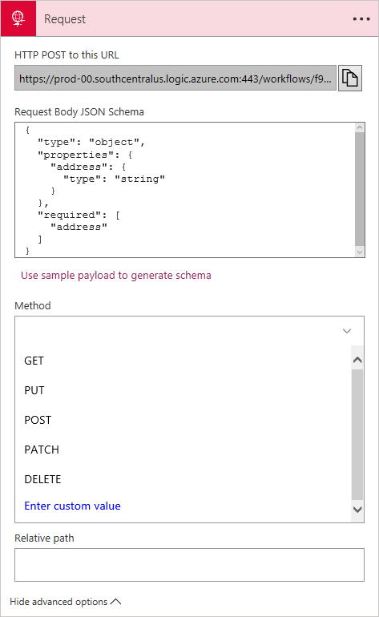
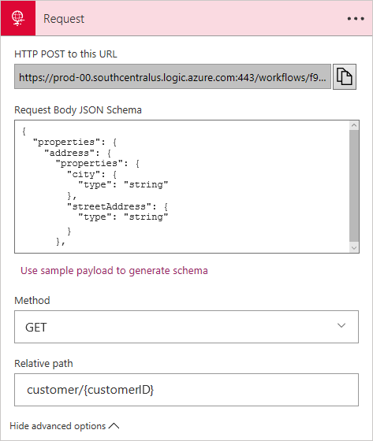
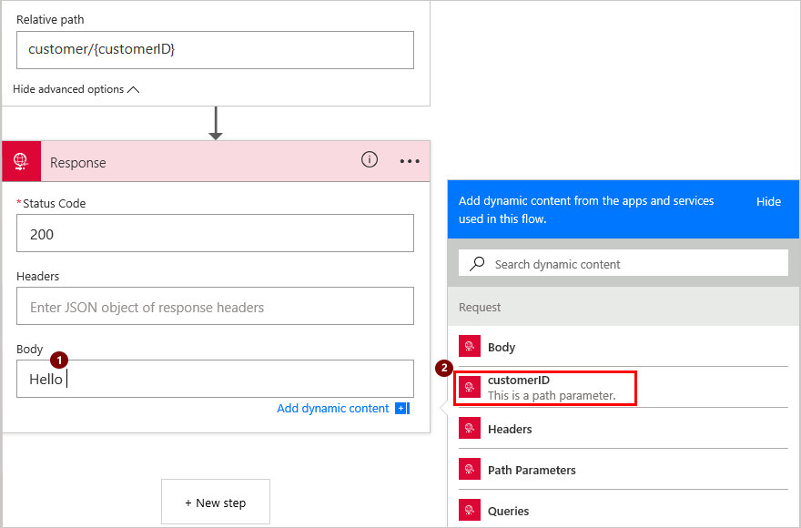

# Call, trigger, or nest workflows with HTTP endpoints for logic apps

Logic apps can natively expose synchronous HTTP endpoints as triggers 
so that you can trigger or manually call your logic apps through a URL. 
You can also nest workflows in your logic apps by using a pattern of callable endpoints.

To receive requests, you can add these triggers to your logic apps:

* [Request](../connectors/connectors-native-reqres.md)
* [API Connection webhook](logic-apps-workflow-actions-triggers.md#api-connection)
* [HTTP Webhook](../connectors/connectors-native-http.md)

Our examples use the **Request** trigger, 
but all principles identically apply to the other trigger types.

## Set up an HTTP endpoint for your logic app

To create an HTTP endpoint, add a trigger that can receive incoming requests.

1. Sign in to the [Azure portal](https://portal.azure.com "Azure portal"). 
Go to your logic app, and open Logic App Designer.

2. Add a trigger that lets your logic app receive incoming requests. 
For example, add the **Request** trigger to your logic app.

3.	Under **Request Body JSON Schema**, 
enter the JSON schema for the payload (data) that you expect the trigger to receive.

	The designer uses this schema for generating 
	tokens that let your logic app consume, parse, 
	and pass data from the trigger throughout your workflow.

	For now, enter the example schema shown in the designer:

	```json
	{
		"type": "object",
		"properties": {
			"address": {
				"type": "string"
			}
		},
		"required": [
			"address"
		]
	}
	```

	![Add the Request action][1]

      > [!TIP]
      > 
      > You can generate a schema for a sample JSON payload 
      > from a tool like [jsonschema.net](http://jsonschema.net/), 
      > or in the **Request** trigger by choosing **Use sample payload to generate schema**. 
      > Enter your sample payload, and choose **Done**.
      > 

	For example, this sample payload:

      ```json
      {
         "address": "21 2nd Street, New York, New York"
      }
      ```

	generates this schema:

      ```json
      }
         "type": "object",
         "properties": {
            "address": {
               "type": "string" 
            }
         }
      }
      ```

4.	Save your logic app. Under **HTTP POST to this URL**, 
you should now get a generated callback URL, like this example:

	

	``` text
	https://prod-00.southcentralus.logic.azure.com:443/workflows/f90cb66c52ea4e9cabe0abf4e197deff/triggers/manual/paths/invoke?api-version...
	```

	This URL contains a Shared Access Signature (SAS) key 
	in the query parameters that are used for authentication. 
	You can also get the endpoint URL from your logic app overview 
	in the Azure portal. Under **Trigger History**, 
	select your trigger:

	![Get endpoint URL from Azure portal][2]

	Or you can get the URL by making this call:

	``` text
	POST https://management.azure.com/{resourceID-for-your-logic-app}/triggers/{myendpointtrigger}/listCallbackURL?api-version=2016-06-01
	```

## Change the HTTP method for your trigger

By default, the **Request** trigger expects an HTTP POST request, 
but you can specify a different HTTP method. 

> [!NOTE]
> You can specify only one method type.

1.	On your **Request** trigger, choose **Show advanced options**.

2. Open the **Method** list. Select another HTTP method, 
or specify a custom method.

	

## Accept parameters through your HTTP endpoint URL

When you want your HTTP endpoint URL to accept parameters, 
customize the relative path for your trigger's URL.

1. On your **Request** trigger, choose **Show advanced options**. 

2. Under **Method**, specify the HTTP method that you want your request to use. 
Select the **GET** method so you can later test your endpoint's URL.

      > [!NOTE]
      > When you specify a relative path for your trigger, 
      > you must also explicitly specify an HTTP method for your trigger.

3.	Under **Relative path**, specify the relative path for the parameter 
	that your URL should accept, for example, `customer/{customerID}`.

	

4.	To use the parameter, add a **Response** action to your logic app. 
(Under your trigger, choose **New step** > **Add an action** > **Response**) 

5.	In your response's **Body**, include the token for the parameter 
that you specified in your trigger.

	For example, to return `Hello {customerID}`, 
	update your response's **Body** with `Hello {customerID token}`. 
	The dynamic content list should appear and show the `customerID` 
	token for you to select.

	

	Your **Body** should look like this example:

	

6. Save your logic app. 

	Your trigger's URL now includes the relative path, for example:

	``` text
	https://prod-00.southcentralus.logic.azure.com/workflows/f90cb66c52ea4e9cabe0abf4e197deff/triggers/manual/paths/invoke/customer/{customerID}?api-version...
	```

7. To test your HTTP endpoint, 
copy and paste the updated URL into another browser window. 
Substitute `{customerID}` with `123456`, and press Enter.

	Your browser should show this text: 

	`Hello 123456`

### Tokens generated from JSON schemas for your logic app

When you specify a JSON schema in your **Request** trigger, 
the Logic App Designer uses that schema to generate tokens, 
which you can use in your logic app workflow steps.

For example, when we add the `title` and `name` 
properties to the JSON schema, their tokens are 
now available to use in later workflow steps.

```json
{
   "type": "object",
   "properties": {
      "address": {
         "type": "string"
      },
      "title": {
         "type": "string"
      },
      "name": {
         "type": "string"
      }
   },
   "required": [
      "address",
      "title",
      "name"
   ]
}
```

## Create nested workflows for logic apps

You can nest workflows in your logic app by adding 
other logic apps that can receive requests. 
To include these logic apps, add the 
**Azure Logic Apps - Choose a Logic Apps workflow** action 
to your trigger. You can then select from eligible logic apps.


## Call or trigger logic apps through HTTP endpoints

After you create your logic app's HTTP endpoint, 
you can trigger your logic app through a `POST` method to the full URL. 
Logic apps have built-in support for direct-access endpoints 
and always use the `POST` method to start running the logic app.

You can include more than one header and any type of content in the body. 
If the content's type is `application/json`, 
you can reference properties from inside your request. 
Otherwise, content is treated as a single binary unit that you can pass to other APIs. 
You can't reference this content inside the workflow without converting that content. 
For example, if you pass `application/xml` content, you can use `@xpath()` 
for an XPath extraction, or `@json()` for converting XML to JSON. 
Learn about [working with content types](../logic-apps/logic-apps-content-type.md).

## Reference content from an incoming request

To get the output from an incoming request, 
you can use the `@triggerOutputs()` function. 
The output might look like this example:

```json
{
    "headers": {
        "content-type" : "application/json"
    },
    "body": {
        "myProperty" : "property value"
    }
}
```

To access the `body` property specifically, 
you can use the `@triggerBody()` shortcut. 

## Respond to requests

For some requests that start a logic app, 
you might want to respond by returning some content to the caller. 
To construct the status code, header, and body for your response, 
you can use the **Response** action.

> [!NOTE] 
> If your logic app doesn't include a **Response**, 
> the endpoint responds *immediately* with a **202 Accepted** status. 
> 
> Also, for the original request to get the response, 
> all steps required for the response must finish 
> within *60 seconds* unless you call the workflow as a nested logic app. 
> If no response happens within 60 seconds, 
> the incoming request times out and receives the HTTP response **408 Client timeout**. 
> For nested logic apps, the parent logic app continues to wait for a 
> response until completed, regardless of how much time is required.

### Construct the response

For our example response, the header specifies 
that the response has content type `application/json`, 
and the body contains `title` and `name`.

![HTTP Response action][3]

Responses have these properties:

| Property | Description |
| --- | --- |
| statusCode |Specifies the HTTP status code for responding to the incoming request. This code can be any valid status code that starts with 2xx, 4xx, or 5xx. However, 3xx status codes are not permitted. |
| headers |Defines any number of headers to include in the response. |
| body |Specifies a body object that can be a string, a JSON object, or even binary content referenced from a previous step. |

Here's what the JSON schema now looks like:

``` json
"Response": {
   "inputs": {
      "body": {
         "title": "@{triggerBody()?['title']}",
         "name": "@{triggerBody()?['name']}"
      },
      "headers": {
		   "content-type": "application/json"
      },
      "statusCode": 200
   },
   "runAfter": {},
   "type": "Response"
}
```

## Q & A

#### Q: What about URL security?

A: Azure securely generates logic app callback URLs using a Shared Access Signature (SAS). 
This signature passes through as a query parameter 
and must be validated before your logic app can fire. 
Azure generates the signature using a unique 
combination of a secret key per logic app, 
the trigger name, and the operation that's performed. 
So unless someone has access to the secret logic app key, 
they cannot generate a valid signature.

#### Q: Can I configure HTTP endpoints further?

A: Yes, HTTP endpoints support more advanced configuration 
through the **API Management**. This service also offers the 
capability for you to consistently manage all your APIs, 
including logic apps, set up custom domain names, 
use more authentication methods, and more, for example:

* [Change the request method](https://docs.microsoft.com/azure/api-management/api-management-advanced-policies#SetRequestMethod)
* [Change the URL segments of the request](https://docs.microsoft.com/azure/api-management/api-management-transformation-policies#RewriteURL)
* Set up your API Management domains in the [Azure portal](https://portal.azure.com/ "Azure portal")
* Set up policy to check for Basic authentication

#### Q: What changed when the schema migrated from the December 1, 2014 preview?

A: Here's a summary about these changes:

| December 1, 2014 preview | June 1, 2016 |
| --- | --- |
| Click **HTTP Listener** API App |Click **Manual trigger** (no API App required) |
| HTTP Listener setting "*Sends response automatically*" |Either include a **Response** action or not in the workflow definition |
| Configure Basic or OAuth authentication |via API Management |
| Configure HTTP method |Under **Show advanced options**, choose an HTTP method |
| Configure relative path |Under **Show advanced options**, add a relative path |
| Reference the incoming body through `@triggerOutputs().body.Content` |Reference through `@triggerOutputs().body` |
| **Send HTTP response** action on the HTTP Listener |Click **Respond to HTTP request** (no API App required) |

[1]: ./media/logic-apps-http-endpoint/manualtrigger.png
[2]: ./media/logic-apps-http-endpoint/manualtriggerurl.png
[3]: ./media/logic-apps-http-endpoint/response.png
