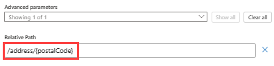

# Create workflows that you can call, trigger, or nest using HTTPS endpoints in Azure Logic Apps

[!INCLUDE [logic-apps-sku-consumption-standard](../../includes/logic-apps-sku-consumption-standard.md)]

Some scenarios might require that you create a logic app workflow that can receive inbound requests from other services or workflows, or a workflow that you can call by using a URL. For this task, you can expose a native synchronous HTTPS endpoint on your workflow when you use any of the following request-based trigger types:

* [Request](../connectors/connectors-native-reqres.md)
* [HTTP Webhook](../connectors/connectors-native-webhook.md)
* Managed connector triggers that have the [ApiConnectionWebhook type](logic-apps-workflow-actions-triggers.md#apiconnectionwebhook-trigger) and can receive inbound HTTPS requests

This guide shows how to create a callable endpoint for your workflow by adding the **Request** trigger and then call that endpoint from another workflow. All principles identically apply to the other request-based trigger types that can receive inbound requests.

## Prerequisites

* An Azure account and subscription. If you don't have a subscription, [sign up for a free Azure account](https://azure.microsoft.com/free/?WT.mc_id=A261C142F).

* A logic app workflow where you want to use the request-based trigger to create the callable endpoint. You can start with either a blank workflow or an existing workflow where you can replace the current trigger. This example starts with a blank workflow.

* To test the URL for the callable endpoint that you create, you'll need a tool or app such as [Postman](https://www.postman.com/downloads/).

## Create a callable endpoint

Based on whether you have a Standard or Consumption logic app workflow, follow the corresponding steps:

### [Standard](#tab/standard)

1. In the [Azure portal](https://portal.azure.com), open your Standard logic app resource and blank workflow in the designer.

1. [Follow these general steps to add the **Request** trigger named **When a HTTP request is received**](create-workflow-with-trigger-or-action.md?tabs=standard#add-trigger).

1. Optionally, in the **Request Body JSON Schema** box, you can enter a JSON schema that describes the payload or data that you expect the trigger to receive.

   The designer uses this schema to generate tokens that represent trigger outputs. You can then easily reference these outputs throughout your logic app's workflow. Learn more about [tokens generated from JSON schemas](#generated-tokens).

   For this example, enter the following schema:

   ```json
   {
      "type": "object",
      "properties": {
         "address": {
            "type": "object",
            "properties": {
               "streetNumber": {
                  "type": "string"
               },
               "streetName": {
                  "type": "string"
               },
               "town": {
                  "type": "string"
               },
               "postalCode": {
                  "type": "string"
               }
            }
         }
      }
   }
    ```

   

   Or, you can generate a JSON schema by providing a sample payload:

   1. In the **Request** trigger, select **Use sample payload to generate schema**.

   1. In the **Enter or paste a sample JSON payload** box, enter your sample payload, for example:

      ```json
      {
         "address": {
            "streetNumber": "00000",
            "streetName": "AnyStreet",
            "town": "AnyTown",
            "postalCode": "11111-1111"
        }
      }
      ```

   1. When you're ready, select **Done**.

      The **Request Body JSON Schema** box now shows the generated schema.

1. Save your workflow.

   The **HTTP POST URL** box now shows the generated callback URL that other services can use to call and trigger your logic app workflow. This URL includes query parameters that specify a Shared Access Signature (SAS) key, which is used for authentication.

   

1. To copy the callback URL, you have these options:

   * To the right of the **HTTP POST URL** box, select **Copy URL** (copy files icon).

   * Copy the callback URL from your workflow's **Overview** page.

     1. On your workflow menu, select **Overview**.

     1. On the **Overview** page, under **Workflow URL**, move your pointer over the URL, and select **Copy to clipboard**:

        :::image type="content" source="./media/logic-apps-http-endpoint/find-trigger-url-standard.png" alt-text="Screenshot shows Standard workflow and Overview page with workflow URL." lightbox="./media/logic-apps-http-endpoint/find-trigger-url-standard.png":::

1. To test the callback URL that you now have for the Request trigger, use a tool or app such as [Postman](https://www.postman.com/downloads/), and send the request using the method that the Request trigger expects.

   This example uses the `POST` method:

   `POST https://{logic-app-name}.azurewebsites.net:443/api/{workflow-name}/triggers/{trigger-name}/invoke?api-version=2022-05-01&sp=%2Ftriggers%2F{trigger-name}%2Frun&sv=1.0&sig={shared-access-signature}`

### [Consumption](#tab/consumption)

1. In the [Azure portal](https://portal.azure.com), open your Consumption logic app resource and blank workflow in the designer.

1. [Follow these general steps to add the **Request** trigger named **When a HTTP request is received**](create-workflow-with-trigger-or-action.md?tabs=consumption#add-trigger).

1. Optionally, in the **Request Body JSON Schema** box, you can enter a JSON schema that describes the payload or data that you expect the trigger to receive.

   The designer uses this schema to generate tokens that represent trigger outputs. You can then easily reference these outputs throughout your logic app's workflow. Learn more about [tokens generated from JSON schemas](#generated-tokens).

   For this example, enter the following schema:

   ```json
   {
      "type": "object",
      "properties": {
         "address": {
            "type": "object",
            "properties": {
               "streetNumber": {
                  "type": "string"
               },
               "streetName": {
                  "type": "string"
               },
               "town": {
                  "type": "string"
               },
               "postalCode": {
                  "type": "string"
               }
            }
         }
      }
   }
   ```

   

   Or, you can generate a JSON schema by providing a sample payload:

   1. In the **Request** trigger, select **Use sample payload to generate schema**.

   1. In the **Enter or paste a sample JSON payload** box, enter your sample payload, for example:

      ```json
      {
         "address": {
            "streetNumber": "00000",
            "streetName": "AnyStreet",
            "town": "AnyTown",
            "postalCode": "11111-1111"
        }
      }
      ```

   1. When you're ready, select **Done**.

      The **Request Body JSON Schema** box now shows the generated schema.

1. Save your workflow.

   The **HTTP POST URL** box now shows the generated callback URL that other services can use to call and trigger your logic app workflow. This URL includes query parameters that specify a Shared Access Signature (SAS) key, which is used for authentication.

   

1. To copy the callback URL, you have these options:

   * To the right of the **HTTP POST URL** box, select **Copy Url** (copy files icon).

   * Copy the callback URL from your logic app's **Overview** page.

     1. On your logic app menu, select **Overview**.

     1. On the **Overview** page, under **Workflow URL**, move your pointer over the URL, and select **Copy to clipboard**:

        :::image type="content" source="./media/logic-apps-http-endpoint/find-trigger-url-consumption.png" alt-text="Screenshot shows Consumption logic app Overview page with workflow URL." lightbox="./media/logic-apps-http-endpoint/find-trigger-url-consumption.png":::

1. To test the callback URL that you now have for the Request trigger, use a tool or app such as [Postman](https://www.postman.com/downloads/), and send the request using the method that the Request trigger expects.

   This example uses the `POST` method:

   `POST https://{server-name}.{region}.logic.azure.com/workflows/{workflow-ID}/triggers/{trigger-name}/paths/invoke/?api-version=2016-10-01&sp=%2Ftriggers%2F{trigger-name}%2Frun&sv=1.0&sig={shared-access-signature}`

---

<a name="select-method"></a>

## Select expected request method

By default, the Request trigger expects a `POST` request. However, you can specify a different method that the caller must use, but only a single method.

### [Standard](#tab/standard)

1. In the Request trigger, open the **Advanced parameters** list, and select **Method**, which adds this property to the trigger.

1. From the **Method** list, select the method that the trigger should expect instead. Or, you can specify a custom method.

   For example, select the **GET** method so that you can test your endpoint's URL later.

### [Consumption](#tab/consumption)

1. In the Request trigger, open the **Add new parameter** list, and select **Method**, which adds this property to the trigger.

1. From the **Method** list, select the method that the trigger should expect instead. Or, you can specify a custom method.

   For example, select the **GET** method so that you can test your endpoint's URL later.

---

<a name="endpoint-url-parameters"></a>

## Pass parameters through endpoint URL

When you want to accept parameter values through the endpoint's URL, you have these options:

* [Accept values through GET parameters](#get-parameters) or URL parameters.

  These values are passed as name-value pairs in the endpoint's URL. For this option, you need to use the GET method in your Request trigger. In a subsequent action, you can get the parameter values as trigger outputs by using the `triggerOutputs()` function in an expression.

* [Accept values through a relative path](#relative-path) for parameters in your Request trigger.

  These values are passed through a relative path in the endpoint's URL. You also need to explicitly [select the method](#select-method) that the trigger expects. In a subsequent action, you can get the parameter values as trigger outputs by referencing those outputs directly.

<a name="get-parameters"></a>

## Accept values through GET parameters

### [Standard](#tab/standard)

1. In the Request trigger, open the **Advanced parameters**, add the **Method** property to the trigger, and select the **GET** method.

   For more information, see [Select expected request method](#select-method).

1. In the designer, [follow these general steps to add the action where you want to use the parameter value](create-workflow-with-trigger-or-action.md?tabs=standard#add-action).

   For this example, select the action named **Response**.

1. To build the `triggerOutputs()` expression that retrieves the parameter value, follow these steps:

   1. In the Response action, select inside the **Body** property so that the options for dynamic content (lightning icon) and expression editor (formula icon) appear. Select the formula icon to open the expression editor.

   1. In the expression box, enter the following expression, replacing `parameter-name` with your parameter name, and select **OK**.

      `triggerOutputs()['queries']['parameter-name']`

      

      In the **Body** property, the expression resolves to the `triggerOutputs()` token.

      

      If you save the workflow, navigate away from the designer, and return to the designer, the token shows the parameter name that you specified, for example:

      

      In code view, the **Body** property appears in the Response action's definition as follows:

      `"body": "@{triggerOutputs()['queries']['parameter-name']}",`

      For example, suppose that you want to pass a value for a parameter named `postalCode`. The **Body** property specifies the string, `Postal Code: ` with a trailing space, followed by the corresponding expression:

      

#### Test your callable endpoint

1. From the Request trigger, copy the workflow URL, and paste the URL into another browser window. In the URL, add the parameter name and value to the URL in the following format, and press Enter.

   `...invoke/{parameter-name}/{parameter-value}?api-version=2022-05-01...`

   For example:

   `https://mystandardlogicapp.azurewebsites.net/api/Stateful-Workflow/triggers/When_a_HTTP_request_is_received/invoke/address/12345?api-version=2022-05-01&sp=%2Ftriggers%2FWhen_a_HTTP_request_is_received%2Frun&sv=1.0&sig={shared-access-signature}`

   The browser returns a response with this text: `Postal Code: 123456`

   

> [!NOTE]
>
> If you want to include the hash or pound symbol (**#**) in the URI, 
> use this encoded version instead: `%25%23`

### [Consumption](#tab/consumption)

1. In the Request trigger, open the **Add new parameter list**, add the **Method** property to the trigger, and select the **GET** method.

   For more information, see [Select expected request method](#select-method).

1. In the designer, [follow these general steps to add the action where you want to use the parameter value](create-workflow-with-trigger-or-action.md?tabs=consumption#add-action).

   For this example, select the action named **Response**.

1. To build the `triggerOutputs()` expression that retrieves the parameter value, follow these steps:

   1. In the Response action, select inside the **Body** property so that the dynamic content list appears, and select **Expression**.

   1. In the **Expression** box, enter the following expression, replacing `parameter-name` with your parameter name, and select **OK**.

      `triggerOutputs()['queries']['parameter-name']`

      

      In the **Body** property, the expression resolves to the `triggerOutputs()` token.

      

      If you save the workflow, navigate away from the designer, and return to the designer, the token shows the parameter name that you specified, for example:

      

      In code view, the **Body** property appears in the Response action's definition as follows:

      `"body": "@{triggerOutputs()['queries']['parameter-name']}",`

      For example, suppose that you want to pass a value for a parameter named `postalCode`. The **Body** property specifies the string, `Postal Code: ` with a trailing space, followed by the corresponding expression:

      

#### Test your callable endpoint

1. From the Request trigger, copy the workflow URL, and paste the URL into another browser window. In the URL, add the parameter name and value following the question mark (`?`) to the URL in the following format, and press Enter.

   `...invoke?{parameter-name=parameter-value}&api-version=2016-10-01...`

   For example:

   `https://prod-07.westus.logic.azure.com:433/workflows/{logic-app-resource-ID}/triggers/manual/paths/invoke?{parameter-name=parameter-value}&api-version=2016-10-01&sp=%2Ftriggers%2Fmanual%2Frun&sv=1.0&sig={shared-access-signature}`

   The browser returns a response with this text: `Postal Code: 123456`

   

1. To put the parameter name and value in a different position within the URL, make sure to use the ampersand (`&`) as a prefix, for example:

   `...?api-version=2016-10-01&{parameter-name=parameter-value}&...`

   This example shows the callback URL with the sample parameter name and value `postalCode=123456` in different positions within the URL:

   * 1st position: `https://prod-07.westus.logic.azure.com:433/workflows/{logic-app-resource-ID}/triggers/manual/paths/invoke?postalCode=123456&api-version=2016-10-01&sp=%2Ftriggers%2Fmanual%2Frun&sv=1.0&sig={shared-access-signature}`

   * 2nd position: `https://prod-07.westus.logic.azure.com:433/workflows/{logic-app-resource-ID}/triggers/manual/paths/invoke?api-version=2016-10-01&postalCode=123456&sp=%2Ftriggers%2Fmanual%2Frun&sv=1.0&sig={shared-access-signature}`

> [!NOTE]
>
> If you want to include the hash or pound symbol (**#**) in the URI, 
> use this encoded version instead: `%25%23`

---

<a name="relative-path"></a>

## Accept values through a relative path

### [Standard](#tab/standard)

1. In the Request trigger, open the **Advanced parameters** list, and select **Relative path**, which adds this property to the trigger.

   

1. In the **Relative path** property, specify the relative path for the parameter in your JSON schema that you want your URL to accept, for example, `/address/{postalCode}`.

   

1. Under the Request trigger, [follow these general steps to add the action where you want to use the parameter value](create-workflow-with-trigger-or-action.md?tabs=standard#add-action).

   For this example, add the **Response** action.

1. In the Response action's **Body** property, include the token that represents the parameter that you specified in your trigger's relative path.

   For example, suppose that you want the Response action to return `Postal Code: {postalCode}`.

   1. In the **Body** property, enter `Postal Code: ` with a trailing space. Keep your cursor inside the edit box so that the dynamic content list remains open.

   1. In the dynamic content list, from the **When a HTTP request is received** section, select the **Path Parameters postalCode** trigger output.

      :::image type="content" source="./media/logic-apps-http-endpoint/response-trigger-output-standard.png" alt-text="Screenshot shows Standard workflow, Response action, and specified trigger output to include in response body." lightbox="./media/logic-apps-http-endpoint/response-trigger-output-standard.png":::

      The **Body** property now includes the selected parameter:

      

1. Save your workflow.

   In the Request trigger, the callback URL is updated and now includes the relative path, for example:

   `https://mystandardlogicapp.azurewebsites.net/api/Stateful-Workflow/triggers/When_a_HTTP_request_is_received/invoke/address/%7BpostalCode%7D?api-version=2022-05-01&sp=%2Ftriggers%2FWhen_a_HTTP_request_is_received%2Frun&sv=1.0&sig={shared-access-signature}`

1. To test your callable endpoint, copy the updated callback URL from the Request trigger, paste the URL into another browser window, replace `%7BpostalCode%7D` in the URL with `123456`, and press Enter.

   The browser returns a response with this text: `Postal Code: 123456`

   

> [!NOTE]
>
> If you want to include the hash or pound symbol (**#**) in the URI, 
> use this encoded version instead: `%25%23`

### [Consumption](#tab/consumption)

1. In the Request trigger, open the **Add new parameter** list, and select **Relative path**, which adds this property to the trigger.

   

1. In the **Relative path** property, specify the relative path for the parameter in your JSON schema that you want your URL to accept, for example, `/address/{postalCode}`.

   

1. Under the Request trigger, [follow these general steps to add the action where you want to use the parameter value](create-workflow-with-trigger-or-action.md?tabs=consumption#add-action).

   For this example, add the **Response** action.

1. In the Response action's **Body** property, include the token that represents the parameter that you specified in your trigger's relative path.

   For example, suppose that you want the Response action to return `Postal Code: {postalCode}`.

   1. In the **Body** property, enter `Postal Code: ` with a trailing space. Keep your cursor inside the edit box so that the dynamic content list remains open.

   1. In the dynamic content list, from the **When a HTTP request is received** section, select the **postalCode** trigger output.

      

      The **Body** property now includes the selected parameter:

      

1. Save your workflow.

   In the Request trigger, the callback URL is updated and now includes the relative path, for example:

   `https://prod-07.westus.logic.azure.com/workflows/{logic-app-resource-ID}/triggers/manual/paths/invoke/address/{postalCode}?api-version=2016-10-01&sp=%2Ftriggers%2Fmanual%2Frun&sv=1.0&sig={shared-access-signature}`

1. To test your callable endpoint, copy the updated callback URL from the Request trigger, paste the URL into another browser window, replace `{postalCode}` in the URL with `123456`, and press Enter.

   The browser returns a response with this text: `Postal Code: 123456`

   

> [!NOTE]
>
> If you want to include the hash or pound symbol (**#**) in the URI, 
> use this encoded version instead: `%25%23`

---

## Call workflow through endpoint URL

After you create the endpoint, you can trigger the workflow by sending an HTTPS request to the endpoint's full URL. Azure Logic Apps workflows have built-in support for direct-access endpoints.

<a name="generated-tokens"></a>

## Tokens generated from schema

When you provide a JSON schema in the Request trigger, the workflow designer generates tokens for the properties in that schema. You can then use those tokens for passing data through your workflow.

For example, if you add more properties, such as `"suite"`, to your JSON schema, tokens for those properties are available for you to use in the later steps for your workflow. Here's the complete JSON schema:

```json
{
   "type": "object",
   "properties": {
      "address": {
         "type": "object",
         "properties": {
            "streetNumber": {
               "type": "string"
            },
            "streetName": {
               "type": "string"
            },
            "suite": {
               "type": "string"
            },
            "town": {
               "type": "string"
            },
            "postalCode": {
               "type": "string"
            }
         }
      }
   }
}
```

## Call other workflows

You can call other workflows that can receive requests by nesting them inside the current workflow. To call these workflows, follow these steps:

### [Standard](#tab/standard)

1. In the designer, [follow these general steps to add the **Workflow Operations** action named **Invoke a workflow in this workflow app**](create-workflow-with-trigger-or-action.md?tabs=standard#add-action).

   The **Workflow Name** list shows the eligible workflows for you to select.

1. From the **Workflow Name** list, select the workflow that you want to call, for example:

   

### [Consumption](#tab/consumption)

1. In the designer, [follow these general steps to add the **Azure Logic Apps** action named **Choose a Logic Apps workflow**](create-workflow-with-trigger-or-action.md?tabs=consumption#add-action).

   The **Choose an operation** box shows the eligible workflows for you to select.

1. From the **Choose an operation** box, select an available workflow that you want to call, for example:

   

---

## Reference content from an inbound request

If the incoming request's content type is `application/json`, you can reference the properties in the incoming request. Otherwise, this content is treated as a single binary unit that you can pass to other APIs. To reference this content inside your logic app's workflow, you need to first convert that content.

For example, if you're passing content that has `application/xml` type, you can use the [`@xpath()` expression](workflow-definition-language-functions-reference.md#xpath) to perform an XPath extraction, or use the [`@json()` expression](workflow-definition-language-functions-reference.md#json) for converting XML to JSON. Learn more about working with supported [content types](logic-apps-content-type.md).

To get the output from an incoming request, you can use the [`@triggerOutputs` expression](workflow-definition-language-functions-reference.md#triggerOutputs). For example, suppose you have output that looks like this example:

```json
{
   "headers": {
      "content-type" : "application/json"
   },
   "body": {
      "myProperty" : "property value"
   }
}
```

To access specifically the `body` property, you can use the [`@triggerBody()` expression](workflow-definition-language-functions-reference.md#triggerBody) as a shortcut.

## Respond to requests

Sometimes you want to respond to certain requests that trigger your workflow by returning content to the caller. To construct the status code, header, and body for your response, use the Response action. This action can appear anywhere in your workflow, not just at the end of your workflow. If your workflow doesn't include a Response action, the endpoint responds *immediately* with the **202 Accepted** status.

For the original caller to successfully get the response, all the required steps for the response must finish within the [request timeout limit](logic-apps-limits-and-config.md#timeout-duration) unless the triggered workflow is called as a nested workflow. If no response is returned within this limit, the incoming request times out and receives the **408 Client timeout** response.

For nested workflows, the parent workflow continues to wait for a response until all the steps are completed, regardless of how much time is required.

### Construct the response

In the response body, you can include multiple headers and any type of content. For example, the following response's header specifies that the response's content type is `application/json` and that the body contains values for the `town` and `postalCode` properties, based on the JSON schema described earlier in this topic for the Request trigger.


Responses have these properties:

| Property (Display) | Property (JSON) | Description |
|--------------------|-----------------|-------------|
| **Status Code** | `statusCode` | The HTTPS status code to use in the response for the incoming request. This code can be any valid status code that starts with 2xx, 4xx, or 5xx. However, 3xx status codes aren't permitted. |
| **Headers** | `headers` | One or more headers to include in the response |
| **Body** | `body` | A body object that can be a string, a JSON object, or even binary content referenced from a previous step |

To view the JSON definition for the Response action and your workflow's complete JSON definition, change from designer view to code view.

``` json
"Response": {
   "type": "Response",
   "kind": "http",
   "inputs": {
      "body": {
         "postalCode": "@triggerBody()?['address']?['postalCode']",
         "town": "@triggerBody()?['address']?['town']"
      },
      "headers": {
         "content-type": "application/json"
      },
      "statusCode": 200
   },
   "runAfter": {}
}
```

## Q & A

#### Q: What about URL security for inbound calls?

**A**: Azure securely generates logic app callback URLs by using [Shared Access Signature (SAS)](/rest/api/storageservices/delegate-access-with-shared-access-signature). This signature passes through as a query parameter and must be validated before your workflow can run. Azure generates the signature using a unique combination of a secret key per logic app, the trigger name, and the operation that's performed. So unless someone has access to the secret logic app key, they can't generate a valid signature.

> [!IMPORTANT]
> For production and higher security systems, we strongly advise against calling your workflow directly from the browser for these reasons:
>
> * The shared access key appears in the URL.
> * You can't manage security content policies due to shared domains across Azure Logic Apps customers.

For more information about security, authorization, and encryption for inbound calls to your workflow, such as [Transport Layer Security (TLS)](https://en.wikipedia.org/wiki/Transport_Layer_Security), previously known as Secure Sockets Layer (SSL), [Microsoft Entra ID Open Authentication (Microsoft Entra ID OAuth)](../active-directory/develop/index.yml), exposing your logic app workflow with Azure API Management, or restricting the IP addresses that originate inbound calls, see [Secure access and data - Access for inbound calls to request-based triggers](logic-apps-securing-a-logic-app.md#secure-inbound-requests).

#### Q: Can I configure callable endpoints further?

**A**: Yes, HTTPS endpoints support more advanced configuration through [Azure API Management](../api-management/api-management-key-concepts.md). This service also offers the capability for you to consistently manage all your APIs, including logic apps, set up custom domain names, use more authentication methods, and more, for example:

* [Change the request method](../api-management/set-method-policy.md)
* [Change the URL segments of the request](../api-management/rewrite-uri-policy.md)
* Set up your API Management domains in the [Azure portal](https://portal.azure.com/)
* Set up policy to check for Basic authentication

## Next steps

* [Receive and respond to incoming HTTPS calls by using Azure Logic Apps](../connectors/connectors-native-reqres.md)
* [Secure access and data in Azure Logic Apps - Access for inbound calls to request-based triggers](logic-apps-securing-a-logic-app.md#secure-inbound-requests)
