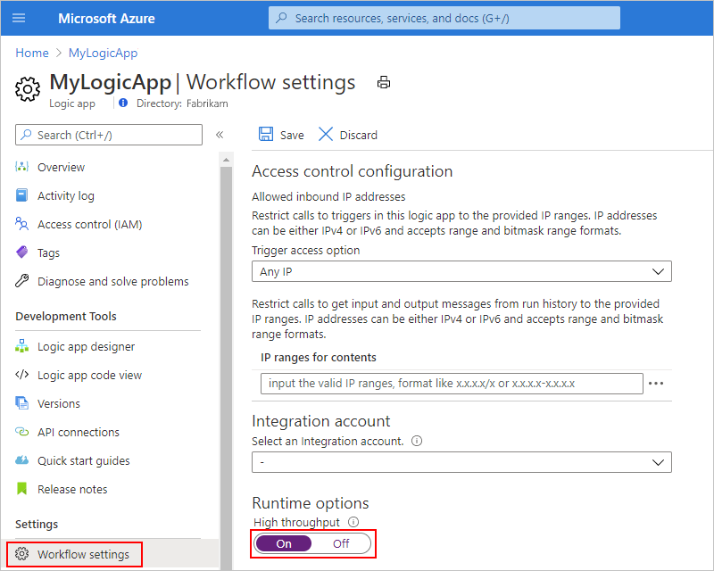

# Limits and configuration reference for Azure Logic Apps

> For Power Automate, review [Limits and configuration in Power Automate](/power-automate/limits-and-config).

This reference guide describes the limits and configuration information for Azure Logic Apps and related resources. Based on your scenario, solution requirements, the capabilities that you want, and the environment where you want to run your workflows, you choose whether to create a Consumption logic app workflow that runs in *multi-tenant* Azure Logic Apps or an integration service environment (ISE). Or, create a Standard logic app workflow that runs in *single-tenant* Azure Logic Apps or an App Service Environment (v3 - Windows plans only).

> [!NOTE]
> Many limits are the same across the available environments where Azure Logic Apps runs, but differences are noted where they exist. 

The following table briefly summarizes differences between a Consumption logic app and a Standard logic app. You'll also learn how single-tenant Azure Logic Apps compares to multi-tenant Azure Logic Apps and an ISE for deploying, hosting, and running your logic app workflows.

[!INCLUDE [Logic app resource type and environment differences](../../includes/logic-apps-resource-environment-differences-table.md)]

<a name="definition-limits"></a>

## Workflow definition limits

The following tables list the values for a single workflow definition:

| Name | Limit | Notes |
| ---- | ----- | ----- |
| Workflows per region per Azure subscription | - Consumption: 1,000 workflows where each logic app is limited to 1 workflow <br><br>- Standard: Unlimited, based on the selected hosting plan, app activity, size of machine instances, and resource usage, where each logic app can have multiple workflows ||
| Workflow - Maximum name length | - Consumption: 80 characters <br><br>- Standard: 32 characters ||
| Triggers per workflow | 10 triggers | This limit applies only when you work on the JSON workflow definition, whether in code view or an Azure Resource Manager (ARM) template, not the designer. |
| Actions per workflow | 500 actions | To extend this limit, you can use nested workflows as necessary. |
| Actions nesting depth | 8 actions | To extend this limit, you can use nested workflows as necessary. |
| Single trigger or action - Maximum name length | 80 characters ||
| Single trigger or action - Maximum input or output size | 104,857,600 bytes <br>(105 MB) | To change the default value in the single-tenant service, review [Edit host and app settings for logic apps in single-tenant Azure Logic Apps](edit-app-settings-host-settings.md). |
| Single action - Maximum combined inputs and outputs size | 209,715,200 bytes <br>(210 MB) | To change the default value in the single-tenant service, review [Edit host and app settings for logic apps in single-tenant Azure Logic Apps](edit-app-settings-host-settings.md). |
| Expression character limit | 8,192 characters ||
| `description` - Maximum length | 256 characters ||
| `parameters` - Maximum number of items | 50 parameters ||
| `outputs` - Maximum number items | 10 outputs ||
| `trackedProperties` - Maximum size | 8,000 characters ||

<a name="run-duration-retention-limits"></a>

## Run duration and history retention limits

The following table lists the values for a single workflow run:

| Name | Multi-tenant | Single-tenant | Integration service environment | Notes |
|------|--------------|---------------|---------------------------------|-------|
| Run history retention in storage | 90 days | 90 days <br>(Default) | 366 days | The amount of time to keep a workflow's run history in storage after a run starts. <br><br>**Note**: If the workflow's run duration exceeds the retention limit, this run is removed from the run history in storage. If a run isn't immediately removed after reaching the retention limit, the run is removed within 7 days. <br><br>Whether a run completes or times out, run history retention is always calculated by using the run's start time and the current limit specified in the workflow setting, [**Run history retention in days**](#change-retention). No matter the previous limit, the current limit is always used for calculating retention. <br><br>For more information, review [Change duration and run history retention in storage](#change-retention). |
| Run duration | 90 days | - Stateful workflow: 90 days <br>(Default) <br><br>- Stateless workflow: 5 min <br>(Default) | 366 days | The amount of time that a workflow can continue running before forcing a timeout. The run duration is calculated by using a run's start time and the limit that's specified in the workflow setting, [**Run history retention in days**](#change-duration) at that start time. <br><br>**Important**: Make sure the run duration value is always less than or equal to the run history retention in storage value. Otherwise, run histories might be deleted before the associated jobs are complete. <br><br>For more information, review [Change run duration and history retention in storage](#change-duration). |
| Recurrence interval | - Min: 1 sec <br><br>- Max: 500 days | - Min: 1 sec <br><br>- Max: 500 days | - Min: 1 sec <br><br>- Max: 500 days ||

<a name="change-duration"></a>
<a name="change-retention"></a>

## Change run duration and history retention in storage

If a run's duration exceeds the current run history retention limit, the run is removed from the runs history in storage. To avoid losing run history, make sure that the retention limit is *always* more than the run's longest possible duration.

### [Consumption](#tab/consumption)

For Consumption logic app workflows, the same setting controls the maximum number of days that a workflow can run and for keeping run history in storage.

* In multi-tenant Azure Logic Apps, the 90-day default limit is the same as the maximum limit. You can only decrease this value.

* In an ISE, you can decrease or increase the 90-day default limit.

For example, suppose that you reduce the retention limit from 90 days to 30 days. A 60-day-old run is removed from the runs history. If you increase the retention period from 30 days to 60 days, a 20-day-old run stays in the runs history for another 40 days.

#### Portal

1. In the [Azure portal](https://portal.azure.com) search box, open your logic app workflow in the designer.

1. On the logic app menu, select **Workflow settings**.

1. Under **Runtime options**, from the **Run history retention in days** list, select **Custom**.

1. Drag the slider to change the number of days that you want.

1. When you're done, on the **Workflow settings** toolbar, select **Save**.

#### ARM template

If you use an Azure Resource Manager template, this setting appears as a property in your workflow's resource definition, which is described in the [Microsoft.Logic workflows template reference](/azure/templates/microsoft.logic/workflows):

```json
{
   "name": "{logic-app-name}",
   "type": "Microsoft.Logic/workflows",
   "location": "{Azure-region}",
   "apiVersion": "2019-05-01",
   "properties": {
      "definition": {},
      "parameters": {},
      "runtimeConfiguration": {
         "lifetime": {
            "unit": "day",
            "count": {number-of-days}
         }
      }
   }
}
```

#### [Standard](#tab/standard)

For Standard logic app workflows, you can decrease or increase the 90-day default limit, but you need to add the following settings and their values to your logic app resource or project:

* An app setting named [**Workflows.RuntimeConfiguration.RetentionInDays**](edit-app-settings-host-settings.md#reference-local-settings-json)

* A host setting named [**Runtime.FlowMaintenanceJob.RetentionCooldownInterval**](edit-app-settings-host-settings.md#run-duration-history)

By default, the app setting named **Workflows.RuntimeConfiguration.RetentionInDays** is set to keep 90 days of data. The host setting named **Runtime.FlowMaintenanceJob.RetentionCooldownInterval** is set to check every 7 days for old data to delete. If you leave these default values, you might see data *up to* 97 days old. For example, suppose Azure Logic Apps checks on Day X and deletes data older than Day X - 90 days, and then waits for 7 days before running again. This behavior results in data that ages up to 97 days before the job runs again. However, if you set the interval to 1 day, but leave the retention days at the default value, the maximum delay to delete old data is 90+1 days.

#### Portal

1. [Follow these steps to add the app setting named **Workflows.RuntimeConfiguration.RetentionInDays**](edit-app-settings-host-settings.md?tabs=azure-portal#manage-app-settings), and set the value to the number days that you want to keep your workflow run history.

1. [Follow these steps to add the host setting named **Runtime.FlowMaintenanceJob.RetentionCooldownInterval**](edit-app-settings-host-settings.md#manage-host-settings-portal), and set the value to the number of days as the interval between when to check for and delete run history that you don't want to keep.

#### Visual Studio Code

1. [Follow these steps to add the app setting named **Workflows.RuntimeConfiguration.RetentionInDays**](edit-app-settings-host-settings.md?tabs=visual-studio-code#manage-app-settings), and set the value to the number days that you want to keep your workflow run history.

1. [Follow these steps to add the host setting named **Runtime.FlowMaintenanceJob.RetentionCooldownInterval**](edit-app-settings-host-settings.md#manage-host-settings-visual-studio-code), and set the value to the number of days as the interval between when to check for and delete run history that you don't want to keep.

---

<a name="concurrency-looping-and-debatching-limits"></a>
<a name="looping-debatching-limits"></a>

## Looping, concurrency, and debatching limits

The following table lists the values for a single workflow run:

### Loop actions

<a name="for-each-loop"></a>

#### For each loop

The following table lists the values for a **For each** loop:

| Name | Multi-tenant | Single-tenant | Integration service environment | Notes |
|------|--------------|---------------|---------------------------------|-------|
| Array items | 100,000 items | - Stateful workflow: 100,000 items <br>(Default) <br><br>- Stateless workflow: 100 items <br>(Default) | 100,000 items | The number of array items that a **For each** loop can process. <br><br>To filter larger arrays, you can use the [query action](logic-apps-perform-data-operations.md#filter-array-action). <br><br>To change the default limit in the single-tenant service, review [Edit host and app settings for logic apps in single-tenant Azure Logic Apps](edit-app-settings-host-settings.md). |
| Concurrent iterations | Concurrency off: 20 <br><br>Concurrency on: <br><br>- Default: 20 <br>- Min: 1 <br>- Max: 50 | Concurrency off: 20 <br>(Default) <br><br>Concurrency on: <br><br>- Default: 20 <br>- Min: 1 <br>- Max: 50 | Concurrency off: 20 <br><br>Concurrency on: <br><br>- Default: 20 <br>- Min: 1 <br>- Max: 50 | The number of **For each** loop iterations that can run at the same time, or in parallel. <br><br>To change this value in the multi-tenant service, see [Change **For each** concurrency limit](../logic-apps/logic-apps-workflow-actions-triggers.md#change-for-each-concurrency) or [Run **For each** loops sequentially](../logic-apps/logic-apps-workflow-actions-triggers.md#sequential-for-each). <br><br>To change the default limit in the single-tenant service, review [Edit host and app settings for logic apps in single-tenant Azure Logic Apps](edit-app-settings-host-settings.md). |

<a name="until-loop"></a>

#### Until loop

The following table lists the values for an **Until** loop:

| Name | Multi-tenant | Single-tenant | Integration service environment | Notes |
|------|--------------|---------------|---------------------------------|-------|
| Iterations | - Default: 60 <br>- Min: 1 <br>- Max: 5,000 | Stateful workflow: <br><br>- Default: 60 <br>- Min: 1 <br>- Max: 5,000 <br><br>Stateless workflow: <br><br>- Default: 60 <br>- Min: 1 <br>- Max: 100 | - Default: 60 <br>- Min: 1 <br>- Max: 5,000 | The number of cycles that an **Until** loop can have during a workflow run. <br><br>To change this value in the multi-tenant service, in the **Until** loop shape, select **Change limits**, and specify the value for the **Count** property. <br><br>To change the default value in the single-tenant service, review [Edit host and app settings for logic apps in single-tenant Azure Logic Apps](edit-app-settings-host-settings.md). |
| Timeout | Default: PT1H (1 hour) | Stateful workflow: PT1H (1 hour) <br><br>Stateless workflow: PT5M (5 min) | Default: PT1H (1 hour) | The amount of time that the **Until** loop can run before exiting and is specified in [ISO 8601 format](https://en.wikipedia.org/wiki/ISO_8601). The timeout value is evaluated for each loop cycle. If any action in the loop takes longer than the timeout limit, the current cycle doesn't stop. However, the next cycle doesn't start because the limit condition isn't met. <br><br>To change this value in the multi-tenant service, in the **Until** loop shape, select **Change limits**, and specify the value for the **Timeout** property. <br><br>To change the default value in the single-tenant service, review [Edit host and app settings for logic apps in single-tenant Azure Logic Apps](edit-app-settings-host-settings.md). |

<a name="concurrency-debatching"></a>

### Concurrency and debatching

| Name | Multi-tenant | Single-tenant | Integration service environment | Notes |
|------|--------------|---------------|---------------------------------|-------|
| Trigger - concurrent runs | Concurrency off: Unlimited <br><br>Concurrency on (irreversible): <br><br>- Default: 25 <br>- Min: 1 <br>- Max: 100 | Concurrency off: Unlimited <br><br>Concurrency on (irreversible): <br><br>- Default: 100 <br>- Min: 1 <br>- Max: 100 | Concurrency off: Unlimited <br><br>Concurrency on (irreversible): <br><br>- Default: 25 <br>- Min: 1 <br>- Max: 100 | The number of concurrent runs that a trigger can start at the same time, or in parallel. <br><br>**Note**: When concurrency is turned on, the **SplitOn** limit is reduced to 100 items for [debatching arrays](../logic-apps/logic-apps-workflow-actions-triggers.md#split-on-debatch). <br><br>To change this value in the multi-tenant service, see [Change trigger concurrency limit](../logic-apps/logic-apps-workflow-actions-triggers.md#change-trigger-concurrency) or [Trigger instances sequentially](../logic-apps/logic-apps-workflow-actions-triggers.md#sequential-trigger). <br><br>To change the default value in the single-tenant service, review [Edit host and app settings for logic apps in single-tenant Azure Logic Apps](edit-app-settings-host-settings.md). |
| Maximum waiting runs | Concurrency off: <br><br>- Min: 1 run <br><br>- Max: 50 runs <br><br>Concurrency on: <br><br>- Min: 10 runs plus the number of concurrent runs <br><br>- Max: 100 runs | Concurrency off: <br><br>- Min: 1 run <br>(Default) <br><br>- Max: 50 runs <br>(Default) <br><br>Concurrency on: <br><br>- Min: 10 runs plus the number of concurrent runs <br><br>- Max: 200 runs <br>(Default) | Concurrency off: <br><br>- Min: 1 run <br><br>- Max: 50 runs <br><br>Concurrency on: <br><br>- Min: 10 runs plus the number of concurrent runs <br><br>- Max: 100 runs | The number of workflow instances that can wait to run when your current workflow instance is already running the maximum concurrent instances. <br><br>To change this value in the multi-tenant service, see [Change waiting runs limit](../logic-apps/logic-apps-workflow-actions-triggers.md#change-waiting-runs). <br><br>To change the default value in the single-tenant service, review [Edit host and app settings for logic apps in single-tenant Azure Logic Apps](edit-app-settings-host-settings.md). |
| **SplitOn** items | Concurrency off: 100,000 items <br><br>Concurrency on: 100 items | Concurrency off: 100,000 items <br><br>Concurrency on: 100 items | Concurrency off: 100,000 items <br>(Default) <br><br>Concurrency on: 100 items <br>(Default) | For triggers that return an array, you can specify an expression that uses a **SplitOn** property that [splits or debatches array items into multiple workflow instances](../logic-apps/logic-apps-workflow-actions-triggers.md#split-on-debatch) for processing, rather than use a **For each** loop. This expression references the array to use for creating and running a workflow instance for each array item. <br><br>**Note**: When concurrency is turned on, the **SplitOn** limit is reduced to 100 items. |

<a name="throughput-limits"></a>

## Throughput limits

The following table lists the values for a single workflow definition:

| Name | Multi-tenant | Single-tenant | Notes |
|------|--------------|---------------|-------|
| Action - Executions per 5-minute rolling interval | Default: 100,000 executions <br>- High throughput mode: 300,000 executions | None | In the multi-tenant service, you can raise the default value to the maximum value for your workflow. For more information, see [Run in high throughput mode](#run-high-throughput-mode), which is in preview. Or, you can [distribute the workload across more than one workflow](handle-throttling-problems-429-errors.md#logic-app-throttling) as necessary. |
| Action - Concurrent outbound calls | ~2,500 calls | None | You can reduce the number of concurrent requests or reduce the duration as necessary. |
| Managed connector throttling | Throttling limit varies based on connector | Throttling limit varies based on connector | For multi-tenant, review [each managed connector's technical reference page](/connectors/connector-reference/connector-reference-logicapps-connectors). <br><br>For more information about handling connector throttling, review [Handle throttling problems ("429 - Too many requests" errors)](handle-throttling-problems-429-errors.md#connector-throttling). |
| Runtime endpoint - Concurrent inbound calls | ~1,000 calls | None | You can reduce the number of concurrent requests or reduce the duration as necessary. |
| Runtime endpoint - Read calls per 5 min  | 60,000 read calls | None | This limit applies to calls that get the raw inputs and outputs from a workflow's run history. You can distribute the workload across more than one workflow as necessary. |
| Runtime endpoint - Invoke calls per 5 min | 45,000 invoke calls | None | You can distribute workload across more than one workflow as necessary. |
| Content throughput per 5 min | 6 GB | None | For example, suppose the backend has 100 workers. Each worker has a limit of 60 MB, which is the result from dividing 6 GB by 100 workers. You can distribute workload across more than one workflow as necessary. |

<a name="run-high-throughput-mode"></a>

### Run in high throughput mode

For a single workflow definition, the number of actions that run every 5 minutes has a [default limit](../logic-apps/logic-apps-limits-and-config.md#throughput-limits). To raise the default value to the [maximum value](../logic-apps/logic-apps-limits-and-config.md#throughput-limits) for your workflow, which is three times the default value, you can enable high throughput mode, which is in preview. Or, you can [distribute the workload across more than one workflow](../logic-apps/handle-throttling-problems-429-errors.md#logic-app-throttling) as necessary.

#### [Portal (multi-tenant service)](#tab/azure-portal)

1. In the Azure portal, on your logic app's menu, under **Settings**, select **Workflow settings**.

1. Under **Runtime options** > **High throughput**, change the setting to **On**.

   

#### [Resource Manager Template](#tab/azure-resource-manager)

To enable this setting in an ARM template for deploying your logic app, in the `properties` object for your logic app's resource definition, add the `runtimeConfiguration` object with the `operationOptions` property set to `OptimizedForHighThroughput`:

```json
{
   <template-properties>
   "resources": [
      // Start logic app resource definition
      {
         "properties": {
            <logic-app-resource-definition-properties>,
            <logic-app-workflow-definition>,
            <more-logic-app-resource-definition-properties>,
            "runtimeConfiguration": {
               "operationOptions": "OptimizedForHighThroughput"
            }
         },
         "name": "[parameters('LogicAppName')]",
         "type": "Microsoft.Logic/workflows",
         "location": "[parameters('LogicAppLocation')]",
         "tags": {},
         "apiVersion": "2016-06-01",
         "dependsOn": [
         ]
      }
      // End logic app resource definition
   ],
   "outputs": {}
}
```

For more information about your logic app resource definition, review [Overview: Automate deployment for Azure Logic Apps by using Azure Resource Manager templates](../logic-apps/logic-apps-azure-resource-manager-templates-overview.md#logic-app-resource-definition).

---

### Integration service environment (ISE)

* [Developer ISE SKU](../logic-apps/connect-virtual-network-vnet-isolated-environment-overview.md#ise-level): Provides up to 500 executions per minute, but note these considerations:

  * Make sure that you use this SKU only for exploration, experiments, development, or testing - not for production or performance testing. This SKU has no service-level agreement (SLA), scale up capability, or redundancy during recycling, which means that you might experience delays or downtime.

  * Backend updates might intermittently interrupt service.

* [Premium ISE SKU](../logic-apps/connect-virtual-network-vnet-isolated-environment-overview.md#ise-level): The following table describes this SKU's throughput limits, but to exceed these limits in normal processing, or run load testing that might go above these limits, [contact the Logic Apps team](mailto://logicappsemail@microsoft.com) for help with your requirements.

  | Name | Limit | Notes |
  |------|-------|-------|
  | Base unit execution limit | System-throttled when infrastructure capacity reaches 80% | Provides ~4,000 action executions per minute, which is ~160 million action executions per month |
  | Scale unit execution limit | System-throttled when infrastructure capacity reaches 80% | Each scale unit can provide ~2,000 more action executions per minute, which is ~80 million more action executions per month |
  | Maximum scale units that you can add | 10 scale units | |

<a name="gateway-limits"></a>

## Data gateway limits

Azure Logic Apps supports write operations, including inserts and updates, through the on-premises data gateway. However, these operations have [limits on their payload size](/data-integration/gateway/service-gateway-onprem#considerations).

<a name="retry-policy-limits"></a>

## Retry policy limits

The following table lists the retry policy limits for a trigger or action, based on whether you have a [Consumption or Standard logic app workflow](logic-apps-overview.md#resource-environment-differences).

| Name | Consumption limit | Standard limit | Notes |
|------|-------------------|----------------|-------|
| Retry attempts | - Default: 4 attempts <br> - Max: 90 attempts | - Default: 4 attempts | To change the default limit in Consumption logic app workflows, use the [retry policy parameter](logic-apps-exception-handling.md#retry-policies). To change the default limit in Standard logic app workflows, review [Edit host and app settings for logic apps in single-tenant Azure Logic Apps](edit-app-settings-host-settings.md). |
| Retry interval | None | Default: 7 sec | To change the default limit in Consumption logic app workflows, use the [retry policy parameter](logic-apps-exception-handling.md#retry-policies). <br><br>To change the default limit in Standard logic app workflows, review [Edit host and app settings for logic apps in single-tenant Azure Logic Apps](edit-app-settings-host-settings.md). |

<a name="variables-action-limits"></a>

## Variables action limits

The following table lists the values for a single workflow definition:

| Name | Multi-tenant | Single-tenant | Integration service environment | Notes |
|------|--------------|---------------|---------------------------------|-------|
| Variables per workflow | 250 variables | 250 variables <br>(Default) | 250 variables ||
| Variable - Maximum content size | 104,857,600 characters | Stateful workflow: 104,857,600 characters <br>(Default) <br><br>Stateless workflow: 1,024 characters <br>(Default) | 104,857,600 characters | To change the default value in the single-tenant service, review [Edit host and app settings for logic apps in single-tenant Azure Logic Apps](edit-app-settings-host-settings.md). |
| Variable (Array type) - Maximum number of array items | 100,000 items | 100,000 items <br>(Default) | Premium SKU: 100,000 items <br><br>Developer SKU: 5,000 items | To change the default value in the single-tenant service, review [Edit host and app settings for logic apps in single-tenant Azure Logic Apps](edit-app-settings-host-settings.md). |

<a name="http-limits"></a>

## HTTP request limits

The following tables list the values for a single inbound or outbound call:

<a name="http-timeout-limits"></a>

### Timeout duration

By default, the HTTP action and APIConnection actions follow the [standard asynchronous operation pattern](/azure/architecture/patterns/async-request-reply), while the Response action follows the *synchronous operation pattern*. Some managed connector operations make asynchronous calls or listen for webhook requests, so the timeout for these operations might be longer than the following limits. For more information, review [each connector's technical reference page](/connectors/connector-reference/connector-reference-logicapps-connectors) and also the [Workflow triggers and actions](../logic-apps/logic-apps-workflow-actions-triggers.md#http-action) documentation.

> [!NOTE]
> For the **Logic App (Standard)** resource type in the single-tenant service, stateless workflows can only run *synchronously*.

| Name | Multi-tenant | Single-tenant | Integration service environment | Notes |
|------|--------------|---------------|---------------------------------|-------|
| Outbound request | 120 sec <br>(2 min) | 235 sec <br>(3.9 min) <br>(Default) | 240 sec <br>(4 min) | Examples of outbound requests include calls made by the HTTP trigger or action. <br><br>**Tip**: For longer running operations, use an [asynchronous polling pattern](../logic-apps/logic-apps-create-api-app.md#async-pattern) or an ["Until" loop](../logic-apps/logic-apps-workflow-actions-triggers.md#until-action). To work around timeout limits when you call another workflow that has a [callable endpoint](logic-apps-http-endpoint.md), you can use the built-in Azure Logic Apps action instead, which you can find in the designer's operation picker under **Built-in**. <br><br>To change the default limit in the single-tenant service, review [Edit host and app settings for logic apps in single-tenant Azure Logic Apps](edit-app-settings-host-settings.md). |
| Inbound request | 120 sec <br>(2 min) | 235 sec <br>(3.9 min) <br>(Default) | 240 sec <br>(4 min) | Examples of inbound requests include calls received by the Request trigger, HTTP Webhook trigger, and HTTP Webhook action. <br><br>**Note**: For the original caller to get the response, all steps in the response must finish within the limit unless you call another nested workflow. For more information, see [Call, trigger, or nest logic apps](../logic-apps/logic-apps-http-endpoint.md). <br><br>To change the default limit in the single-tenant service, review [Edit host and app settings for logic apps in single-tenant Azure Logic Apps](edit-app-settings-host-settings.md). |

<a name="content-storage-size-limits"></a>

### Request trigger and webhook trigger size limits

| Name | Multi-tenant | Single-tenant | Notes |
|------|--------------|---------------|-------|
| Request trigger (inbound) and webhook-based triggers - Content size limit per 5-minute rolling interval per workflow | 3,145,728 KB | None | This limit applies only to the content size for inbound requests received by the Request trigger or any webhook trigger. <br><br>For example, suppose the backend has 100 workers. Each worker has a limit of 31,457,280 bytes, which is the result from dividing 3,145,728,000 bytes by 100 workers. To avoid experiencing premature throttling for the Request trigger, use a new HTTP client for each request, which helps evenly distribute the calls across all nodes. For a webhook trigger, you might have to use multiple workflows, which splits the load and avoids throttling. |

<a name="message-size-limits"></a>

### Messages

| Name | Chunking enabled | Multi-tenant | Single-tenant | Integration service environment | Notes |
|------|------------------|--------------|-------------------------|---------------------------------|-------|
| Content download - Maximum number of requests | Yes | 1,000 requests | 1,000 requests <br>(Default) | 1,000 requests ||
| Message size | No | 100 MB | 100 MB | 200 MB | To work around this limit, see [Handle large messages with chunking](../logic-apps/logic-apps-handle-large-messages.md). However, some connectors and APIs don't support chunking or even the default limit. <br><br>- Connectors such as AS2, X12, and EDIFACT have their own [B2B message limits](#b2b-protocol-limits). <br><br>- ISE connectors use the ISE limit, not the non-ISE connector limits. <br><br>To change the default value in the single-tenant service, review [Edit host and app settings for logic apps in single-tenant Azure Logic Apps](edit-app-settings-host-settings.md). |
| Message size per action | Yes | 1 GB | 1,073,741,824 bytes <br>(1 GB) <br>(Default) | 5 GB | This limit applies to actions that either natively support chunking or let you enable chunking in their runtime configuration. <br><br>If you're using an ISE, the Azure Logic Apps engine supports this limit, but connectors have their own chunking limits up to the engine limit, for example, see the [Azure Blob Storage connector's API reference](/connectors/azureblob/). For more information about chunking, see [Handle large messages with chunking](../logic-apps/logic-apps-handle-large-messages.md). <br><br>To change the default value in the single-tenant service, review [Edit host and app settings for logic apps in single-tenant Azure Logic Apps](edit-app-settings-host-settings.md). |
| Content chunk size per action | Yes | Varies per connector | 52,428,800 bytes (52 MB) <br>(Default) | Varies per connector | This limit applies to actions that either natively support chunking or let you enable chunking in their runtime configuration. <br><br>To change the default value in the single-tenant service, review [Edit host and app settings for logic apps in single-tenant Azure Logic Apps](edit-app-settings-host-settings.md). |

### Character limits

| Name | Limit | Notes |
|------|-------|-------|
| Expression evaluation limit | 131,072 characters | The `@concat()`, `@base64()`, `@string()` expressions can't be longer than this limit. |
| Request URL character limit | 16,384 characters | |

<a name="authentication-limits"></a>

### Authentication limits

The following table lists the values for a workflow that starts with a Request trigger and enables [Microsoft Entra ID Open Authentication](../active-directory/develop/index.yml) (Microsoft Entra ID OAuth) for authorizing inbound calls to the Request trigger:

| Name | Limit | Notes |
| ---- | ----- | ----- |
| Microsoft Entra authorization policies | 5 policies | |
| Claims per authorization policy | 10 claims | |
| Claim value - Maximum number of characters | 150 characters |

<a name="switch-action-limits"></a>

## Switch action limits

The following table lists the values for a single workflow definition:

| Name | Limit | Notes |
| ---- | ----- | ----- |
| Maximum number of cases per action | 25 ||

<a name="inline-code-action-limits"></a>

## Inline Code action limits

The following table lists the values for a single workflow definition:

| Name | Multi-tenant | Single-tenant | Integration service environment | Notes |
|------|--------------|---------------|---------------------------------|-------|
| Maximum number of code characters | 1,024 characters | 100,000 characters | 1,024 characters | To use the higher limit, create a **Logic App (Standard)** resource, which runs in single-tenant Azure Logic Apps, either [by using the Azure portal](create-single-tenant-workflows-azure-portal.md) or [by using Visual Studio Code and the **Azure Logic Apps (Standard)** extension](create-single-tenant-workflows-visual-studio-code.md). |
| Maximum duration for running code | 5 sec | 15 sec | 1,024 characters | To use the higher limit, create a **Logic App (Standard)** resource, which runs in single-tenant Azure Logic Apps, either [by using the Azure portal](create-single-tenant-workflows-azure-portal.md) or [by using Visual Studio Code and the **Azure Logic Apps (Standard)** extension](create-single-tenant-workflows-visual-studio-code.md). |

<a name="custom-connector-limits"></a>

## Custom connector limits

In multi-tenant Azure Logic Apps and the integration service environment only, you can create and use [custom managed connectors](/connectors/custom-connectors), which are wrappers around an existing REST API or SOAP API. In single-tenant Azure Logic Apps, you can create and use only [custom built-in connectors](https://techcommunity.microsoft.com/t5/integrations-on-azure/azure-logic-apps-running-anywhere-built-in-connector/ba-p/1921272).

The following table lists the values for custom connectors:

| Name | Multi-tenant | Single-tenant | Integration service environment | Notes |
|------|--------------|---------------|---------------------------------|-------|
| Custom connectors | 1,000 per Azure subscription | Unlimited | 1,000 per Azure subscription ||
| APIs per service | SOAP-based: 50 | Not applicable | SOAP-based: 50 ||
| Parameters per API | SOAP-based: 50 | Not applicable | SOAP-based: 50 ||
| Requests per minute for a custom connector | 500 requests per minute per connection | Based on your implementation | 2,000 requests per minute per *custom connector* ||
| Connection timeout | 2 min | Idle connection: <br>4 min <br><br>Active connection: <br>10 min | 2 min ||

For more information, review the following documentation:

* [Custom managed connectors overview](/connectors/custom-connectors)
* [Enable built-in connector authoring - Visual Studio Code with Azure Logic Apps (Standard) extension](create-single-tenant-workflows-visual-studio-code.md#enable-built-in-connector-authoring)

<a name="managed-identity"></a>

## Managed identity limits

| Name | Limit |
|------|-------|
| Managed identities per logic app resource | - Consumption: Either the system-assigned identity *or* only one user-assigned identity <br><br>- Standard: The system-assigned identity *and* any number of user-assigned identities <br><br>**Note**: By default, a **Logic App (Standard)** resource has the system-assigned managed identity automatically enabled to authenticate connections at runtime. This identity differs from the authentication credentials or connection string that you use when you create a connection. If you disable this identity, connections won't work at runtime. To view this setting, on your logic app's menu, under **Settings**, select **Identity**. |
| Number of logic apps that have a managed identity in an Azure subscription per region | - Consumption: 1,000 logic apps <br>- Standard: Per [Azure App Service limits, if any](../azure-resource-manager/management/azure-subscription-service-limits.md#app-service-limits) |

<a name="integration-account-limits"></a>

## Integration account limits

Each Azure subscription has these integration account limits:

* One [Free tier](../logic-apps/logic-apps-pricing.md#integration-accounts) integration account per Azure region. This tier is available only for public regions in Azure, for example, West US or Southeast Asia, but not for [Microsoft Azure operated by 21Vianet](/azure/china/overview-operations) or [Azure Government](../azure-government/documentation-government-welcome.md).

* 1,000 total integration accounts, including integration accounts in any [integration service environments (ISE)](../logic-apps/connect-virtual-network-vnet-isolated-environment-overview.md) across both [Developer and Premium SKUs](../logic-apps/connect-virtual-network-vnet-isolated-environment-overview.md#ise-level).

* Each ISE, whether [Developer or Premium](../logic-apps/connect-virtual-network-vnet-isolated-environment-overview.md#ise-level), can use a single integration account at no extra cost, although the included account type varies by ISE SKU. You can create more integration accounts for your ISE up to the total limit for an [extra cost](logic-apps-pricing.md#ise-pricing).

  | ISE SKU | Integration account limits |
  |---------|----------------------------|
  | **Premium** | 20 total accounts, including one Standard account at no extra cost. With this SKU, you can have only [Standard](../logic-apps/logic-apps-pricing.md#integration-accounts) accounts. No Free or Basic accounts are permitted. |
  | **Developer** | 20 total accounts, including one [Free](../logic-apps/logic-apps-pricing.md#integration-accounts) account (limited to 1). With this SKU, you can have either combination: <br><br>- A Free account and up to 19 [Standard](../logic-apps/logic-apps-pricing.md#integration-accounts) accounts. <br>- No Free account and up to 20 Standard accounts. <br><br>No Basic or more Free accounts are permitted. <br><br>**Important**: Use the [Developer SKU](../logic-apps/connect-virtual-network-vnet-isolated-environment-overview.md#ise-level) for experimenting, development, and testing, but not for production or performance testing. |

To learn how pricing and billing work for ISEs, see the [Logic Apps pricing model](../logic-apps/logic-apps-pricing.md#ise-pricing). For pricing rates, see [Logic Apps pricing](https://azure.microsoft.com/pricing/details/logic-apps/).

<a name="artifact-number-limits"></a>

### Artifact limits per integration account

The following tables list the values for the number of artifacts limited to each integration account tier. For pricing rates, see [Logic Apps pricing](https://azure.microsoft.com/pricing/details/logic-apps/). To learn how pricing and billing work for integration accounts, see the [Logic Apps pricing model](../logic-apps/logic-apps-pricing.md#integration-accounts).

> [!NOTE]
> Use the Free tier only for exploratory scenarios, not production scenarios. 
> This tier restricts throughput and usage, and has no service-level agreement (SLA).

| Artifact | Free | Basic | Standard | Premium (preview) |
|----------|------|-------|----------|-------------------|
| EDI trading agreements | 10 | 1 | 1,000 | Unlimited |
| EDI trading partners | 25 | 2 | 1,000 | Unlimited |
| Maps | 25 | 500 | 1,000 | Unlimited |
| Schemas | 25 | 500 | 1,000 | Unlimited |
| Assemblies | 10 | 25 | 1,000 | Unlimited, but currently unsupported for export from an ISE. |
| Certificates | 25 | 2 | 1,000 | Unlimited |
| Batch configurations | 5 | 1 | 50 | Unlimited |
| RosettaNet partner interface process (PIP) | 10 | 1 | 500 | Unlimited, but currently unsupported for export from an ISE. |

<a name="artifact-capacity-limits"></a>

### Artifact capacity limits

| Artifact | Limit | Notes |
| -------- | ----- | ----- |
| Assembly | 8 MB | To upload files larger than 2 MB, use an [Azure storage account and blob container](../logic-apps/logic-apps-enterprise-integration-schemas.md). |
| Map (XSLT file) | 8 MB | To upload files larger than 2 MB, use the [Azure Logic Apps REST API - Maps](/rest/api/logic/maps/createorupdate). <br><br>**Note**: The amount of data or records that a map can successfully process is based on the message size and action timeout limits in Azure Logic Apps. For example, if you use an HTTP action, based on [HTTP message size and timeout limits](#http-limits), a map can process data up to the HTTP message size limit if the operation completes within the HTTP timeout limit. |
| Schema | 8 MB | To upload files larger than 2 MB, use an [Azure storage account and blob container](../logic-apps/logic-apps-enterprise-integration-schemas.md). |

<a name="integration-account-throughput-limits"></a>

### Throughput limits

| Runtime endpoint | Free | Basic | Standard | Notes |
|------------------|------|-------|----------|-------|
| Read calls per 5 min | 3,000 | 30,000 | 60,000 | This limit applies to calls that get the raw inputs and outputs from a logic app's run history. You can distribute the workload across more than one account as necessary. |
| Invoke calls per 5 min | 3,000 | 30,000 | 45,000 | You can distribute the workload across more than one account as necessary. |
| Tracking calls per 5 min | 3,000 | 30,000 | 45,000 | You can distribute the workload across more than one account as necessary. |
| Blocking concurrent calls | ~1,000 | ~1,000 | ~1,000 | Same for all SKUs. You can reduce the number of concurrent requests or reduce the duration as necessary. |

<a name="b2b-protocol-limits"></a>

### B2B protocol (AS2, X12, EDIFACT) message size

The following table lists the message size limits that apply to B2B protocols:

| Name | Multi-tenant | Single-tenant | Integration service environment | Notes |
|------|--------------|---------------|---------------------------------|-------|
| AS2 | v2 - 100 MB<br>v1 - 25 MB | Unavailable | v2 - 200 MB <br>v1 - 25 MB | Applies to decode and encode |
| X12 | 50 MB | Unavailable | 50 MB | Applies to decode and encode |
| EDIFACT | 50 MB | Unavailable | 50 MB | Applies to decode and encode |

<a name="configuration"></a>
<a name="firewall-ip-configuration"></a>

## Firewall configuration: IP addresses and service tags

If your environment has strict network requirements and uses a firewall that limits traffic to specific IP addresses, your environment or firewall needs to permit incoming communication received by Azure Logic Apps and outgoing communication sent by Azure Logic Apps. To set up this access, you can create [Azure Firewall rules](../firewall/rule-processing.md) for your firewall to allow access for *both* [inbound](#inbound) and [outbound](#outbound) IP addresses used by Azure Logic Apps in your logic app's Azure region.  *All* logic apps in the same region use the same IP address ranges.

> [!NOTE]
> If you're using [Power Automate](/power-automate/getting-started), some actions, such as **HTTP** and **HTTP + OpenAPI**, 
> go directly through the Azure Logic Apps service and come from the IP addresses that are listed here. For more information 
> about the IP addresses used by Power Automate, see [Limits and configuration for Power Automate](/power-automate/limits-and-config#ip-address-configuration).

For example, suppose your logic apps are deployed in the West US region. To support calls that your logic apps send or receive through built-in triggers and actions, such as the [HTTP trigger or action](../connectors/connectors-native-http.md), your firewall needs to allow access for *all* the Azure Logic Apps service inbound IP addresses *and* outbound IP addresses that exist in the West US region.

If your workflow uses [managed connectors](../connectors/managed.md), such as the Office 365 Outlook connector or SQL connector, or uses [custom connectors](/connectors/custom-connectors/), the firewall also needs to allow access for *all* the [managed connector outbound IP addresses](/connectors/common/outbound-ip-addresses) in your logic app's Azure region. If your workflow uses custom connectors that access on-premises resources through the [on-premises data gateway resource in Azure](logic-apps-gateway-connection.md), you need to set up the gateway installation to allow access for the corresponding [*managed connector* outbound IP addresses](/connectors/common/outbound-ip-addresses). For more information about setting up communication settings on the gateway, review these topics:

* [Adjust communication settings for the on-premises data gateway](/data-integration/gateway/service-gateway-communication)
* [Configure proxy settings for the on-premises data gateway](/data-integration/gateway/service-gateway-proxy)

<a name="ip-setup-considerations"></a>

### Firewall IP configuration considerations

Before you set up your firewall with IP addresses, review these considerations:

* To help you simplify any security rules that you want to create, you can optionally use [service tags](../virtual-network/service-tags-overview.md) instead, rather than specify IP address prefixes for each region. These tags represent a group of IP address prefixes from a specific Azure service and work across the regions where the Azure Logic Apps service is available:

  * **LogicAppsManagement**: Represents the inbound IP address prefixes for the Azure Logic Apps service.

  * **LogicApps**: Represents the outbound IP address prefixes for the Azure Logic Apps service.

  * **AzureConnectors**: Represents the IP address prefixes for managed connectors that make inbound webhook callbacks to the Azure Logic Apps service and outbound calls to their respective services, such as Azure Storage or Azure Event Hubs.

* For Standard logic app workflows that run in single-tenant Azure Logic Apps, you have to allow access for any trigger or action connections in your workflows. You can allow traffic from [service tags](../virtual-network/service-tags-overview.md) and use the same level of restrictions or policies as Azure App Service. You also need to find and use the fully qualified domain names (FQDNs) for your connections. For more information, review the corresponding sections in the following documentation:

  * [Firewall permissions for single tenant logic apps - Azure portal](create-single-tenant-workflows-azure-portal.md#firewall-setup)
  * [Firewall permissions for single tenant logic apps - Visual Studio Code](create-single-tenant-workflows-visual-studio-code.md#firewall-setup)

* If your logic apps have problems accessing Azure storage accounts that use [firewalls and firewall rules](../storage/common/storage-network-security.md), you have [various other options to enable access](../connectors/connectors-create-api-azureblobstorage.md#access-storage-accounts-behind-firewalls).

  For example, logic apps can't directly access storage accounts that use firewall rules and exist in the same region. However, if you permit the [outbound IP addresses for managed connectors in your region](/connectors/common/outbound-ip-addresses), your logic apps can access storage accounts that are in a different region except when you use the Azure Table Storage or Azure Queue Storage connectors. To access your Table Storage or Queue Storage, you can use the HTTP trigger and actions instead. For other options, see [Access storage accounts behind firewalls](../connectors/connectors-create-api-azureblobstorage.md#access-storage-accounts-behind-firewalls).

<a name="inbound"></a>

### Inbound IP addresses

For Azure Logic Apps to receive incoming communication through your firewall, you have to allow traffic through the inbound IP addresses described in this section for your logic app's Azure region. To help reduce complexity when you create security rules, you can optionally use the [service tag](../virtual-network/service-tags-overview.md), **LogicAppsManagement**, rather than specify the Azure Logic Apps inbound IP address prefixes for each region. If you're using Azure Government, see [Azure Government - Inbound IP addresses](#azure-government-inbound).

> [!NOTE]
> 
> Some managed connectors make inbound webhook callbacks to Azure Logic Apps. If you use access control on the logic app resource, 
> you must make sure that the calls from these target systems (IP addresses) have permissions to access your logic app. The following 
> connectors make inbound webhook callbacks to Azure Logic Apps:
>
> Adobe Creative Cloud, Adobe Sign, Adobe Sign Demo, Adobe Sign Preview, Adobe Sign Stage, Microsoft Sentinel, Event Grid, 
> Microsoft Form, Business Central, Calendly, Common Data Service, DocuSign, DocuSign Demo, Dynamics 365 for Fin & Ops, 
> LiveChat, Office 365* Outlook, Outlook.com, Parserr, SAP*, Shifts for Microsoft Teams, Teamwork Projects, Typeform, and so on:
>
> - **Office 365**: The return caller is actually the Office 365 connector. You can specify the managed connector outbound 
> IP address prefixes for each region, or optionally, you can use the **AzureConnectors** service tag for these managed connectors.
>
> - **SAP**: The return caller depends on whether the deployment environment is either multi-tenant Azure or ISE. 
> In the multi-tenant environment, the on-premises data gateway makes the call back to the Azure Logic Apps service. 
> In an ISE, the SAP connector makes the call back to Azure Logic Apps.

<a name="multi-tenant-inbound"></a>

#### Multi-tenant - Inbound IP addresses

| Region | Azure Logic Apps IP |
|--------|---------------------|
| Australia East | 13.75.153.66, 104.210.89.222, 104.210.89.244, 52.187.231.161, 20.53.94.103, 20.53.107.215 |
| Australia Southeast | 13.73.115.153, 40.115.78.70, 40.115.78.237, 52.189.216.28, 52.255.42.110, 20.70.114.64 |
| Brazil South | 191.235.86.199, 191.235.95.229, 191.235.94.220, 191.234.166.198, 20.201.66.147, 20.201.25.72 |
| Brazil Southeast | 20.40.32.59, 20.40.32.162, 20.40.32.80, 20.40.32.49, 20.206.42.14, 20.206.43.33 |
| Canada Central | 13.88.249.209, 52.233.30.218, 52.233.29.79, 40.85.241.105, 20.104.14.9, 20.48.133.182 |
| Canada East | 52.232.129.143, 52.229.125.57, 52.232.133.109, 40.86.202.42, 20.200.63.149, 52.229.126.142 |
| Central India | 52.172.157.194, 52.172.184.192, 52.172.191.194, 104.211.73.195, 20.204.203.110, 20.204.212.77 |
| Central US | 13.67.236.76, 40.77.111.254, 40.77.31.87, 104.43.243.39, 13.86.98.126, 20.109.202.37 |
| East Asia | 168.63.200.173, 13.75.89.159, 23.97.68.172, 40.83.98.194, 20.187.254.129, 20.187.189.246 |
| East US | 137.135.106.54, 40.117.99.79, 40.117.100.228, 137.116.126.165, 52.226.216.209, 40.76.151.124, 20.84.29.150, 40.76.174.148 |
| East US 2 | 40.84.25.234, 40.79.44.7, 40.84.59.136, 40.70.27.253, 20.96.58.28, 20.96.89.98, 20.96.90.28 |
| France Central | 52.143.162.83, 20.188.33.169, 52.143.156.55, 52.143.158.203, 20.40.139.209, 51.11.237.239 |
| France South | 52.136.131.145, 52.136.129.121, 52.136.130.89, 52.136.131.4, 52.136.134.128, 52.136.143.218 |
| Germany North | 51.116.211.29, 51.116.208.132, 51.116.208.37, 51.116.208.64, 20.113.206.147, 20.113.197.46 |
| Germany West Central | 51.116.168.222, 51.116.171.209, 51.116.233.40, 51.116.175.0, 20.113.12.69, 20.113.11.8 |
| Japan East | 13.71.146.140, 13.78.84.187, 13.78.62.130, 13.78.43.164, 20.191.174.52, 20.194.207.50 |
| Japan West | 40.74.140.173, 40.74.81.13, 40.74.85.215, 40.74.68.85, 20.89.226.241, 20.89.227.25 |
| Jio India West | 20.193.206.48,20.193.206.49,20.193.206.50,20.193.206.51 |
| Korea Central | 52.231.14.182, 52.231.103.142, 52.231.39.29, 52.231.14.42, 20.200.207.29, 20.200.231.229 |
| Korea South | 52.231.166.168, 52.231.163.55, 52.231.163.150, 52.231.192.64, 20.200.177.151, 20.200.177.147 |
| North Central US | 168.62.249.81, 157.56.12.202, 65.52.211.164, 65.52.9.64, 52.162.177.104, 23.101.174.98 |
| North Europe | 13.79.173.49, 52.169.218.253, 52.169.220.174, 40.112.90.39, 40.127.242.203, 51.138.227.94, 40.127.145.51 |
| Norway East | 51.120.88.93, 51.13.66.86, 51.120.89.182, 51.120.88.77, 20.100.27.17, 20.100.36.102 |       
| Norway West | 51.120.220.160, 51.120.220.161, 51.120.220.162, 51.120.220.163, 51.13.155.184, 51.13.151.90 |
| Poland Central | 20.215.144.231, 20.215.145.0 |
| South Africa North | 102.133.228.4, 102.133.224.125, 102.133.226.199, 102.133.228.9, 20.87.92.64, 20.87.91.171 |
| South Africa West | 102.133.72.190, 102.133.72.145, 102.133.72.184, 102.133.72.173, 40.117.9.225, 102.133.98.91 |
| South Central US | 13.65.98.39, 13.84.41.46, 13.84.43.45, 40.84.138.132, 20.94.151.41, 20.88.209.113 |
| South India | 52.172.9.47, 52.172.49.43, 52.172.51.140, 104.211.225.152, 104.211.221.215,104.211.205.148 |
| Southeast Asia | 52.163.93.214, 52.187.65.81, 52.187.65.155, 104.215.181.6, 20.195.49.246, 20.198.130.155, 23.98.121.180 |
| Switzerland North | 51.103.128.52, 51.103.132.236, 51.103.134.138, 51.103.136.209, 20.203.230.170, 20.203.227.226 |
| Switzerland West | 51.107.225.180, 51.107.225.167, 51.107.225.163, 51.107.239.66, 51.107.235.139,51.107.227.18 |
| UAE Central | 20.45.75.193, 20.45.64.29, 20.45.64.87, 20.45.71.213 |
| UAE North | 20.46.42.220, 40.123.224.227, 40.123.224.143, 20.46.46.173, 20.74.255.147, 20.74.255.37 |
| UK South | 51.140.79.109, 51.140.78.71, 51.140.84.39, 51.140.155.81, 20.108.102.180, 20.90.204.232, 20.108.148.173, 20.254.10.157 |
| UK West | 51.141.48.98, 51.141.51.145, 51.141.53.164, 51.141.119.150, 51.104.62.166, 51.141.123.161 |
| West Central US | 52.161.26.172, 52.161.8.128, 52.161.19.82, 13.78.137.247, 52.161.64.217, 52.161.91.215 |
| West Europe | 13.95.155.53, 52.174.54.218, 52.174.49.6, 20.103.21.113, 20.103.18.84, 20.103.57.210, 20.101.174.52, 20.93.236.81, 20.103.94.255, 20.82.87.229, 20.76.171.34, 20.103.84.61 |
| West India | 104.211.164.112, 104.211.165.81, 104.211.164.25, 104.211.157.237, 104.211.167.12,104.211.166.35 |
| West US | 52.160.90.237, 138.91.188.137, 13.91.252.184, 157.56.160.212, 104.40.34.112, 52.160.68.27, 13.88.168.158, 104.42.40.164, 13.87.207.79, 13.87.204.210, 168.62.9.100 |
| West US 2 | 13.66.224.169, 52.183.30.10, 52.183.39.67, 13.66.128.68, 20.99.190.19, 20.72.244.108 |
| West US 3 | 20.150.172.240, 20.150.172.242, 20.150.172.243, 20.150.172.241, 20.106.116.172, 20.106.116.225 |

<a name="azure-government-inbound"></a>

#### Azure Government - Inbound IP addresses

| Azure Government region | Azure Logic Apps IP |
|-------------------------|---------------------|
| US Gov Arizona | 52.244.67.164, 52.244.67.64, 52.244.66.82, 52.126.52.254, 52.126.53.145, 52.182.49.105, 52.182.49.175 |
| US Gov Texas | 52.238.119.104, 52.238.112.96, 52.238.119.145, 52.245.171.151, 52.245.163.42 |
| US Gov Virginia | 52.227.159.157, 52.227.152.90, 23.97.4.36, 13.77.239.182, 13.77.239.190 |
| US DoD Central | 52.182.49.204, 52.182.52.106 |

<a name="outbound"></a>

### Outbound IP addresses

For Azure Logic Apps to send outgoing communication through your firewall, you have to allow traffic in your logic app's Azure region for *all the outbound IP addresses* described in this section. If you're using Azure Government, see [Azure Government - Outbound IP addresses](#azure-government-outbound).

> [!TIP]
> 
> To help reduce complexity when you create security rules, you can optionally use the [service tag](../virtual-network/service-tags-overview.md), 
> **LogicApps**, rather than specify the Azure Logic Apps outbound IP address prefixes for each region. Optionally, you can also use the 
> **AzureConnectors** service tag for managed connectors that make outbound calls to their respective services, such as Azure Storage or 
> Azure Event Hubs, rather than specify the outbound managed connector IP address prefixes for each region. These tags work across the 
> regions where Azure Logic Apps is available.

If your workflow also uses any [managed connectors](../connectors/managed.md), such as the Office 365 Outlook connector or SQL connector, or uses any [custom connectors](/connectors/custom-connectors/), your firewall has to allow traffic in your logic app's Azure region for [*all the managed connector outbound IP addresses*](/connectors/common/outbound-ip-addresses/#azure-logic-apps). If your workflow uses custom connectors that access on-premises resources through the [on-premises data gateway resource in Azure](logic-apps-gateway-connection.md), you need to set up the gateway installation to allow access for the corresponding [*managed connector* outbound IP addresses](/connectors/common/outbound-ip-addresses#azure-logic-apps). For more information about setting up communication settings on the gateway, review these topics:

* [Adjust communication settings for the on-premises data gateway](/data-integration/gateway/service-gateway-communication)
* [Configure proxy settings for the on-premises data gateway](/data-integration/gateway/service-gateway-proxy)

<a name="multi-tenant-outbound"></a>

#### Multi-tenant - Outbound IP addresses

This section lists the outbound IP addresses that Azure Logic Apps requires in your logic app's Azure region to communicate through your firewall. Also, if your workflow uses any managed connectors or custom connectors, your firewall has to allow traffic in your logic app's Azure region for [*all the managed connectors' outbound IP addresses*](/connectors/common/outbound-ip-addresses/#azure-logic-apps). If you have custom connectors that access on-premises resources through the on-premises data gateway resource in Azure, set up your *gateway installation* to allow access for the corresponding managed connector outbound IP addresses. 

| Region | Azure Logic Apps IP |
|--------|---------------------|
| Australia East | 13.75.149.4, 104.210.91.55, 104.210.90.241, 52.187.227.245, 52.187.226.96, 52.187.231.184, 52.187.229.130, 52.187.226.139, 20.53.93.188, 20.53.72.170, 20.53.107.208, 20.53.106.182 |
| Australia Southeast | 13.73.114.207, 13.77.3.139, 13.70.159.205, 52.189.222.77, 13.77.56.167, 13.77.58.136, 52.189.214.42, 52.189.220.75, 52.255.36.185, 52.158.133.57, 20.70.114.125, 20.70.114.10 |
| Brazil South | 191.235.82.221, 191.235.91.7, 191.234.182.26, 191.237.255.116, 191.234.161.168, 191.234.162.178, 191.234.161.28, 191.234.162.131, 20.201.66.44, 20.201.64.135, 20.201.24.212, 191.237.207.21 |
| Brazil Southeast | 20.40.32.81, 20.40.32.19, 20.40.32.85, 20.40.32.60, 20.40.32.116, 20.40.32.87, 20.40.32.61, 20.40.32.113, 20.206.41.94, 20.206.41.20, 20.206.42.67, 20.206.40.250 |
| Canada Central | 52.233.29.92, 52.228.39.244, 40.85.250.135, 40.85.250.212, 13.71.186.1, 40.85.252.47, 13.71.184.150, 20.104.13.249, 20.104.9.221, 20.48.133.133, 20.48.132.222 |
| Canada East | 52.232.128.155, 52.229.120.45, 52.229.126.25, 40.86.203.228, 40.86.228.93, 40.86.216.241, 40.86.226.149, 40.86.217.241, 20.200.60.151, 20.200.59.228, 52.229.126.67, 52.229.105.109 |
| Central India | 52.172.154.168, 52.172.186.159, 52.172.185.79, 104.211.101.108, 104.211.102.62, 104.211.90.169, 104.211.90.162, 104.211.74.145, 20.204.204.74, 20.204.202.72, 20.204.212.60, 20.204.212.8 |
| Central US | 13.67.236.125, 104.208.25.27, 40.122.170.198, 40.113.218.230, 23.100.86.139, 23.100.87.24, 23.100.87.56, 23.100.82.16, 52.141.221.6, 52.141.218.55, 20.109.202.36, 20.109.202.29 |
| East Asia | 13.75.94.173, 40.83.127.19, 52.175.33.254, 40.83.73.39, 65.52.175.34, 40.83.77.208, 40.83.100.69, 40.83.75.165, 20.187.254.110, 20.187.250.221, 20.187.189.47, 20.187.188.136 |
| East US | 13.92.98.111, 40.121.91.41, 40.114.82.191, 23.101.139.153, 23.100.29.190, 23.101.136.201, 104.45.153.81, 23.101.132.208, 52.226.216.197, 52.226.216.187, 40.76.151.25, 40.76.148.50, 20.84.29.29, 20.84.29.18, 40.76.174.83, 40.76.174.39 |
| East US 2 | 40.84.30.147, 104.208.155.200, 104.208.158.174, 104.208.140.40, 40.70.131.151, 40.70.29.214, 40.70.26.154, 40.70.27.236, 20.96.58.140, 20.96.58.139, 20.96.89.54, 20.96.89.48, 20.96.89.254, 20.96.89.234 |
| France Central | 52.143.164.80, 52.143.164.15, 40.89.186.30, 20.188.39.105, 40.89.191.161, 40.89.188.169, 40.89.186.28, 40.89.190.104, 20.40.138.112, 20.40.140.149, 51.11.237.219, 51.11.237.216 |
| France South | 52.136.132.40, 52.136.129.89, 52.136.131.155, 52.136.133.62, 52.136.139.225, 52.136.130.144, 52.136.140.226, 52.136.129.51, 52.136.139.71, 52.136.135.74, 52.136.133.225, 52.136.139.96 |
| Germany North | 51.116.211.168, 51.116.208.165, 51.116.208.175, 51.116.208.192, 51.116.208.200, 51.116.208.222, 51.116.208.217, 51.116.208.51, 20.113.195.253, 20.113.196.183, 20.113.206.134, 20.113.206.170 |
| Germany West Central | 51.116.233.35, 51.116.171.49, 51.116.233.33, 51.116.233.22, 51.116.168.104, 51.116.175.17, 51.116.233.87, 51.116.175.51, 20.113.11.136, 20.113.11.85, 20.113.10.168, 20.113.8.64 |
| Japan East | 13.71.158.3, 13.73.4.207, 13.71.158.120, 13.78.18.168, 13.78.35.229, 13.78.42.223, 13.78.21.155, 13.78.20.232, 20.191.172.255, 20.46.187.174, 20.194.206.98, 20.194.205.189 |
| Japan West | 40.74.140.4, 104.214.137.243, 138.91.26.45, 40.74.64.207, 40.74.76.213, 40.74.77.205, 40.74.74.21, 40.74.68.85, 20.89.227.63, 20.89.226.188, 20.89.227.14, 20.89.226.101 |
| Jio India West | 20.193.206.128, 20.193.206.129, 20.193.206.130, 20.193.206.131, 20.193.206.132, 20.193.206.133, 20.193.206.134, 20.193.206.135 |
| Korea Central | 52.231.14.11, 52.231.14.219, 52.231.15.6, 52.231.10.111, 52.231.14.223, 52.231.77.107, 52.231.8.175, 52.231.9.39, 20.200.206.170, 20.200.202.75, 20.200.231.222, 20.200.231.139 |
| Korea South | 52.231.204.74, 52.231.188.115, 52.231.189.221, 52.231.203.118, 52.231.166.28, 52.231.153.89, 52.231.155.206, 52.231.164.23, 20.200.177.148, 20.200.177.135, 20.200.177.146, 20.200.180.213 |
| North Central US | 168.62.248.37, 157.55.210.61, 157.55.212.238, 52.162.208.216, 52.162.213.231, 65.52.10.183, 65.52.9.96, 65.52.8.225, 52.162.177.90, 52.162.177.30, 23.101.160.111, 23.101.167.207 |
| North Europe | 40.113.12.95, 52.178.165.215, 52.178.166.21, 40.112.92.104, 40.112.95.216, 40.113.4.18, 40.113.3.202, 40.113.1.181, 40.127.242.159, 40.127.240.183, 51.138.226.19, 51.138.227.160, 40.127.144.251, 40.127.144.121 |
| Norway East | 51.120.88.52, 51.120.88.51, 51.13.65.206, 51.13.66.248, 51.13.65.90, 51.13.65.63, 51.13.68.140, 51.120.91.248, 20.100.26.148, 20.100.26.52, 20.100.36.49, 20.100.36.10 |
| Norway West | 51.120.220.128, 51.120.220.129, 51.120.220.130, 51.120.220.131, 51.120.220.132, 51.120.220.133, 51.120.220.134, 51.120.220.135, 51.13.153.172, 51.13.148.178, 51.13.148.11, 51.13.149.162 |
| Poland Central | 20.215.144.229, 20.215.128.160, 20.215.144.235, 20.215.144.246  |
| South Africa North | 102.133.231.188, 102.133.231.117, 102.133.230.4, 102.133.227.103, 102.133.228.6, 102.133.230.82, 102.133.231.9, 102.133.231.51, 20.87.92.40, 20.87.91.122, 20.87.91.169, 20.87.88.47 |
| South Africa West | 102.133.72.98, 102.133.72.113, 102.133.75.169, 102.133.72.179, 102.133.72.37, 102.133.72.183, 102.133.72.132, 102.133.75.191, 102.133.101.220, 40.117.9.125, 40.117.10.230, 40.117.9.229 |
| South Central US | 104.210.144.48, 13.65.82.17, 13.66.52.232, 23.100.124.84, 70.37.54.122, 70.37.50.6, 23.100.127.172, 23.101.183.225, 20.94.150.220, 20.94.149.199, 20.88.209.97, 20.88.209.88 |
| South India | 52.172.50.24, 52.172.55.231, 52.172.52.0, 104.211.229.115, 104.211.230.129, 104.211.230.126, 104.211.231.39, 104.211.227.229, 104.211.211.221, 104.211.210.192, 104.211.213.78, 104.211.218.202 |
| Southeast Asia | 13.76.133.155, 52.163.228.93, 52.163.230.166, 13.76.4.194, 13.67.110.109, 13.67.91.135, 13.76.5.96, 13.67.107.128, 20.195.49.240, 20.195.49.29, 20.198.130.152, 20.198.128.124, 23.98.121.179, 23.98.121.115 |
| Switzerland North | 51.103.137.79, 51.103.135.51, 51.103.139.122, 51.103.134.69, 51.103.138.96, 51.103.138.28, 51.103.136.37, 51.103.136.210, 20.203.230.58, 20.203.229.127, 20.203.224.37, 20.203.225.242 |
| Switzerland West | 51.107.239.66, 51.107.231.86, 51.107.239.112, 51.107.239.123, 51.107.225.190, 51.107.225.179, 51.107.225.186, 51.107.225.151, 51.107.239.83, 51.107.232.61, 51.107.234.254, 51.107.226.253, 20.199.193.249 |
| UAE Central | 20.45.75.200, 20.45.72.72, 20.45.75.236, 20.45.79.239, 20.45.67.170, 20.45.72.54, 20.45.67.134, 20.45.67.135 |
| UAE North | 40.123.230.45, 40.123.231.179, 40.123.231.186, 40.119.166.152, 40.123.228.182, 40.123.217.165, 40.123.216.73, 40.123.212.104, 20.74.255.28, 20.74.250.247, 20.216.16.75, 20.74.251.30 |
| UK South | 51.140.74.14, 51.140.73.85, 51.140.78.44, 51.140.137.190, 51.140.153.135, 51.140.28.225, 51.140.142.28, 51.140.158.24, 20.108.102.142, 20.108.102.123, 20.90.204.228, 20.90.204.188, 20.108.146.132, 20.90.223.4, 20.26.15.70, 20.26.13.151 |
| UK West | 51.141.54.185, 51.141.45.238, 51.141.47.136, 51.141.114.77, 51.141.112.112, 51.141.113.36, 51.141.118.119, 51.141.119.63, 51.104.58.40, 51.104.57.160, 51.141.121.72, 51.141.121.220 |
| West Central US | 52.161.27.190, 52.161.18.218, 52.161.9.108, 13.78.151.161, 13.78.137.179, 13.78.148.140, 13.78.129.20, 13.78.141.75, 13.71.199.128 - 13.71.199.159, 13.78.212.163, 13.77.220.134, 13.78.200.233, 13.77.219.128 |
| West Europe | 40.68.222.65, 40.68.209.23, 13.95.147.65, 23.97.218.130, 51.144.182.201, 23.97.211.179, 104.45.9.52, 23.97.210.126, 13.69.71.160, 13.69.71.161, 13.69.71.162, 13.69.71.163, 13.69.71.164, 13.69.71.165, 13.69.71.166, 13.69.71.167, 20.103.21.81, 20.103.17.247, 20.103.17.223, 20.103.16.47, 20.103.58.116, 20.103.57.29, 20.101.174.49, 20.101.174.23, 20.93.236.26, 20.93.235.107, 20.103.94.250, 20.76.174.72, 20.82.87.192, 20.82.87.16, 20.76.170.145, 20.103.91.39, 20.103.84.41, 20.76.161.156 |
| West India | 104.211.164.80, 104.211.162.205, 104.211.164.136, 104.211.158.127, 104.211.156.153, 104.211.158.123, 104.211.154.59, 104.211.154.7, 104.211.155.179, 104.211.142.119, 104.211.153.240, 104.211.156.193 |
| West US | 52.160.92.112, 40.118.244.241, 40.118.241.243, 157.56.162.53, 157.56.167.147, 104.42.49.145, 40.83.164.80, 104.42.38.32, 13.86.223.0, 13.86.223.1, 13.86.223.2, 13.86.223.3, 13.86.223.4, 13.86.223.5, 104.40.34.169, 104.40.32.148, 52.160.70.221, 52.160.70.105, 13.91.81.221, 13.64.231.196, 13.87.204.182, 40.78.65.193, 13.87.207.39, 104.42.44.28, 40.83.134.97, 40.78.65.112, 168.62.9.74, 168.62.28.191 |
| West US 2 | 13.66.210.167, 52.183.30.169, 52.183.29.132, 13.66.201.169, 13.77.149.159, 52.175.198.132, 13.66.246.219, 20.99.189.158, 20.99.189.70, 20.72.244.58, 20.72.243.225 |
| West US 3 | 20.150.181.32, 20.150.181.33, 20.150.181.34, 20.150.181.35, 20.150.181.36, 20.150.181.37, 20.150.181.38, 20.150.173.192, 20.106.85.228, 20.150.159.163, 20.106.116.207, 20.106.116.186 |

<a name="azure-government-outbound"></a>

#### Azure Government - Outbound IP addresses

| Region | Azure Logic Apps IP |
|--------|---------------------|
| US DoD Central | 52.182.48.215, 52.182.92.143, 52.182.53.147, 52.182.52.212, 52.182.49.162, 52.182.49.151 |
| US Gov Arizona | 52.244.67.143, 52.244.65.66, 52.244.65.190, 52.126.50.197, 52.126.49.223, 52.126.53.144, 52.126.36.100 |
| US Gov Texas | 52.238.114.217, 52.238.115.245, 52.238.117.119, 20.141.120.209, 52.245.171.152, 20.141.123.226, 52.245.163.1  |
| US Gov Virginia | 13.72.54.205, 52.227.138.30, 52.227.152.44, 13.77.239.177, 13.77.239.140, 13.77.239.187, 13.77.239.184 |

## Next steps

* [Create an example Consumption logic app workflow in multi-tenant Azure Logic Apps](quickstart-create-example-consumption-workflow.md)
* [Create an example Standard logic app workflow in single-tenant Azure Logic Apps](create-single-tenant-workflows-azure-portal.md)
