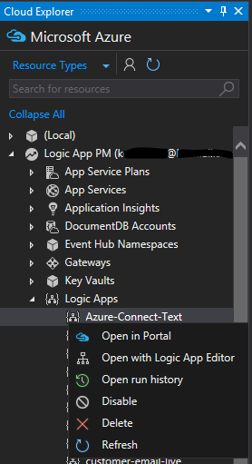
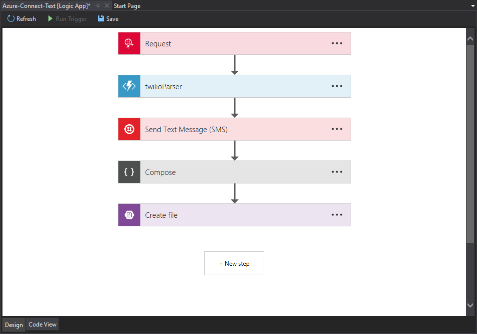
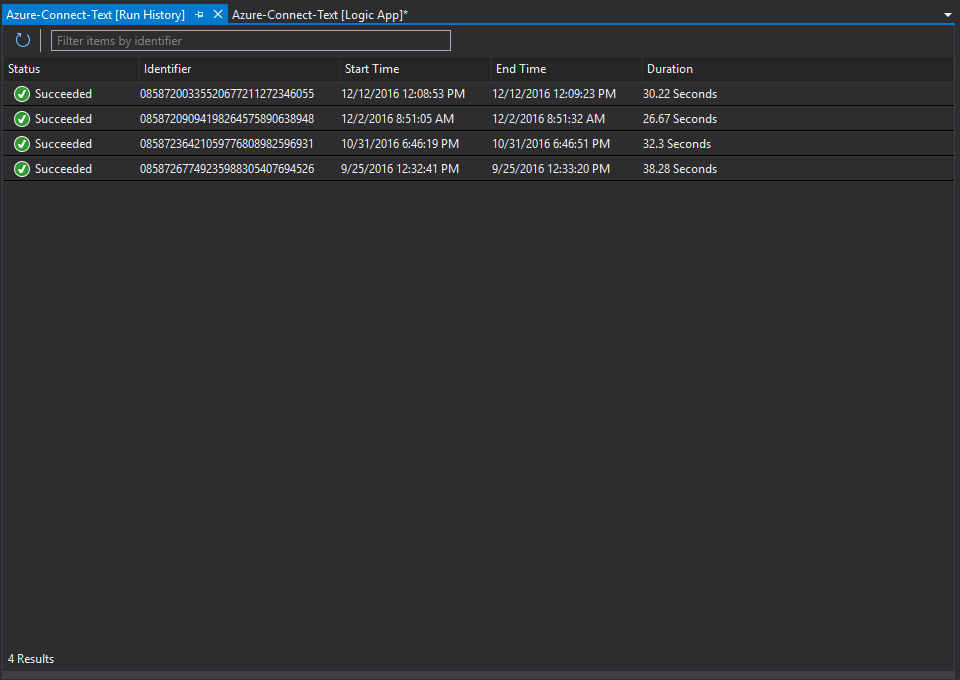
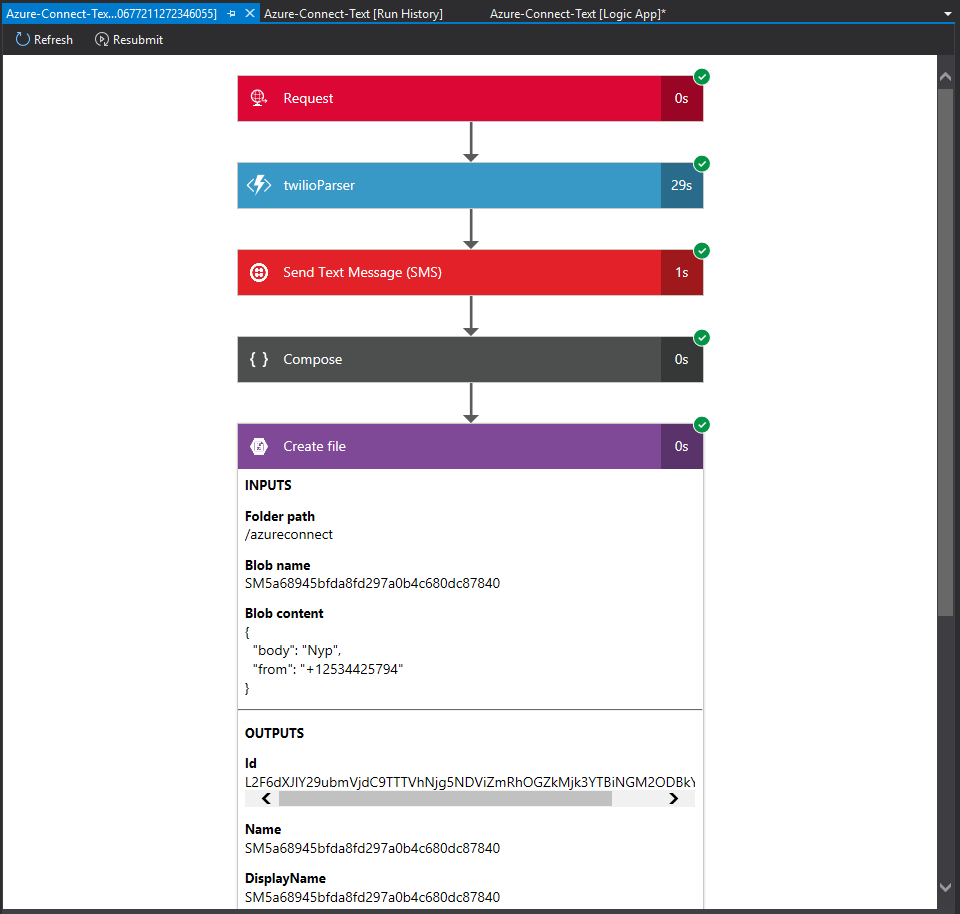

# Manage your logic apps with Visual Studio Cloud Explorer

Although the [Azure portal](https://portal.azure.com/) 
offers a great way for you to design and manage Azure Logic Apps, 
you can manage many Azure assets, including logic apps, in Visual Studio 
when you use Visual Studio Cloud Explorer. 
You can browse published logic apps, and perform tasks like enable and disable
your logic apps or edit and view run histories. 

## Installation steps

To install and configure Visual Studio tools for Azure Logic Apps, 
follow these steps.

### Prerequisites

* [Visual Studio 2015 or Visual Studio 2017](https://www.visualstudio.com/downloads/download-visual-studio-vs.aspx)
* [Latest Azure SDK](https://azure.microsoft.com/downloads/) (2.9.1 or greater)
* [Visual Studio Cloud Explorer](https://marketplace.visualstudio.com/items?itemName=MicrosoftCloudExplorer.CloudExplorerforVisualStudio2015)
* Access to the web when using the embedded designer

### Install Visual Studio tools for Logic Apps

After you install the prerequisites:

1. Open Visual Studio. On the **Tools** menu, 
select **Extensions and Updates**.
2. Expand the **Online** category so you can search online.
3. Browse or search for **Logic Apps** until 
you find **Azure Logic Apps Tools for Visual Studio**.
4. To download and install the extension, click **Download**.
5. Restart Visual Studio after installation.

> [!NOTE]
> You can also download Azure Logic Apps Tools 
> for Visual Studio directly from the 
> [Visual Studio Marketplace](https://visualstudiogallery.msdn.microsoft.com/e25ad307-46cf-412e-8ba5-5b555d53d2d9).

## Browse for logic apps in Cloud Explorer

1.	To open Cloud Explorer, on the **View** menu, choose **Cloud Explorer**.
2.	Browse for your logic app, either by resource group or by resource type. 

	If you browse by resource type, 
	select your Azure subscription, 
	expand the Logic Apps section,
	then select a Logic App. 
	You can either right-click a logic app, 
	choose from the **Actions** menu 
	at the bottom of Cloud Explorer.

	

## Edit your logic app with Logic App Designer

To open a currently deployed logic app in the same designer 
that you use in the Azure portal, right-click your logic app, 
and select **Open with Logic App Editor**. 

In the designer, you can edit your logic app, save your updates 
to the cloud, and start a new run by choosing **Run Trigger**.

## Browse your logic app run history

To view the run history for your logic app, 
right-click your logic app, and select **Open run history**. 
To reorder your run history based on any of the properties shown, 
select the column header.

To show the run history for an instance so you can see the run results, 
including the inputs and outputs from each step, 
double-click one of the run instances.

## Next steps

*	To get started with Azure Logic Apps, learn 
[how to create your first logic app in the Azure portal](logic-apps-create-a-logic-app.md)
* [Design, build, and deploy logic apps in Visual Studio](logic-apps-deploy-from-vs.md)
* [View common examples and scenarios](logic-apps-examples-and-scenarios.md)
* [Learn how to automate business processes with Azure Logic Apps](http://channel9.msdn.com/Events/Build/2016/T694)
* [Learn how to integrate your systems with Azure Logic Apps](http://channel9.msdn.com/Events/Build/2016/P462)
