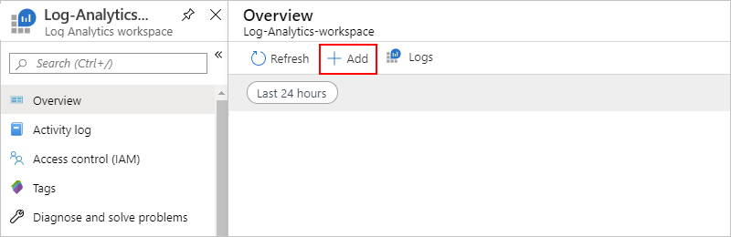
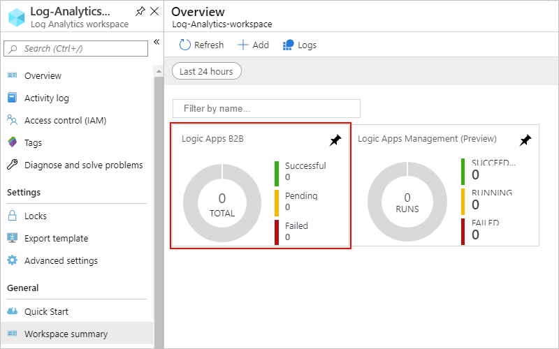

# Set up and collect Azure Monitor logs to help troubleshoot B2B messages in Azure Logic Apps

After you set up B2B communication between trading partners in your integration account, those partners can exchange messages by using protocols such as AS2, X12, and EDIFACT. To check that this communication works the way you expect, you can set up and use [Azure Monitor logs](../azure-monitor/platform/data-platform-logs.md) for your integration account to record and store information about runtime data and events, such as trigger events, run events, and action events. [Azure Monitor](../azure-monitor/overview.md) helps you monitor your cloud and on-premises environments so that you can more easily maintain their availability and performance. By using [Azure Monitor logs](../azure-monitor/platform/data-platform-logs.md), you can create [log queries](../azure-monitor/log-query/log-query-overview.md) that help you collect and review this information. You can also [use this diagnostics data with other Azure services](../logic-apps/logic-apps-azure-storage-event-hubs.md), such as Azure Storage and Azure Event Hubs.

For example, you can use these web-based tracking capabilities to track messages:

* Message count and status
* Acknowledgments status
* Correlate messages with acknowledgments
* Detailed error descriptions for failures
* Search capabilities

To set up logging for your integration account, [install the Logic Apps B2B solution](#install-b2b-solution) in the Azure portal. This solution provides aggregated information for B2B messag events. Then, to enable logging and creating queries for this information, set up [Azure Monitor logs](#set-up-resource-logs).

This article shows how to enable Azure Monitor logging for your integration account.

[!INCLUDE [azure-monitor-log-analytics-rebrand](../../includes/azure-monitor-log-analytics-rebrand.md)]

## Prerequisites

* A Log Analytics workspace. If you don't have a Log Analytics workspace, learn [how to create a Log Analytics workspace](../azure-monitor/learn/quick-create-workspace.md).

* A logic app that's set up with Azure Monitor logging and sends that information to a Log Analytics workspace. Learn [how to set up Azure Monitor logs for your logic app](../logic-apps/logic-apps-monitor-your-logic-apps.md).

* An integration account that's linked to your logic app. Learn [how to link your integration account to your logic app](../logic-apps/logic-apps-enterprise-integration-create-integration-account.md).

## Install Logic Apps B2B solution

Before Azure Monitor logs can track the B2B messages for your logic app, add the **Logic Apps B2B** solution to your Log Analytics workspace.

1. In the [Azure portal](https://portal.azure.com)'s search box, enter `log analytics workspaces`, and then select **Log Analytics workspaces**.

   

1. Under **Log Analytics workspaces**, select your workspace.

   

1. On the Overview pane, under **Get started with Log Analytics** > **Configure monitoring solutions**, select **View solutions**.

   

1. On the Overview pane, select **Add**.

   

1. After the **Marketplace** opens, in the search box, enter `logic apps b2b`, and select **Logic Apps B2B**.

   

1. On the solution description pane, select **Create**.

   

1. Review and confirm the Log Analytics workspace where you want to install the solution, and select **Create** again.

   

   After Azure deploys the solution to the Azure resource group that contains your Log Analytics workspace, the solution appears on your workspace's summary pane. When B2B messages are processed, the message count on this pane is updated.

   

## Set up Azure monitor logs for your integration account

You can enable Azure Monitor logging directly from your integration account.

1. In the [Azure portal](https://portal.azure.com), find and select your integration account.

   

1. On your integration account's menu, under **Monitoring**, select **Diagnostic settings**. Select **Add diagnostic setting**.

   

1. To create the setting, follow these steps:

   1. Provide a name for the setting.

   1. Select **Send to Log Analytics**.

   1. For **Subscription**, select the Azure subscription that's associated with your Log Analytics workspace.

   1. For **Log Analytics Workspace**, select the workspace that you want to use.

   1. Under **log**, select the **IntegrationAccountTrackingEvents** category, which specifies the event category that you want to record.

   1. When you're done, select **Save**.

   For example: 

   

1. Now [set up tracking for your B2B messages in Azure Monitor logs](../logic-apps/logic-apps-track-b2b-messages-omsportal.md).

## Next steps

* [Track B2B messages in Azure Monitor logs](../logic-apps/logic-apps-track-b2b-messages-omsportal.md)
* [Learn more about the Enterprise Integration Pack](../logic-apps/logic-apps-enterprise-integration-overview.md)

