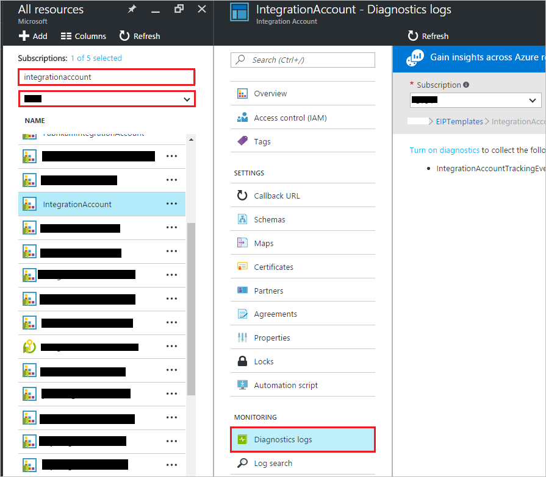
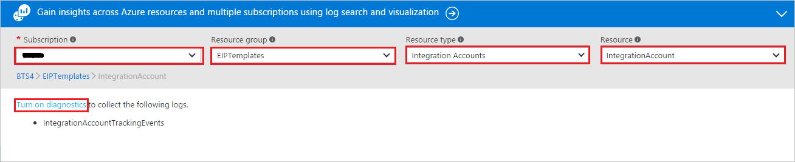
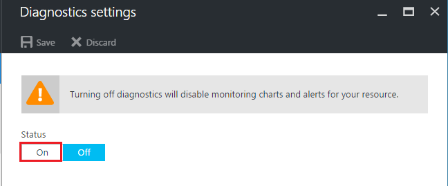
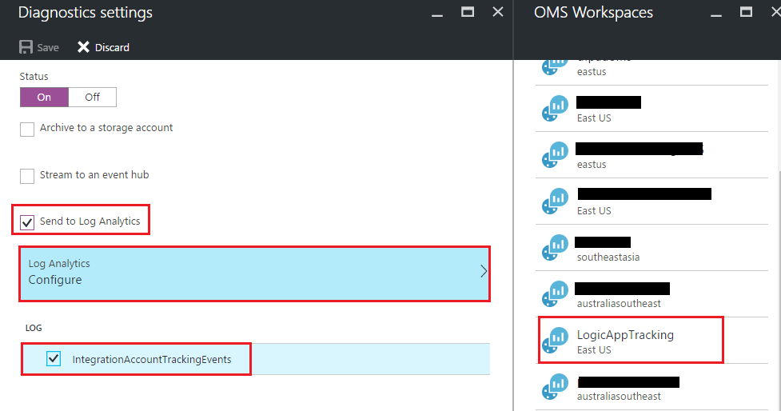
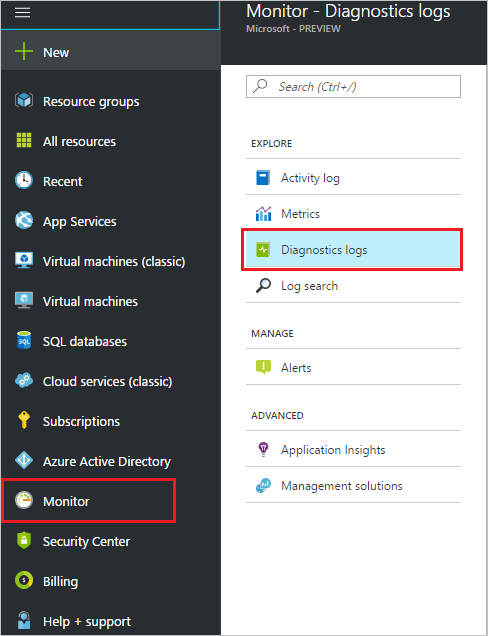
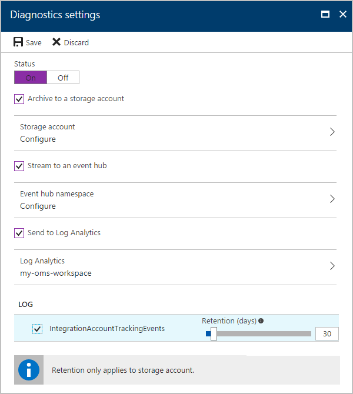

# Start or enable logging of AS2, X12, and EDIFACT messages to monitor success, errors, and message properties

B2B communication involves message exchanges between two running business processes or applications. The relationship defines an agreement between business processes. 
After communication is established, you can set up message monitoring to check that communication is working as expected. For richer details and debugging, you can set up diagnostics for your integration account.

Message tracking is available for these B2B protocols: AS2, X12, and EDIFACT. 

## Prerequisites

* An Azure account; you can create a [free account](https://azure.microsoft.com/free).
* An Integration Account; you can create an [Integration Account](logic-apps-enterprise-integration-create-integration-account.md).
* A Logic App; you can create a [Logic App](logic-apps-create-a-logic-app.md) and [enable logging](logic-apps-monitor-your-logic-apps.md).

## Enable logging for an integration account

You can enable logging for an integration account either with the **Azure portal** or with **Monitor**.

### Enable logging with Azure portal

1. Select your integration account, then select **Diagnostics logs**.

	

2. Select your **Subscription** and **Resource Group**. 
From **Resource Type**, select **Integration Accounts**. 
From **Resource**, select your integration account. 
Click **Turn on Diagnostics** to enable diagnostics for your selected integration account.

	

3. Select status **ON**.

	

4. Select **Send to Log Analytics** and configure Log Analytics to emit data.

	

### Enable logging with Monitor

0. Select **Monitor**, **Diagnostics logs**.

	

0. Select your **Subscription** and **Resource Group**. 
From **Resource Type**, select **Integration Accounts**. 
From **Resource**, select your integration account. 
Click **Turn on Diagnostics** to enable diagnostics for your selected integration account.

	

0. Select status **ON**.

	 

0. Select **Send to Log Analytics** and configure **Log Analytics** to emit data.

	

## Extend your solutions

In addition to the **Log Analytics**, you can configure your integration account and [Logic Apps](./logic-apps-monitor-your-logic-apps.md) to an Event Hub or Storage Account.

You can use this telemetry from the Event Hub or Storage into other services like [Azure Stream Analytics](https://azure.microsoft.com/services/stream-analytics/), and [Power BI](https://powerbi.com) to have real-time monitoring of your integration workflows.

## Supported Tracking Schema

We support these tracking schema types, which all have fixed schemas except the Custom type.

* [Custom Tracking Schema](logic-apps-track-integration-account-custom-tracking-schema.md)
* [AS2 Tracking Schema](logic-apps-track-integration-account-as2-tracking-schemas.md)
* [X12 Tracking Schema](logic-apps-track-integration-account-x12-tracking-schema.md)

## Next steps

[Tracking B2B messages in OMS Portal](logic-apps-track-b2b-messages-omsportal.md "Tracking B2B messages")

[Learn more about the Enterprise Integration Pack](logic-apps-enterprise-integration-overview.md "Learn about Enterprise Integration Pack")

