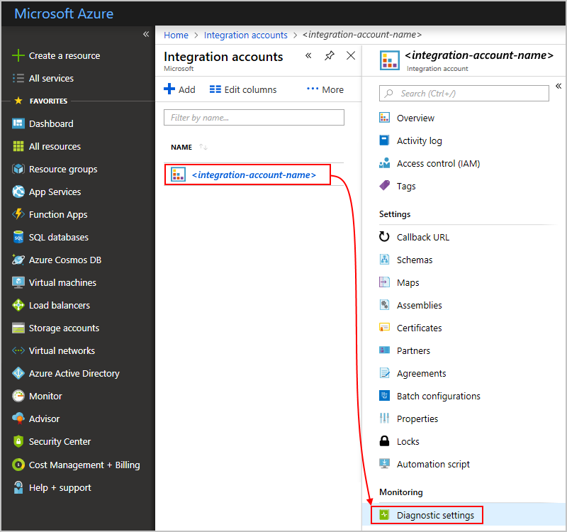
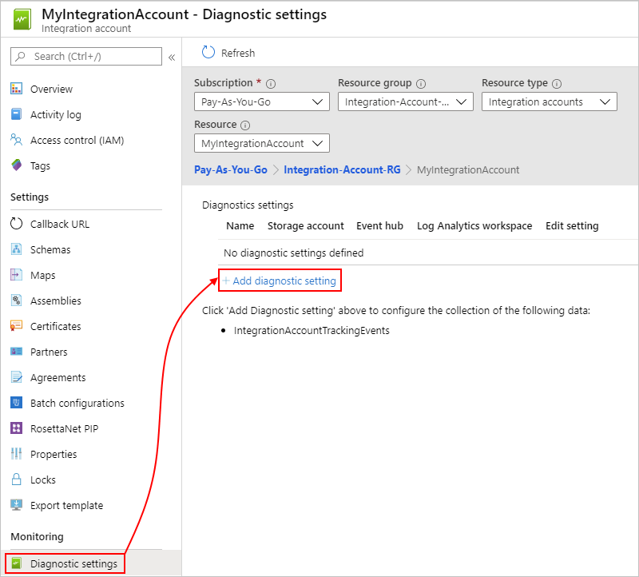
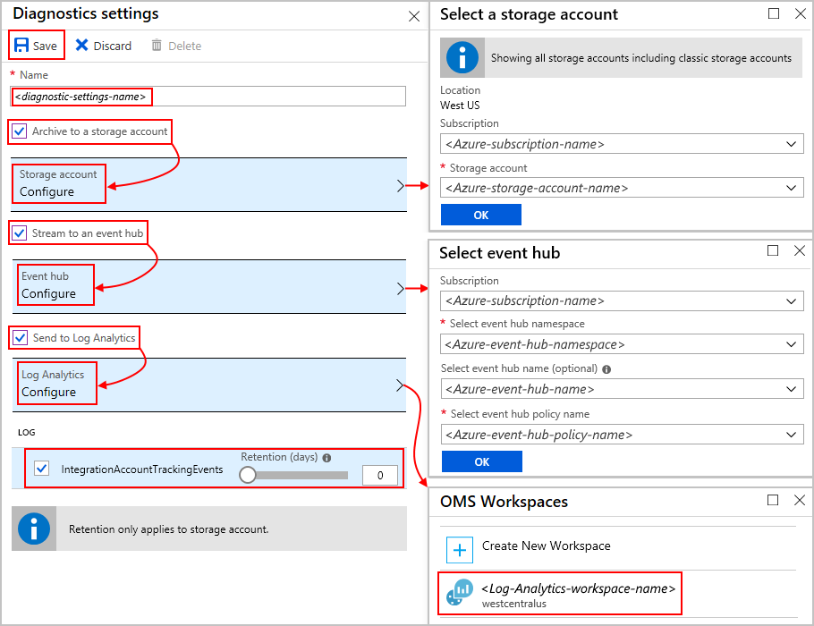

# Monitor B2B messages with Azure Monitor logs in Azure Logic Apps

After you set up B2B communication between trading partners 
in your integration account, those partners can exchange 
messages with each other. To check that this communication 
works the way you expect, you can monitor AS2, X12, and EDIFACT 
messages and set up diagnostics logging for your integration account 
with [Azure Monitor logs](../log-analytics/log-analytics-overview.md). 
This service monitors your cloud and on-premises environments, 
help you maintain their availability and performance, and collects 
runtime details and events for richer debugging. You can also 
use this data with other services 
such as Azure Storage and Azure Event Hubs.

> [!NOTE]
> This page might still have references to Microsoft Operations Management Suite (OMS), 
> which is [retiring in January 2019](../azure-monitor/platform/oms-portal-transition.md), 
> but replaces those steps with Azure Log Analytics where possible. 

[!INCLUDE [azure-monitor-log-analytics-rebrand](../../includes/azure-monitor-log-analytics-rebrand.md)]

## Prerequisites

* A logic app that's set up with diagnostics logging. Learn 
[how to create a logic app](quickstart-create-first-logic-app-workflow.md) 
and [how to set up logging for that logic app](../logic-apps/logic-apps-monitor-your-logic-apps.md#azure-diagnostics).

* After you meet the previous requirements, you also need a Log Analytics workspace, 
which you use for monitoring and tracking B2B communication through Azure Monitor logs. 
If you don't have a Log Analytics workspace, learn 
[how to create a Log Analytics workspace](../azure-monitor/learn/quick-create-workspace.md).

* An integration account that's linked to your logic app. Learn 
[how to create an integration account with a link to your logic app](../logic-apps/logic-apps-enterprise-integration-create-integration-account.md).

## Turn on diagnostics logging

You can turn on logging either directly from your integration account 
or [through the Azure Monitor service](#azure-monitor-service). 
Azure Monitor provides basic monitoring with infrastructure-level data. 
Learn more about [Azure Monitor](../azure-monitor/overview.md).

### Turn on logging from integration account

1. In the [Azure portal](https://portal.azure.com), 
find and select your integration account. 
Under **Monitoring**, select **Diagnostic settings**.

   

1. Now find and select your integration account. In filter lists, 
select the values that apply to your integration account.
When you're done, choose **Add diagnostic setting**.

   | Property | Value | Description | 
   |----------|-------|-------------|
   | **Subscription** | <*Azure-subscription-name*> | The Azure subscription that's associated with your integration account | 
   | **Resource group** | <*Azure-resource-group-name*> | The Azure resource group for your integration account | 
   | **Resource type** | **Integration accounts** | The type for the Azure resource where you want to turn on logging | 
   | **Resource** | <*integration-account-name*> | The name for your Azure resource where you want to turn on logging | 
   ||||  

   For example:

   

1. Provide a name for your new diagnostic setting and 
select your Log Analytics workspace and the data you want to log.

   1. Select **Send to Log Analytics**. 

   1. Under **Log Analytics**, select **Configure**. 

   1. Under **OMS Workspaces**, select the Log Analytics 
   workspace you want to use for logging. 

      > [!NOTE]
      > OMS workspaces are being replaced by Log Analytics workspaces. 

   1. Under **Log**, select the **IntegrationAccountTrackingEvents** category, 
   and choose **Save**.

   For example: 

   

1. Now [set up tracking for your B2B messages in Azure Monitor logs](../logic-apps/logic-apps-track-b2b-messages-omsportal.md).

### Turn on logging through Azure Monitor

1. In the [Azure portal](https://portal.azure.com), 
on the main Azure menu, select **Monitor**. 
Under **Settings**, select **Diagnostics settings**. 

   

1. Now find and select your integration account. In filter lists, 
select the values that apply to your integration account.
When you're done, choose **Add diagnostic setting**.

   | Property | Value | Description | 
   |----------|-------|-------------|
   | **Subscription** | <*Azure-subscription-name*> | The Azure subscription that's associated with your integration account | 
   | **Resource group** | <*Azure-resource-group-name*> | The Azure resource group for your integration account | 
   | **Resource type** | **Integration accounts** | The type for the Azure resource where you want to turn on logging | 
   | **Resource** | <*integration-account-name*> | The name for your Azure resource where you want to turn on logging | 
   ||||  

   For example:

   

1. Provide a name for your new diagnostic setting and 
select your Log Analytics workspace and the data you want to log.

   1. Select **Send to Log Analytics**. 

   1. Under **Log Analytics**, select **Configure**. 

   1. Under **OMS Workspaces**, select the Log Analytics 
   workspace you want to use for logging. 

      > [!NOTE]
      > OMS workspaces are being replaced by Log Analytics workspaces. 

   1. Under **Log**, select the **IntegrationAccountTrackingEvents** category, 
   and choose **Save**.

   For example: 

   

1. Now [set up tracking for your B2B messages in Azure Monitor logs](../logic-apps/logic-apps-track-b2b-messages-omsportal.md).

## Use diagnostic data with other services

Along with Azure Monitor logs, you can extend how you use your logic app's 
diagnostic data with other Azure services, for example: 

* [Archive Azure Diagnostics Logs in Azure Storage](../azure-monitor/platform/archive-diagnostic-logs.md)
* [Stream Azure Diagnostics Logs to Azure Event Hubs](../azure-monitor/platform/diagnostic-logs-stream-event-hubs.md) 

You can then get real-time monitoring by using telemetry 
and analytics from other services, like 
[Azure Stream Analytics](../stream-analytics/stream-analytics-introduction.md) 
and [Power BI](../azure-monitor/platform/powerbi.md). For example:

* [Stream data from Event Hubs to Stream Analytics](../stream-analytics/stream-analytics-define-inputs.md)
* [Analyze streaming data with Stream Analytics and create a real-time analytics dashboard in Power BI](../stream-analytics/stream-analytics-power-bi-dashboard.md)

Based on the options you want set up, make sure that you first 
[create an Azure storage account](../storage/common/storage-create-storage-account.md) 
or [create an Azure event hub](../event-hubs/event-hubs-create.md). 
You can then select the destinations where you want to send diagnostic data.
Retention periods apply only when you choose to use a storage account.

## Supported tracking schemas

Azure supports these tracking schema types, 
which all have fixed schemas except the Custom type.

* [AS2 tracking schema](../logic-apps/logic-apps-track-integration-account-as2-tracking-schemas.md)
* [X12 tracking schema](../logic-apps/logic-apps-track-integration-account-x12-tracking-schema.md)
* [Custom tracking schema](../logic-apps/logic-apps-track-integration-account-custom-tracking-schema.md)

## Next steps

* [Track B2B messages in Azure Monitor logs](../logic-apps/logic-apps-track-b2b-messages-omsportal.md "Track B2B messages in Azure Monitor logs")
* [Learn more about the Enterprise Integration Pack](../logic-apps/logic-apps-enterprise-integration-overview.md "Learn about Enterprise Integration Pack")

