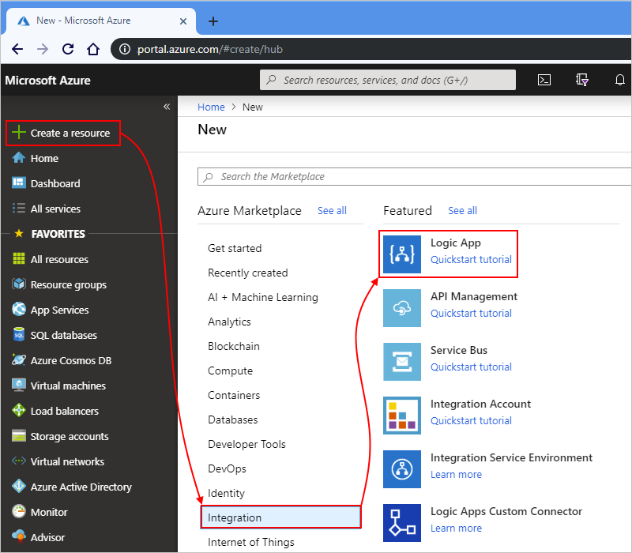
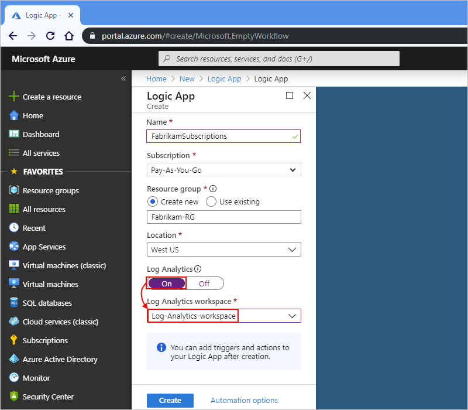
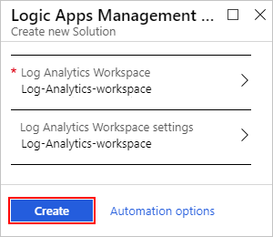
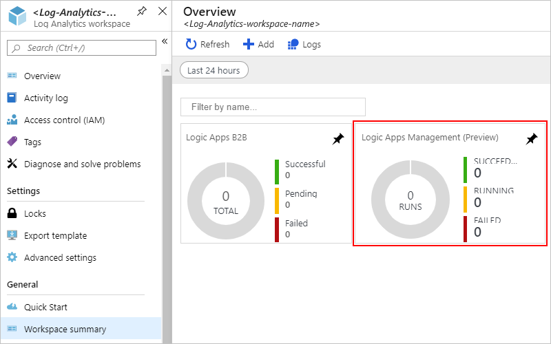
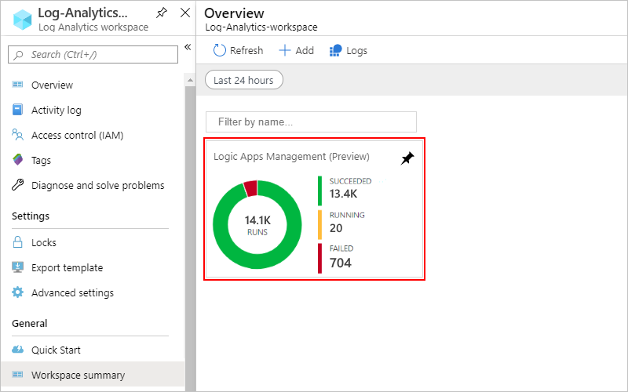
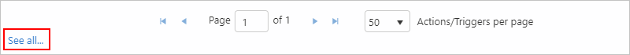

# Get insights and debugging data for logic apps by using Azure Monitor logs

To monitor and get richer debugging details about your logic apps, turn on [Azure Monitor logs](../log-analytics/log-analytics-overview.md) when you create your logic app. Azure Monitor logs provide diagnostics logging and monitoring for your logic apps when you install the Logic Apps Management solution in the Azure portal. This solution also provides aggregated information for your logic app runs with specific details such as status, execution time, resubmission status, and correlation IDs. This article shows how to turn on Azure Monitor logs so you can view runtime events and data for your logic app runs.

This topic shows how to set up Azure Monitor logs when you create your logic app. To turn on Azure Monitor logs for existing logic apps, follow these steps to [turn on diagnostic logging and send logic app runtime data to Azure Monitor logs](../logic-apps/logic-apps-monitor-your-logic-apps.md#azure-diagnostics).

> [!NOTE]
> This page previously described steps for how to perform these 
> tasks with the Microsoft Operations Management Suite (OMS), 
> which [retired in January 2019](../azure-monitor/platform/oms-portal-transition.md), 
> and replaces those steps with [Azure Monitor logs](../azure-monitor/platform/data-platform-logs.md), 
> which replaced the term Log Analytics. Log data is still stored in a Log Analytics workspace 
> and is still collected and analyzed by the same Log Analytics service. For more information, see 
> [Azure Monitor terminology changes](../azure-monitor/terminology.md).

## Prerequisites

Before you start, you need a Log Analytics workspace. Learn [how to create a Log Analytics workspace](../azure-monitor/learn/quick-create-workspace.md).

## Turn on logging for new logic apps

1. In [Azure portal](https://portal.azure.com), create your logic app. From the main Azure menu, select **Create a resource** > **Integration** > **Logic App**.

   

1. Under **Logic App**, follow these steps:

   1. Provide a name for your logic app and select your Azure subscription.

   1. Create or select an Azure resource group. Select the location for your logic app.

   1. Under **Log Analytics**, select **On**.

   1. From the **Log Analytics workspace** list, select the workspace where you want to send the data from your logic app runs.

      

      After you finish this step, Azure creates your logic app, which is now associated with your Log Analytics workspace. Also, this step automatically installs the Logic Apps Management solution in your workspace.

   1. When you're done, select **Create**.

1. To view your logic app runs, [continue with these steps](#view-logic-app-runs-oms).

## Install Logic Apps Management solution

If you already set up Azure Monitor logs when you created your logic app, 
skip this step. You already have the Logic Apps Management solution installed.

1. In the [Azure portal](https://portal.azure.com), select **All services**. In the search box, find "log analytics workspaces", and select **Log Analytics workspaces**.

   

1. Under **Log Analytics workspaces**, select your workspace.

   

1. On the Overview pane, under **Get started with Log Analytics** > **Configure monitoring solutions**, select **View solutions**.

   

1. Under **Overview**, select **Add**.

   

1. After the **Marketplace** opens, in the search box, enter "logic apps management", and select **Logic Apps Management**.

   

1. On the solution description pane, select **Create**.

   

1. Review and confirm the Log Analytics workspace where you want to install the solution, and select **Create** again.

   

   After Azure deploys the solution to the Azure resource group that contains your Log Analytics workspace, the solution appears on your workspace's summary pane.

   

## View logic app run information

After your logic app runs, you can view the status and count for those runs on the **Logic Apps Management** tile.

1. Go to your Log Analytics workspace, and select **Workspace summary** > **Logic Apps Management**.

   

   Here, your logic app runs are grouped by name or by execution status. This page also shows details about failures in actions or triggers for the logic app runs.

   

1. To view all the runs for a specific logic app or status, select the row for a logic app or a status.

   Here is an example that shows all the runs for a specific logic app:

   

   This page has advanced options: 

   * **Tracked properties** column: For a logic app where you set up tracked properties, which are grouped by actions, you can view those properties from this column. To view these tracked properties, select **View**. To search the tracked properties, use the column filter.

      

      Any newly added tracked properties might take 10-15 minutes before they appear first time. Learn [how to add tracked properties to your logic app](logic-apps-monitor-your-logic-apps.md#azure-diagnostics-event-settings-and-details).

   * **Resubmit**: You can resubmit one or more logic apps runs that failed, succeeded, or are still running. Select the check boxes for the runs that you want to resubmit, and then select **Resubmit**.

     

1. To filter your results, you can perform both client-side and server-side filtering.

   * **Client-side filter**: For each column, select the filters that you want, for example:

     

   * **Server-side filter**: To select a specific time window or to limit the number of runs that appear, use the scope control at the top of the page. By default, only 1,000 records appear at a time.

     

1. To view all the actions and their details for a specific run, select the row for a logic app run.

   Here is an example that shows all the actions and triggers for a specific logic app run:

   

1. On any results page, to view the query behind the results or to see all the results, select **See All**, which opens the **Logs** page.

   

   On the **Logs** page, you can choose these options:

   * To view the query results in a table, select **Table**.

   * Queries use [Kusto query language](https://aka.ms/LogAnalyticsLanguageReference), which you can edit if you want to view different results. To change the query, update the query string and select **Run** to view the results in the table. 

     

## Next steps

* [Monitor B2B messages](../logic-apps/logic-apps-monitor-b2b-message.md)