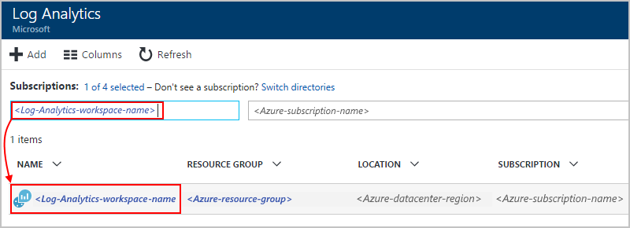
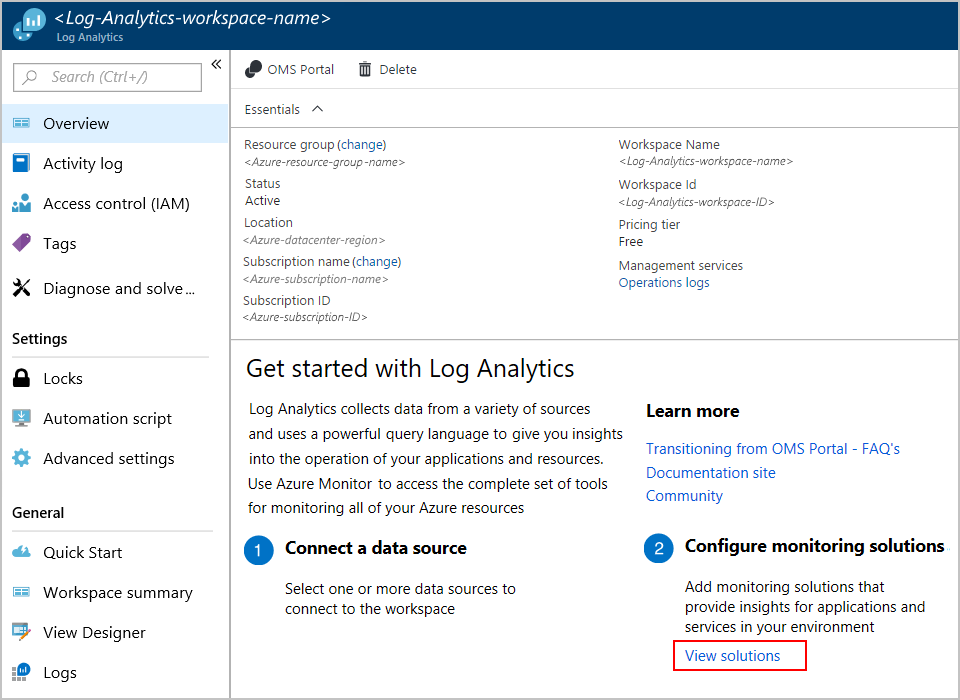

# Monitor logic apps with Azure Monitor logs

To monitor and get richer debugging details about your logic apps, 
turn on [Azure Monitor logs](../log-analytics/log-analytics-overview.md) 
when you create your logic app. Azure Monitor logs provides diagnostics 
logging and monitoring for your logic apps when you install the 
Logic Apps Management solution in the Azure portal. This solution 
also provides aggregated information for your logic app runs with 
specific details such as status, execution time, resubmission status, 
and correlation IDs. This article shows how to turn on Azure Monitor logs 
so you can view runtime events and data for your logic app runs.

To turn on Azure Monitor logs for existing logic apps, follow these steps to 
[turn on diagnostic logging and send logic app runtime data to Azure Monitor logs](../logic-apps/logic-apps-monitor-your-logic-apps.md#azure-diagnostics).

> [!NOTE]
> This page previously described steps for how to perform these tasks 
> with the Microsoft Operations Management Suite (OMS), which is 
> [retiring in January 2019](../azure-monitor/platform/oms-portal-transition.md), 
> replaces those steps with Azure Log Analytics instead. 

[!INCLUDE [azure-monitor-log-analytics-rebrand](../../includes/azure-monitor-log-analytics-rebrand.md)]

## Prerequisites

Before you start, you need a Log Analytics workspace. 
Learn [how to create a Log Analytics workspace](../azure-monitor/learn/quick-create-workspace.md). 

## Turn on diagnostics logging when creating logic apps

1. In [Azure portal](https://portal.azure.com), create a logic app. 
Choose **Create a resource** > **Integration** > **Logic App**.

   

1. Under **Create logic app**, perform these tasks as shown:

   1. Provide a name for your logic app and select your Azure subscription. 

   1. Create or select an Azure resource group.

   1. Set **Log Analytics** to **On**. 

   1. From the list Log Analytics workspace list, 
   select the workspace where you want to send 
   data for your logic app runs. 

      

      After you finish this step, Azure creates your logic app, 
      which is now associated with your Log Analytics workspace. 
      Also, this step also automatically installs the 
      Logic Apps Management solution in your workspace.

   1. When you're done, choose **Create**.

1. To view your logic app runs, 
[continue with these steps](#view-logic-app-runs-oms).

## Install Logic Apps Management solution

If you already turned on Azure Monitor logs when you created your logic app, 
skip this step. You already have the Logic Apps Management solution installed.

1. In the [Azure portal](https://portal.azure.com), 
select **All services**. In the search box, 
find "log analytics", and select **Log Analytics**.

   

1. Under **Log Analytics**, find and 
select your Log Analytics workspace. 

   

1. Under **Get started with Log Analytics** > **Configure monitoring solutions**, 
choose **View solutions**.

   

1. On the Overview page, choose **Add**, 
which opens the **Management Solutions** list. 
From that list, select **Logic Apps Management**. 

   

   If you can't find the solution, at the bottom of the list, 
   choose **Load more** until the solution appears.

1. Choose **Create**, confirm the Log Analytics 
workspace where you want to install the solution, 
and then choose **Create** again.   

   

   If you don't want to use an existing workspace, 
   you can also create a new workspace at this time.

   When you're done, the Logic Apps Management 
   solution appears on the Overview page. 

## View logic app run information

After your logic app runs, you can view 
the status and count for those runs on the 
**Logic Apps Management** tile. 

1. Go to your Log Analytics workspace, and open the Overview page. 
Choose **Logic Apps Management**. 

   

   Here, your logic app runs are grouped by name or by execution status. 
   This page also shows details about failures in actions or triggers 
   for the logic app runs.

   
   
1. To view all the runs for a specific logic app or status, 
select the row for a logic app or a status.

   Here is an example that shows all the runs for a specific logic app:

   

   This page has these advanced options:

   * **Tracked properties:**

     This column shows tracked properties, which are grouped by actions, 
     for the logic app. To view the tracked properties, choose **View**. 
     To search the tracked properties, use the column filter.
   
     

     Any newly added tracked properties might take 
     10-15 minutes before they appear first time. Learn 
     [how to add tracked properties to your logic app](logic-apps-monitor-your-logic-apps.md#azure-diagnostics-event-settings-and-details).

   * **Resubmit:** You can resubmit one or more logic app runs that failed, 
   succeeded, or are still running. Select the checkboxes for the runs 
   that you want to resubmit, and choose **Resubmit**. 

     

1. To filter these results, you can perform both client-side and server-side filtering.

   * **Client-side filter**: For each column, choose the filters that you want, for example:

     

   * **Server-side filter**: To choose a specific time window or to limit the number of runs that appear, 
   use the scope control at the top of the page. By default, only 1,000 records appear at a time.
   
     
 
1. To view all the actions and their details for a specific run, 
select a row for a logic app run.

   Here is an example that shows all the actions for a specific logic app run:

   
   
1. On any results page, to view the query behind the results or to see all results, 
choose **See All**, which opens the Log Search page.
   
   
   
   On the Log Search page,

   * To view the query results in a table, choose **Table**.

   * To change the query, you can edit the query string in the search bar. 
   For a better experience, choose **Advanced Analytics**.

     
     
     On the log analytics page, you can update queries and 
     view the results from the table. This query uses 
     [Kusto query language](https://aka.ms/LogAnalyticsLanguageReference), 
     which you can edit if you want to view different results. 

     

## Next steps

* [Monitor B2B messages](../logic-apps/logic-apps-monitor-b2b-message.md)