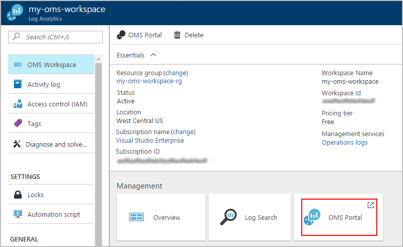
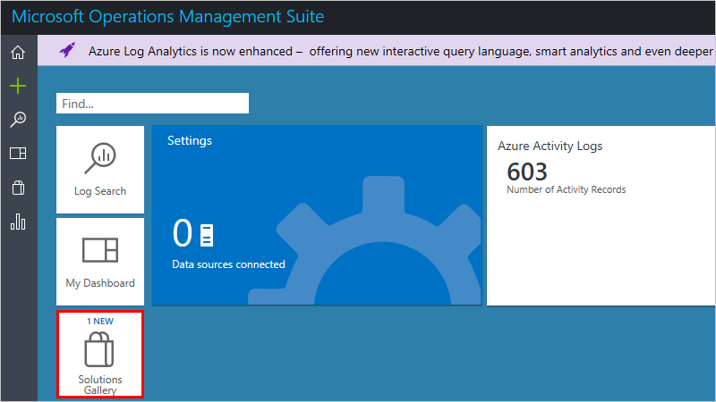
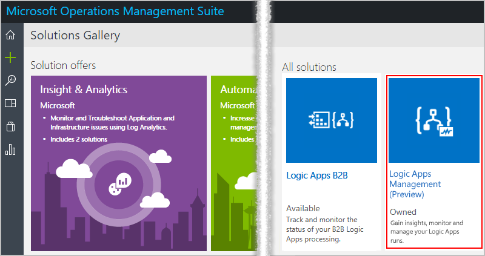
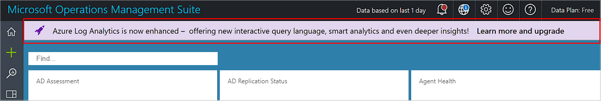

# Monitor and get insights about logic app runs with Operations Management Suite (OMS) and Log Analytics

For monitoring and richer debugging information, 
you can turn on Log Analytics at the same time 
when you create a logic app. Log Analytics provides 
diagnostics logging and monitoring for your 
logic app runs through the Operations Management Suite (OMS) portal. 
When you add the Logic Apps Management solution to OMS, 
you get aggregated status for your logic app runs and 
specific details like status, execution time, 
resubmission status, and correlation IDs.

This topic shows how to turn on Log Analytics or install 
the Logic Apps Management solution in OMS so you can 
view runtime events and data for your logic app run.

 > [!TIP]
 > To monitor your existing logic apps, follow these steps to 
 > [turn on diagnostic logging and send logic app runtime data to OMS](../logic-apps/logic-apps-monitor-your-logic-apps.md#azure-diagnostics).

## Requirements

Before you start, you need to have an OMS workspace. 
Learn [how to create an OMS workspace](../log-analytics/log-analytics-get-started.md). 

## Turn on diagnostics logging when creating logic apps

1. In [Azure portal](https://portal.azure.com), create a logic app. 
Choose **New** > **Enterprise Integration** > **Logic App** > **Create**.

   

2. In the **Create logic app** page, perform these tasks as shown:

   1. Provide a name for your logic app and select your Azure subscription. 
   2. Create or select an Azure resource group.
   3. Set **Log Analytics** to **On**. 
   Select the OMS workspace where you want to 
   send data for your logic app runs. 
   4. When you're ready, choose **Pin to dashboard** > **Create**.

      

      After you finish this step, Azure creates your logic app, 
      which is now associated with your OMS workspace. 
      Also, this step also automatically installs the 
      Logic Apps Management solution in your OMS workspace.

3. To view your logic app runs in OMS, 
[continue with these steps](#view-logic-app-runs-oms).

## Install the Logic Apps Management solution in OMS

If you already turned on Log Analytics when you created your logic app, 
skip this step. You already have the Logic Apps Management 
solution installed in OMS.

1. In the [Azure portal](https://portal.azure.com), choose **More Services**. 
Search for "log analytics" as your filter, 
and choose **Log Analytics** as shown:

   

2. Under **Log Analytics**, find and select your OMS workspace. 

   

3. Under **Management**, choose **OMS Portal**.

   

4. On your OMS homepage, if the upgrade banner appears, choose the banner so that you 
upgrade your OMS workspace first. Then choose **Solutions Gallery**.

   

5. Under **All solutions**, find and choose the tile 
for the **Logic Apps Management** solution.

   

6. To install the solution in your OMS workspace, choose **Add**.

   

## View your logic app runs in your OMS workspace

1. To view the count and status for your logic app runs, 
go to the overview page for your OMS workspace. 
Review the details on the **Logic Apps Management** tile.

   

   > [!Note]
   > If this upgrade banner appears instead of the Logic Apps Management tile, choose the banner so that you upgrade your OMS workspace first.
  
   > 

2. To view a summary with more details about your logic app runs, 
choose the **Logic Apps Management** tile.

   Here, your logic app runs are grouped by name or by execution status.

   
   
3. To view all the runs for a specific logic app or status, 
select the row for a logic app or a status.

   Here is an example that shows all 
   the runs for a specific logic app:

   

   > [!NOTE]
   > The **Resubmission** column shows "Yes" for 
   > runs that result from a resubmitted run.

4. To filter these results, you can perform 
both client-side and server-side filtering.

   * Client-side filter: For each column, 
   choose the filters that you want. 
   Here are some examples:

     

   * Server-side filter: To choose a specific time window 
   or to limit the number of runs that appear, 
   use the scope control at the top of the page. 
   By default, only 1,000 records appear at a time. 
   
     
 
5. To view all the actions and their details for a specific run, 
select a row, which opens the Log Search page. 

   * To view this information in a table, choose **Table**.
   * To change the query, you can edit the query string in the search bar. 
   For a better experience, choose **Advanced Analytics**.

     

     Here on the Azure Log Analytics page, 
     you can update queries and view the results from the table. 
     This query uses [Kusto query language](https://docs.loganalytics.io/learn/tutorials/getting_started_with_queries.html), 
     which you can edit if you want to view different results. 

     

## Next steps

* [Monitor B2B messages](../logic-apps/logic-apps-monitor-b2b-message.md)
