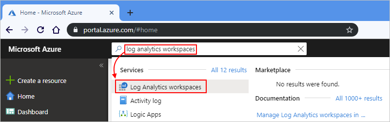
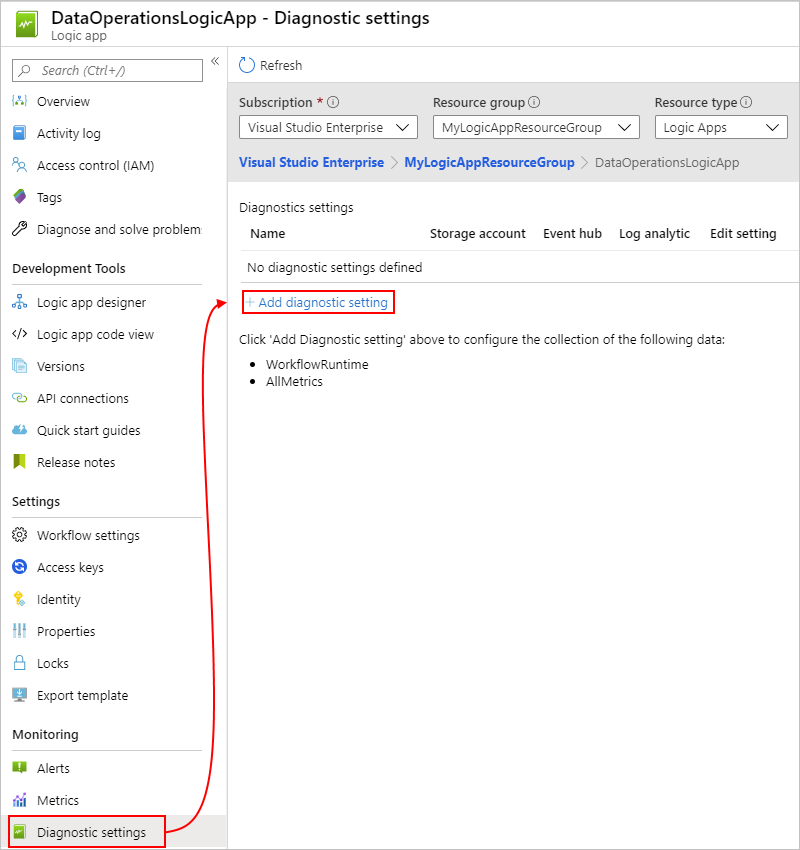
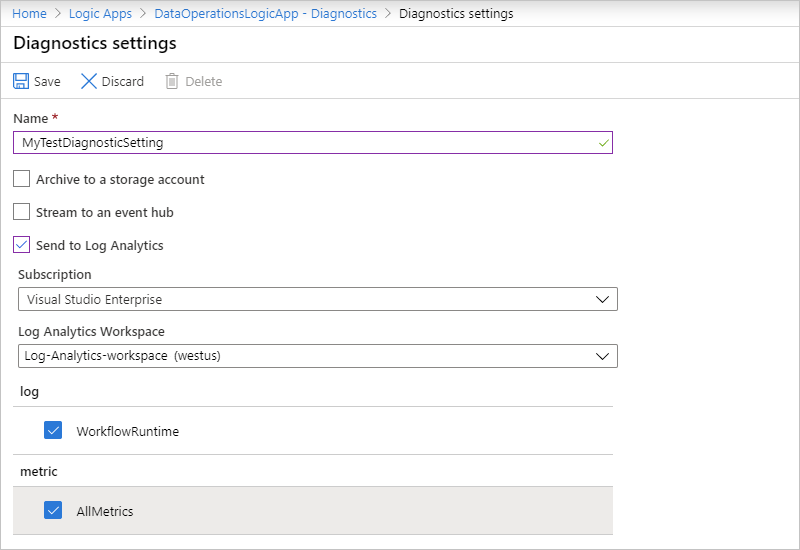
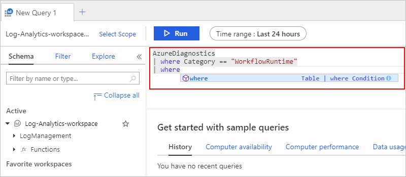

# Set up Azure Monitor logs and collect diagnostics data for Azure Logic Apps

To get richer debugging information about your logic apps during runtime, you can set up and use [Azure Monitor logs](../azure-monitor/platform/data-platform-logs.md) to record and store information about runtime data and events, such as trigger events, run events, and action events in a [Log Analytics workspace](../azure-monitor/platform/resource-logs-collect-workspace.md). [Azure Monitor](../azure-monitor/overview.md) helps you monitor your cloud and on-premises environments so that you can more easily maintain their availability and performance. By using Azure Monitor logs, you can create [log queries](../azure-monitor/log-query/log-query-overview.md) that help you collect and review this information. You can also [use this diagnostics data with other Azure services](../logic-apps/logic-apps-azure-storage-event-hubs.md), such as Azure Storage and Azure Event Hubs.

To set up logging for your logic app, you can [enable Log Analytics when you create your logic app](#logging-for-new-logic-apps), or you can [install the Logic Apps Management solution](#install-management-solution) in your Log Analytics workspace for existing logic apps. This solution provides aggregated information for your logic app runs and includes specific details such as status, execution time, resubmission status, and correlation IDs. Then, to enable logging and creating queries for this information, set up [Azure Monitor logs](#set-up-resource-logs).

This article shows how to enable Log Analytics when you create logic apps, how to install and set up the Logic Apps Management solution, and how to set up and create queries for Azure Monitor logs.

## Prerequisites

Before you start, you need a Log Analytics workspace. If you don't have a workspace, learn [how to create a Log Analytics workspace](../azure-monitor/learn/quick-create-workspace.md).

## Enable Log Analytics for new logic apps

You can turn on Log Analytics when you create your logic app.

1. In the [Azure portal](https://portal.azure.com), on the pane where you provide the information to create your logic app, follow these steps:

   1. Under **Log Analytics**, select **On**.

   1. From the **Log Analytics workspace** list, select the workspace where you want to send the data from your logic app runs.

      

      After you finish this step, Azure creates your logic app, which is now associated with your Log Analytics workspace. Also, this step automatically installs the Logic Apps Management solution in your workspace.

1. When you're done, select **Create**.

1. After you run your logic app, to view your logic app runs, [continue with these steps](#view-logic-app-runs).

## Install Logic Apps Management solution

If you turned on Log Analytics when you created your logic app, skip this step. You already have the Logic Apps Management solution installed in your Log Analytics workspace.

1. In the [Azure portal](https://portal.azure.com)'s search box, enter `log analytics workspaces`, and then select **Log Analytics workspaces**.

   

1. Under **Log Analytics workspaces**, select your workspace.

   

1. On the **Overview** pane, under **Get started with Log Analytics** > **Configure monitoring solutions**, select **View solutions**.

   

1. Under **Overview**, select **Add**.

   

1. After the **Marketplace** opens, in the search box, enter `logic apps management`, and select **Logic Apps Management**.

   

1. On the solution description pane, select **Create**.

   

1. Review and confirm the Log Analytics workspace where you want to install the solution, and select **Create** again.

   

   After Azure deploys the solution to the Azure resource group that contains your Log Analytics workspace, the solution appears on your workspace's summary pane.

   

## Set up Azure Monitor logs

When you store information about runtime events and data in [Azure Monitor logs](../azure-monitor/platform/data-platform-logs.md), you can create [log queries](../azure-monitor/log-query/log-query-overview.md) that help you find and review this information.

1. In the [Azure portal](https://portal.azure.com), find and select your logic app.

1. On your logic app menu, under **Monitoring**, select **Diagnostic settings** > **Add diagnostic setting**.

   

1. To create the setting, follow these steps:

   1. Provide a name for the setting.

   1. Select **Send to Log Analytics**.

   1. For **Subscription**, select the Azure subscription that's associated with your Log Analytics workspace.

   1. For **Log Analytics Workspace**, select the workspace that you want to use.

   1. Under **log**, select the **WorkflowRuntime** category, which specifies the event category that you want to record.

   1. To select all metrics, under **metric**, select **AllMetrics**.

   1. When you're done, select **Save**.

   For example:

   

## View logic app runs status

After your logic app runs, you can view the data about those runs in your Log Analytics workspace.

1. In the [Azure portal](https://portal.azure.com), find and open your Log Analytics workspace.

1. On your workspace's menu, select **Workspace summary** > **Logic Apps Management**.

   

   > [!NOTE]
   > If the Logic Apps Management tile doesn't immediately show results after a run, 
   > try selecting **Refresh** or wait for a short time before trying again.

   Here, your logic app runs are grouped by name or by execution status. This page also shows details about failures in actions or triggers for the logic app runs.

   

1. To view all the runs for a specific logic app or status, select the row for that logic app or status.

   Here is an example that shows all the runs for a specific logic app:

   

   For actions where you [set up tracked properties](logic-apps-monitor-your-logic-apps.md#azure-diagnostics-event-settings-and-details), you can also view those properties by selecting **View** in the **Tracked Properties** column. To search the tracked properties, use the column filter.

   

   > [!NOTE]
   > Tracked properties or completed events might might experience 10-15 minute 
   > delays before appearing in your log analytics workspace.
   > Also, the **Resubmit** capability on this page is currently unavailable.

1. To filter your results, you can perform both client-side and server-side filtering.

   * **Client-side filter**: For each column, select the filters that you want, for example:

     

   * **Server-side filter**: To select a specific time window or to limit the number of runs that appear, use the scope control at the top of the page. By default, only 1,000 records appear at a time.

     

1. To view all the actions and their details for a specific run, select the row for a logic app run.

   Here is an example that shows all the actions and triggers for a specific logic app run:

   

<!-------------
   * **Resubmit**: You can resubmit one or more logic apps runs that failed, succeeded, or are still running. Select the check boxes for the runs that you want to resubmit, and then select **Resubmit**.

     
--------------->

## View and create queries

Queries use [Kusto query language](https://aka.ms/LogAnalyticsLanguageReference), which you can edit if you want to view different results. To view the [query](../azure-monitor/log-query/log-query-overview.md) behind a results page, follow these steps:

1. On any results page, at the bottom, select **See All**, which opens the **Logs** page.

   

1. On the **Logs** page, you can select these options:

   * To view the query results as a table, under the query editor, select **Table**.

   * To change the query, update the query string and select **Run** to view the results in the table.

     

   * To create your own query, next the most recent existing query, select the plus sign (**+**). In the search box, specify a field that you want to find, and press **Enter**. When you start typing, you see possible matches and operations that you can use.

     

For more information about creating queries, see these topics:

* [Get started with Log Analytics in Azure Monitor](../azure-monitor/log-query/get-started-portal.md)
* [Get started with log queries in Azure Monitor](../azure-monitor/log-query/get-started-queries.md)

## Extend diagnostic data Azure Storage and Azure Event Hubs

Along with Azure Monitor logs, you can extend how you use your logic app's diagnostic data with other Azure services, for example: 

* [Archive Azure Diagnostics Logs in Azure Storage](../azure-monitor/platform/archive-diagnostic-logs.md)
* [Stream Azure Diagnostics Logs to Azure Event Hubs](../azure-monitor/platform/resource-logs-stream-event-hubs.md) 

You can then get real-time monitoring by using telemetry and analytics from other services, like [Azure Stream Analytics](../stream-analytics/stream-analytics-introduction.md) 
and [Power BI](../azure-monitor/platform/powerbi.md). For example:

* [Stream data from Event Hubs to Stream Analytics](../stream-analytics/stream-analytics-define-inputs.md)
* [Analyze streaming data with Stream Analytics and create a real-time analytics dashboard in Power BI](../stream-analytics/stream-analytics-power-bi-dashboard.md)

Based on the options you want set up, make sure that you first [create an Azure storage account](../storage/common/storage-create-storage-account.md) or [create an Azure event hub](../event-hubs/event-hubs-create.md). 
You can then select the destinations where you want to send diagnostic data. Retention periods apply only when you choose to use a storage account.

## Next steps

* [Monitor B2B messages](../logic-apps/logic-apps-monitor-b2b-message.md)