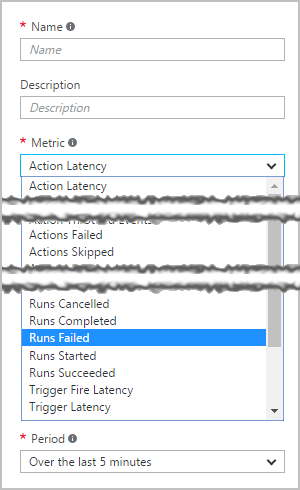

# Monitor performance, log diagnostic data, and set up alerts for logic app workflows

After you [create a logic app](logic-apps-create-a-logic-app.md), 
you can check the performance and full run history in the Azure portal. 
When you set up services like Azure Log Analytics, Azure Diagnostics, 
and Azure Alerts, you can also log diagnostic data, monitor events in real-time, 
and get alerts for events that might indicate failures or other problems, 
for example, "when more than 5 runs fail within an hour."

## View history for runs and triggers in your logic app

1. To find your logic app in the [Azure portal](https://portal.azure.com), 
on the left menu, choose **More services**. Then, in the search box, 
find "logic apps", and choose **Logic apps**.

   

   The Azure portal shows all the logic apps that are associated with your Azure subscription. 

2. Select the logic app that you want to monitor.

3. To view all the actions and triggers that ran for the selected logic app, 
choose **Overview**.

   * **Runs history** shows all the runs for the logic app. 
   * **Trigger History** shows all the trigger activity for the logic app.

   For example:

   

   You can filter either list to a specific date and timeframe. 
   To learn more about the statuses for each run and trigger, 
   see [Troubleshoot your logic app](logic-apps-diagnosing-failures.md).

4. To view the steps that ran for a specific run, select that run. 
The monitor view shows each step in that run.

   

   For more details about the run, like the run's **Correlation ID**, 
   which you can use with the 
   [REST API for Logic Apps](https://docs.microsoft.com/rest/api/logic), 
   choose **Run Details**. This information summarizes the steps, status, 
   inputs, and outputs for the run.

   

5. To view the details about each step in the run, like inputs, 
outputs, and any error messages that might have happened for each step, 
expand the steps that you want. For example:

   
   
   > [!NOTE]
   > All runtime details and events are encrypted within the Logic App service. 
   > They are decrypted only when a user requests to view that data. 
   > You can also control access to these events with 
   > [Azure Role-Based Access Control (RBAC)](../active-directory/role-based-access-control-what-is.md).

## Set up logging, monitoring, and alerts for your logic app with Azure Log Analytics, Azure Diagnostics, and Azure Alerts

* **Diagnostics** allows you to view runtime details and events, and subscribe to [Azure Alerts](#adding-azure-alerts)
In addition to the details provided by the Azure Portal and REST API above, you can configure your logic app to use Azure Diagnostics for more rich details and debugging.

1. Click the **Diagnostics** section of the logic app blade
2. Click to configure the **Diagnostic Settings**
3. Configure an Event Hub or Storage Account to emit data to
   
    

### Adding Azure Alerts
Once diagnostics are configured, you can add Azure Alerts to fire when certain thresholds are crossed.  In the **Diagnostics** blade, select the **Alerts** tile and **Add alert**.  This will walk you through configuring an alert based on a number of thresholds and metrics.



You can configure the **Condition**, **Threshold**, and **Period** as desired.  Finally, you can configure an email address to send a notification to, or configure a webhook.  You can use the [request trigger](../connectors/connectors-native-reqres.md) in a logic app to run on an alert as well (to do things like [post to Slack](https://github.com/Azure/azure-quickstart-templates/tree/master/201-alert-to-slack-with-logic-app), [send a text](https://github.com/Azure/azure-quickstart-templates/tree/master/201-alert-to-text-message-with-logic-app), or [add a message to a queue](https://github.com/Azure/azure-quickstart-templates/tree/master/201-alert-to-queue-with-logic-app)).

### Azure Diagnostics Settings
Each of these events contains details about the logic app and event like status.  Here is an example of a *ActionCompleted* event:

```javascript
{
            "time": "2016-07-09T17:09:54.4773148Z",
            "workflowId": "/SUBSCRIPTIONS/80D4FE69-ABCD-EFGH-A938-9250F1C8AB03/RESOURCEGROUPS/MYRESOURCEGROUP/PROVIDERS/MICROSOFT.LOGIC/WORKFLOWS/MYLOGICAPP",
            "resourceId": "/SUBSCRIPTIONS/80D4FE69-ABCD-EFGH-A938-9250F1C8AB03/RESOURCEGROUPS/MYRESOURCEGROUP/PROVIDERS/MICROSOFT.LOGIC/WORKFLOWS/MYLOGICAPP/RUNS/08587361146922712057/ACTIONS/HTTP",
            "category": "WorkflowRuntime",
            "level": "Information",
            "operationName": "Microsoft.Logic/workflows/workflowActionCompleted",
            "properties": {
                "$schema": "2016-06-01",
                "startTime": "2016-07-09T17:09:53.4336305Z",
                "endTime": "2016-07-09T17:09:53.5430281Z",
                "status": "Succeeded",
                "code": "OK",
                "resource": {
                    "subscriptionId": "80d4fe69-ABCD-EFGH-a938-9250f1c8ab03",
                    "resourceGroupName": "MyResourceGroup",
                    "workflowId": "cff00d5458f944d5a766f2f9ad142553",
                    "workflowName": "MyLogicApp",
                    "runId": "08587361146922712057",
                    "location": "eastus",
                    "actionName": "Http"
                },
                "correlation": {
                    "actionTrackingId": "e1931543-906d-4d1d-baed-dee72ddf1047",
                    "clientTrackingId": "my-custom-tracking-id"
                },
                "trackedProperties": {
                    "myProperty": "<value>"
                }
            }
        }
```

The two properties that are especially useful for tracking and monitoring are *clientTrackingId* and *trackedProperties*.  

#### Client tracking ID
The client tracking ID is a value that will correlate events across a logic app run, including any nested workflows called as a part of a logic app.  This ID will be auto-generated if not provided, but you can manually specify the client tracking ID from a trigger by passing a `x-ms-client-tracking-id` header with the ID value in the trigger request (request trigger, HTTP trigger, or webhook trigger).

#### Tracked properties
Tracked properties can be added onto actions in the workflow definition to track inputs or outputs in diagnostics data.  This can be useful if you wish to track data like an "order ID" in your telemetry.  To add a tracked property, include the `trackedProperties` property on an action.  Tracked properties can only track a single actions inputs and outputs, but you can use the `correlation` properties of the events to correlate across actions in a run.

```javascript
{
    "myAction": {
        "type": "http",
        "inputs": {
            "uri": "http://uri",
            "headers": {
                "Content-Type": "application/json"
            },
            "body": "@triggerBody()"
        },
        "trackedProperties":{
            "myActionHTTPStatusCode": "@action()['outputs']['statusCode']",
            "myActionHTTPValue": "@action()['outputs']['body']['foo']",
            "transactionId": "@action()['inputs']['body']['bar']"
        }
    }
}
```

### Extending your solutions
You can leverage this telemetry from the Event Hub or Storage into other services like [Operations Management Suite](https://www.microsoft.com/cloud-platform/operations-management-suite), [Azure Stream Analytics](https://azure.microsoft.com/services/stream-analytics/), and [Power BI](https://powerbi.com) to have real time monitoring of your integration workflows.

## Next Steps
* [Common examples and scenarios for logic apps](../logic-apps/logic-apps-examples-and-scenarios.md)
* [Creating a Logic App Deployment Template](../logic-apps/logic-apps-create-deploy-template.md)
* [Enterprise integration features](../logic-apps/logic-apps-enterprise-integration-overview.md)

