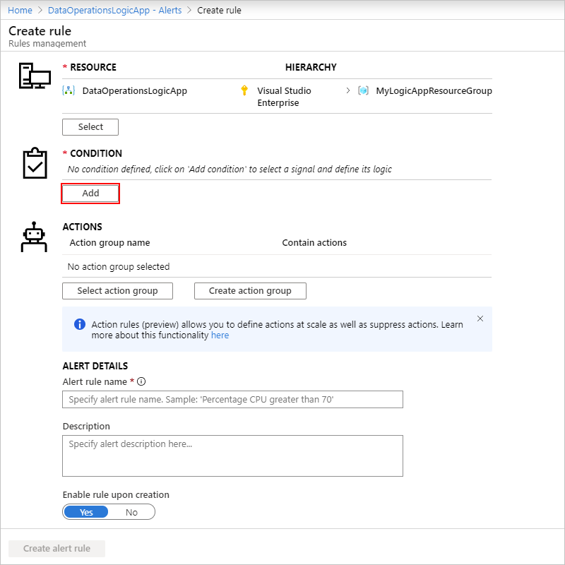
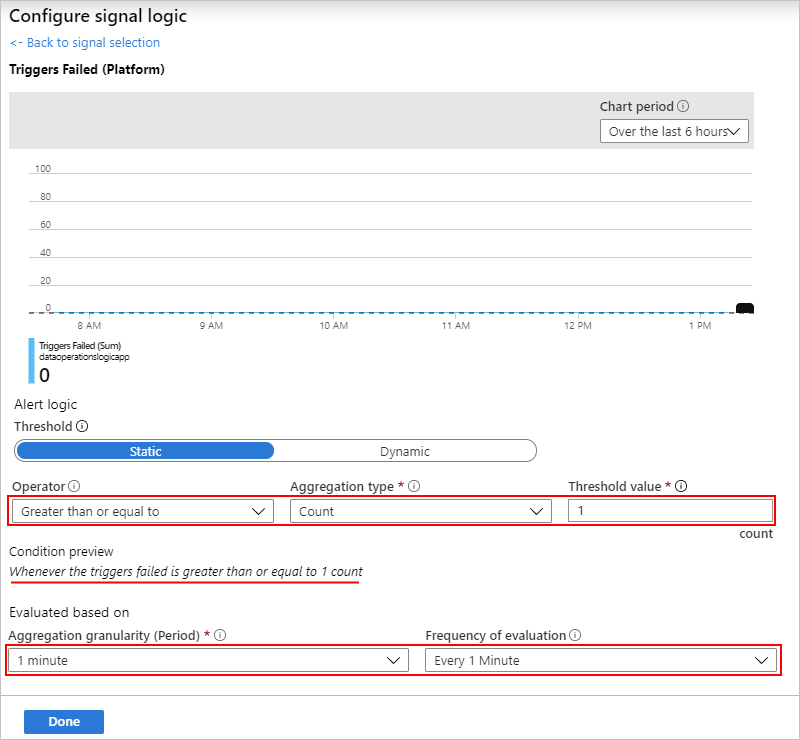

# Check run status, view run history, and set up alerts in Azure Logic Apps

After you [create and run a logic app](../logic-apps/quickstart-create-first-logic-app-workflow.md), you can check that logic app's run status, run history, trigger history, and performance. To get notifications about failures or other possible problems, set up [alerts](#add-azure-alerts). For example, you can create an alert that detects "when more than five runs fail in an hour."

For real-time event monitoring and richer debugging, set up diagnostics logging for your logic app by using the [Logic Analytics capability](../azure-monitor/log-query/get-started-portal.md) in [Azure Monitor](../azure-monitor/overview.md). This Azure service helps you monitor your cloud and on-premises environments so that you can more easily maintain their availability and performance. You can then find and view events, such as trigger events, run events, and action events. By storing this information in [Azure Monitor logs](../azure-monitor/platform/data-platform-logs.md), you can create [log queries](../azure-monitor/log-query/log-query-overview.md) that help you find and analyze this information. You can also use this diagnostic data with other Azure services, such as Azure Storage and Azure Event Hubs. For more information, see [Monitor logic apps with Azure Monitor](../logic-apps/logic-apps-monitor-your-logic-apps-oms.md).

[!INCLUDE [azure-monitor-log-analytics-rebrand](../../includes/azure-monitor-log-analytics-rebrand.md)]

## Review runs history

1. In the [Azure portal](https://portal.azure.com), find and open your logic app in the Logic App Designer.

   To find your logic app , in the main Azure search box, enter `logic apps`, and then select **Logic Apps**.

   

   The Azure portal shows all the logic apps that are associated with your Azure subscriptions. You can filter this list based on name, subscription, resource group, location, and so on.

   

1. Select your logic app, and then select **Overview**.

   On the overview pane, under **Runs history**, all the past, current, and any waiting runs for your logic app appear, for example:

   

   > [!TIP]
   > If you don't find all the data that you expect, on the toolbar, select **Refresh**.

   For status definitions and descriptions, see [Troubleshoot your logic app](../logic-apps/logic-apps-diagnosing-failures.md).

1. To review the steps and other information for a specific run, under **Runs history**, select that run.

   

   The **Logic app run** pane shows each step in the selected run, each step's run status, and the time taken for each step to run, for example:

   

1. To get more information about a specific step, select that step so that the shape expands. You can now view details such as inputs, outputs, and any errors that happened in that step, for example:

   

   > [!NOTE]
   > All runtime details and events are encrypted within the Logic Apps service. 
   > They are decrypted only when a user requests to view that data. 
   > You can [hide inputs and outputs in run history](../logic-apps/logic-apps-securing-a-logic-app.md#obfuscate) 
   > or control user access to this information by using 
   > [Azure Role-Based Access Control (RBAC)](../role-based-access-control/overview.md).

1. To get more information about the run itself, on the toolbar, select **Run Details**.

   

   This information summarizes the steps, status, inputs, and outputs for the run.

   

   For example, you can get the run's **Correlation ID** property, which you might need when you use the 
   [REST API for Logic Apps](https://docs.microsoft.com/rest/api/logic).

## Review trigger history

1. To view all the trigger activity for your logic app, on your logic app's menu, select **Overview**.
In the **Summary** section, under **Evaluation**, select **See trigger history**.

   

1. To view information about a specific trigger event, on the trigger pane, select the specific trigger event that you want to review.

   

   You can now review information about the selected trigger event, for example:

   

<a name="add-azure-alerts"></a>

## Set up monitoring alerts

To set up alerts without [Azure Monitor logs](../log-analytics/log-analytics-overview.md), follow these steps. 

To get alerts based on specific metrics or exceeded thresholds for your logic app, set up [alerts in Azure Monitor](../azure-monitor/platform/alerts-overview.md). Learn about [metrics in Azure](../monitoring-and-diagnostics/monitoring-overview-metrics.md).

For more about creating alerts, see 

1. On your logic app menu, under **Monitoring**, select **Alerts** > **New alert rule**.

   

1. On the **Create rule** pane, follow these steps:

   1. Under **Resource**, select your logic app, if not already selected. Under **Condition**, select **Add** so that you can define the condition that triggers the alert.

      

   1. On the **Configure signal logic** pane, find and select the signal for to get an alert. You can use the search box, or to sort the signals alphabetically, select the **Signal name** column header.

      For example, if you want to send an alert when a trigger fails, follow these steps:

      1. In the **Signal name** column, find and select the **Triggers Failed** signal.

         

      1. On the information pane that opens for the selected signal, under **Alert logic**, set up your condition, for example:

         1. For **Operator**, select **Greater than or equal to**.

         1. For **Aggregation type**, select **Count**.

         1. For **Threshold value**, enter `1`.

         1. Under **Condition preview**, confirm that your condition appears correct.

         1. Under **Evaluated based on**, set up the interval and frequency for running the alert rule. For **Aggregation granularity (Period)**, select the period for grouping the data. For **Frequency of evaluation**, select how often you want to check the condition.

         1. When you're ready, select **Done**.

         Here's the finished condition:

         

   1. Specify a name, optional description, and severity level for your alert. Either leave the **Enable rule upon creation** setting turned on, or turn off until you're ready to enable the rule.

   1. When you're done, select **Create alert rule**.

   1. Select whether to send mail for the alert.

   1. Specify any other email addresses for sending the alert. You can also specify a webhook URL where you want to send the alert.

   For example, this rule sends an alert when five or more runs fail in an hour:

   

> [!TIP]
> To run a logic app from an alert, you can include the 
> [request trigger](../connectors/connectors-native-reqres.md) in your workflow, 
> which lets you perform tasks like these examples:
> 
> * [Post to Slack](https://github.com/Azure/azure-quickstart-templates/tree/master/201-alert-to-slack-with-logic-app)
> * [Send a text](https://github.com/Azure/azure-quickstart-templates/tree/master/201-alert-to-text-message-with-logic-app)
> * [Add a message to a queue](https://github.com/Azure/azure-quickstart-templates/tree/master/201-alert-to-queue-with-logic-app)

<a name="diagnostic-event-properties"></a>

## Azure Diagnostics event settings and details

Each diagnostic event has details about your logic app and that event, 
for example, the status, start time, end time, and so on. 
To programmatically set up monitoring, tracking, and logging, 
you can use these details with the 
[REST API for Azure Logic Apps](https://docs.microsoft.com/rest/api/logic) 
and the [REST API for Azure Diagnostics](../azure-monitor/platform/metrics-supported.md#microsoftlogicworkflows).

For example, the `ActionCompleted` event has the 
`clientTrackingId` and `trackedProperties` properties 
that you can use for tracking and monitoring:

``` json
{
    "time": "2016-07-09T17:09:54.4773148Z",
    "workflowId": "/SUBSCRIPTIONS/<subscription-ID>/RESOURCEGROUPS/MYRESOURCEGROUP/PROVIDERS/MICROSOFT.LOGIC/WORKFLOWS/MYLOGICAPP",
    "resourceId": "/SUBSCRIPTIONS/<subscription-ID>/RESOURCEGROUPS/MYRESOURCEGROUP/PROVIDERS/MICROSOFT.LOGIC/WORKFLOWS/MYLOGICAPP/RUNS/08587361146922712057/ACTIONS/HTTP",
    "category": "WorkflowRuntime",
    "level": "Information",
    "operationName": "Microsoft.Logic/workflows/workflowActionCompleted",
    "properties": {
        "$schema": "2016-06-01",
        "startTime": "2016-07-09T17:09:53.4336305Z",
        "endTime": "2016-07-09T17:09:53.5430281Z",
        "status": "Succeeded",
        "code": "OK",
        "resource": {
            "subscriptionId": "<subscription-ID>",
            "resourceGroupName": "MyResourceGroup",
            "workflowId": "cff00d5458f944d5a766f2f9ad142553",
            "workflowName": "MyLogicApp",
            "runId": "08587361146922712057",
            "location": "westus",
            "actionName": "Http"
        },
        "correlation": {
            "actionTrackingId": "e1931543-906d-4d1d-baed-dee72ddf1047",
            "clientTrackingId": "<my-custom-tracking-ID>"
        },
        "trackedProperties": {
            "myTrackedProperty": "<value>"
        }
    }
}
```

* `clientTrackingId`: If not provided, Azure automatically generates this ID 
and correlates events across a logic app run, 
including any nested workflows that are called from the logic app. 
You can manually specify this ID from a trigger by passing a 
`x-ms-client-tracking-id` header with your custom ID value 
in the trigger request. You can use a request trigger, 
HTTP trigger, or webhook trigger.

* `trackedProperties`: To track inputs or outputs in diagnostics data, 
you can add tracked properties to actions in your logic app's JSON definition. 
Tracked properties can track only a single action's inputs and outputs, 
but you can use the `correlation` properties of events to correlate across actions in a run.

  To track one or more properties, add the `trackedProperties` section and the 
  properties you want to the action definition. For example, 
  suppose you want to track data like an "order ID" in your telemetry:

  ``` json
  "myAction": {
    "type": "http",
    "inputs": {
        "uri": "http://uri",
        "headers": {
            "Content-Type": "application/json"
        },
        "body": "@triggerBody()"
    },
    "trackedProperties": {
        "myActionHTTPStatusCode": "@action()['outputs']['statusCode']",
        "myActionHTTPValue": "@action()['outputs']['body']['<content>']",
        "transactionId": "@action()['inputs']['body']['<content>']"
    }
  }
  ```
  Here's another example that uses **Initialize variable** action. The example adds tracked properties from the action's input where the input is an array, not a record.  

  ``` json
  "actions": { 
   "Initialize_variable": { 
      "inputs": { 
         "variables": [{ 
            "name": "ConnectorName", 
            "type": "String", 
            "value": "SFTP-SSH" 
         }]
      },
      "runAfter": {},
      "trackedProperties": { 
         "Track1": "@action().inputs.variables[0].value"
      },
      "type": "InitializeVariable"
   } 
  }
  ```

## Next steps

* [Automate logic app deployment](../logic-apps/logic-apps-azure-resource-manager-templates-overview.md)
* [B2B scenarios with Enterprise Integration Pack](../logic-apps/logic-apps-enterprise-integration-overview.md)
* [Monitor B2B messages](../logic-apps/logic-apps-monitor-b2b-message.md)
