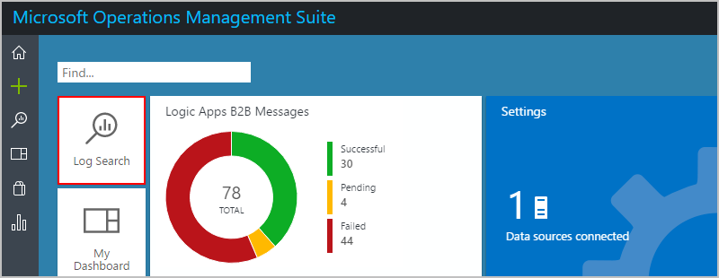
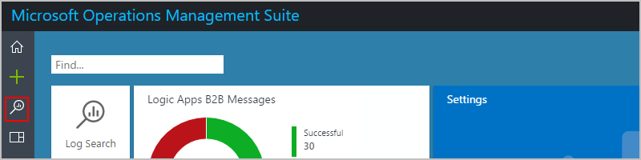

# Monitor status, set up logging, and turn on alerts for Azure Logic Apps

After you [create a logic app](logic-apps-create-a-logic-app.md), 
you can check its status, performance, and run history in the Azure portal. 
For monitoring events in real time, richer debugging, and notifications 
about failures or other possible problems, you can set up 
[logging](#azure-diagnostics) and [alerts](#add-azure-alerts). 

For example, you can create an alert for 
"when more than five runs fail within an hour." 
After your logic app runs, you can [view the events](#find-events) 
that happened during your logic app run.

## View runs and triggers history for your logic app

1. To find your logic app in the [Azure portal](https://portal.azure.com), 
on the main Azure menu, choose **More services**. In the search box, 
find "logic apps", and choose **Logic apps**.

   

   The Azure portal shows all the logic apps that are associated with your Azure subscription. 

2. Select the logic app that you want to monitor.

3. To view all the actions and triggers that fired for the selected logic app, 
choose **Overview**.

   * **Runs history** shows all the runs for the logic app. 
   * **Trigger History** shows all the trigger activity for the logic app.

   For example:

   

   For status descriptions, see [Troubleshoot your logic app](../logic-apps/logic-apps-diagnosing-failures.md).

   > [!TIP]
   > If you don't find the data that you expect, 
   > on the toolbar, choose **Refresh**.

4. You can view the steps for a specific run. 
Under **Runs history**, select that run. 
The monitor view shows each step in that run.

   

   For more details about the run, choose **Run Details**. 
   This information summarizes the steps, status, inputs, and outputs for the run.

   

   For example, you can get the run's **Correlation ID**, 
   which you might need when you use the 
   [REST API for Logic Apps](https://docs.microsoft.com/rest/api/logic),

5. To get details about a specific step, 
choose that step. For example:

   

   You can now review details like inputs, outputs, 
   and any errors that happened for that step.
   
   > [!NOTE]
   > All runtime details and events are encrypted within the Logic App service. 
   > They are decrypted only when a user requests to view that data. 
   > You can also control access to these events with 
   > [Azure Role-Based Access Control (RBAC)](../active-directory/role-based-access-control-what-is.md).

6. To get details about a specific trigger event, 
go back to the **Overview** pane. Under **Trigger history**, 
select the trigger event.

   You can now review details like inputs and outputs.

   

<a name="azure-diagnostics"></a>

## Turn on logging for your logic app

For richer debugging with runtime details and events, 
you can set up diagnostic logging with [Azure Log Analytics](../log-analytics/log-analytics-overview.md). 
Log Analytics is a service in [Operations Management Suite (OMS)](../operations-management-suite/operations-management-suite-overview.md) 
that monitors your cloud and on-premises environments 
to help you maintain their availability and performance. 

Before you start, you need to have an OMS workspace. Learn 
[how to create an OMS workspace](../log-analytics/log-analytics-get-started.md).

1. In the [Azure portal](https://portal.azure.com), 
find and select your logic app. 

2. On the logic app blade menu, under **Monitoring**, 
choose **Diagnostics** > **Diagnostic Settings**.

3. Under **Diagnostics settings**, choose **On**.

   

4. Now select the OMS workspace and event category for logging as shown:

   1. Select **Send to Log Analytics**. 
   2. Under **Log Analytics**, choose **Configure**. 
   3. Under **OMS Workspaces**, select the OMS workspace 
   to use for logging.
   4. Under **Log**, select the **WorkflowRuntime** category.
   5. Choose the metric interval.
   6. When you're done, choose **Save**.

   

After your logic app runs, you can find events and other data for those runs.

<a name="find-events"></a>

## Find events and data from your logic app runs

1. In the [Azure portal](https://portal.azure.com), choose **More Services**. 
Search for "log analytics", and then choose **Log Analytics** as shown here:

   

2. Under **Log Analytics**, find and select your OMS workspace. 

   

3. Choose **OMS Portal**.

   

4. On your OMS home page, choose **Log Search**.

   

   -or-

   

5. In the search box, enter a field that you want to find, and press **Enter**. 
When you start typing, OMS shows you possible matches and operations that you can use. 
Learn more about [how to find data in Log Analytics](../log-analytics/log-analytics-log-searches.md).

   For example, to find the top 10 events that happened, 
   enter and select this search query: **Category=WorkflowRuntime |top 10**

   

6. On the results page, in the left bar, choose the timeframe that you want to view.
To refine your query by adding a filter, choose **+Add**.

   

7. Under **Add Filters**, enter the filter name so you can find the filter you want. 
Select the filter, and choose **+Add**.

   This example uses the word "status" to find failed events under **AzureDiagnostics**.
   Here the filter for **status_s** is already selected.

   

8. In the left bar, select the filter value that you want to use, and choose **Apply**.

   

9. Now return to the query that you're building. 
Your query is updated with your selected filter and value. 
Your previous results are now filtered too.

   

10. To save your query for future use, choose **Save**. 
Learn [how to save your query](../logic-apps/logic-apps-track-b2b-messages-omsportal-query-filter-control-number.md#save-oms-query).

## Extend how and where you use diagnostic data with other services

Along with Azure Log Analytics, you can extend how you use your logic app's 
diagnostic data with other Azure services, for example: 

* [Archive Azure Diagnostics Logs in Azure Storage](../monitoring-and-diagnostics/monitoring-archive-diagnostic-logs.md)
* [Stream Azure Diagnostics Logs to Azure Event Hubs](../monitoring-and-diagnostics/monitoring-stream-diagnostic-logs-to-event-hubs.md) 

You can then get real-time monitoring for your workflows by using the telemetry 
in these services and other Azure services, like [Azure Stream Analytics](../stream-analytics/stream-analytics-introduction.md) and [Power BI](../log-analytics/log-analytics-powerbi.md). For example:

* [Stream data from Event Hubs to Stream Analytics](../stream-analytics/stream-analytics-define-inputs.md)
* [Analyze streaming data with Stream Analytics and create a real-time analytics dashboard in Power BI](../stream-analytics/stream-analytics-power-bi-dashboard.md)

Based on the options that you want set up, make sure that you first 
[create an Azure storage account](../storage/storage-create-storage-account.md) 
or [create an Azure event hub](../event-hubs/event-hubs-create.md). 
Then select the options for where you want to send diagnostic data:


> [!NOTE]
> Retention periods apply only when you choose to use a storage account.

<a name="add-azure-alerts"></a>

## Set up alerts for your logic app

To notify you about metrics that you want to measure or thresholds 
that are crossed while your logic app runs, you can set up 
[alerts](../monitoring-and-diagnostics/monitoring-overview-alerts.md). 
Learn about [metrics in Azure](../monitoring-and-diagnostics/monitoring-overview-metrics.md).

1. On the logic app blade menu, under **Monitoring**, 
choose **Diagnostics** > **Alert rules** > **Add alert** as shown here:

   

2. On the **Add an alert rule** blade, create your alert as shown:

   1. Under **Resource**, select your logic app, if not already selected. 
   2. Give a name and description for your alert.
   3. Select a **Metric** or event that you want to track.
   4. Select a **Condition**, specify a **Threshold** for the metric, 
   and select the **Period** for monitoring this metric.
   5. Select whether to send mail for the alert. 
   6. Specify any other email addresses for sending the alert. 
   You can also specify a webhook URL where you want to send the alert.

   For example, this rule sends an alert when five or more runs fail in an hour:

   

> [!TIP]
> To run a logic app from an alert, you can include the 
> [request trigger](../connectors/connectors-native-reqres.md) in your workflow, 
> which lets you perform tasks like these examples:
> 
> * [Post to Slack](https://github.com/Azure/azure-quickstart-templates/tree/master/201-alert-to-slack-with-logic-app)
> * [Send a text](https://github.com/Azure/azure-quickstart-templates/tree/master/201-alert-to-text-message-with-logic-app)
> * [Add a message to a queue](https://github.com/Azure/azure-quickstart-templates/tree/master/201-alert-to-queue-with-logic-app)

## Azure Diagnostics event settings and details

Each diagnostic event contains details about your logic app and that event, 
like status, start time, end time, and so on. You can use these details 
to set up tracking, monitoring, and logging with the 
[REST API for Azure Logic Apps](https://docs.microsoft.com/rest/api/logic), 
[REST API for Azure Diagnostics](../monitoring-and-diagnostics/monitoring-supported-metrics.md#microsoftlogicworkflows).

For example, the `ActionCompleted` event has the 
`clientTrackingId` and `trackedProperties` properties 
that you can use for tracking and monitoring:

``` json
{
    "time": "2016-07-09T17:09:54.4773148Z",
    "workflowId": "/SUBSCRIPTIONS/80D4FE69-ABCD-EFGH-A938-9250F1C8AB03/RESOURCEGROUPS/MYRESOURCEGROUP/PROVIDERS/MICROSOFT.LOGIC/WORKFLOWS/MYLOGICAPP",
    "resourceId": "/SUBSCRIPTIONS/80D4FE69-ABCD-EFGH-A938-9250F1C8AB03/RESOURCEGROUPS/MYRESOURCEGROUP/PROVIDERS/MICROSOFT.LOGIC/WORKFLOWS/MYLOGICAPP/RUNS/08587361146922712057/ACTIONS/HTTP",
    "category": "WorkflowRuntime",
    "level": "Information",
    "operationName": "Microsoft.Logic/workflows/workflowActionCompleted",
    "properties": {
        "$schema": "2016-06-01",
        "startTime": "2016-07-09T17:09:53.4336305Z",
        "endTime": "2016-07-09T17:09:53.5430281Z",
        "status": "Succeeded",
        "code": "OK",
        "resource": {
            "subscriptionId": "80d4fe69-ABCD-EFGH-a938-9250f1c8ab03",
            "resourceGroupName": "MyResourceGroup",
            "workflowId": "cff00d5458f944d5a766f2f9ad142553",
            "workflowName": "MyLogicApp",
            "runId": "08587361146922712057",
            "location": "westus",
            "actionName": "Http"
        },
        "correlation": {
            "actionTrackingId": "e1931543-906d-4d1d-baed-dee72ddf1047",
            "clientTrackingId": "<my-custom-tracking-id>"
        },
        "trackedProperties": {
            "myTrackedProperty": "<value>"
        }
    }
}
```

* `clientTrackingId`: This ID is auto-generated if not provided, 
and correlates events across a logic app run, 
including any nested workflows that are called from the logic app. 
You can manually specify this ID from a trigger by passing a 
`x-ms-client-tracking-id` header with your custom ID value 
in the trigger request. You can use a request trigger, 
HTTP trigger, or webhook trigger.

* `trackedProperties`: To track inputs or outputs in diagnostics data, 
you can add tracked properties to actions in your logic app's JSON definition. 

  For example, suppose you want to track data like an "order ID" in your telemetry. 
  To track one or more properties, add the `trackedProperties` section and the 
  properties you want to the action definition.
  Tracked properties can track only a single action's inputs and outputs, 
  but you can use the `correlation` properties of events to correlate across actions in a run.

  ``` json
  {
      "myAction": {
          "type": "http",
          "inputs": {
              "uri": "http://uri",
              "headers": {
                  "Content-Type": "application/json"
              },
              "body": "@triggerBody()"
          },
          "trackedProperties": {
              "myActionHTTPStatusCode": "@action()['outputs']['statusCode']",
              "myActionHTTPValue": "@action()['outputs']['body']['<content>']",
              "transactionId": "@action()['inputs']['body']['<content>']"
          }
      }
  }
  ```

## Next steps

* [Create templates for logic app deployment and release management](../logic-apps/logic-apps-create-deploy-template.md)
* [B2B scenarios with Enterprise Integration Pack](../logic-apps/logic-apps-enterprise-integration-overview.md)
* [Monitor B2B messages](../logic-apps/logic-apps-monitor-b2b-message.md)

