# Monitor status, set up diagnostics logging, and turn on alerts for Azure Logic Apps

After you [create and run a logic app](../logic-apps/quickstart-create-first-logic-app-workflow.md), 
you can check its runs history, trigger history, status, and performance. 
For real-time event monitoring and richer debugging, 
set up [diagnostics logging](#azure-diagnostics) for your logic app. 
That way, you can [find and view events](#find-events), 
like trigger events, run events, and action events. 
You can also use this [diagnostics data with other services](#extend-diagnostic-data), 
like Azure Storage and Azure Event Hubs. 

To get notifications about failures or other possible problems, 
set up [alerts](#add-azure-alerts). For example, 
you can create an alert that detects 
"when more than five runs fail in an hour." 
You can also set up monitoring, tracking, and logging programmatically 
by using [Azure Diagnostics event settings and properties](#diagnostic-event-properties).

## View runs and trigger history for your logic app

1. To find your logic app in the [Azure portal](https://portal.azure.com), 
on the main Azure menu, choose **All services**. In the search box, 
type "logic apps", and choose **Logic apps**.

   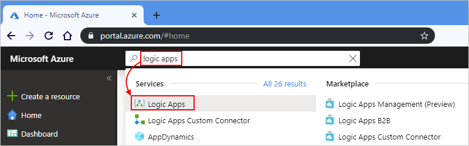

   The Azure portal shows all the logic apps that are associated with your Azure subscription. 

2. Select your logic app, then choose **Overview**.

   The Azure portal shows the runs history and trigger history 
   for your logic app. For example:

   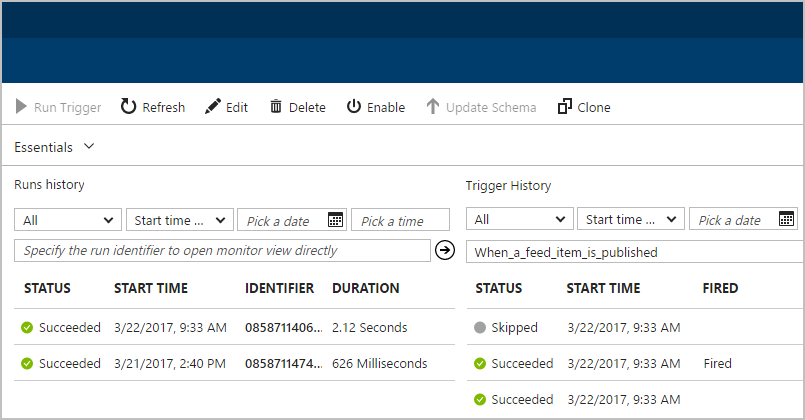

   * **Runs history** shows all the runs for your logic app. 
   * **Trigger History** shows all the trigger activity for your logic app.

   For status descriptions, see 
   [Troubleshoot your logic app](../logic-apps/logic-apps-diagnosing-failures.md).

   > [!TIP]
   > If you don't find the data that you expect, 
   > on the toolbar, choose **Refresh**.

3. To view the steps from a specific run, 
under **Runs history**, select that run. 

   The monitor view shows each step in that run. For example:

   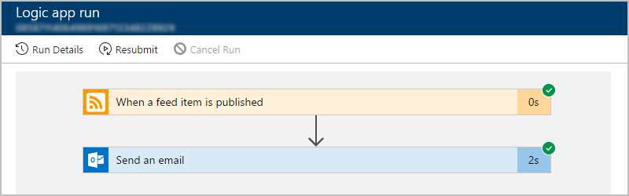

4. To get more details about the run, choose **Run Details**. 
This information summarizes the steps, status, inputs, and outputs for the run. 

   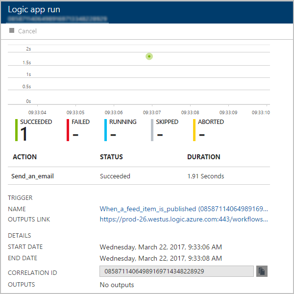

   For example, you can get the run's **Correlation ID**, 
   which you might need when you use the 
   [REST API for Logic Apps](https://docs.microsoft.com/rest/api/logic).

5. To get details about a specific step, choose that step. 
You can now review details like inputs, outputs, 
and any errors that happened for that step. For example:

   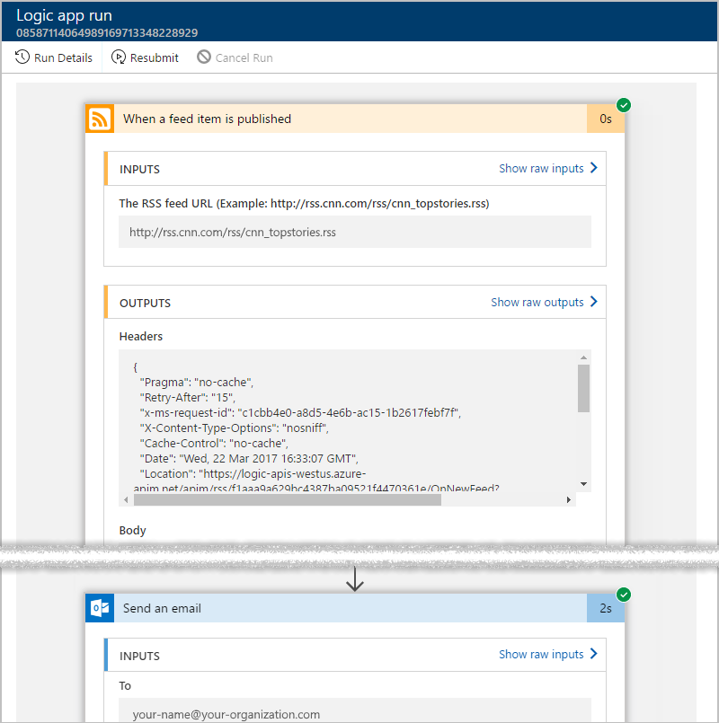
   
   > [!NOTE]
   > All runtime details and events are encrypted within the Logic Apps service. 
   > They are decrypted only when a user requests to view that data. 
   > You can also control access to these events with 
   > [Azure Role-Based Access Control (RBAC)](../role-based-access-control/overview.md).

6. To get details about a specific trigger event, 
go back to the **Overview** pane. Under **Trigger history**, 
select the trigger event. You can now review details like inputs and outputs, 
for example:

   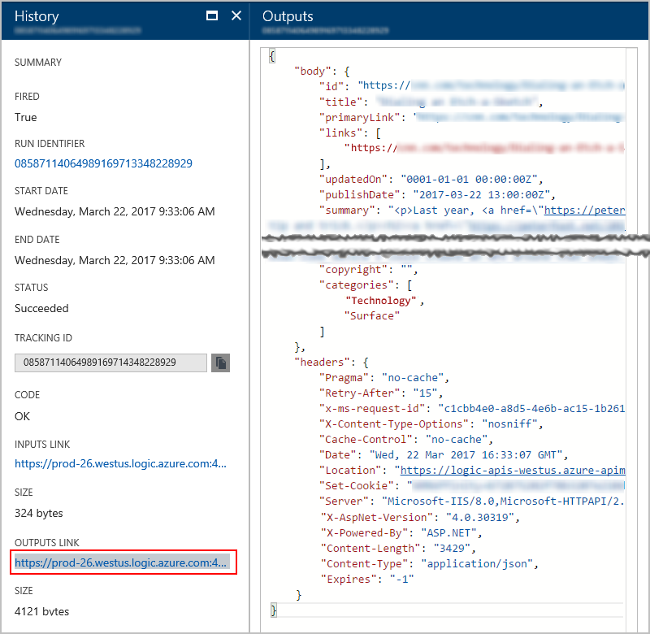

<a name="azure-diagnostics"></a>

## Turn on diagnostics logging for your logic app

For richer debugging with runtime details and events, 
you can set up diagnostics logging with 
[Azure Log Analytics](../log-analytics/log-analytics-overview.md). 
Log Analytics is a service in Azure 
that monitors your cloud and on-premises environments 
to help you maintain their availability and performance. 

Before you start, you need to have a Log Analytics workspace. Learn 
[how to create a Log Analytics workspace](../log-analytics/log-analytics-quick-create-workspace.md).

1. In the [Azure portal](https://portal.azure.com), 
find and select your logic app. 

2. On the logic app blade menu, under **Monitoring**, 
choose **Diagnostics** > **Diagnostic Settings**.

   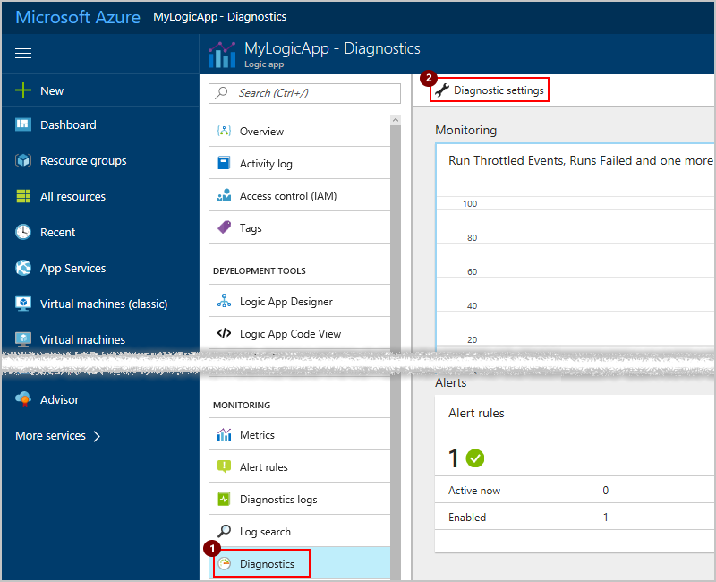

3. Under **Diagnostics settings**, choose **On**.

   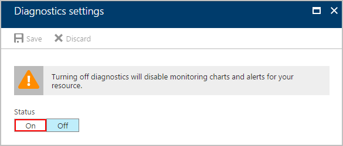

4. Now select the Log Analytics workspace and event category for logging as shown:

   1. Select **Send to Log Analytics**. 
   2. Under **Log Analytics**, choose **Configure**. 
   3. Under **OMS Workspaces**, select the Log Analytics workspace 
   to use for logging.
   4. Under **Log**, select the **WorkflowRuntime** category.
   5. Choose the metric interval.
   6. When you're done, choose **Save**.

   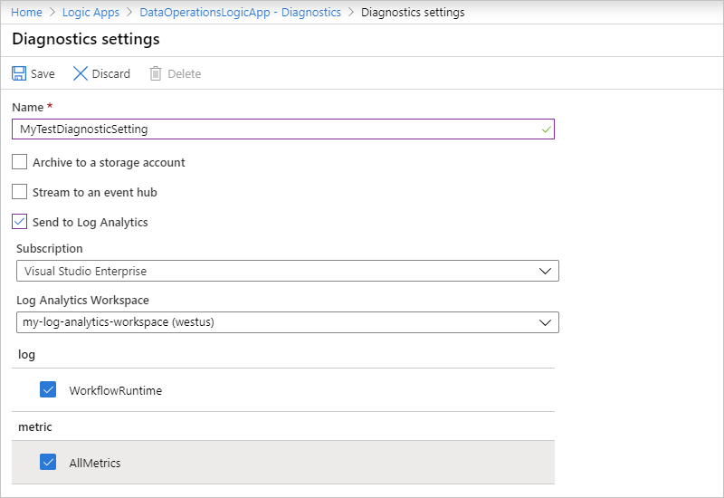

Now, you can find events and other data for trigger events, 
run events, and action events.

<a name="find-events"></a>

## Find events and data for your logic app

To find and view events in your logic app, 
like trigger events, run events, and action events, 
follow these steps.

1. In the [Azure portal](https://portal.azure.com), choose **All Services**. 
Search for "log analytics", then choose **Log Analytics** as shown here:

   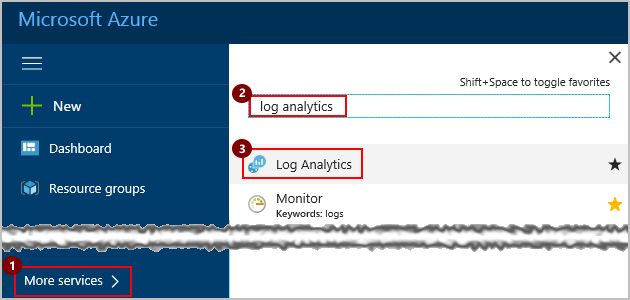

2. Under **Log Analytics**, find and select your Log Analytics workspace. 

   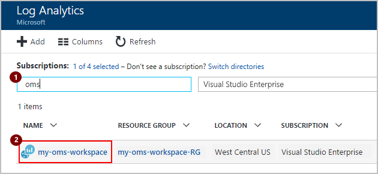

3. Under **Management**, choose **Log Search**.

   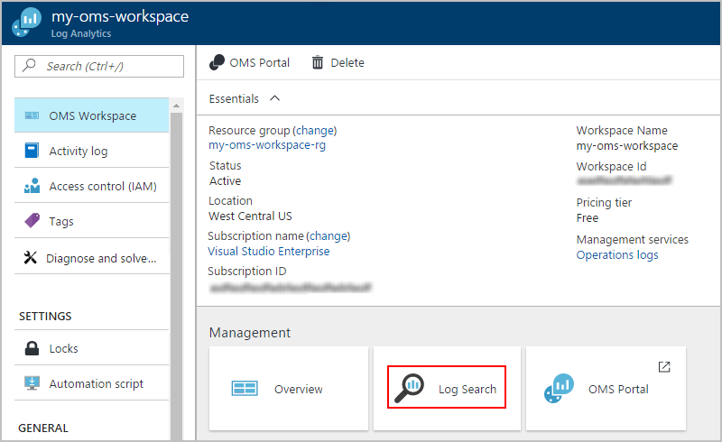

4. In the search box, specify a field that you want to find, and press **Enter**. 
When you start typing, you see possible matches and operations that you can use. 

   For example, to find the top 10 events that happened, 
   enter and select this search query: **search Category == "WorkflowRuntime" | limit 10**

   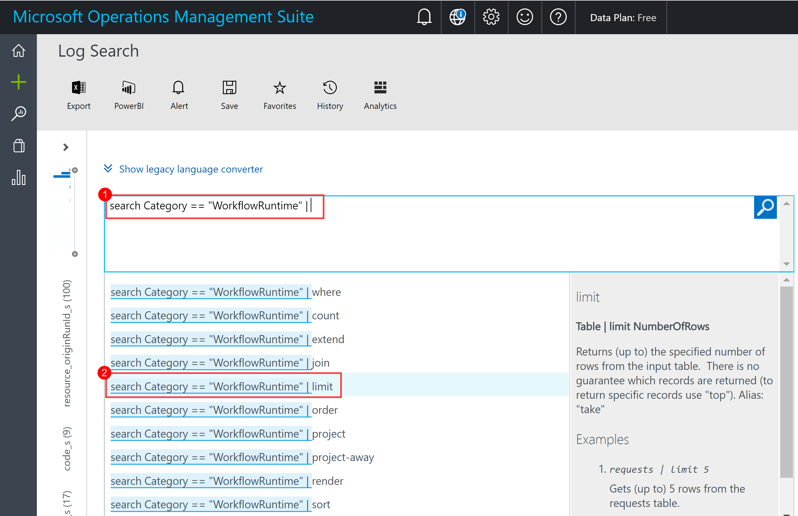

   Learn more about [how to find data in Log Analytics](../log-analytics/log-analytics-log-searches.md).

5. On the results page, in the left bar, choose the timeframe that you want to view.
To refine your query by adding a filter, choose **+Add**.

   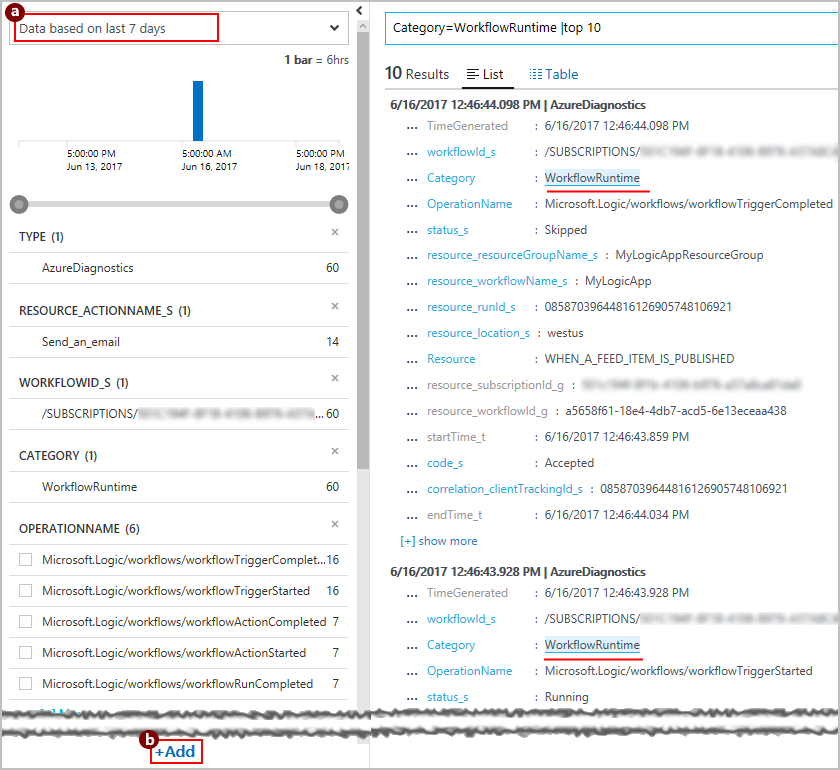

6. Under **Add Filters**, enter the filter name so you can find the filter you want. 
Select the filter, and choose **+Add**.

   This example uses the word "status" to find failed events under **AzureDiagnostics**.
   Here the filter for **status_s** is already selected.

   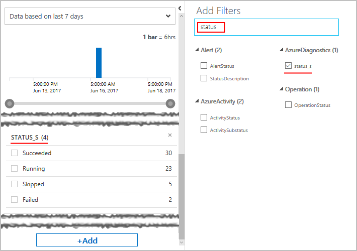

7. In the left bar, select the filter value that you want to use, and choose **Apply**.

   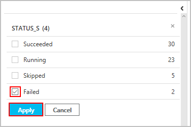

8. Now return to the query that you're building. 
Your query is updated with your selected filter and value. 
Your previous results are now filtered too.

   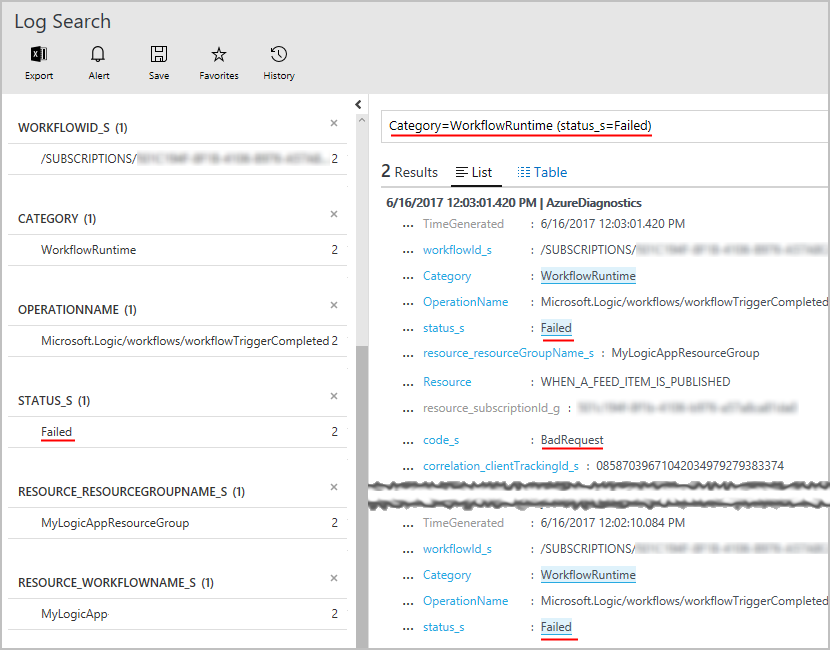

9. To save your query for future use, choose **Save**. 
Learn [how to save your query](../logic-apps/logic-apps-track-b2b-messages-omsportal-query-filter-control-number.md#save-oms-query).

<a name="extend-diagnostic-data"></a>

## Extend how and where you use diagnostic data with other services

Along with Azure Log Analytics, you can extend how you use your logic app's 
diagnostic data with other Azure services, for example: 

* [Archive Azure Diagnostics Logs in Azure Storage](../monitoring-and-diagnostics/monitoring-archive-diagnostic-logs.md)
* [Stream Azure Diagnostics Logs to Azure Event Hubs](../monitoring-and-diagnostics/monitoring-stream-diagnostic-logs-to-event-hubs.md) 

You can then get real-time monitoring by using telemetry and analytics from other services, 
like [Azure Stream Analytics](../stream-analytics/stream-analytics-introduction.md) 
and [Power BI](../log-analytics/log-analytics-powerbi.md). For example:

* [Stream data from Event Hubs to Stream Analytics](../stream-analytics/stream-analytics-define-inputs.md)
* [Analyze streaming data with Stream Analytics and create a real-time analytics dashboard in Power BI](../stream-analytics/stream-analytics-power-bi-dashboard.md)

Based on the options that you want set up, make sure that you first 
[create an Azure storage account](../storage/common/storage-create-storage-account.md) 
or [create an Azure event hub](../event-hubs/event-hubs-create.md). 
Then select the options for where you want to send diagnostic data:

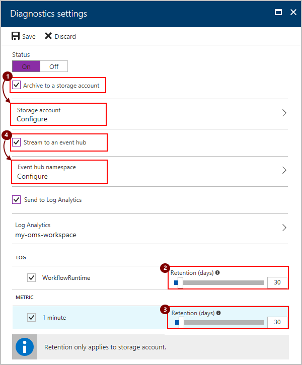

> [!NOTE]
> Retention periods apply only when you choose to use a storage account.

<a name="add-azure-alerts"></a>

## Set up alerts for your logic app

To monitor specific metrics or exceeded thresholds for your logic app, 
set up [alerts in Azure](../monitoring-and-diagnostics/monitoring-overview-alerts.md). 
Learn about [metrics in Azure](../monitoring-and-diagnostics/monitoring-overview-metrics.md). 

To set up alerts without 
[Azure Log Analytics](../log-analytics/log-analytics-overview.md), follow these steps. 
For more advanced alerts criteria and actions, [set up Log Analytics](#azure-diagnostics) too.

1. On the logic app blade menu, under **Monitoring**, 
choose **Diagnostics** > **Alert rules** > **Add alert** as shown here:

   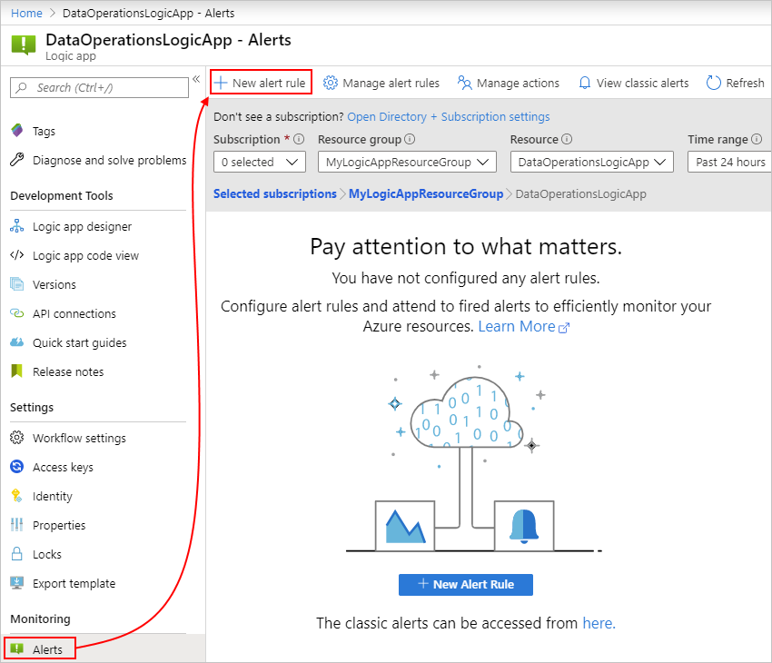

2. On the **Add an alert rule** blade, create your alert as shown:

   1. Under **Resource**, select your logic app, if not already selected. 
   2. Give a name and description for your alert.
   3. Select a **Metric** or event that you want to track.
   4. Select a **Condition**, specify a **Threshold** for the metric, 
   and select the **Period** for monitoring this metric.
   5. Select whether to send mail for the alert. 
   6. Specify any other email addresses for sending the alert. 
   You can also specify a webhook URL where you want to send the alert.

   For example, this rule sends an alert when five or more runs fail in an hour:

   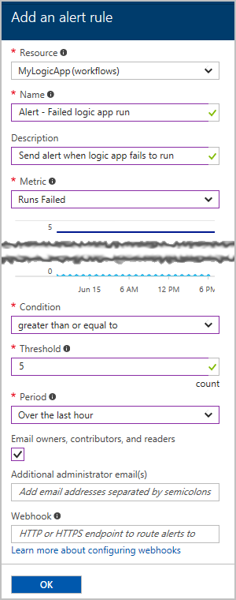

> [!TIP]
> To run a logic app from an alert, you can include the 
> [request trigger](../connectors/connectors-native-reqres.md) in your workflow, 
> which lets you perform tasks like these examples:
> 
> * [Post to Slack](https://github.com/Azure/azure-quickstart-templates/tree/master/201-alert-to-slack-with-logic-app)
> * [Send a text](https://github.com/Azure/azure-quickstart-templates/tree/master/201-alert-to-text-message-with-logic-app)
> * [Add a message to a queue](https://github.com/Azure/azure-quickstart-templates/tree/master/201-alert-to-queue-with-logic-app)

<a name="diagnostic-event-properties"></a>

## Azure Diagnostics event settings and details

Each diagnostic event has details about your logic app and that event, 
for example, the status, start time, end time, and so on. 
To programmatically set up monitoring, tracking, and logging, 
you can use these details with the 
[REST API for Azure Logic Apps](https://docs.microsoft.com/rest/api/logic) 
and the [REST API for Azure Diagnostics](../monitoring-and-diagnostics/monitoring-supported-metrics.md#microsoftlogicworkflows).

For example, the `ActionCompleted` event has the 
`clientTrackingId` and `trackedProperties` properties 
that you can use for tracking and monitoring:

``` json
{
    "time": "2016-07-09T17:09:54.4773148Z",
    "workflowId": "/SUBSCRIPTIONS/<subscription-ID>/RESOURCEGROUPS/MYRESOURCEGROUP/PROVIDERS/MICROSOFT.LOGIC/WORKFLOWS/MYLOGICAPP",
    "resourceId": "/SUBSCRIPTIONS/<subscription-ID>/RESOURCEGROUPS/MYRESOURCEGROUP/PROVIDERS/MICROSOFT.LOGIC/WORKFLOWS/MYLOGICAPP/RUNS/08587361146922712057/ACTIONS/HTTP",
    "category": "WorkflowRuntime",
    "level": "Information",
    "operationName": "Microsoft.Logic/workflows/workflowActionCompleted",
    "properties": {
        "$schema": "2016-06-01",
        "startTime": "2016-07-09T17:09:53.4336305Z",
        "endTime": "2016-07-09T17:09:53.5430281Z",
        "status": "Succeeded",
        "code": "OK",
        "resource": {
            "subscriptionId": "<subscription-ID>",
            "resourceGroupName": "MyResourceGroup",
            "workflowId": "cff00d5458f944d5a766f2f9ad142553",
            "workflowName": "MyLogicApp",
            "runId": "08587361146922712057",
            "location": "westus",
            "actionName": "Http"
        },
        "correlation": {
            "actionTrackingId": "e1931543-906d-4d1d-baed-dee72ddf1047",
            "clientTrackingId": "<my-custom-tracking-ID>"
        },
        "trackedProperties": {
            "myTrackedProperty": "<value>"
        }
    }
}
```

* `clientTrackingId`: If not provided, Azure automatically generates this ID 
and correlates events across a logic app run, 
including any nested workflows that are called from the logic app. 
You can manually specify this ID from a trigger by passing a 
`x-ms-client-tracking-id` header with your custom ID value 
in the trigger request. You can use a request trigger, 
HTTP trigger, or webhook trigger.

* `trackedProperties`: To track inputs or outputs in diagnostics data, 
you can add tracked properties to actions in your logic app's JSON definition. 
Tracked properties can track only a single action's inputs and outputs, 
but you can use the `correlation` properties of events to correlate across actions in a run.

  To track one or more properties, add the `trackedProperties` section and the 
  properties you want to the action definition. For example, 
  suppose you want to track data like an "order ID" in your telemetry:

  ``` json
  "myAction": {
    "type": "http",
    "inputs": {
        "uri": "http://uri",
        "headers": {
            "Content-Type": "application/json"
        },
        "body": "@triggerBody()"
    },
    "trackedProperties": {
        "myActionHTTPStatusCode": "@action()['outputs']['statusCode']",
        "myActionHTTPValue": "@action()['outputs']['body']['<content>']",
        "transactionId": "@action()['inputs']['body']['<content>']"
    }
  }
  ```

## Next steps

* [Create templates for logic app deployment and release management](../logic-apps/logic-apps-create-deploy-template.md)
* [B2B scenarios with Enterprise Integration Pack](../logic-apps/logic-apps-enterprise-integration-overview.md)
* [Monitor B2B messages](../logic-apps/logic-apps-monitor-b2b-message.md)
