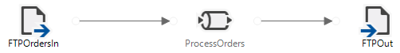
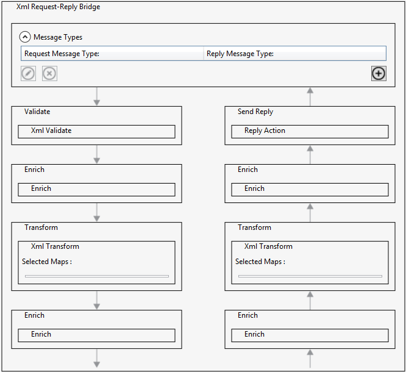
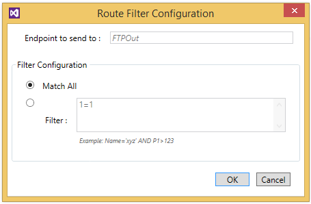

# Migrate from BizTalk Services to Azure Logic Apps

Microsoft Azure BizTalk Services (MABS) is retiring. 
To move your MABS integration solutions to 
[Azure Logic Apps](../logic-apps/logic-apps-overview.md), 
follow the guidance in this article. 

## Introduction

BizTalk Services consists of two subservices:

* Microsoft BizTalk Services Hybrid Connections
* EAI and EDI bridge-based integration

[Azure App Service Hybrid Connections](../app-service/app-service-hybrid-connections.md) 
replaces BizTalk Services Hybrid Connections. Azure Hybrid Connections is available with 
Azure App Service through the Azure portal. This service provides a Hybrid Connection 
Manager so that you can manage existing BizTalk Services hybrid connections 
and also new hybrid connections that you create in the portal. 

[Logic Apps](../logic-apps/logic-apps-overview.md) replaces EAI and EDI bridge-based 
integration with all the same capabilities in BizTalk Services and more. 
This service provides cloud-scale consumption-based workflow and orchestration 
features for you to quickly and easily build complex integration 
solutions through a browser or with Visual Studio.

This table maps BizTalk Services capabilities to Logic Apps.

| BizTalk Services   | Logic Apps            | Purpose                      |
| ------------------ | --------------------- | ---------------------------- |
| Connector          | Connector             | Send and receive data   |
| Bridge             | Logic App             | Pipeline processor           |
| Validate stage     | XML Validation action | Validate an XML document against a schema | 
| Enrich stage       | Data Tokens           | Promote properties into messages or for routing decisions |
| Transform stage    | Transform action      | Convert XML messages from one format to another |
| Decode stage       | Flat File Decode action | Convert from flat file to XML |
| Encode stage       | Flat File Encode action | Convert from XML to flat file |
| Message Inspector  | Azure Functions or API Apps | Run custom code in your integrations |
| Route Action       | Condition or Switch | Route messages to one of the specified connectors |
|||| 

## BizTalk Services artifacts

BizTalk Services has several kinds of artifacts. 

## Connectors

BizTalk Services connectors help bridges send and receive data, 
including two-way bridges that enable HTTP-based request/response interactions. 
Logic Apps uses the same terminology and has 180+ connectors that serve the same 
purpose by connecting to a wide range of technologies and services. 
For example, connectors are available for cloud SaaS and PaaS services, 
such as OneDrive, Office365, Dynamics CRM, and more, 
plus on-premises systems through the On-Premises Data Gateway,
which replaces the BizTalk Adapter Service for BizTalk Services. 
Sources in BizTalk Services are limited to FTP, SFTP, 
and Service Bus Queue or Topic subscription.

By default, each bridge has an HTTP endpoint, 
which is configured with the Runtime Address 
and the Relative Address properties for the bridge. 
To achieve the same results with Logic Apps, use the 
[Request and Response](../connectors/connectors-native-reqres.md) actions.

## XML processing and bridges

In BizTalk Services, a bridge is analogous to a processing pipeline. 
A bridge can take data received from a connector, 
do some work with the data, and send the results to another system. 
Logic Apps does the same by supporting the same pipeline-based 
interaction patterns as BizTalk Services and also providing other integration patterns. 
The [XML Request-Reply Bridge](https://msdn.microsoft.com/library/azure/hh689781.aspx) 
in BizTalk Services is known as a VETER pipeline, which consists of stages that 
perform these tasks:

* (V) Validate
* (E) Enrich
* (T) Transform
* (E) Enrich
* (R) Route

This image shows how processing is split between request and reply, 
which provides control over the request and the reply paths separately, 
for example, by using different maps for each path:

Also, an XML One-Way bridge adds Decode and Encode stages 
at the start and end of processing. 
The Pass-Through bridge contains a single Enrich stage.

### Message processing, decoding, and encoding

In BizTalk Services, you can receive different types of XML messages, 
and determine the matching schema for the message received. 
This work is performed in the *Message Types* stage of the receive processing pipeline. 
The Decode stage then uses the detected message type to decode the message using the provided schema. 
If the schema is a flat file schema, this stage converts the incoming flat file to XML. 

Logic Apps provides similar capabilities. 
You receive a flat file over different protocols using the 
different connector triggers (File System, FTP, HTTP, and so on), 
and use the [Flat File Decode](../logic-apps/logic-apps-enterprise-integration-flatfile.md) 
action to convert the incoming data to XML. You can move your existing flat file 
schemas directly to Logic Apps without any changes, 
and then upload schemas to your Integration Account.

### Validation

After the incoming data is converted to XML (or if XML was the message format received), 
validation runs to determine if the message adheres to your XSD schema. 
To perform this task in Logic Apps, use the 
[XML Validation](../logic-apps/logic-apps-enterprise-integration-xml-validation.md) action. 
You can use the same schemas from BizTalk Services without any changes.

### Transform messages

In BizTalk Services, the Transform stage converts one XML-based message format to another. 
This work is done by applying a map, using the TRFM-based mapper. 
In Logic Apps, the process is similar. The Transform action executes a map from your Integration Account. 
The main difference is that maps in Logic Apps are in XSLT format. 
XSLT includes the ability to reuse existing XSLT you already have, 
including maps created for BizTalk Server that contain functoids. 

### Routing rules

BizTalk Services makes a routing decision on which endpoint 
or connector to send incoming messages or data. 
The ability to select from pre-configured endpoints 
is possible using the routing filter option:

In BizTalk Services, if there are only two options, 
using a *condition* is the best way for 
converting routing filters in BizTalk Services. 
If there are more than two, then use a **switch**.

Logic Apps provides sophisticated logic capabilities 
plus advanced control flow and routing with 
[conditional statements](../logic-apps/logic-apps-control-flow-conditional-statement.md) 
and [switch statements](../logic-apps/logic-apps-control-flow-switch-statement.md).

### Enrich

In BizTalk Services processing, the Enrich stage adds properties 
to the message context associated with the data received. 
For example, promoting a property to use for routing from a database lookup, 
or by extracting a value using an XPath expression. 
Logic Apps provides access to all contextual data outputs from preceding actions, 
making it straightforward to replicate the same behavior. 
For example, using the `Get Row` SQL connection action, 
you return data from a SQL Server database, 
and use the data in a Decision action for routing. 
Likewise, properties on incoming Service Bus queued 
messages by a trigger are addressable, 
as well as XPath using the xpath workflow definition language expression.

### Run custom code

BizTalk Services lets you [run custom code](https://msdn.microsoft.com/library/azure/dn232389.aspx) 
that is uploaded in your own assemblies. This functionality is implemented by the 
[IMessageInspector](https://msdn.microsoft.com/library/microsoft.biztalk.services.imessageinspector) interface. 
Each stage in the bridge includes two properties (On Enter Inspector, and On Exit Inspector) 
that provide the .NET type you created that implements this interface. 
Custom code lets you perform more complex processing on data and lets you 
reuse existing code in assemblies that perform common business logic. 

Logic Apps provides two primary ways to execute custom code: Azure Functions, and API Apps. 
Azure Functions can be created, and called from logic apps. 
See [Add and run custom code for logic apps through Azure Functions](../logic-apps/logic-apps-azure-functions.md). 
Use API Apps, part of Azure App Service, to create your own triggers and actions. Learn more about 
[creating a custom API to use with Logic Apps](../logic-apps/logic-apps-create-api-app.md). 

If you have custom code in assemblies that you call from BizTalk Services, 
you can either move this code to Azure Functions, or create custom APIs with API Apps, 
depending on what you're implementing. For example, if you have code that wraps 
another service for which Logic Apps doesn't have a connector, 
then create an API App, and use the actions your API app provides within your logic app. 
If you have helper functions or libraries, then Azure Functions is likely the best fit.

### EDI processing and trading partner management

BizTalk Services and Logic Apps include EDI and B2B processing 
with support for AS2 (Applicability Statement 2), X12, and EDIFACT. 
In BizTalk Services, your create EDI bridges and create or manage 
trading partners and agreements in the dedicated Tracking and Management portal.
In Logic Apps, you get this functionality through the 
[Enterprise Integration Pack (EIP)](../logic-apps/logic-apps-enterprise-integration-overview.md). 
The EIP provides [Integration Account](../logic-apps/logic-apps-enterprise-integration-create-integration-account.md) 
and B2B actions for EDI and B2B processing. 
You also use an Integration Account to create and manage 
[trading partners](../logic-apps/logic-apps-enterprise-integration-partners.md) 
and [agreements](../logic-apps/logic-apps-enterprise-integration-agreements.md). 
After you create an Integration Account, you can link one or more logic apps to the account. 
You can then use B2B actions to access trading partner information from your logic app. 
The following actions are provided:

* AS2 Encode
* AS2 Decode
* X12 Encode
* X12 Decode
* EDIFACT Encode
* EDIFACT Decode

Unlike BizTalk Services, these actions are decoupled from the transport protocols. 
So when you create your logic apps, you have more flexibility in which connectors 
that you use to send and receive data. For example, you can receive X12 files as attachments from email, 
and then process these files in a logic app. 

## Manage and monitor

In BizTalk Services, a dedicated portal provided tracking capabilities to monitor and troubleshoot issues. 
Logic Apps provides richer tracking and monitoring capabilities through the 
[Azure portal](../logic-apps/logic-apps-monitor-your-logic-apps.md), 
and includes a mobile app for keeping an eye on things when you're on the move.

## High availability

For high availability (HA) in BizTalk Services, 
you can share the processing load by using 
more than one instance in a specific region. 
Logic Apps provides in-region HA at no additional cost. 

In BizTalk Services, out-of-region disaster recovery for 
B2B processing requires a backup and restore process. 
For business continuity, Logic Apps provides cross-region 
active/passive [DR capability](../logic-apps/logic-apps-enterprise-integration-b2b-business-continuity.md), 
which lets you synchronize B2B data across integration accounts in different regions.

## Next steps

* [What is Logic Apps?](../logic-apps/logic-apps-overview.md)
* [Create your first logic app](../logic-apps/quickstart-create-first-logic-app-workflow.md), or quickly get started using a [pre-built template](../logic-apps/logic-apps-create-logic-apps-from-templates.md)  
* [View all the available connectors](../connectors/apis-list.md) that you can use in logic apps