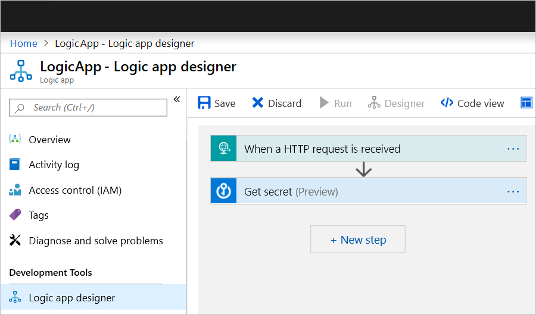
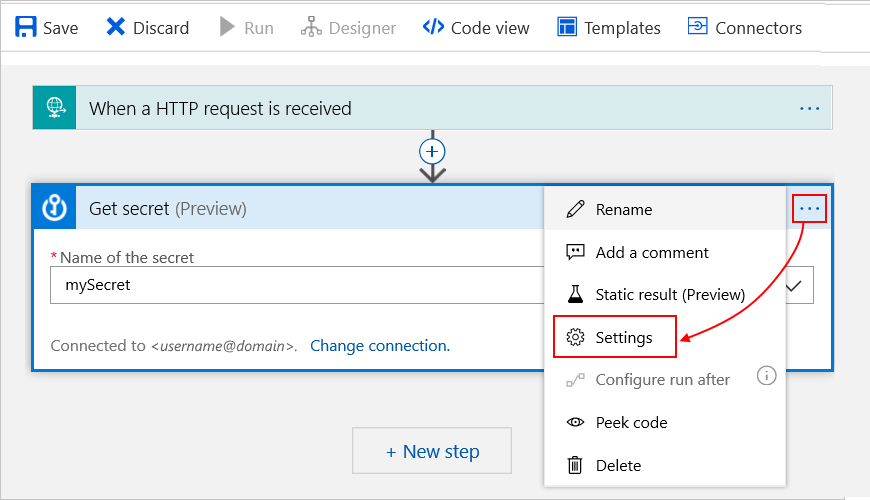
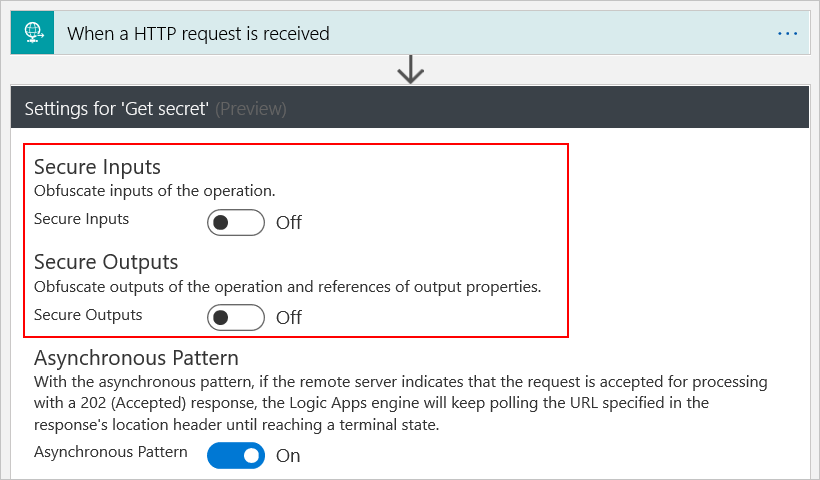
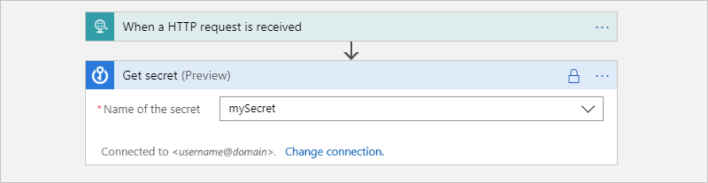
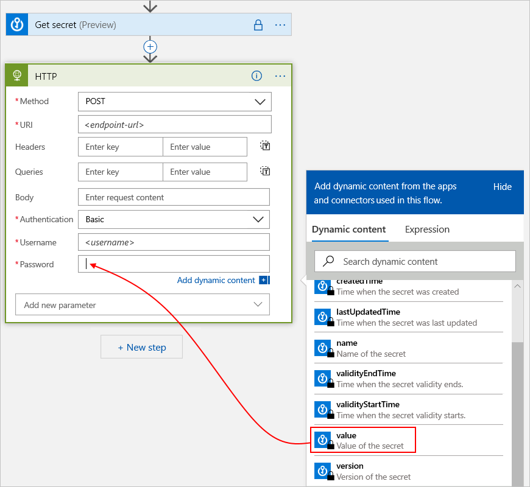
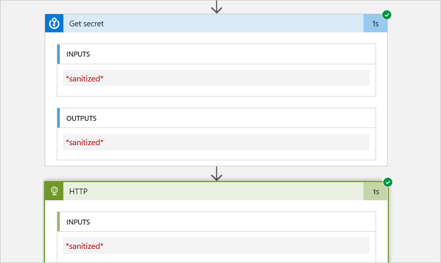

# Secure inputs and outputs with obfuscation in Azure Logic Apps

When your logic app finishes running, you can access the history for that particular run, including the steps that ran along with the status, duration, inputs, and outputs for each action. This rich detail provides insight into how your logic app ran and where you might start troubleshooting any problems that arise. However, for actions that handle any secrets or sensitive information, you want to block others from viewing and accessing that data. For example, if your logic app gets a secret from Azure Key Vault to use as authentication for an HTTP action, you want to hide that secret from view.

To prevent showing the inputs and outputs in your logic app's run history, you can turn on obfuscation for all the inputs, outputs, or both in triggers and actions.

Here are some considerations when enabling obfuscation:

* When you secure the outputs on an action, Logic Apps also blocks the action's input history for any action that explicitly references that output. Also, the [Logic Apps API for handling workflow history](https://docs.microsoft.com/rest/api/logic/) doesn't return secured outputs.

* If an action uses secured output as input, that input is treated as secure only if that action emits the same data as the input used. So, make sure that you also turn on secure outputs on that action.

* When you secure the inputs or outputs on an action, you prevent that action from sending the secured data to Azure Log Analytics. You also can't add [tracked properties](logic-apps-monitor-your-logic-apps.md#azure-diagnostics-event-settings-and-details) that action for monitoring.

## Prerequisites

* An Azure subscription. If you don't have an Azure subscription yet, [sign up for a free Azure account](https://azure.microsoft.com/free/).

* The logic app where you want to secure inputs and outputs

  If you're new to logic apps, review [What is Azure Logic Apps](../logic-apps/logic-apps-overview.md) and [Quickstart: Create your first logic app](../logic-apps/quickstart-create-first-logic-app-workflow.md).

## Secure inputs or outputs

1. If your logic app isn't already open in the [Azure portal](https://portal.azure.com), open your logic app in the Logic App Designer.

   

1. On the trigger or action where you want to secure data, select the ellipses (**...**) button, and then select **Settings**.

   

1. Turn on either **Secure inputs**, **Secure outputs**, or both. When you're finished, select **Done**.

   

   The action or trigger now shows a lock icon in the title bar.

   

   Tokens that represent secured outputs from previous actions also show lock icons. For example, when you select such an output from the dynamic content list to use in an action, that token shows a lock icon.

   

   When you view your logic app's run history, the secured inputs and outputs appear hidden.

   

## Next steps

Learn more about [how to secure logic apps](logic-apps-securing-a-logic-apps.md)