---
# required metadata
title: Perform operations on data - Azure Logic Apps | Microsoft Docs
description: Convert, manage, and manipulate data outputs and formats in Azure Logic Apps
services: logic-apps
ms.service: logic-apps
author: ecfan
ms.author: estfan
manager: jeconnoc
ms.topic: article
ms.date: 07/30/2018

# optional metadata
ms.reviewer: klam, LADocs
ms.suite: integration
---

# Perform data operations in Azure Logic Apps

This article shows how you can work with data in your logic apps by 
adding actions for these tasks and more:

* Create tables from arrays.
* Create arrays from other arrays based on a condition.
* Create user-friendly tokens from JavaScript Object Notation (JSON) 
object properties so you can easily use those properties in your workflow.

If you don't find the action you want here, 
try browsing the many various 
[data manipulation functions](../logic-apps/workflow-definition-language-functions-reference.md) 
that Logic Apps provides. 

These tables summarize the data operations you can use 
and are organized based on the source data types that 
the operations work on, but each description appears alphabetically.

**Array actions** 

These actions help you work with data in arrays.

| Action | Description | 
|--------|-------------| 
| [**Create CSV table**](#create-csv-table-action) | Create a comma-separated value (CSV) table from an array. | 
| [**Create HTML table**](#create-html-table-action) | Create an HTML table from an array. | 
| [**Filter array**](#filter-array-action) | Create an array subset from an array based on the specified filter or condition. | 
| [**Join**](#join-action) | Create a string from all the items in an array and separate each item with the specified character. | 
| [**Select**](#select-action) | Create an array from the specified properties for all the items in a different array. | 
||| 

**JSON actions**

These actions help you work with data in JavaScript Object Notation (JSON) format.

| Action | Description | 
|--------|-------------| 
| [**Compose**](#compose-action) | Create a message, or string, from multiple inputs that can have various data types. You can then use this string as a single input, rather than repeatedly entering the same inputs. For example, you can create a single JSON message from various inputs. | 
| [**Parse JSON**](#parse-json-action) | Create user-friendly data tokens for properties in JSON content so you can more easily use the properties in your logic apps. | 
||| 

To create more complex JSON transformations, see 
[Perform advanced JSON transformations with Liquid templates](../logic-apps/logic-apps-enterprise-integration-liquid-transform.md).

## Prerequisites

To follow the examples in this article, you need these items:

* An Azure subscription. If you don't have an Azure subscription yet, 
<a href="https://azure.microsoft.com/free/" target="_blank">sign up for a free Azure account</a>.

* The logic app where you need the operation for working with data 

  If you're new to logic apps, review 
  [What is Azure Logic Apps](../logic-apps/logic-apps-overview.md) 
  and [Quickstart: Create your first logic app](../logic-apps/quickstart-create-first-logic-app-workflow.md).

* A [trigger](../logic-apps/logic-apps-overview.md#logic-app-concepts) 
as the first step in your logic app 

  Data operations are available only as actions, 
  so before you can use these actions, start your 
  logic app with a trigger and include any other 
  actions required for creating the outputs you want.

<a name="compose-action"></a>

## Compose action

To construct a single output such as a JSON object from multiple inputs, 
you can use the **Data Operations - Compose** action. Your inputs can have 
various types such as integers, Booleans, arrays, JSON objects, and any 
other native type that Azure Logic Apps supports, for example, binary and XML. 
You can then use the output in actions that follow after the **Compose** action. 
The **Compose** action can also save you from repeatedly entering the same inputs 
while you build your logic app's workflow. 

For example, you can construct a JSON message from multiple variables, 
such as string variables that store people's first names and last names, 
and an integer variable that stores people's ages. Here, the **Compose** 
action accepts these inputs:

`{ "age": <ageVar>, "fullName": "<lastNameVar>, <firstNameVar>" }`

and creates this output:

`{"age":35,"fullName":"Owens,Sophie"}`

To try an example, follow these steps by using the Logic App Designer. 
Or, if you prefer working in the code view editor, you can copy the 
example **Compose** and **Initialize variable** action definitions 
from this article into your own logic app's underlying workflow definition: 
[Data operation code examples - Compose](../logic-apps/logic-apps-data-operations-code-samples.md#compose-action-example) 

1. In the <a href="https://portal.azure.com" target="_blank">Azure portal</a> 
or Visual Studio, open your logic app in Logic App Designer. 

   This example uses the Azure portal and a logic app with a 
   **Recurrence** trigger and several **Initialize variable** actions. 
   These actions are set up for creating two string variables 
   and an integer variable. When you later test your logic app, 
   you can manually run your app without waiting for the trigger to fire.

   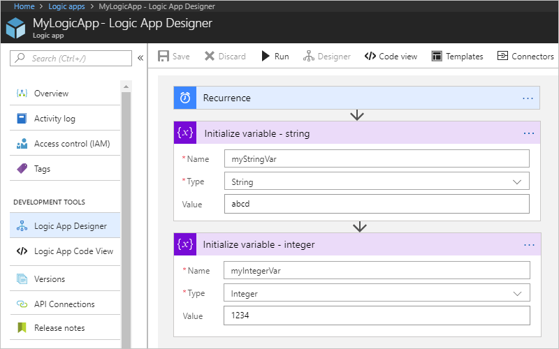

2. In your logic app where you want to create the output, 
follow one of these steps: 

   * To add an action under the last step, 
   choose **New step** > **Add an action**.

     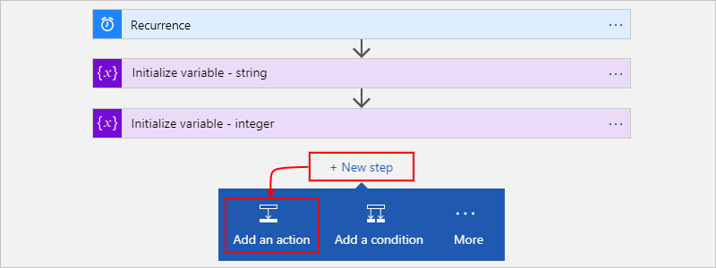

   * To add an action between steps, move your mouse 
   over the connecting arrow so the plus sign (+) appears. 
   Choose the plus sign, and then select **Add an action**.

3. In the search box, enter "compose" as your filter. 
From the actions list, select this action: **Compose**

   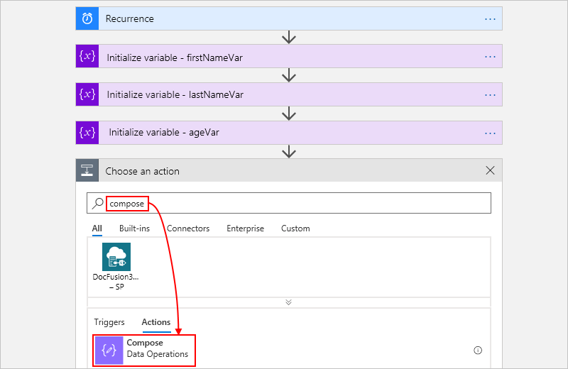

4. In the **Inputs** box, provide the inputs you want for creating the output. 

   For this example, when you click inside the **Inputs** box, 
   the dynamic content list appears so you can select 
   the previously created variables:

   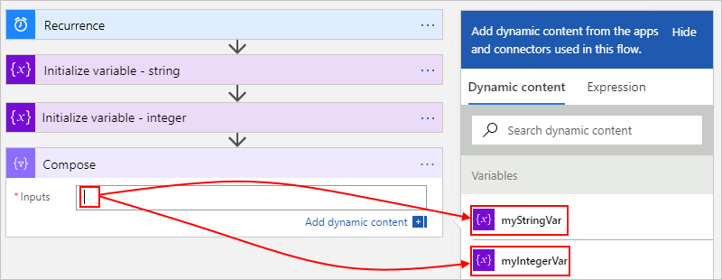

   Here is the finished example **Compose** action: 

   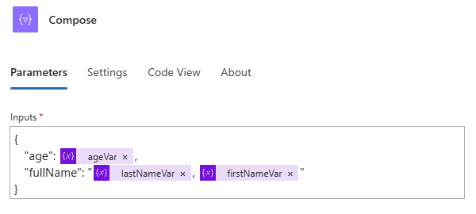

5. Save your logic app. On the designer toolbar, choose **Save**.

For more information about this action in 
your underlying workflow definition, see the 
[Compose action](../logic-apps/logic-apps-workflow-actions-triggers.md#compose-action). 

### Test your logic app

To confirm whether the **Compose** action creates the expected results, 
send yourself a notification that includes output from the **Compose** action.

1. In your logic app, add an action that can send you 
the results from the **Compose** action.

2. In that action, click anywhere you want the results to appear. 
When the dynamic content list opens, under the **Compose** action, 
select **Output**. 

   This example uses the **Office 365 Outlook - Send an email** action 
   and includes the **Output** fields in the email's body and subject:

   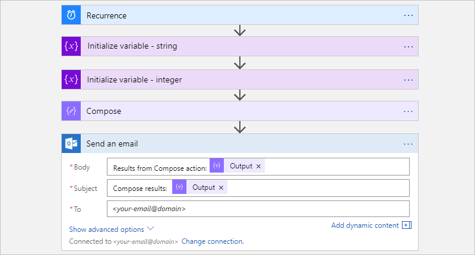

3. Now, manually run your logic app. On the designer toolbar, choose **Run**. 

   Based on the email connector you used, here are the results you get:

   

<a name="create-csv-table-action"></a>

## Create CSV table action

To create a comma-separated value (CSV) table that has the properties 
and values from JavaScript Object Notation (JSON) objects in an array, 
use the **Data Operations - Create CSV table** action. You can then use 
the resulting table in actions that follow the **Create CSV table** action. 

If you prefer working in the code view editor, you can copy the 
example **Create CSV table** and **Initialize variable** action definitions 
from this article into your own logic app's underlying workflow definition: 
[Data operation code examples - Create CSV table](../logic-apps/logic-apps-data-operations-code-samples.md#create-csv-table-action-example) 

1. In the <a href="https://portal.azure.com" target="_blank">Azure portal</a> 
or Visual Studio, open your logic app in Logic App Designer. 

   This example uses the Azure portal and a logic app with a 
   **Recurrence** trigger and an **Initialize variable** action. 
   The action is set up for creating a variable whose initial value 
   is an array that has some properties and values in JSON format. 
   When you later test your logic app, you can manually run your 
   app without waiting for the trigger to fire.

   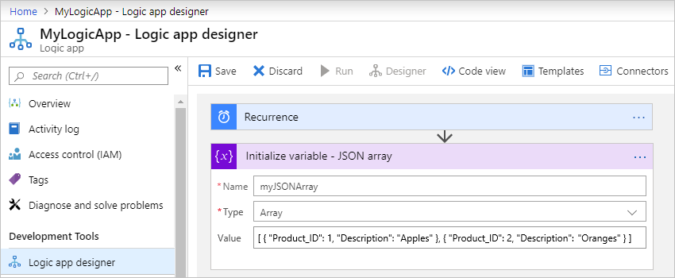

2. In your logic app where you want to create the CSV table, 
follow one of these steps: 

   * To add an action under the last step, 
   choose **New step** > **Add an action**.

     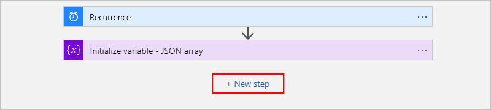

   * To add an action between steps, move your mouse 
   over the connecting arrow so the plus sign (+) appears. 
   Choose the plus sign, and then select **Add an action**.

3. In the search box, enter "create csv table" as your filter. 
From the actions list, select this action: **Create CSV table**

   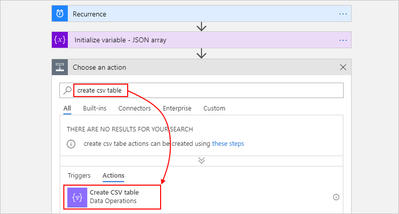

4. In the **From** box, provide the array or expression you want for creating the table. 

   For this example, when you click inside the **From** box, 
   the dynamic content list appears so you can select 
   the previously created variable:

   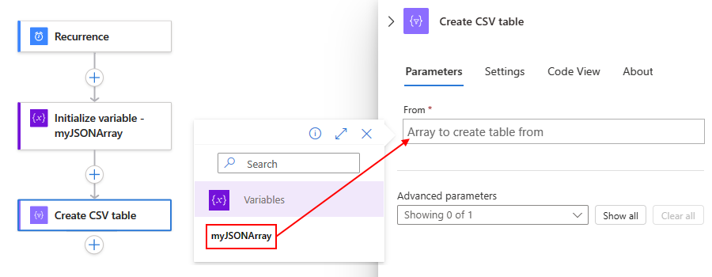

   Here is the finished example **Create CSV table** action: 

   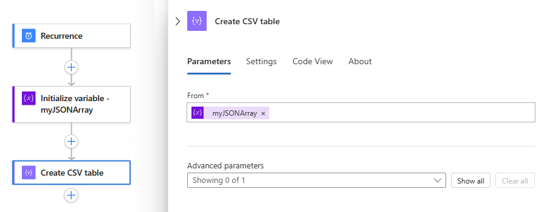

   By default, this action automatically creates the columns based on the array items. 
   To manually create the column headers and values, choose **Show advanced options**. 
   To provide only custom values, change **Columns** to **Custom**. 
   To provide custom column headers too, change **Include headers** to **Yes**. 

   > [!TIP]
   > To create user-friendly tokens for the properties in 
   > JSON objects so you can select those properties as inputs, 
   > use the [Parse JSON](#parse-json-action) before calling the 
   > **Create CSV table** action.

5. Save your logic app. On the designer toolbar, choose **Save**.

For more information about this action in your underlying workflow definition, 
see the [Table action](../logic-apps/logic-apps-workflow-actions-triggers.md#table-action).

### Test your logic app

To confirm whether the **Create CSV table** action creates the expected results, 
send yourself a notification that includes output from the **Create CSV table** action.

1. In your logic app, add an action that can send you 
the results from the **Create CSV table** action.

2. In that action, click anywhere you want the results to appear. 
When the dynamic content list opens, under the **Create CSV table** action, 
select **Output**. 

   This example uses the **Office 365 Outlook - Send an email** action 
   and includes the **Output** field in the email's body:

   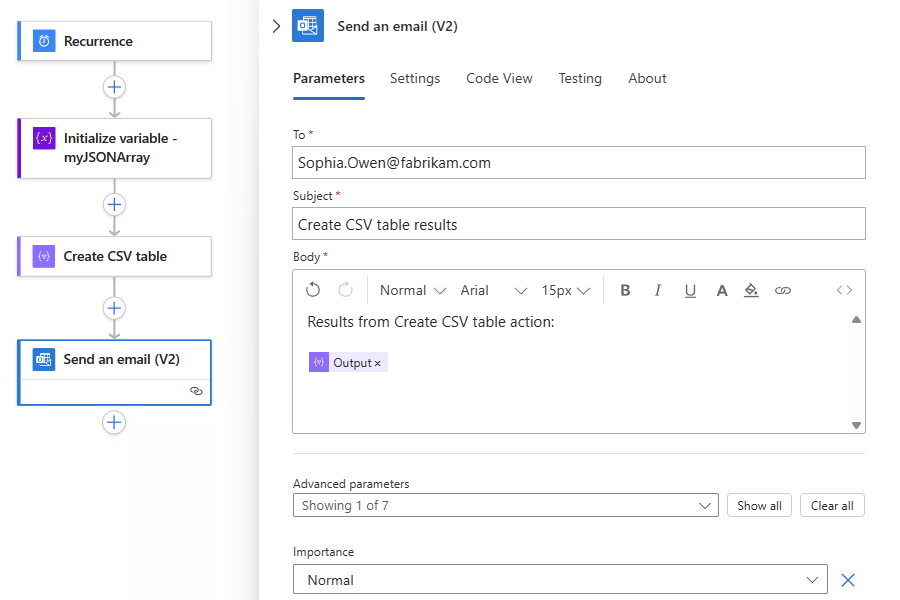

3. Now, manually run your logic app. On the designer toolbar, choose **Run**. 

   Based on the email connector you used, here are the results you get:

   

<a name="create-html-table-action"></a>

## Create HTML table action

To create an HTML table that has the properties and values 
from JavaScript Object Notation (JSON) objects in an array, 
use the **Data Operations - Create HTML table** action. 
You can then use the resulting table in actions that 
follow the **Create HTML table** action.

If you prefer working in the code view editor, you can copy the 
example **Create HTML table** and **Initialize variable** action definitions 
from this article into your own logic app's underlying workflow definition: 
[Data operation code examples - Create HTML table](../logic-apps/logic-apps-data-operations-code-samples.md#create-html-table-action-example) 

1. In the <a href="https://portal.azure.com" target="_blank">Azure portal</a> 
or Visual Studio, open your logic app in Logic App Designer. 

   This example uses the Azure portal and a logic app with a 
   **Recurrence** trigger and an **Initialize variable** action. 
   The action is set up for creating a variable whose initial value 
   is an array that has some properties and values in JSON format. 
   When you later test your logic app, you can manually run your 
   app without waiting for the trigger to fire.

   

2. In your logic app where you want to create an HTML table, 
follow one of these steps: 

   * To add an action under the last step, 
   choose **New step** > **Add an action**.

     

   * To add an action between steps, move your mouse 
   over the connecting arrow so the plus sign (+) appears. 
   Choose the plus sign, and then select **Add an action**.

3. In the search box, enter "create html table" as your filter. 
From the actions list, select this action: **Create HTML table**

   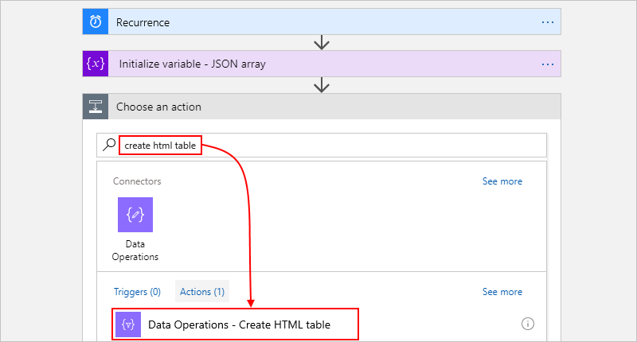

4. In the **From** box, provide the array or expression you want for creating the table. 

   For this example, when you click inside the **From** box, 
   the dynamic content list appears so you can select 
   the previously created variable:

   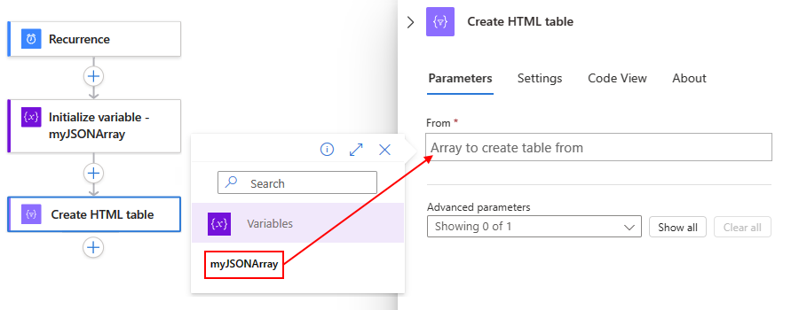

   Here is the finished example **Create HTML table** action: 

   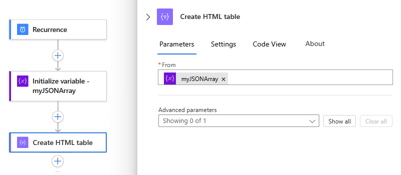

   By default, this action automatically creates the columns based on the array items. 
   To manually create the column headers and values, choose **Show advanced options**. 
   To provide only custom values, change **Columns** to **Custom**. 
   To provide custom column headers too, change **Include headers** to **Yes**. 

   > [!TIP]
   > To create user-friendly tokens for the properties in 
   > JSON objects so you can select those properties as inputs, 
   > use the [Parse JSON](#parse-json-action) before calling the 
   > **Create HTML table** action.

5. Save your logic app. On the designer toolbar, choose **Save**.

For more information about this action in your underlying workflow definition, 
see the [Table action](../logic-apps/logic-apps-workflow-actions-triggers.md#table-action).

### Test your logic app

To confirm whether the **Create HTML table** action creates the expected results, 
send yourself a notification that includes output from the **Create HTML table** action.

1. In your logic app, add an action that can send you 
the results from the **Create HTML table** action.

2. In that action, click anywhere you want the results to appear. 
When the dynamic content list opens, under the **Create HTML table** action, 
select **Output**. 

   This example uses the **Office 365 Outlook - Send an email** action 
   and includes the **Output** field in the email's body:

   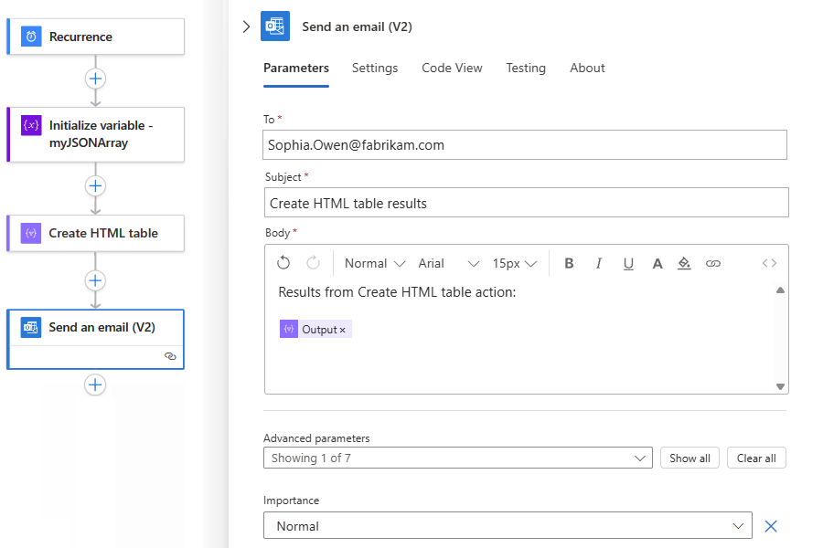
   
   > [!NOTE]
   > When including the HTML table output in an email action, 
   > make sure that you set the **Is HTML** property to **Yes** 
   > in the email action's advanced options. That way, 
   > the email action correctly formats the HTML table.

3. Now, manually run your logic app. On the designer toolbar, choose **Run**. 

   Based on the email connector you used, here are the results you get:

   

<a name="filter-array-action"></a>

## Filter array action

To create a smaller array that has items, which meet specific criteria, 
from an existing array, use the **Data Operations - Filter array** action. 
You can then use the filtered array in actions that follow after the **Filter array** action. 

> [!NOTE]
> Any filter text that you use in your condition is case sensitive. 
> Also, this action can't change the format or components of items in the array. 
> 
> For actions to use the array output from the **Filter array** action, 
> either those actions must accept arrays as input, or you might 
> have to transform the output array into another compatible format. 

If you prefer working in the code view editor, you can copy the 
example **Filter array** and **Initialize variable** action definitions 
from this article into your own logic app's underlying workflow definition: 
[Data operation code examples - Filter array](../logic-apps/logic-apps-data-operations-code-samples.md#filter-array-action-example) 

1. In the <a href="https://portal.azure.com" target="_blank">Azure portal</a> 
or Visual Studio, open your logic app in Logic App Designer. 

   This example uses the Azure portal and a logic app with a 
   **Recurrence** trigger and an **Initialize variable** action. 
   The action is set up for creating a variable whose initial 
   value is an array that has some sample integers. When you 
   later test your logic app, you can manually run your app 
   without waiting for the trigger to fire.

   > [!NOTE]
   > Although this example uses a simple integer array, 
   > this action is especially useful for JSON object arrays where 
   > you can filter based on the objects' properties and values.

   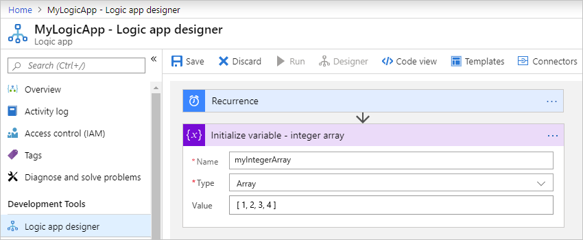

2. In your logic app where you want to create the filtered array, 
follow one of these steps: 

   * To add an action under the last step, 
   choose **New step** > **Add an action**.

     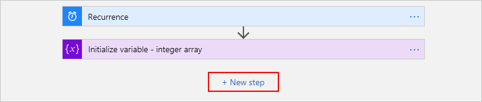

   * To add an action between steps, move your mouse 
   over the connecting arrow so the plus sign (+) appears. 
   Choose the plus sign, and then select **Add an action**.

3. In the search box, enter "filter array" as your filter. 
From the actions list, select this action: **Filter array**

   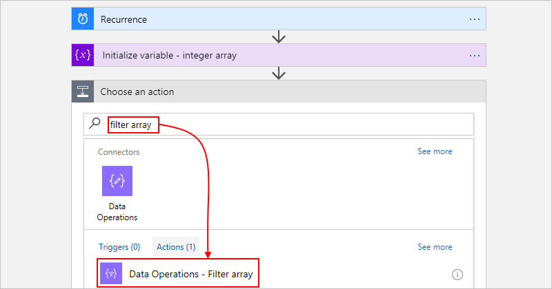

4. In the **From** box, provide the array or expression you want to filter. 

   For this example, when you click inside the **From** box, 
   the dynamic content list appears so you can select 
   the previously created variable:

   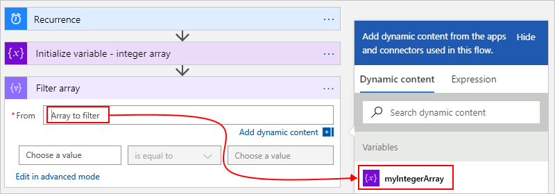

5. For the condition, specify the array items to compare, 
select the comparison operator, and specify the comparison value.

   This example uses the **item()** function for accessing 
   each item in the array while the **Filter array** action 
   searches for array items whose value is greater than 1:
   
   

6. Save your logic app. On the designer toolbar, choose **Save**.

For more information about this action in your underlying workflow definition, 
see [Query action](../logic-apps/logic-apps-workflow-actions-triggers.md#query-action).

### Test your logic app

To confirm whether **Filter array** action creates the expected results, 
send yourself a notification that includes output from the **Filter array** action.

1. In your logic app, add an action that can send you 
the results from the **Filter array** action.

2. In that action, click anywhere you want the results to appear. 
When the dynamic content list opens, choose **Expression**. 
To get the array output from the **Filter array** action, 
enter this expression that includes the **Filter array** action's name:

   ```
   @actionBody('Filter_array')
   ```

   This example uses the **Office 365 Outlook - Send an email** action 
   and includes the outputs from the **actionBody('Filter_array')** 
   expression in the email's body:

   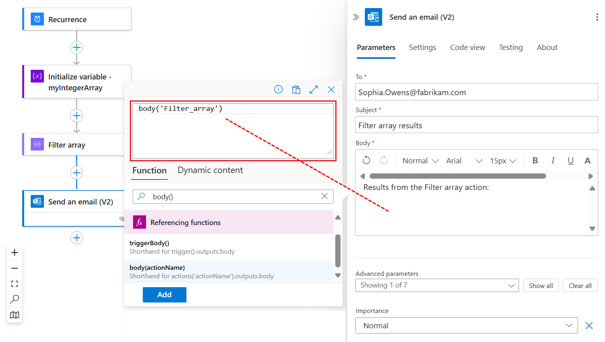

3. Now, manually run your logic app. On the designer toolbar, choose **Run**. 

   Based on the email connector you used, here are the results you get:

   

<a name="join-action"></a>

## Join action

To create a string that has all the items from an array and 
separate those items with a specific delimiter character, 
use the **Data Operations - Join** action. You can then use 
the string in actions that follow after the **Join** action.

If you prefer working in the code view editor, you can copy the 
example **Join** and **Initialize variable** action definitions 
from this article into your own logic app's underlying workflow definition: 
[Data operation code examples - Join](../logic-apps/logic-apps-data-operations-code-samples.md#join-action-example) 

1. In the <a href="https://portal.azure.com" target="_blank">Azure portal</a> 
or Visual Studio, open your logic app in Logic App Designer. 

   This example uses the Azure portal and a logic app with a 
   **Recurrence** trigger and an **Initialize variable** action. 
   This action is set up for creating a variable whose initial 
   value is an array that has some sample integers. 
   When you test your logic app later, you can manually 
   run your app without waiting for the trigger to fire.

   

2. In your logic app where you want to create the string from an array, 
follow one of these steps: 

   * To add an action under the last step, 
   choose **New step** > **Add an action**.

     

   * To add an action between steps, move your mouse 
   over the connecting arrow so the plus sign (+) appears. 
   Choose the plus sign, and then select **Add an action**.

3. In the search box, enter "join" as your filter. 
From the actions list, select this action: 
**Join**

   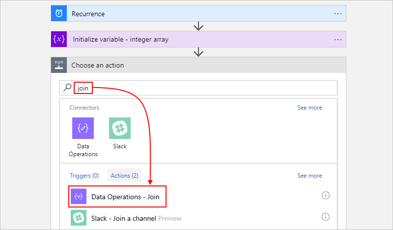

4. In the **From** box, provide the array that has the items you want to join as a string. 

   For this example, when you click inside the **From** box, 
   the dynamic content list that appears so you can select 
   the previously created variable:  

   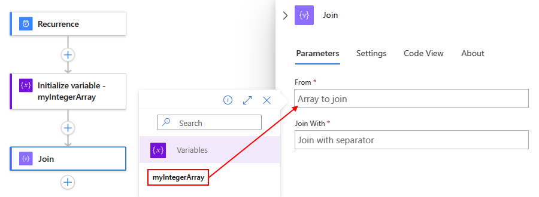

5. In the **Join with** box, enter the character 
you want for separating each array item. 

   This example uses a colon (:) as the separator.

   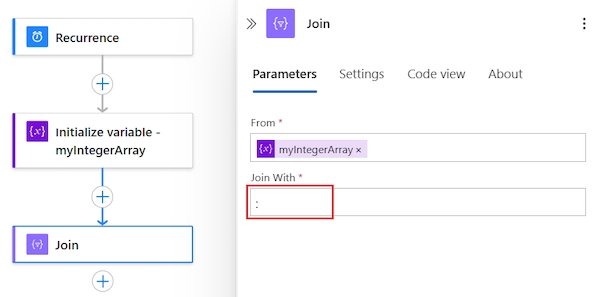

6. Save your logic app. On the designer toolbar, choose **Save**.

For more information about this action in your underlying workflow definition, 
see the [Join action](../logic-apps/logic-apps-workflow-actions-triggers.md#join-action).

### Test your logic app

To confirm whether the **Join** action creates the expected results, 
send yourself a notification that includes output from the **Join** action. 

1. In your logic app, add an action that can send you 
the results from the **Join** action.

2. In that action, click anywhere you want the results to appear. 
When the dynamic content list opens, under the **Join** action, 
select **Output**. 

   This example uses the **Office 365 Outlook - Send an email** action 
   and includes the **Output** field in the email's body:

   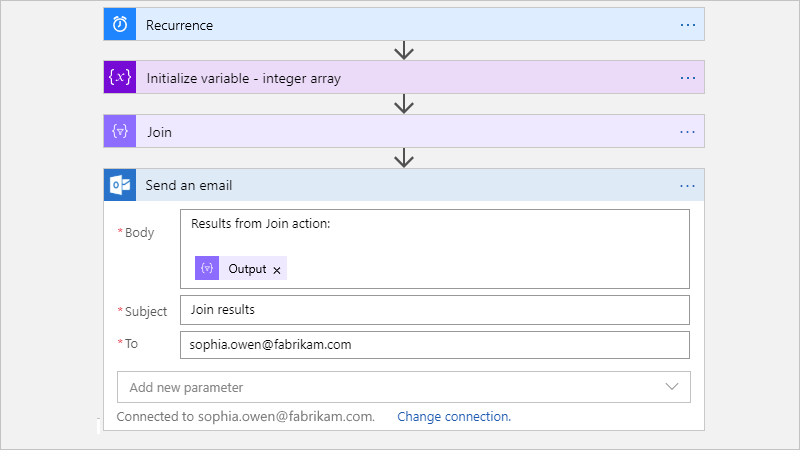

3. Now, manually run your logic app. On the designer toolbar, choose **Run**. 

   Based on the email connector you used, here are the results you get:

   

<a name="parse-json-action"></a>

## Parse JSON action

To reference or access properties in JavaScript Object Notation (JSON) content, 
you can create user-friendly fields or tokens for those properties 
by using the **Data operations - Parse JSON** action.
That way, you can select those properties from the dynamic 
content list when you specify inputs for your logic app. 
For this action, you can either provide a JSON schema 
or generate a JSON schema from your sample JSON content or payload.

If you prefer working in the code view editor, you can copy the 
example **Parse JSON** and **Initialize variable** action definitions 
from this article into your own logic app's underlying workflow definition: 
[Data operation code examples - Parse JSON](../logic-apps/logic-apps-data-operations-code-samples.md#parse-json-action-example) 

1. In the <a href="https://portal.azure.com" target="_blank">Azure portal</a> 
or Visual Studio, open your logic app in Logic App Designer. 

   This example uses the Azure portal and a logic app with a 
   **Recurrence** trigger and an **Initialize variable** action. 
   The action is set up for creating a variable whose initial 
   value is a JSON object that has properties and values. 
   When you later test your logic app, you can manually 
   run your app without waiting for the trigger to fire.

   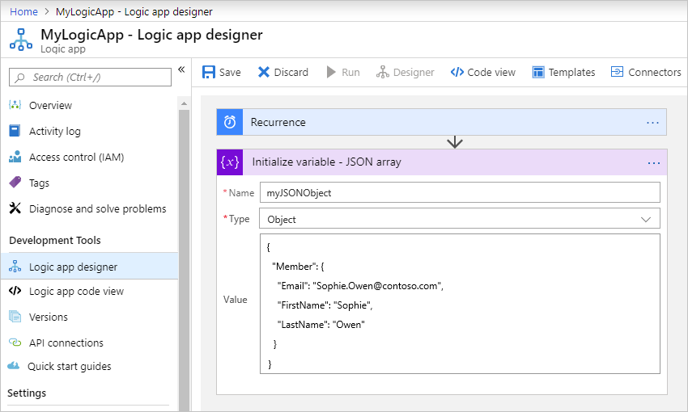

2. In your logic app where you want to parse the JSON content, 
follow one of these steps: 

   * To add an action under the last step, 
   choose **New step** > **Add an action**.

     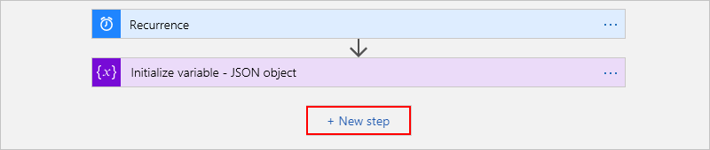

   * To add an action between steps, move your mouse 
   over the connecting arrow so the plus sign (+) appears. 
   Choose the plus sign, and then select **Add an action**.

3. In the search box, enter "parse json" as your filter. 
From the actions list, select this action: **Parse JSON**

   

4. In the **Content** box, provide the JSON content you want to parse. 

   For this example, when you click inside the **Content** box, 
   the dynamic content list appears so you can select 
   the previously created variable:

   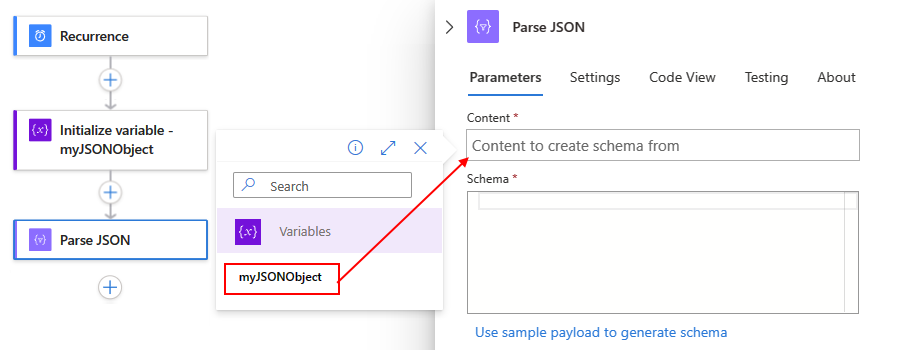

5. Enter the JSON schema that describes the JSON content you're parsing. 

   For this example, here is the JSON schema:

   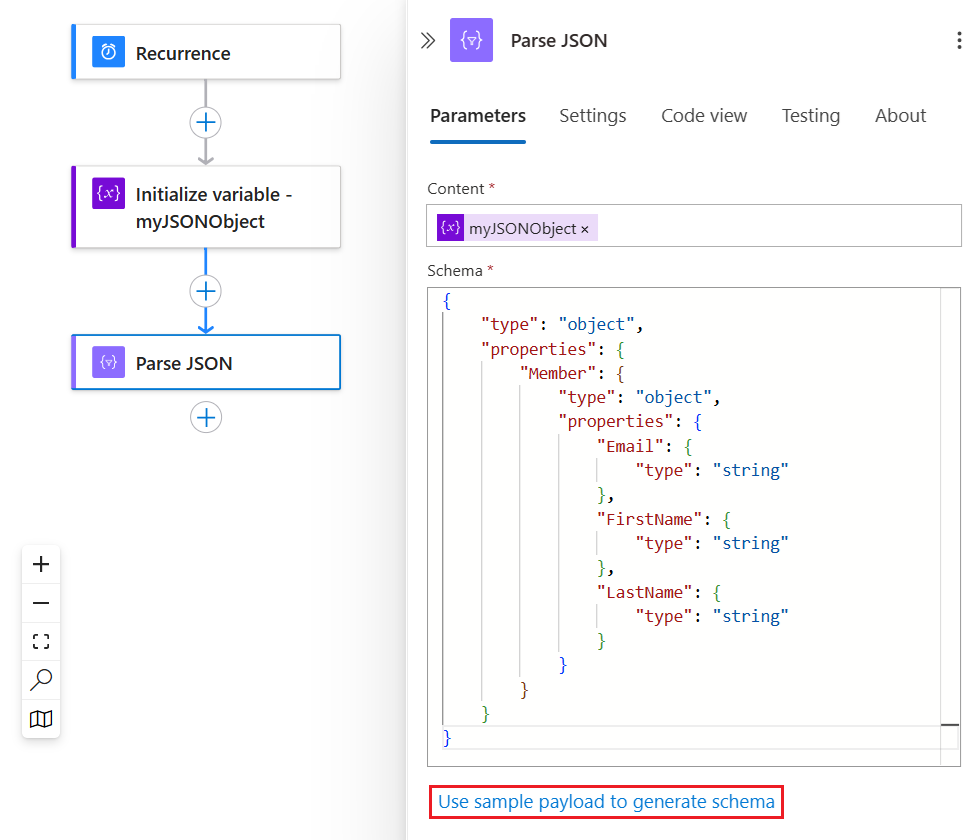

   If you don't have the schema, you can generate that schema 
   from the JSON content, or *payload*, you're parsing. 
   
   1. In the **Parse JSON** action, 
   select **Use sample payload to generate schema**.

   2. Under **Enter or paste a sample JSON payload**, 
   provide the JSON content, and then choose **Done**.

      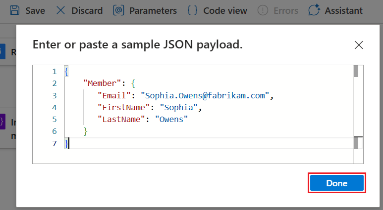

6. Save your logic app. On the designer toolbar, choose **Save**.

For more information about this action in your underlying workflow definition, 
see [Parse JSON action](../logic-apps/logic-apps-workflow-actions-triggers.md).

### Test your logic app

To confirm whether the **Parse JSON** action creates the expected results, 
send yourself a notification that includes output from the **Parse JSON** action.

1. In your logic app, add an action that can send you 
the results from the **Parse JSON** action.

2. In that action, click anywhere you want the results to appear. 
When the dynamic content list opens, under the **Parse JSON** action, 
you can now select the properties from the parsed JSON content.

   This example uses the **Office 365 Outlook - Send an email** action 
   and includes the **FirstName**, **LastName**, and **Email** fields 
   in the email's body:

   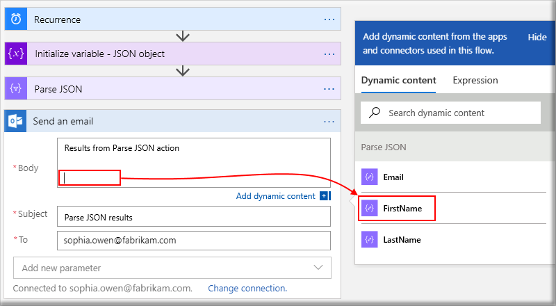

   Here is the finished email action:

   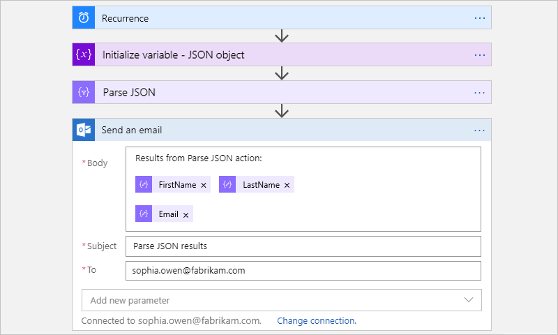

3. Now, manually run your logic app. On the designer toolbar, choose **Run**. 

   Based on the email connector you used, here are the results you get:

   

<a name="select-action"></a>

## Select action

To create an array that has JSON objects built from values in 
an existing array, use the **Data operations - Select** action. 
For example, you can create a JSON object for each value in 
an integer array by specifying the properties that each JSON 
object must have and how to map the values in the source array 
to those properties. And although you can change the 
components in those JSON objects, the output array 
always has the same number of items as the source array.

> [!NOTE]
> For actions to use the array output from the **Select** action, 
> either those actions must accept arrays as input, or you might 
> have to transform the output array into another compatible format. 

If you prefer working in the code view editor, you can copy the 
example **Select** and **Initialize variable** action definitions 
from this article into your own logic app's underlying workflow definition: 
[Data operation code examples - Select](../logic-apps/logic-apps-data-operations-code-samples.md#select-action-example) 

1. In the <a href="https://portal.azure.com" target="_blank">Azure portal</a> 
or Visual Studio, open your logic app in Logic App Designer. 

   This example uses the Azure portal and a logic app with a 
   **Recurrence** trigger and an **Initialize variable** action. 
   The action is set up for creating a variable whose initial 
   value is an array that has some sample integers. 
   When you later test your logic app, you can manually 
   run your app without waiting for the trigger to fire.

   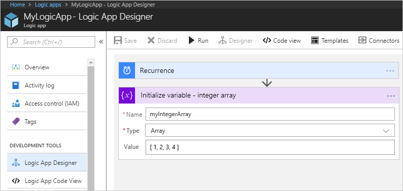

2. In your logic app where you want to create the array, 
follow one of these steps: 

   * To add an action under the last step, 
   choose **New step** > **Add an action**.

     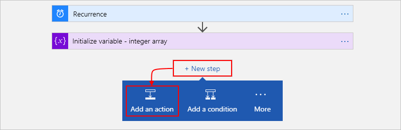

   * To add an action between steps, move your mouse 
   over the connecting arrow so the plus sign (+) appears. 
   Choose the plus sign, and then select **Add an action**.

3. In the search box, enter "select" as your filter. 
From the actions list, select this action: **Select**

   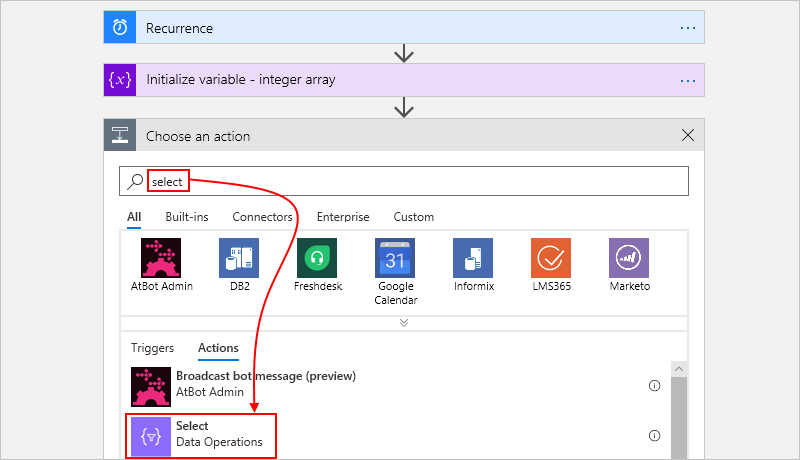

4. In the **From** box, specify the source array you want.

   For this example, when you click inside the **From** box, 
   the dynamic content list appears so you can select 
   the previously created variable:

   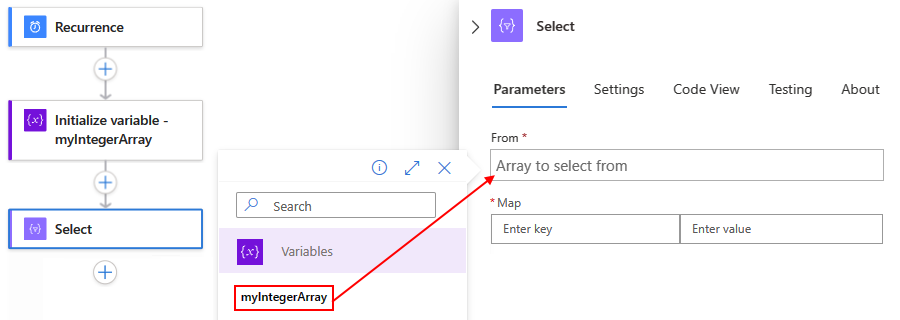

5. In the **Map** box's left-hand column, provide the property name you want to assign 
each value in the source array. In the right-hand column, specify an expression 
that represents the value you want to assign the property.

   This example specifies "Product_ID" as the property name to assign each value 
   in the integer array by using the **item()** function in an expression 
   that accesses each array item. 

   

   Here is the finished action:

   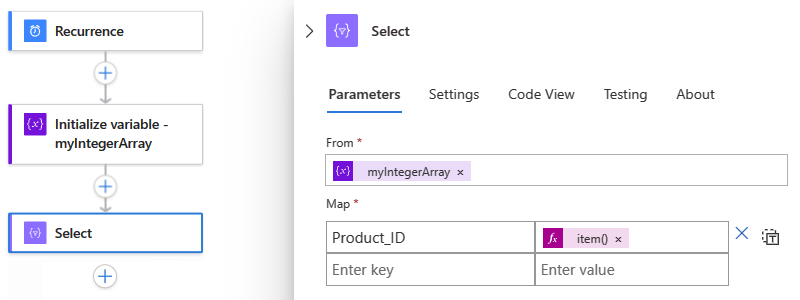

6. Save your logic app. On the designer toolbar, choose **Save**.

For more information about this action in your underlying workflow definition, 
see [Select action](../logic-apps/logic-apps-workflow-actions-triggers.md).

### Test your logic app

To confirm whether the **Select** action creates the expected results, 
send yourself a notification that includes output from the **Select** action.

1. In your logic app, add an action that can send you 
the results from the **Select** action.

2. In that action, click anywhere you want the results to appear. 
When the dynamic content list opens, choose **Expression**. 
To get the array output from the **Select** action, 
enter this expression that includes the **Select** action's name:

   ```
   @actionBody('Select')
   ```

   This example uses the **Office 365 Outlook - Send an email** action 
   and includes the outputs from the **actionBody('Select')** 
   expression in the email's body:

   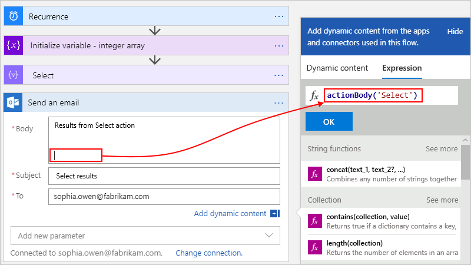

3. Now, manually run your logic app. On the designer toolbar, choose **Run**. 

   Based on the email connector you used, here are the results you get:

   

## Get support

* For questions, visit the [Azure Logic Apps forum](https://social.msdn.microsoft.com/Forums/en-US/home?forum=azurelogicapps).
* To submit or vote on feature ideas, visit the [Logic Apps user feedback site](https://aka.ms/logicapps-wish).

## Next steps

* Learn about [Logic Apps connectors](../connectors/apis-list.md)
