# Perform data operations in Azure Logic Apps

This article shows how you can work with data in your logic apps by adding actions for these tasks and more:

* Create tables from arrays.
* Create arrays from other arrays based on a condition.
* Create user-friendly tokens from JavaScript Object Notation (JSON) object properties so you can easily use those properties in your workflow.

If you don't find the action you want here, try browsing the many various [data manipulation functions](../logic-apps/workflow-definition-language-functions-reference.md) that Azure Logic Apps provides.

These tables summarize the data operations you can use and are organized based on the source data types that the operations work on, but each description appears alphabetically.

**Array actions** 

These actions help you work with data in arrays.

| Action | Description |
|--------|-------------|
| [**Create CSV table**](#create-csv-table-action) | Create a comma-separated value (CSV) table from an array. |
| [**Create HTML table**](#create-html-table-action) | Create an HTML table from an array. |
| [**Filter array**](#filter-array-action) | Create an array subset from an array based on the specified filter or condition. |
| [**Join**](#join-action) | Create a string from all the items in an array and separate each item with the specified character. |
| [**Select**](#select-action) | Create an array from the specified properties for all the items in a different array. |
||| 

**JSON actions**

These actions help you work with data in JavaScript Object Notation (JSON) format.

| Action | Description |
|--------|-------------|
| [**Compose**](#compose-action) | Create a message, or string, from multiple inputs that can have various data types. You can then use this string as a single input, rather than repeatedly entering the same inputs. For example, you can create a single JSON message from various inputs. |
| [**Parse JSON**](#parse-json-action) | Create user-friendly data tokens for properties in JSON content so you can more easily use the properties in your logic apps. |
|||

To create more complex JSON transformations, see [Perform advanced JSON transformations with Liquid templates](../logic-apps/logic-apps-enterprise-integration-liquid-transform.md).

## Prerequisites

* An Azure subscription. If you don't have a subscription, [sign up for a free Azure account](https://azure.microsoft.com/free/).

* The logic app where you need the operation for working with data

  If you're new to logic apps, review [What is Azure Logic Apps?](../logic-apps/logic-apps-overview.md) and [Quickstart: Create your first logic app](../logic-apps/quickstart-create-first-logic-app-workflow.md).

* A [trigger](../logic-apps/logic-apps-overview.md#logic-app-concepts) as the first step in your logic app 

  Data operations are available only as actions, so before you can use these actions, start your logic app with a trigger and include any other actions required for creating the outputs you want.

<a name="compose-action"></a>

## Compose action

To construct a single output such as a JSON object from multiple inputs, you can use the **Compose** action. Your inputs can have various types such as integers, Booleans, arrays, JSON objects, and any other native type that Azure Logic Apps supports, for example, binary and XML. You can then use the output in actions that follow after the **Compose** action. The **Compose** action can also save you from repeatedly entering the same inputs while you build your logic app's workflow.

For example, you can construct a JSON message from multiple variables, such as string variables that store people's first names and last names, and an integer variable that stores people's ages. Here, the **Compose** action accepts these inputs:

`{ "age": <ageVar>, "fullName": "<lastNameVar>, <firstNameVar>" }`

and creates this output:

`{"age":35,"fullName":"Owens,Sophie"}`

To try an example, follow these steps by using the Logic App Designer. Or, if you prefer working in the code view editor, you can copy the example **Compose** and **Initialize variable** action definitions from this article into your own logic app's underlying workflow definition: [Data operation code examples - Compose](../logic-apps/logic-apps-data-operations-code-samples.md#compose-action-example) 

1. In the [Azure portal](https://portal.azure.com) or Visual Studio, open your logic app in Logic App Designer.

   This example uses the Azure portal and a logic app with a **Recurrence** trigger and several **Initialize variable** actions. These actions are set up for creating two string variables and an integer variable. When you later test your logic app, you can manually run your app without waiting for the trigger to fire.

   

1. In your logic app where you want to create the output, follow one of these steps: 

   * To add an action under the last step, select **New step**.

     

   * To add an action between steps, move your mouse over the connecting arrow so the plus sign (**+**) appears. Select the plus sign, and then select **Add an action**.

1. Under **Choose an action**, in the search box, enter `compose` as your filter. From the actions list, select the **Compose** action.

   

1. In the **Inputs** box, provide the inputs you want for creating the output.

   For this example, when you click inside the **Inputs** box, the dynamic content list appears so you can select the previously created variables:

   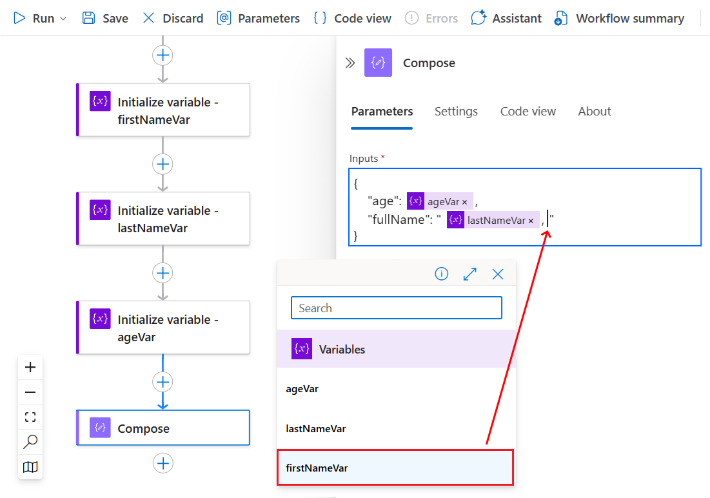

   Here is the finished example **Compose** action: 

   

1. Save your logic app. On the designer toolbar, select **Save**.

For more information about this action in your underlying workflow definition, see the [Compose action](../logic-apps/logic-apps-workflow-actions-triggers.md#compose-action).

### Test your logic app

To confirm whether the **Compose** action creates the expected results, send yourself a notification that includes output from the **Compose** action.

1. In your logic app, add an action that can send you the results from the **Compose** action.

1. In that action, click anywhere you want the results to appear. When the dynamic content list opens, under the **Compose** action, select **Output**.

   This example uses the **Send an email** action and includes the **Output** fields in the email's body and subject:

   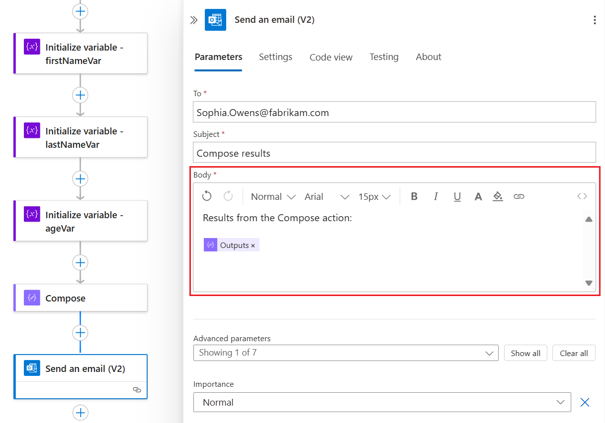

1. Now, manually run your logic app. On the designer toolbar, select **Run**.

   Based on the email connector you used, here are the results you get:

   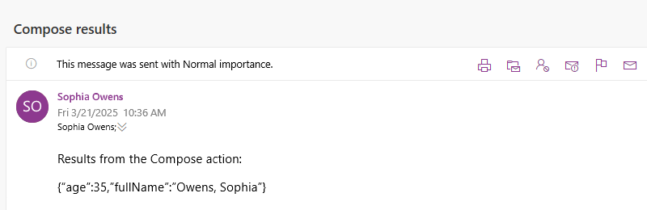

<a name="create-csv-table-action"></a>

## Create CSV table action

To create a comma-separated value (CSV) table that has the properties and values from JavaScript Object Notation (JSON) objects in an array, use the **Create CSV table** action. You can then use the resulting table in actions that follow the **Create CSV table** action.

If you prefer working in the code view editor, you can copy the example **Create CSV table** and **Initialize variable** action definitions from this article into your own logic app's underlying workflow definition: [Data operation code examples - Create CSV table](../logic-apps/logic-apps-data-operations-code-samples.md#create-csv-table-action-example)

1. In the [Azure portal](https://portal.azure.com) or Visual Studio, open your logic app in Logic App Designer.

   This example uses the Azure portal and a logic app with a **Recurrence** trigger and an **Initialize variable** action. The action is set up for creating a variable whose initial value is an array that has some properties and values in JSON format. When you later test your logic app, you can manually run your app without waiting for the trigger to fire.

   

1. In your logic app where you want to create the CSV table, follow one of these steps: 

   * To add an action under the last step, select **New step**.

     

   * To add an action between steps, move your mouse over the connecting arrow so the plus sign (**+**) appears. Select the plus sign, and then select **Add an action**.

1. Under **Choose an action**, in the search box, enter `create csv table` as your filter. From the actions list, select the **Create CSV table** action.

   

1. In the **From** box, provide the array or expression you want for creating the table.

   For this example, when you click inside the **From** box, the dynamic content list appears so you can select the previously created variable:

   

   > [!TIP]
   > To create user-friendly tokens for the properties in JSON objects so you can select 
   > those properties as inputs, use the [Parse JSON](#parse-json-action) before calling 
   > the **Create CSV table** action.

   Here is the finished example **Create CSV table** action: 

   

1. Save your logic app. On the designer toolbar, select **Save**.

### Customize table format

By default, the **Columns** property is set to automatically create the table columns based on the array items. To specify custom headers and values, follow these steps:

1. Open the **Columns** list, and select **Custom**.

1. In the **Header** property, specify the custom header text to use instead.

1. In the **Value** property, specify the custom value to use instead.

To return values from the array, you can use the [`item()` function](../logic-apps/workflow-definition-language-functions-reference.md#item) with the **Create CSV table** action. In a `For_each` loop, you can use the [`items()` function](../logic-apps/workflow-definition-language-functions-reference.md#items).

For example, suppose you want table columns that have only the property values and not the property names from an array. To return only these values, follow these steps for working in designer view or in code view. Here is the result that this example returns:

```text
Apples,1
Oranges,2
```

#### Work in designer view

In the action, keep the **Header** column empty. On each row in the **Value** column, dereference each array property that you want. Each row under **Value** returns all the values for the specified array property and becomes a column in your table.

1. Under **Value**, on each row that you want, click inside the edit box so that the dynamic content list appears.

1. In the dynamic content list, select **Expression**.

1. In the expression editor, enter this expression that specifies the array property value that you want, and select **OK**.

   `item()?['<array-property-name>']`

   For example:

   * `item()?['Description']`
   * `item()?['Product_ID']`

   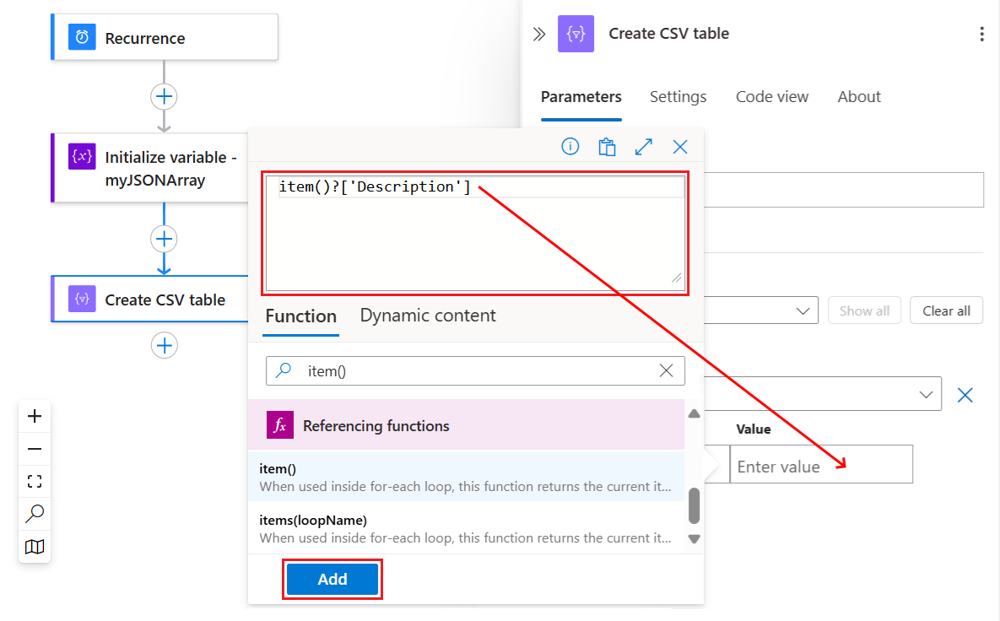

1. Repeat the previous steps for each array property that you want. When you're done, your action looks like this example:

   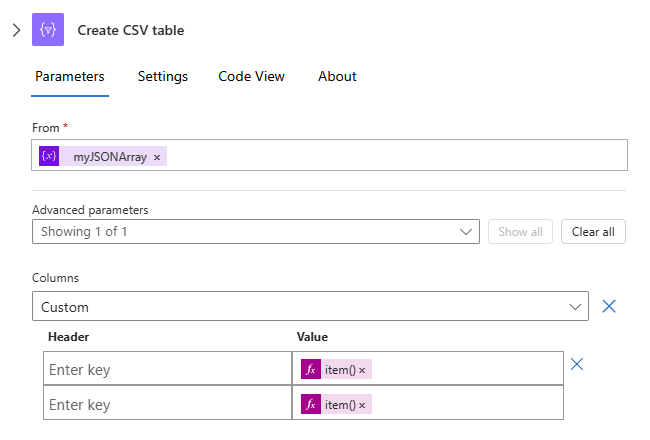

1. To resolve expressions into more descriptive versions, switch to code view and back to designer view, and then reopen the collapsed action:

   The **Create CSV table** action now appears like this example:

   

#### Work in code view

In the action's JSON definition, within the `columns` array, set the `header` property to an empty string. For each `value` property, dereference each array property that you want.

1. On the designer toolbar, select **Code view**.

1. In the code editor, in the action's `columns` array, add the empty `header` property and this `value` expression for each column of array values that you want:

   ```json
   {
      "header": "",
      "value": "@item()?['<array-property-name>']"
   }
   ```

   For example:

   ```json
   "Create_CSV_table": {
      "inputs": {
         "columns": [
            { 
               "header": "",
               "value": "@item()?['Description']"
            },
            { 
               "header": "",
               "value": "@item()?['Product_ID']"
            }
         ],
         "format": "CSV",
         "from": "@variables('myJSONArray')"
      }
   }
   ```

1. Switch back to designer view, and reopen the collapsed action.

   The **Create CSV table** action now appears like this example, and the expressions have resolved to more descriptive versions:

   

For more information about this action in your underlying workflow definition, see the [Table action](../logic-apps/logic-apps-workflow-actions-triggers.md#table-action).

### Test your logic app

To confirm whether the **Create CSV table** action creates the expected results, send yourself a notification that includes output from the **Create CSV table** action.

1. In your logic app, add an action that can send you the results from the **Create CSV table** action.

1. In that action, click anywhere you want the results to appear. When the dynamic content list opens, under the **Create CSV table** action, select **Output**. 

   This example uses the Office 365 Outlook **Send an email** action and includes the **Output** field in the email's body:

   

1. Now, manually run your logic app. On the designer toolbar, select **Run**.

   Based on the email connector you used, here are the results you get:

   

<a name="create-html-table-action"></a>

## Create HTML table action

To create an HTML table that has the properties and values from JavaScript Object Notation (JSON) objects in an array, use the **Create HTML table** action. You can then use the resulting table in actions that follow the **Create HTML table** action.

If you prefer working in the code view editor, you can copy the example **Create HTML table** and **Initialize variable** action definitions from this article into your own logic app's underlying workflow definition: [Data operation code examples - Create HTML table](../logic-apps/logic-apps-data-operations-code-samples.md#create-html-table-action-example) 

1. In the [Azure portal](https://portal.azure.com) or Visual Studio, open your logic app in Logic App Designer.

   This example uses the Azure portal and a logic app with a **Recurrence** trigger and an **Initialize variable** action. The action is set up for creating a variable whose initial value is an array that has some properties and values in JSON format. When you later test your logic app, you can manually run your app without waiting for the trigger to fire.

   

1. In your logic app where you want to create an HTML table, follow one of these steps:

   * To add an action under the last step, select **New step**.

     

   * To add an action between steps, move your mouse over the connecting arrow so the plus sign (**+**) appears. Select the plus sign, and then select **Add an action**.

1. Under **Choose an action**, in the search box, enter `create html table` as your filter. From the actions list, select the **Create HTML table** action.

   

1. In the **From** box, provide the array or expression you want for creating the table.

   For this example, when you click inside the **From** box, the dynamic content list appears so you can select the previously created variable:

   

   > [!TIP]
   > To create user-friendly tokens for the properties in JSON objects so you can select 
   > those properties as inputs, use the [Parse JSON](#parse-json-action) before calling 
   > the **Create HTML table** action.

   Here is the finished example **Create HTML table** action:

   

1. Save your logic app. On the designer toolbar, select **Save**.

### Customize table format

By default, the **Columns** property is set to automatically create the table columns based on the array items. To specify custom headers and values, follow these steps:

1. Open the **Columns** list, and select **Custom**.

1. In the **Header** property, specify the custom header text to use instead.

1. In the **Value** property, specify the custom value to use instead.

To return values from the array, you can use the [`item()` function](../logic-apps/workflow-definition-language-functions-reference.md#item) with the **Create HTML table** action. In a `For_each` loop, you can use the [`items()` function](../logic-apps/workflow-definition-language-functions-reference.md#items).

For example, suppose you want table columns that have only the property values and not the property names from an array. To return only these values, follow these steps for working in designer view or in code view. Here is the result that this example returns:

```text
Apples,1
Oranges,2
```

#### Work in designer view

In the action, keep the **Header** column empty. On each row in the **Value** column, dereference each array property that you want. Each row under **Value** returns all the values for the specified property and becomes a column in your table.

1. Under **Value**, on each row that you want, click inside the edit box so that the dynamic content list appears.

1. In the dynamic content list, select **Expression**.

1. In the expression editor, enter this expression that specifies the array property value that you want, and select **OK**.

   `item()?['<array-property-name>']`

   For example:

   * `item()?['Description']`
   * `item()?['Product_ID']`

   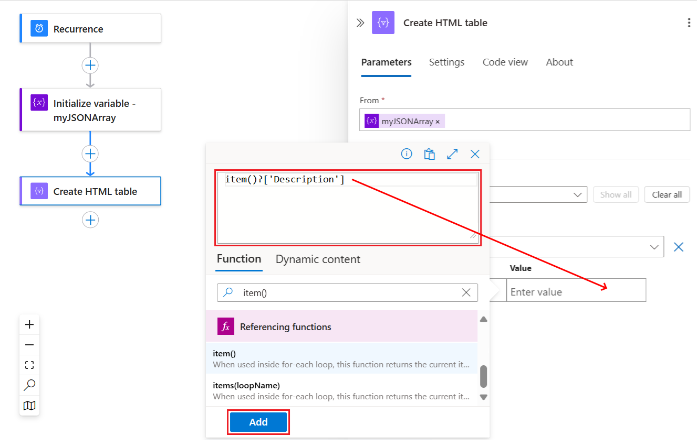

1. Repeat the previous steps for each array property that you want. When you're done, your action looks like this example:

   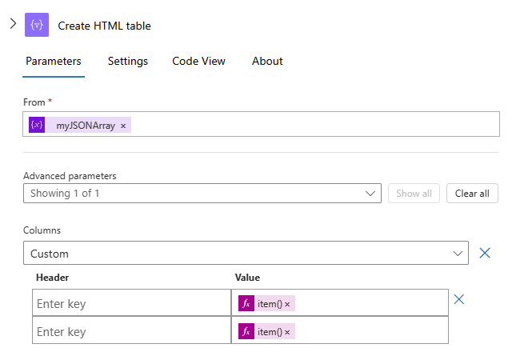

1. To resolve expressions into more descriptive versions, switch to code view and back to designer view, and then reopen the collapsed action:

   The **Create HTML table** action now appears like this example:

   

#### Work in code view

In the action's JSON definition, within the `columns` array, set the `header` property to an empty string. For each `value` property, dereference each array property that you want.

1. On the designer toolbar, select **Code view**.

1. In the code editor, in the action's `columns` array, add the empty `header` property and this `value` expression for each column of array values that you want:

   ```json
   {
      "header": "",
      "value": "@item()?['<array-property-name>']"
   }
   ```

   For example:

   ```json
   "Create_HTML_table": {
      "inputs": {
         "columns": [
            { 
               "header": "",
               "value": "@item()?['Description']"
            },
            { 
               "header": "",
               "value": "@item()?['Product_ID']"
            }
         ],
         "format": "HTML",
         "from": "@variables('myJSONArray')"
      }
   }
   ```

1. Switch back to designer view, and reopen the collapsed action.

   The **Create HTML table** action now appears like this example, and the expressions have resolved to more descriptive versions:

   

For more information about this action in your underlying workflow definition, see the [Table action](../logic-apps/logic-apps-workflow-actions-triggers.md#table-action).

### Test your logic app

To confirm whether the **Create HTML table** action creates the expected results, send yourself a notification that includes output from the **Create HTML table** action.

1. In your logic app, add an action that can send you the results from the **Create HTML table** action.

1. In that action, click anywhere you want the results to appear. When the dynamic content list opens, under the **Create HTML table** action, select **Output**. 

   This example uses the Office 365 Outlook **Send an email** action and includes the **Output** field in the email's body:

   

   > [!NOTE]
   > When including the HTML table output in an email action, make sure that you set the **Is HTML** property to **Yes** 
   > in the email action's advanced options. That way, the email action correctly formats the HTML table.

1. Now, manually run your logic app. On the designer toolbar, select **Run**.

   Based on the email connector you used, here are the results you get:

   

<a name="filter-array-action"></a>

## Filter array action

To create a smaller array that has items, which meet specific criteria, from an existing array, use the **Filter array** action. You can then use the filtered array in actions that follow after the **Filter array** action.

> [!NOTE]
> Any filter text that you use in your condition is case sensitive. Also, this action can't change the format or components of items in the array. 
> 
> For actions to use the array output from the **Filter array** action, either those actions must accept arrays as input, or you might 
> have to transform the output array into another compatible format.
> 
> If you call an HTTP endpoint and receive a JSON response, use the **Parse JSON** action to process the JSON response. 
> Otherwise, the **Filter array** action can read only the response body and not the structure of the JSON payload.

If you prefer working in the code view editor, you can copy the example **Filter array** and **Initialize variable** action definitions from this article into your own logic app's underlying workflow definition: [Data operation code examples - Filter array](../logic-apps/logic-apps-data-operations-code-samples.md#filter-array-action-example)

1. In the [Azure portal](https://portal.azure.com) or Visual Studio, open your logic app in Logic App Designer.

   This example uses the Azure portal and a logic app with a **Recurrence** trigger and an **Initialize variable** action. The action is set up for creating a variable whose initial value is an array that has some sample integers. When you later test your logic app, you can manually run your app without waiting for the trigger to fire.

   > [!NOTE]
   > Although this example uses a simple integer array, this action is especially useful for JSON 
   > object arrays where you can filter based on the objects' properties and values.

   

1. In your logic app where you want to create the filtered array, follow one of these steps: 

   * To add an action under the last step, select **New step**.

     

   * To add an action between steps, move your mouse over the connecting arrow so the plus sign (**+**) appears. Select the plus sign, and then select **Add an action**.

1. In the search box, enter `filter array` as your filter. From the actions list, select the **Filter array** action.

   

1. In the **From** box, provide the array or expression you want to filter.

   For this example, when you click inside the **From** box, the dynamic content list appears so you can select the previously created variable:

   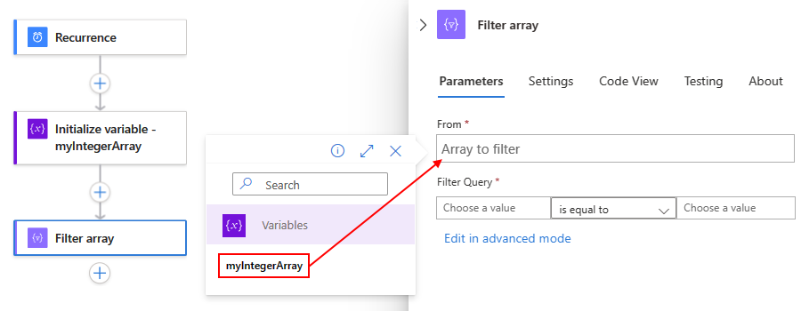

1. For the condition, specify the array items to compare, select the comparison operator, and specify the comparison value.

   This example uses the `item()` function for accessing each item in the array while the **Filter array** action searches for array items whose value is greater than one:

   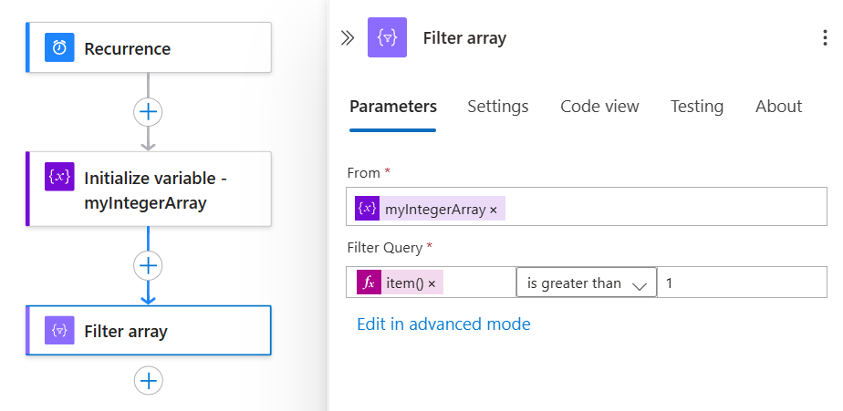

1. Save your logic app. On the designer toolbar, select **Save**.

For more information about this action in your underlying workflow definition, see [Query action](../logic-apps/logic-apps-workflow-actions-triggers.md#query-action).

### Test your logic app

To confirm whether **Filter array** action creates the expected results, send yourself a notification that includes output from the **Filter array** action.

1. In your logic app, add an action that can send you the results from the **Filter array** action.

1. In that action, click anywhere you want the results to appear. When the dynamic content list opens, select **Expression**. To get the array output from the **Filter array** action, enter this expression that includes the **Filter array** action's name:

   `@actionBody('Filter_array')`

   This example uses the Office 365 Outlook **Send an email** action and includes the outputs from the **actionBody('Filter_array')** expression in the email's body:

   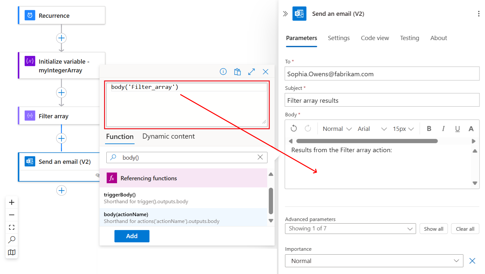

1. Now, manually run your logic app. On the designer toolbar, select **Run**.

   Based on the email connector you used, here are the results you get:

   

<a name="join-action"></a>

## Join action

To create a string that has all the items from an array and separate those items with a specific delimiter character, use the **Join** action. You can then use the string in actions that follow after the **Join** action.

If you prefer working in the code view editor, you can copy the example **Join** and **Initialize variable** action definitions from this article into your own logic app's underlying workflow definition: [Data operation code examples - Join](../logic-apps/logic-apps-data-operations-code-samples.md#join-action-example)

1. In the [Azure portal](https://portal.azure.com) or Visual Studio, open your logic app in Logic App Designer.

   This example uses the Azure portal and a logic app with a **Recurrence** trigger and an **Initialize variable** action. This action is set up for creating a variable whose initial value is an array that has some sample integers. When you test your logic app later, you can manually run your app without waiting for the trigger to fire.

   

1. In your logic app where you want to create the string from an array, follow one of these steps:

   * To add an action under the last step, select **New step**.

     

   * To add an action between steps, move your mouse over the connecting arrow so the plus sign (**+**) appears. Select the plus sign, and then select **Add an action**.

1. In the search box, enter `join` as your filter. From the actions list, select this action: **Join**

   

1. In the **From** box, provide the array that has the items you want to join as a string.

   For this example, when you click inside the **From** box, the dynamic content list that appears so you can select the previously created variable:  

   

1. In the **Join with** box, enter the character you want for separating each array item. 

   This example uses a colon (:) as the separator.

   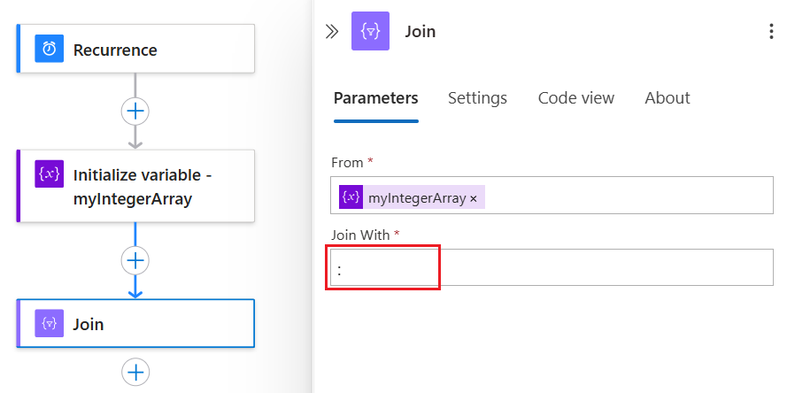

1. Save your logic app. On the designer toolbar, select **Save**.

For more information about this action in your underlying workflow definition, see the [Join action](../logic-apps/logic-apps-workflow-actions-triggers.md#join-action).

### Test your logic app

To confirm whether the **Join** action creates the expected results, send yourself a notification that includes output from the **Join** action.

1. In your logic app, add an action that can send you the results from the **Join** action.

1. In that action, click anywhere you want the results to appear. When the dynamic content list opens, under the **Join** action, select **Output**. 

   This example uses the Office 365 Outlook **Send an email** action and includes the **Output** field in the email's body:

   

1. Now, manually run your logic app. On the designer toolbar, select **Run**.

   Based on the email connector you used, here are the results you get:

   

<a name="parse-json-action"></a>

## Parse JSON action

To reference or access properties in JavaScript Object Notation (JSON) content, you can create user-friendly fields or tokens for those properties by using the **Parse JSON** action. That way, you can select those properties from the dynamic content list when you specify inputs for your logic app. For this action, you can either provide a JSON schema or generate a JSON schema from your sample JSON content or payload.

If you prefer working in the code view editor, you can copy the example **Parse JSON** and **Initialize variable** action definitions from this article into your own logic app's underlying workflow definition: [Data operation code examples - Parse JSON](../logic-apps/logic-apps-data-operations-code-samples.md#parse-json-action-example)

1. In the [Azure portal](https://portal.azure.com) or Visual Studio, open your logic app in Logic App Designer.

   This example uses the Azure portal and a logic app with a **Recurrence** trigger and an **Initialize variable** action. The action is set up for creating a variable whose initial value is a JSON object that has properties and values. When you later test your logic app, you can manually run your app without waiting for the trigger to fire.

   

1. In your logic app where you want to parse the JSON content, follow one of these steps:

   * To add an action under the last step, select **New step**.

     

   * To add an action between steps, move your mouse over the connecting arrow so the plus sign (**+**) appears. Select the plus sign, and then select **Add an action**.

1. In the search box, enter `parse json` as your filter. From the actions list, select the **Parse JSON** action.

   

1. In the **Content** box, provide the JSON content you want to parse.

   For this example, when you click inside the **Content** box, the dynamic content list appears so you can select the previously created variable:

   

1. Enter the JSON schema that describes the JSON content you're parsing.

   For this example, here is the JSON schema:

   

   If you don't have the schema, you can generate that schema from the JSON content, or *payload*, you're parsing. 
   
   1. In the **Parse JSON** action, select **Use sample payload to generate schema**.

   1. Under **Enter or paste a sample JSON payload**, provide the JSON content, and then select **Done**.

      

1. Save your logic app. On the designer toolbar, select **Save**.

For more information about this action in your underlying workflow definition, see [Parse JSON action](../logic-apps/logic-apps-workflow-actions-triggers.md).

### Test your logic app

To confirm whether the **Parse JSON** action creates the expected results, send yourself a notification that includes output from the **Parse JSON** action.

1. In your logic app, add an action that can send you the results from the **Parse JSON** action.

1. In that action, click anywhere you want the results to appear. When the dynamic content list opens, under the **Parse JSON** action, you can now select the properties from the parsed JSON content.

   This example uses the Office 365 Outlook **Send an email** action and includes the **FirstName**, **LastName**, and **Email** fields in the email's body:

   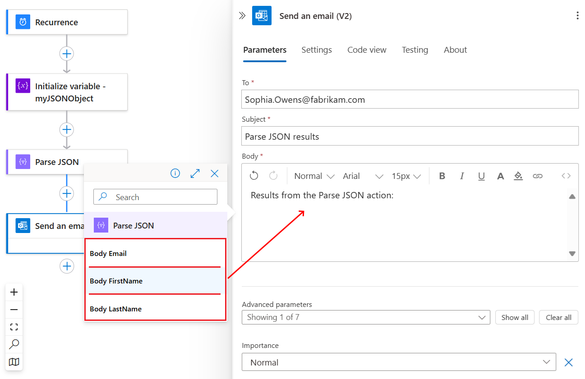

   Here is the finished email action:

   

1. Now, manually run your logic app. On the designer toolbar, select **Run**. 

   Based on the email connector you used, here are the results you get:

   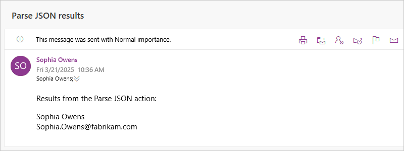

<a name="select-action"></a>

## Select action

To create an array that has JSON objects built from values in an existing array, use the **Select** action. For example, you can create a JSON object for each value in an integer array by specifying the properties that each JSON object must have and how to map the values in the source array to those properties. And although you can change the components in those JSON objects, the output array always has the same number of items as the source array.

> [!NOTE]
> For actions to use the array output from the **Select** action, either those actions must accept 
> arrays as input, or you might have to transform the output array into another compatible format. 

If you prefer working in the code view editor, you can copy the example **Select** and **Initialize variable** action definitions from this article into your own logic app's underlying workflow definition: [Data operation code examples - Select](../logic-apps/logic-apps-data-operations-code-samples.md#select-action-example) 

1. In the [Azure portal](https://portal.azure.com) or Visual Studio, open your logic app in Logic App Designer.

   This example uses the Azure portal and a logic app with a **Recurrence** trigger and an **Initialize variable** action. The action is set up for creating a variable whose initial value is an array that has some sample integers. When you later test your logic app, you can manually run your app without waiting for the trigger to fire.

   

1. In your logic app where you want to create the array, follow one of these steps: 

   * To add an action under the last step, select **New step**.

     

   * To add an action between steps, move your mouse over the connecting arrow so the plus sign (**+**) appears. Select the plus sign, and then select **Add an action**.

1. Under **Choose an action**, select **Built-in**. In the search box, enter `select` as your filter. From the actions list, select the **Select** action.

   

1. In the **From** box, specify the source array you want.

   For this example, when you click inside the **From** box, the dynamic content list appears so you can select the previously created variable:

   

1. In the **Map** box's left-hand column, provide the property name you want to assign each value in the source array. In the right-hand column, specify an expression that represents the value you want to assign the property.

   This example specifies "Product_ID" as the property name to assign each value in the integer array by using the `item()` function in an expression that accesses each array item. 

   

   Here is the finished action:

   

1. Save your logic app. On the designer toolbar, select **Save**.

For more information about this action in your underlying workflow definition, see [Select action](../logic-apps/logic-apps-workflow-actions-triggers.md).

### Test your logic app

To confirm whether the **Select** action creates the expected results, send yourself a notification that includes output from the **Select** action.

1. In your logic app, add an action that can send you the results from the **Select** action.

1. In that action, click anywhere you want the results to appear. When the dynamic content list opens, select **Expression**. To get the array output from the **Select** action, enter this expression that includes the **Select** action's name:

   `@actionBody('Select')`

   This example uses the Office 365 Outlook **Send an email** action and includes the outputs from the `@actionBody('Select')` expression in the email's body:

   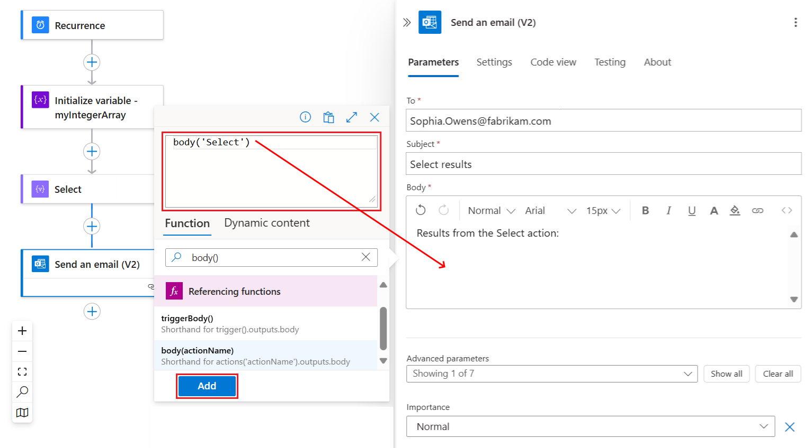

1. Now, manually run your logic app. On the designer toolbar, select **Run**.

   Based on the email connector you used, here are the results you get:

   

## Next steps

* Learn about [Logic Apps connectors](../connectors/apis-list.md)
